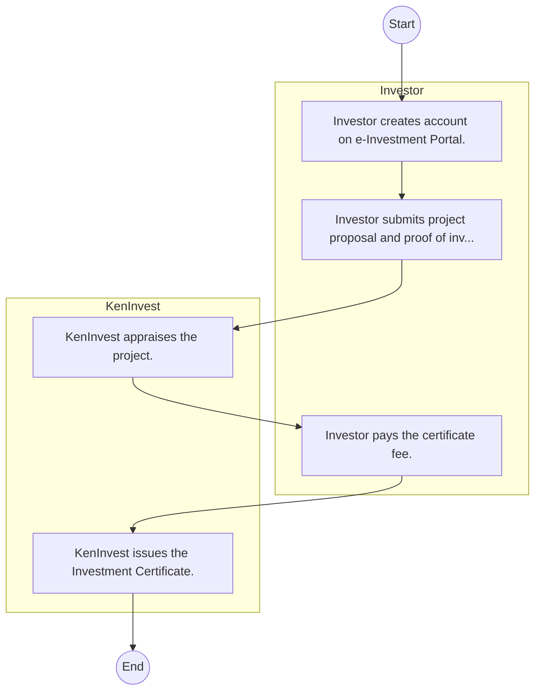

# Kenya Investment Authority – Service Delivery

## Cover Page
- **Ministry/Department/Agency (MDA):** Kenya Investment Authority
- **Process Name:** Service Delivery
- **Document Version:** 1.0
- **Date:** 2026-02-14
- **Classification:** Official

---

## Executive Summary
The Kenya Investment Authority (KenInvest) is a statutory body established under the Investment Promotion Act No. 6 of 2004. Its core mandate is to promote and facilitate both local and foreign investments in Kenya, acting as a one-stop center for investors, thereby improving the investment climate, fostering economic growth, and contributing to job creation and national development.

---

## Process Flowchart (BPMN 2.0 - Mermaid)
*Guidance: This diagram visualizes the AS-IS process flow across different actors.*

---

## Process Overview
### Process Name
Service Delivery

### Service Category
- G2B (Government to Business)

### Scope
- **In Scope:** End-to-end processing within Kenya Investment Authority.

### Triggers
- Submission of application/request by Investor.

### End States
- **Successful:** License / Permit / Certificate, Compliance Inspection Report, Official Receipt, Gazette Notice

### Policy Context
- The Kenya Investment Authority Act; The Constitution of Kenya 2010; Data Protection Act 2019.

---

## Stakeholders
| Stakeholder | Role | Responsibilities |
|---|---|---|
| Investor | Process Actor | Performs actions as defined in steps. |
| KenInvest | Process Actor | Performs actions as defined in steps. |

---

## Inputs & Outputs
- **Inputs:** Application Form (License/Permit), Compliance Documents (Tax Compliance, CR12), Technical Reports / Site Plans, Proof of Payment
- **Outputs:** License / Permit / Certificate, Compliance Inspection Report, Official Receipt, Gazette Notice

---

## Detailed Process (AS-IS)
| Step | Role | Action | Tool | Notes |
|---|---|---|---|---|
| 1 | Investor | Investor creates account on e-Investment Portal. | Digital | |
| 2 | Investor | Investor submits project proposal and proof of investment (min $100k for foreign, KES 1M for local). | Manual | |
| 3 | KenInvest | KenInvest appraises the project. | Manual | |
| 4 | Investor | Investor pays the certificate fee. | Manual | |
| 5 | KenInvest | KenInvest issues the Investment Certificate. | Manual | |

---

## Pain Points & Opportunities
### Pain Points
- Manual document verification takes time.
- High cost and time for physical inspections.
- Risk of counterfeit licenses/certificates.
- Lack of real-time monitoring of licensees.

### Opportunities
- Integration with IPRS/BRS via Service Bus.
- Adoption of Government Payment Gateway.
- Implementation of Automated Rules Engine.
- Issuance of Digital Verifiable Credentials.

---

## Future State Process (TO-BE)
### Narrative
The To-Be process leverages the Government Service Bus to integrate with BRS (Business Registry) and the Payment Gateway. Manual data entry and document uploads are replaced by real-time API validations, enabling a paperless, cashless, and presence-less service experience.

### Optimized Steps (Digital)
| Step | Actor | Action | System |
|---|---|---|---|
| 1 | Applicant | Applicant logs in via Single Sign-On (SSO) and selects the service. | Citizen Portal / SSO |
| 2 | System | Applicant enters Business Registration Number; System auto-populates details from BRS (Business Registry) via the Service Bus. | Service Bus / Registry API |
| 3 | System | System performs auto-validation of compliance (e.g., KRA Tax Status) via Inter-Agency APIs. | Service Bus / Compliance Engine |
| 4 | Applicant | Applicant pays fees via the Government Payment Gateway; System auto-receipts. | Payment Gateway |
| 5 | System | Application is processed by the Rules Engine. (Low-risk cases are Auto-Approved). | Workflow Engine |
| 6 | Officer | Complex cases are routed to the Officer Workbench for digital review and approval. | Officer Workbench |
| 7 | System | System generates a Verifiable Digital Certificate (QR Code) and notifies the applicant. | Output Generator |

---

## References & Evidence
The information in this document was derived from the following official sources:

- [https://www.invest.go.ke/](https://www.invest.go.ke/)
- [https://saraka.info/](https://saraka.info/)
- [https://unido.org/](https://unido.org/)
- [https://mfa.ir/](https://mfa.ir/)
- [https://eac.int/](https://eac.int/)
- [https://kenyaembassyparis.fr/](https://kenyaembassyparis.fr/)
- [https://investmentkenya.com/](https://investmentkenya.com/)
- [https://investmentpromotion.go.ke/](https://investmentpromotion.go.ke/)

---

## Appendices
See attached ERD and System Design.
