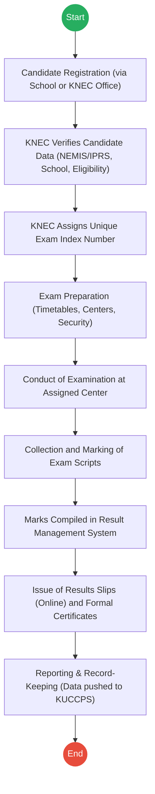
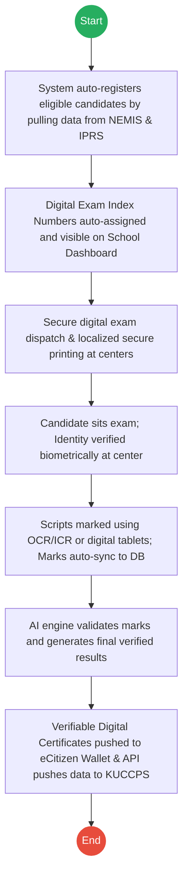

# KENYA NATIONAL EXAMINATIONS COUNCIL (KNEC) – Service Delivery

## Cover Page
- **Ministry/Department/Agency (MDA):** KENYA NATIONAL EXAMINATIONS COUNCIL (KNEC)
- **Process Name:** Exam Administration
- **Document Version:** 2.0
- **Date:** 2026-02-24
- **Classification:** Official

---

## Executive Summary
The Kenya National Examinations Council (KNEC) is responsible for setting and maintaining examination standards, developing and conducting national examinations at basic and tertiary levels, and awarding certificates to successful candidates. This process is critical for evaluating educational achievement and providing necessary data for tertiary placement by bodies like KUCCPS.

---

## 1. AS-IS Process Flowchart (BPMN 2.0)
*Current State visualization (Semi-Manual Exam Administration).*

---

## Process Overview
### Process Name
Exam Administration

### Service Category
- G2C (Government to Citizen) / G2G (Government to Government)

### Scope
- **In Scope:** Candidate registration, data verification, exam index assignment, exam preparation and conduct, marking, compilation of results, certificate issuance, and data sharing with KUCCPS.
- **Out of Scope:** Routine school-level assessments not administered nationally.

### Triggers
- Annual national examination cycle (e.g., KPSEA, KCSE).
- Registration submission by schools or private candidates.

### End States
- **Successful:** Verified candidate results, formal examination certificates, and data forwarded for tertiary placement.

### Policy Context
- Kenya National Examinations Council Act No. 29 of 2012.

---

## Detailed Process (AS-IS)
| Step | Role | Action | Tool/System | Notes |
|---|---|---|---|---|
| 1 | Candidate/School | **Registration:** Identifies candidate via NEMIS No. Submits registration through school or KNEC office with Birth Cert/ID and previous certificates. | Manual/Portal | |
| 2 | KNEC | **Verification:** Verifies identity against NEMIS/IPRS, confirms school enrollment and eligibility. | KNEC System | |
| 3 | KNEC | **Index Assignment:** Assigns a unique Exam Index Number linked to the candidate's identity. | KNEC System | |
| 4 | KNEC | **Preparation:** Prepares timetables, allocates centers, and arranges secure exam materials. | Logistics System | |
| 5 | KNEC/Candidate | **Conduct Exam:** Candidate sits for exam. KNEC supervises attendance and exam integrity. | Physical | |
| 6 | KNEC Examiners | **Collection & Marking:** Scripts securely transported to marking centers and marked to standards. | Physical | |
| 7 | KNEC | **Compilation:** Marks entered into KNEC Result Management System and checked for accuracy. | Result Management | |
| 8 | KNEC | **Issuance:** Generates result slips (online initially) and later issues formal physical certificates to schools. | Online Portal / Print | |
| 9 | KNEC | **Reporting:** Maintains database for policy planning. Exam data is extracted and shared with KUCCPS. | Database | |

---

## Pain Points & Opportunities
### Pain Points
- **Manual Verification:** Schools and private candidates submit physical copies of IDs or birth certificates which KNEC must manually verify.
- **Physical Logistics:** The massive reliance on physical exam papers poses constant security risks (leakages) and high transport costs.
- **Manual Data Entry (Marking):** Entering marks manually from paper scripts into the Result Management System is slow and prone to human error.
- **Physical Certificates:** Printing and distributing physical certificates to thousands of schools delays candidates from applying for jobs or university.

### Opportunities
- **Automated Registration:** Direct API link with NEMIS and IPRS so that eligible candidates are auto-registered without physical documents.
- **Digital Certificates:** Issue Verifiable Digital Certificates directly into a student's eCitizen Wallet, completely eliminating the wait for physical prints.
- **Automated Marking/Scanning:** Adopt optical character recognition (OCR) and intelligent character recognition (ICR) for faster, error-free mark compilation.
- **Real-Time Data Sharing:** Direct API integration with KUCCPS for instant tertiary placement upon results release.

---

## 2. TO-BE Process Flowchart (BPMN 2.0)
*Future State visualization (Digitized Exam Administration).*

## Future State Process (TO-BE)
### Narrative
**TO-BE Process: Digitized Exam Administration**

**Design Principles:**
- Zero Manual Registration
- Enhanced Exam Security (Digital Dispatch)
- Automated Marking & Validation
- Instant Digital Certification

### Optimized Steps (Digital)
| Step | Actor | Action | System |
|---|---|---|---|
| 1 | System | **Auto-Registration:** Automatically fetches eligible students from NEMIS and verifies their identity via IPRS API. No manual registration forms needed. | NEMIS / IPRS API |
| 2 | System | **Auto-Indexing:** Automatically assigns digital Exam Index Numbers and updates the Head Teacher's Workbench. | KNEC Core Engine |
| 3 | KNEC | **Secure Dispatch:** Exam papers are securely transmitted digitally to centers and printed just-in-time using decrypted secure printers. | Secure Dispatch Platform |
| 4 | Invigilator | **Biometric Check-In:** Candidates are verified biometrically (fingerprint/face) at the exam center to completely eliminate impersonation. | Identity Scanner |
| 5 | Examiners | **Smart Marking:** Scripts are either scanned and marked via OCR/ICR, or marked on secure digital tablets. Marks auto-sync to the central database without manual data entry. | Smart Marking System |
| 6 | System | **Validation & Results:** AI algorithms check for grading anomalies. Verified results are instantly published online. | AI Validation Engine |
| 7 | System | **Instant Issuance & Sharing:** Verifiable Digital Certificates are instantly deposited into the candidate's eCitizen Wallet. Results are pushed to KUCCPS via API in real-time. | Digital Registry / X-Road |

---

## References
- Kenya National Examinations Council Act No. 29 of 2012.