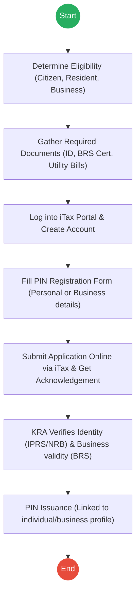
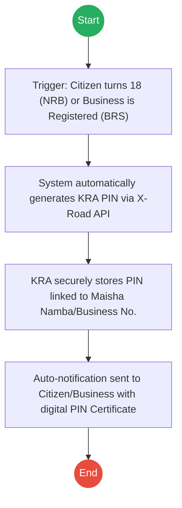
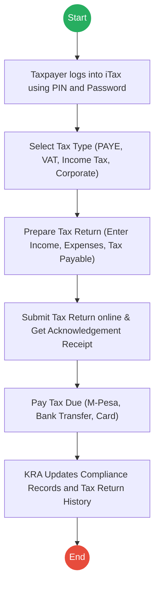
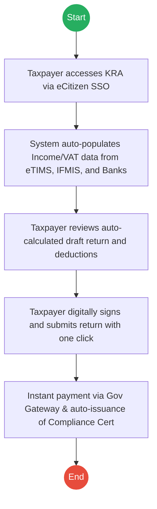

# KENYA REVENUE AUTHORITY (KRA) – Tax Return Filing & PIN Registration

## Cover Page
- **Ministry/Department/Agency (MDA):** KENYA REVENUE AUTHORITY (KRA)
- **Process Names:** KRA PIN Registration, Tax Return Filing
- **Document Version:** 2.0
- **Date:** 2026-02-24
- **Classification:** Official

---

## Executive Summary
The Kenya Revenue Authority (KRA) is the principal government agency responsible for the assessment, collection, and accounting of all government revenues. Utilizing the iTax portal, KRA manages the registration of individuals and businesses into the tax system (PIN Registration) and oversees the mandatory periodic filing of tax returns to ensure national economic compliance.

---

## Process 1: KRA PIN Registration

### 1.1 AS-IS Process Flowchart (BPMN 2.0)

### 1.2 Detailed Process (AS-IS)
| Step | Role | Action | Tool/System | Notes |
|---|---|---|---|---|
| 1 | Applicant | **Eligibility Check:** Determines eligibility (citizens, residents, businesses earning taxable income). | Manual | |
| 2 | Applicant | **Documentation:** Gathers National ID / BRS documents and supporting docs (utility bills, leases). | Physical/Scans | |
| 3 | Applicant | **Portal Access:** Logs into iTax, provides details, and links National ID or BRS Number. | iTax Portal | |
| 4 | Applicant | **Form Fill:** Fills KRA PIN application form with full name, ID, contact details (or director details for businesses). | iTax Portal | |
| 5 | Applicant | **Submission:** Submits form online via iTax. System generates Acknowledgement Receipt. | iTax Portal | |
| 6 | KRA | **Verification:** Verifies identity against IPRS/NRB and business validity against BRS. Checks for duplicate PINs. | KRA Backend | |
| 7 | System | **Issuance:** Issues KRA PIN, linking it to the individual or business profile. | iTax Portal | |

### 1.3 TO-BE Process (Inferred)
**Design Principles:** Zero-Registration (Auto-PIN Generation), Real-time Inter-agency Sync.

| Step | Role | Action | System |
|---|---|---|---|
| 1 | System | **Trigger Event:** Citizen receives ID (NRB) or business is incorporated (BRS). | NRB / BRS APIs |
| 2 | System | **Auto-Generation:** Instantly generates KRA PIN based on the new identity/business record. No manual application needed. | KRA Core Engine |
| 3 | System | **Data Sync:** Syncs the newly generated PIN with the central Golden Record (IPRS). | Inter-Agency Hub |
| 4 | System | **Digital Issuance:** Dispatches the Verifiable Digital PIN Certificate via SMS/eCitizen Wallet. | Notification Gateway |

---

## Process 2: Tax Return Filing

### 2.1 AS-IS Process Flowchart (BPMN 2.0)

### 2.2 Detailed Process (AS-IS)
| Step | Role | Action | Tool/System | Notes |
|---|---|---|---|---|
| 1 | Taxpayer | **Login:** Logs into iTax using PIN and password. | iTax Portal | |
| 2 | Taxpayer | **Selection:** Selects Tax Type (PAYE, VAT, Income Tax, Corporation Tax). | iTax Portal | |
| 3 | Taxpayer | **Preparation:** Enters required details: Income, revenue, expenses, deductions, tax payable. | iTax Portal / Excel | Often requires downloading complex Excel sheets. |
| 4 | Taxpayer | **Submission:** Reviews and submits the return online. System generates Acknowledgement Receipt. | iTax Portal | |
| 5 | Taxpayer | **Payment:** Pays tax due via M-Pesa, Bank transfer, or online card payment. | Payment Gateway | |
| 6 | KRA | **Reporting:** Maintains PIN database, tax returns history, and compliance records. | iTax Backend | |

### 2.3 TO-BE Process (Inferred)
**Design Principles:** Auto-Populated Returns, Open Banking Integration, Smart Compliance.

| Step | Role | Action | System |
|---|---|---|---|
| 1 | Taxpayer | **SSO Access:** Logs in securely via unified eCitizen Identity. | eCitizen SSO |
| 2 | System | **Auto-Population:** Automatically fetches PAYE data from employers, sales data from eTIMS, and relevant financial data to pre-fill the return. | X-Road (eTIMS/IFMIS) |
| 3 | Taxpayer | **Review:** Reviews the auto-calculated tax liability and verifies applicable deductions. | KRA Portal |
| 4 | Taxpayer | **Submission:** Digitally signs and submits the pre-filled return with a single click. | KRA Portal |
| 5 | System | **Payment & Clearance:** Processes payment seamlessly and instantly issues a Verifiable Tax Compliance Certificate (TCC). | Payment Gateway |

---

## References
- Kenya Revenue Authority Act.
- Income Tax Act.