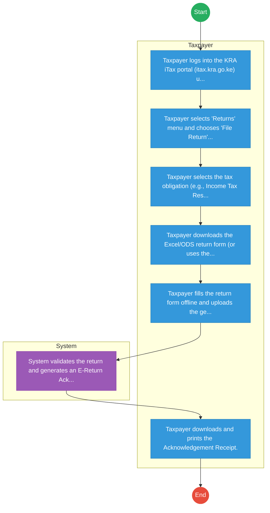
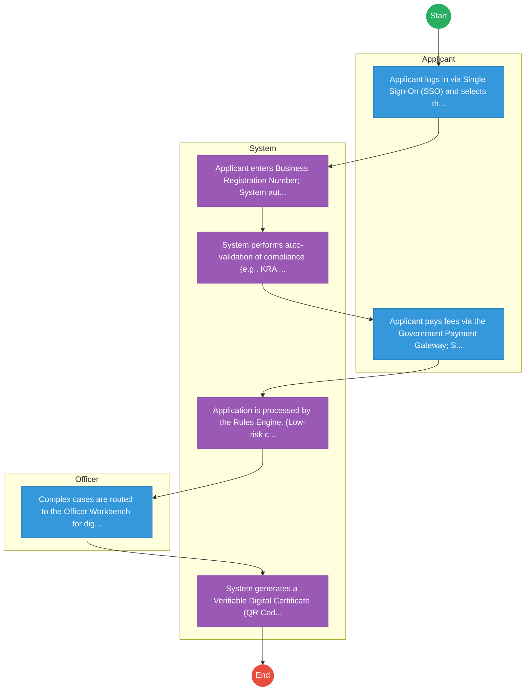

# Kenya Revenue Authority – Tax Return Filing

## Cover Page
- **Ministry/Department/Agency (MDA):** Kenya Revenue Authority
- **Process Name:** Tax Return Filing
- **Document Version:** 1.0
- **Date:** 2026-02-14
- **Classification:** Official

---

## Executive Summary
The Kenya Revenue Authority (KRA) is the principal government agency responsible for the assessment, collection, and accounting of all government revenues. Established on July 1, 1995, by an Act of Parliament (Chapter 469 of the laws of Kenya), KRA advises the government on tax policy, enforces compliance with tax and customs laws, and facilitates trade, utilizing digital platforms like iTax for taxpayer services.

---

## 1. AS-IS Process Flowchart (BPMN 2.0)
*Current State visualization.*

---

## Process Overview
### Process Name
Tax Return Filing

### Service Category
- G2B (Government to Business)

### Scope
- **In Scope:** End-to-end processing within Kenya Revenue Authority.

### Triggers
- Submission of application/request by Taxpayer.

### End States
- **Successful:** Tax Compliance Certificate, Assessment Order, Release Order

### Policy Context
- The Kenya Revenue Authority Act; The Constitution of Kenya 2010; Data Protection Act 2019.

---

## Stakeholders
| Stakeholder | Role | Responsibilities |
|---|---|---|
| Taxpayer | Process Actor | Performs actions as defined in steps. |
| System | Process Actor | Performs actions as defined in steps. |

---

## Detailed Process (AS-IS)
| Step | Role | Action | Tool | Notes |
|---|---|---|---|---|
| 1 | Taxpayer | Taxpayer logs into the KRA iTax portal (itax.kra.go.ke) using PIN and password. | Digital | |
| 2 | Taxpayer | Taxpayer selects 'Returns' menu and chooses 'File Return' or 'File Nil Return'. | Manual | |
| 3 | Taxpayer | Taxpayer selects the tax obligation (e.g., Income Tax Resident) and period. | Manual | |
| 4 | Taxpayer | Taxpayer downloads the Excel/ODS return form (or uses the web-based form for simple returns). | Manual | |
| 5 | Taxpayer | Taxpayer fills the return form offline and uploads the generated ZIP file back to the portal. | Digital | |
| 6 | System | System validates the return and generates an E-Return Acknowledgement Receipt. | Manual | |
| 7 | Taxpayer | Taxpayer downloads and prints the Acknowledgement Receipt. | Manual | |

---

## Pain Points & Opportunities
### Pain Points
- Tax evasion
- Complex filing process
- System downtime

### Opportunities
- Integration with IPRS/BRS via Service Bus.
- Adoption of Government Payment Gateway.
- Implementation of Automated Rules Engine.
- Issuance of Digital Verifiable Credentials.

---

## 2. TO-BE Process Flowchart (BPMN 2.0)
*Future State visualization (Optimized).*

## Future State Process (TO-BE)
### Narrative
The To-Be process leverages the Government Service Bus to integrate with BRS (Business Registry) and the Payment Gateway. Manual data entry and document uploads are replaced by real-time API validations, enabling a paperless, cashless, and presence-less service experience.

### Optimized Steps (Digital)
| Step | Actor | Action | System |
|---|---|---|---|
| 1 | Applicant | Applicant logs in via Single Sign-On (SSO) and selects the service. | Citizen Portal / SSO |
| 2 | System | Applicant enters Business Registration Number; System auto-populates details from BRS (Business Registry) via the Service Bus. | Service Bus / Registry API |
| 3 | System | System performs auto-validation of compliance (e.g., KRA Tax Status) via Inter-Agency APIs. | Service Bus / Compliance Engine |
| 4 | Applicant | Applicant pays fees via the Government Payment Gateway; System auto-receipts. | Payment Gateway |
| 5 | System | Application is processed by the Rules Engine. (Low-risk cases are Auto-Approved). | Workflow Engine |
| 6 | Officer | Complex cases are routed to the Officer Workbench for digital review and approval. | Officer Workbench |
| 7 | System | System generates a Verifiable Digital Certificate (QR Code) and notifies the applicant. | Output Generator |

---

## References
Derived from official mandates.
