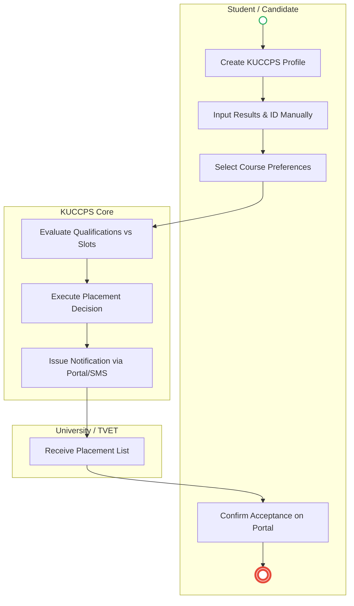
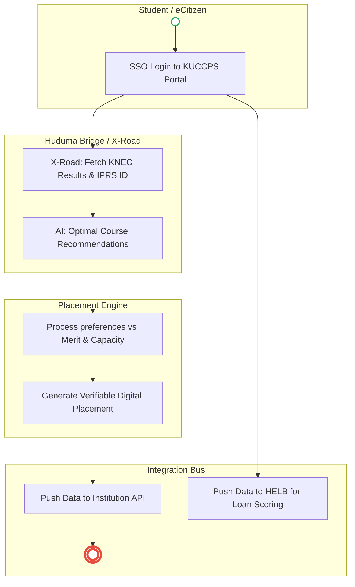

# KENYA UNIVERSITIES AND COLLEGES CENTRAL PLACEMENT SERVICE (KUCCPS) – Student Admission

## Cover Page
- **Ministry/Department/Agency (MDA):** KENYA UNIVERSITIES AND COLLEGES CENTRAL PLACEMENT SERVICE (KUCCPS)
- **Process Name:** Student Admission
- **Document Version:** 2.0
- **Date:** 2026-02-24
- **Classification:** Official

---

## Executive Summary
The Kenya Universities and Colleges Central Placement Service (KUCCPS) is mandated to coordinate the placement of government-sponsored students to universities and colleges. It ensures equitable, fair, and merit-based admission into higher education institutions across Kenya by matching candidates' academic performance with their preferred courses and available institutional capacities.

---

### 1.1 AS-IS Process Flow (BPMN 2.0)

---

## Process Overview
### Process Name
Student Admission / Placement

### Service Category
- G2C (Government to Citizen) / G2G (Government to Institution)

### Scope
- **In Scope:** Verifying candidate eligibility, profile creation, submission of course preferences, algorithmic placement matching, candidate acceptance, and notification to tertiary institutions.
- **Out of Scope:** Actual physical enrollment at the respective university/college (handled by the specific institution).

### Triggers
- Release of Kenya Certificate of Secondary Education (KCSE) results by KNEC.
- Opening of the KUCCPS application portal.

### End States
- **Successful:** Student placement confirmed; Admission record generated for institution and government planning; Data ready for scholarship, loan (HELB), or bursary processing.

### Policy Context
- Universities Act, 2012.

---

## Detailed Process (AS-IS)
| Step | Role | Action | Tool/System | Notes |
|---|---|---|---|---|
| 1 | Candidate / KUCCPS | **Verification:** Candidate provides KCSE slip, name, ID/NEMIS. KUCCPS verifies minimum entry requirements and identity. | Manual/Portal | |
| 2 | Candidate | **Profile Creation:** Creates an account on the KUCCPS portal, inputs personal details and KCSE results. | KUCCPS Portal | |
| 3 | Candidate | **Preferences:** Submits preferences for up to 6 university courses and up to 6 college/TVET courses. | KUCCPS Portal | |
| 4 | KUCCPS | **Matching:** Evaluates qualifications against course requirements, available slots, and government/institutional quotas. | Placement Algorithm| |
| 5 | KUCCPS | **Decision:** Assigns candidate to a University or TVET program. | Placement Algorithm| |
| 6 | KUCCPS | **Notification:** Communicates placement to the candidate via Portal, SMS, and Email. | Notification Gateway| |
| 7 | Candidate | **Acceptance:** Confirms acceptance of the placement through the KUCCPS portal. | KUCCPS Portal | |
| 8 | KUCCPS | **Reporting:** Notifies the institution, updates the central database, and sends reports to the Ministry of Education. | Database | Used for planning and HELB funding. |

---

## Pain Points & Opportunities
### Pain Points
- **Manual Results Entry:** Candidates manually entering KCSE results is prone to errors or tampering.
- **Verification Delays:** Verifying identity against National IDs or NEMIS manually can slow down the portal creation process.
- **Data Silos:** Lack of real-time data sharing with HELB means students have to start fresh applications for funding after placement.
- **Portal Overload:** High traffic upon portal opening frequently causes system crashes and poor user experience.

### Opportunities
- **Instant Data Sync:** Direct API integration with KNEC to instantly fetch verified KCSE results, and IPRS to verify identity without manual input.
- **AI-Assisted Guidance:** Implementing an AI recommender system on the portal to guide students toward courses where they have the highest probability of placement based on their grades.
- **Unified Education Record:** Passing the placement data immediately to HELB via API to automatically initiate the loan assessment process.

---

### 2.1 TO-BE Process (BPMN 2.0 - POC v2 Aligned)

## Future State Process (TO-BE)
### Narrative
**TO-BE Process: Seamless & Integrated Placement**

**Design Principles:**
- Zero Data Entry (API Data Fetching)
- Inter-Agency Interoperability (KNEC, HELB, Universities)
- AI-Assisted Decision Making

### Optimized Steps (Digital)
| Step | Actor | Action | System |
|---|---|---|---|
| 1 | Student | **SSO Login:** Logs into the KUCCPS portal using the unified eCitizen identity (Maisha Namba/UPI). | eCitizen SSO |
| 2 | System | **Auto-Fetch Data:** Instantly retrieves verified identity from IPRS and official KCSE examination results directly from KNEC. | X-Road APIs |
| 3 | System/AI | **Smart Selection:** An AI engine analyzes the student's grades against historical cutoff points and quotas, suggesting optimal course choices to maximize placement success. | KUCCPS AI Recommender |
| 4 | Student | **Submission:** Reviews suggestions, selects final preferences, and submits securely online. | KUCCPS Portal |
| 5 | System | **Automated Matching:** The placement algorithm runs to fairly distribute students to Universities and TVETs based on merit and capacity. | Core Placement Engine |
| 6 | Student | **Digital Acceptance:** Receives a Verifiable Digital Placement Notification and accepts it instantly on the portal. | KUCCPS Portal |
| 7 | System | **Ecosystem Sync:** The final placement data is pushed via API to the respective Tertiary Institution (for admission) and immediately to HELB (to trigger loan processing). | Inter-Agency Data Hub |

---

## References
- Universities Act, 2012.

---

### Validation Survey
Please provide your feedback here: [https://ee.kobotoolbox.org/x/4Ls7SlCG](https://ee.kobotoolbox.org/x/4Ls7SlCG)
