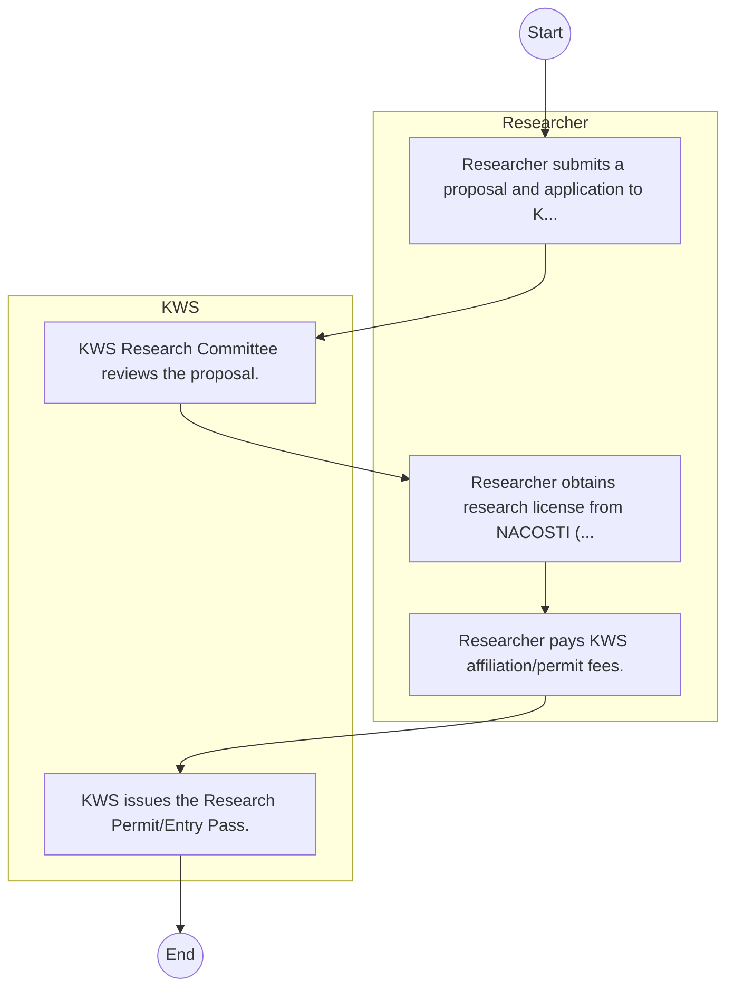

# Kenya Wildlife Service – Licensing and Permitting

## Cover Page
- **Ministry/Department/Agency (MDA):** Kenya Wildlife Service
- **Process Name:** Licensing and Permitting
- **Document Version:** 1.0
- **Date:** 2026-02-14
- **Classification:** Official

---

## Executive Summary
The Kenya Wildlife Service (KWS) is a state corporation responsible for the conservation and management of Kenya's wildlife and its habitats. Established under the Wildlife Conservation and Management Act of 2013, KWS is mandated to protect wildlife and visitors within national parks and reserves, conduct research, engage communities, enforce wildlife laws, and mitigate human-wildlife conflicts. Its vision is to ensure thriving wildlife and healthy habitats for all, forever, contributing significantly to Kenya's natural heritage and tourism sector.

---

## Process Flowchart (BPMN 2.0 - Mermaid)
*Guidance: This diagram visualizes the AS-IS process flow across different actors.*

---

## Process Overview
### Process Name
Licensing and Permitting

### Service Category
- G2C/G2B

### Scope
- **In Scope:** End-to-end processing within Kenya Wildlife Service.

### Triggers
- Submission of application/request by Researcher.

### End States
- **Successful:** License / Permit / Certificate, Compliance Inspection Report, Official Receipt, Gazette Notice

### Policy Context
- The Kenya Wildlife Service Act; The Constitution of Kenya 2010; Data Protection Act 2019.

---

## Stakeholders
| Stakeholder | Role | Responsibilities |
|---|---|---|
| Researcher | Process Actor | Performs actions as defined in steps. |
| KWS | Process Actor | Performs actions as defined in steps. |

---

## Inputs & Outputs
- **Inputs:** Application Form (License/Permit), Compliance Documents (Tax Compliance, CR12), Technical Reports / Site Plans, Proof of Payment
- **Outputs:** License / Permit / Certificate, Compliance Inspection Report, Official Receipt, Gazette Notice

---

## Detailed Process (AS-IS)
| Step | Role | Action | Tool | Notes |
|---|---|---|---|---|
| 1 | Researcher | Researcher submits a proposal and application to KWS. | Manual | |
| 2 | KWS | KWS Research Committee reviews the proposal. | Manual | |
| 3 | Researcher | Researcher obtains research license from NACOSTI (prerequisite). | Manual | |
| 4 | Researcher | Researcher pays KWS affiliation/permit fees. | Manual | |
| 5 | KWS | KWS issues the Research Permit/Entry Pass. | Manual | |

---

## Pain Points & Opportunities
### Pain Points
- Manual document verification takes time.
- High cost and time for physical inspections.
- Risk of counterfeit licenses/certificates.
- Lack of real-time monitoring of licensees.

### Opportunities
- Integration with IPRS/BRS via Service Bus.
- Adoption of Government Payment Gateway.
- Implementation of Automated Rules Engine.
- Issuance of Digital Verifiable Credentials.

---

## Future State Process (TO-BE)
### Narrative
The To-Be process leverages the Government Service Bus to integrate with BRS (Business Registry) and the Payment Gateway. Manual data entry and document uploads are replaced by real-time API validations, enabling a paperless, cashless, and presence-less service experience.

### Optimized Steps (Digital)
| Step | Actor | Action | System |
|---|---|---|---|
| 1 | Applicant | Applicant logs in via Single Sign-On (SSO) and selects the service. | Citizen Portal / SSO |
| 2 | System | Applicant enters Business Registration Number; System auto-populates details from BRS (Business Registry) via the Service Bus. | Service Bus / Registry API |
| 3 | System | System performs auto-validation of compliance (e.g., KRA Tax Status) via Inter-Agency APIs. | Service Bus / Compliance Engine |
| 4 | Applicant | Applicant pays fees via the Government Payment Gateway; System auto-receipts. | Payment Gateway |
| 5 | System | Application is processed by the Rules Engine. (Low-risk cases are Auto-Approved). | Workflow Engine |
| 6 | Officer | Complex cases are routed to the Officer Workbench for digital review and approval. | Officer Workbench |
| 7 | System | System generates a Verifiable Digital Certificate (QR Code) and notifies the applicant. | Output Generator |

---

## References & Evidence
The information in this document was derived from the following official sources:

- [https://www.kws.go.ke/](https://www.kws.go.ke/)
- [https://kikosi.co.ke/](https://kikosi.co.ke/)
- [https://wikipedia.org/](https://wikipedia.org/)

---

## Appendices
See attached ERD and System Design.
