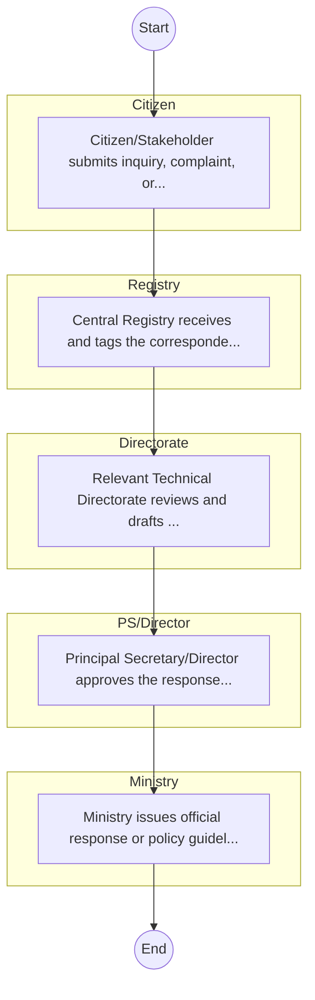

# Ministry of Co-operatives and Micro, Small and Medium Enterprises (MSME) Development – Service Delivery

## Cover Page
- **Ministry/Department/Agency (MDA):** Ministry of Co-operatives and Micro, Small and Medium Enterprises (MSME) Development
- **Process Name:** Service Delivery
- **Document Version:** 1.0
- **Date:** 2026-02-14
- **Classification:** Official

---

## Executive Summary
Represents 'General Economic and Commercial Affairs' cluster for balanced coverage; entity type: Ministry. Included as Tier 3 for light‑touch desk review/survey.

---

## Process Flowchart (BPMN 2.0 - Mermaid)
*Guidance: This diagram visualizes the AS-IS process flow across different actors.*

---

## Process Overview
### Process Name
Service Delivery

### Service Category
- G2C/G2B

### Scope
- **In Scope:** End-to-end processing within Ministry of Co-operatives and Micro, Small and Medium Enterprises (MSME) Development.

### Triggers
- Submission of application/request by Citizen.

### End States
- **Successful:** Policy Guidelines / Circulars, Official Response Letters, Cabinet Resolutions, Public Service Reports

### Policy Context
- The Ministry of Co-operatives and Micro, Small and Medium Enterprises (MSME) Development Act; The Constitution of Kenya 2010; Data Protection Act 2019.

---

## Stakeholders
| Stakeholder | Role | Responsibilities |
|---|---|---|
| PS/Director | Process Actor | Performs actions as defined in steps. |
| Directorate | Process Actor | Performs actions as defined in steps. |
| Citizen | Process Actor | Performs actions as defined in steps. |
| Registry | Process Actor | Performs actions as defined in steps. |
| Ministry | Process Actor | Performs actions as defined in steps. |

---

## Inputs & Outputs
- **Inputs:** Public Inquiries / Petitions, Policy Proposals / Memos, Inter-agency Correspondence, Cabinet Memos
- **Outputs:** Policy Guidelines / Circulars, Official Response Letters, Cabinet Resolutions, Public Service Reports

---

## Detailed Process (AS-IS)
| Step | Role | Action | Tool | Notes |
|---|---|---|---|---|
| 1 | Citizen | Citizen/Stakeholder submits inquiry, complaint, or policy proposal via email or office. | Manual | |
| 2 | Registry | Central Registry receives and tags the correspondence. | Manual | |
| 3 | Directorate | Relevant Technical Directorate reviews and drafts response/action. | Manual | |
| 4 | PS/Director | Principal Secretary/Director approves the response. | Manual | |
| 5 | Ministry | Ministry issues official response or policy guideline. | Manual | |

---

## Pain Points & Opportunities
### Pain Points
- Slow movement of physical files (Bureaucracy).
- Loss of institutional memory (Manual registries).
- Difficulty in tracking correspondence status.
- Siloed operations between departments.

### Opportunities
- Integration with IPRS/BRS via Service Bus.
- Adoption of Government Payment Gateway.
- Implementation of Automated Rules Engine.
- Issuance of Digital Verifiable Credentials.

---

## Future State Process (TO-BE)
### Narrative
The To-Be process leverages the Government Service Bus to integrate with BRS (Business Registry) and the Payment Gateway. Manual data entry and document uploads are replaced by real-time API validations, enabling a paperless, cashless, and presence-less service experience.

### Optimized Steps (Digital)
| Step | Actor | Action | System |
|---|---|---|---|
| 1 | Applicant | Applicant logs in via Single Sign-On (SSO) and selects the service. | Citizen Portal / SSO |
| 2 | System | Applicant enters Business Registration Number; System auto-populates details from BRS (Business Registry) via the Service Bus. | Service Bus / Registry API |
| 3 | System | System performs auto-validation of compliance (e.g., KRA Tax Status) via Inter-Agency APIs. | Service Bus / Compliance Engine |
| 4 | Applicant | Applicant pays fees via the Government Payment Gateway; System auto-receipts. | Payment Gateway |
| 5 | System | Application is processed by the Rules Engine. (Low-risk cases are Auto-Approved). | Workflow Engine |
| 6 | Officer | Complex cases are routed to the Officer Workbench for digital review and approval. | Officer Workbench |
| 7 | System | System generates a Verifiable Digital Certificate (QR Code) and notifies the applicant. | Output Generator |

---

## References & Evidence
The information in this document was derived from the following official sources:

- Official Mandate and Service Charter (Inferred from Statutory Acts).

---

## Appendices
See attached ERD and System Design.
