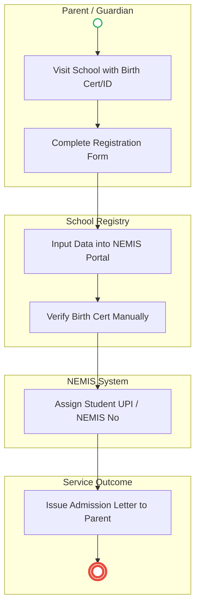
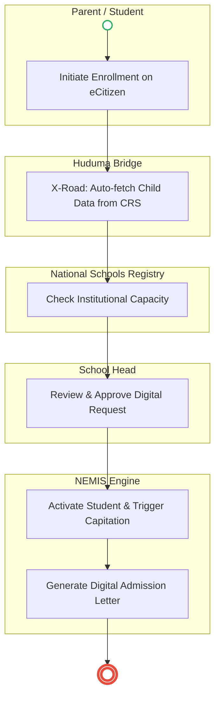

# MINISTRY OF EDUCATION – Service Delivery

## Cover Page
- **Ministry/Department/Agency (MDA):** MINISTRY OF EDUCATION
- **Process Name:** Student Registration & Transition (NEMIS)
- **Document Version:** 2.0
- **Date:** 2026-02-24
- **Classification:** Official

---

## Executive Summary
The Ministry of Education (MoE) is responsible for national education policy and standards. It oversees the **National Education Management Information System (NEMIS)**, which acts as the central repository for all student data, assigning a Unique Personal Identifier (UPI) or NEMIS Number to every learner from Early Years Education to secondary school, which is crucial for tracking enrollment, transition, and capitation funding.

---

### 1.1 AS-IS Process Flow (BPMN 2.0)

---

## Process Overview
### Process Name
Student Registration & Transition (NEMIS)

### Service Category
- G2C (Government to Citizen) / G2G (Government to School)

### Scope
- **In Scope:** Initial registration of a learner into a school, data entry into NEMIS, generation of the NEMIS Number (UPI), issuance of admission letters, and reporting for government planning.
- **Out of Scope:** Administration of national exams (handled by KNEC) and university placement (handled by KUCCPS).

### Triggers
- A child reaches the eligible school-going age (4-6 years).
- A parent/guardian seeks admission at a specific school.

### End States
- **Successful:** NEMIS Student Number issued; School Enrollment Record created; Data available for capitation and government planning.

### Policy Context
- Basic Education Act, 2013.

---

## Detailed Process (AS-IS)
| Step | Role | Action | Tool/System | Notes |
|---|---|---|---|---|
| 1 | Parent/Guardian | **Initiation:** Child reaches school-going age; parent decides on school placement. | Physical | |
| 2 | Parent/Guardian | **Documentation:** Approaches school and provides Child’s Birth Cert (from CRS), Parent ID, and Health records. | Manual Documents | Without a Birth Cert, registration is blocked. |
| 3 | School | **Form Preparation:** Records child’s name, DOB, gender, parent details, and previous records on a registration form. | Physical Register | |
| 4 | School Officer | **Data Entry:** Enters child data into the NEMIS portal, verifying the Birth Cert number and confirming uniqueness. | NEMIS Portal | Done on behalf of the parent. |
| 5 | School | **Validation:** Checks completeness of data, accuracy against the Birth Cert, and compliance with admission rules. | Manual/NEMIS | |
| 6 | NEMIS System | **Confirmation:** Issues the NEMIS Number (UPI) to the student and stores the record in the central database. | NEMIS Database | |
| 7 | School | **Issuance:** Provides an Admission letter containing the NEMIS Number to the parent for reference. | Physical Letter | |
| 8 | School | **Reporting:** Submits monthly/annual enrollment reports to the County Education Office and MOE. | Manual/Portal | Used for planning and resource allocation. |

---

## Pain Points & Opportunities
### Pain Points
- **School Bottleneck:** Parents cannot register their children directly; they must rely entirely on the school officer, leading to delays if the school lacks internet access or personnel.
- **Manual Verification:** Schools manually verifying physical Birth Certificates against the system leads to spelling errors and "duplicate" rejections.
- **Reporting Burden:** Despite having NEMIS, schools are still often required to submit manual enrollment reports to county offices.

### Opportunities
- **Parent Self-Service:** Empower parents to initiate enrollment requests directly via eCitizen using the child's UPI (from birth).
- **Auto-Verification:** Direct API link to Civil Registration Services (CRS) to auto-populate the child's details, eliminating manual data entry by schools.
- **Automated Capitation:** Capitation funds and monthly reports should be auto-generated by the system based on active daily attendance, rather than manual submissions.

---

### 2.1 TO-BE Process (BPMN 2.0 - POC v2 Aligned)

## Future State Process (TO-BE)
### Narrative
**TO-BE Process: Parent-Led Digital Enrollment**

**Design Principles:**
- Parent Empowerment (Self-Service)
- Single Source of Truth Verification (CRS API)
- Automated Capacity and Capitation Management

### Optimized Steps (Digital)
| Step | Actor | Action | System |
|---|---|---|---|
| 1 | Parent | **Self-Service Request:** Logs into eCitizen using SSO to initiate the school enrollment process for their child. | eCitizen Portal |
| 2 | System | **Auto-Population:** Uses the child's Maisha Namba (UPI minted at birth) to instantly fetch and verify details from the CRS Registry, eliminating document uploads. | X-Road (CRS API) |
| 3 | Parent/System| **School Selection:** Parent selects the desired school. System instantly queries the National Schools Registry to confirm available capacity. | Schools Registry API |
| 4 | School Head | **Digital Approval:** The Head Teacher receives the verified digital request on their dashboard and approves the admission with one click. | Officer Workbench |
| 5 | NEMIS System | **Activation & Funding:** NEMIS automatically activates the student's enrollment status and immediately triggers capitation funding calculations for the MOE. | NEMIS Core Engine |
| 6 | System | **Digital Issuance:** Generates a Digital Admission Letter and sends it directly to the parent's eCitizen Wallet and via SMS. | Notification Gateway |

---

## References
- Basic Education Act, 2013.