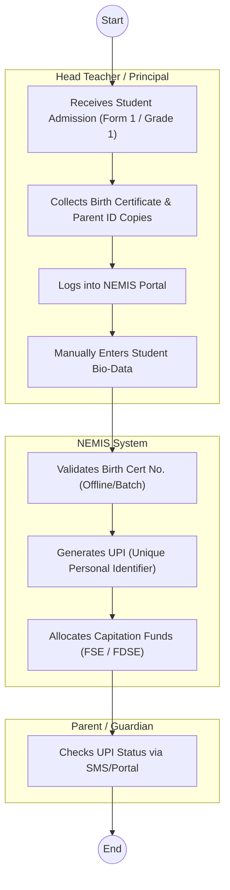
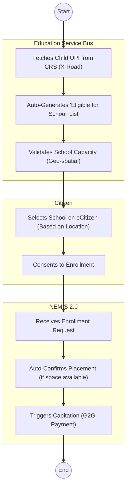

# MINISTRY OF EDUCATION – Service Delivery

## Cover Page
- **Ministry/Department/Agency (MDA):** MINISTRY OF EDUCATION
- **Process Name:** Student Registration & Transition (NEMIS)
- **Document Version:** 1.2
- **Date:** 2026-02-19
- **Classification:** Official

---

## Executive Summary
The Ministry of Education (MoE) is responsible for national education policy and standards. The **National Education Management Information System (NEMIS)** is the central repository for all student data, assigning a Unique Personal Identifier (UPI) to every learner from Early Years Education (EYE) to University.

---

## 1. AS-IS Process Flowchart (BPMN 2.0)
*Current State visualization (Manual Entry / System Glitches).*

---

## Process Overview
### Process Name
Student Registration & Capitation (NEMIS)

### Service Category
- G2C (Government to Citizen) / G2G (Government to School)

### Scope
- **In Scope:** Registration of learners in Public/Private Basic Education institutions; Disbursement of Free Primary/Day Secondary Education funds.
- **Out of Scope:** University placement (KUCCPS handles this based on NEMIS data).

### Triggers
- Admission of a child to school (PP1, Grade 1, Form 1).
- Transfer of a student between schools.

### End States
- **Successful:** UPI Generated; Capitation Disbursed.

### Policy Context
- Basic Education Act, 2013; Sessional Paper No. 1 of 2019.

---

## Stakeholders
| Stakeholder | Role | Responsibilities |
|---|---|---|
| Head Teacher | Data Entrant | Captures learner details on NEMIS. |
| County Director of Education (CDE) | Approver | Approves school registrations and transfers. |
| Parent | Beneficiary | Provides birth documents; monitors progress. |
| KNEC | Consumer | Uses NEMIS data for exam registration (KPSEA, KCSE). |

---

## Detailed Process (AS-IS)
| Step | Role | Action | Tool | Notes |
|---|---|---|---|---|
| 1 | Head Teacher | **Admission:** Admits student physically. Collects Birth Certificate copy. | Physical File | |
| 2 | Head Teacher | **Data Entry:** Logs into NEMIS (often at a cyber café due to lack of school internet). Types name, DOB, Birth Cert No, Parent Name/ID. | NEMIS Web Portal | System often hangs during peak admission weeks (Jan/Feb). |
| 3 | NEMIS System | **Validation:** Attempts to validate Birth Cert against CRS database. | Integration API | *Pain Point:* Often fails if names don't match *exactly* or if CRS data is missing. |
| 4 | Head Teacher | **Generation:** If successful, NEMIS generates a **UPI**. If failed, student is flagged as "Pending" (Risk of missing Capitation). | Dashboard | Thousands of students lack UPIs due to "validation errors." |
| 5 | MoE HQ | **Capitation:** Funds are disbursed *only* to students with valid UPIs. | IFMIS / Bank | Schools struggle with "ghost students" vs real students without UPIs. |
| 6 | KNEC | **Exam Reg:** Fetches UPIs for exam registration. | KNEC Portal | Students without UPIs risk missing exams. |

---

## Pain Points & Opportunities
### Pain Points
- **System Downtime:** NEMIS crashes frequently during Form 1 admission.
- **Data Mismatch:** Rigid validation against CRS (e.g., "Maina" vs "Maina J.") causes rejection.
- **Manual Transfers:** Moving a student requires the *previous* school to "release" them online. Head Teachers often refuse/delay this.
- **Capitation Loss:** Schools lose funds for students whose UPI generation is stuck.
- **Cyber Costs:** Head Teachers in rural areas travel long distances to access internet.

### Opportunities
- **Auto-Registration:** Link Birth Registration (CRS) to Education. A child turning 4 is *automatically* eligible for PP1.
- **Offline Mode:** Allow data capture on a mobile app without internet, syncing later.
- **Parent Self-Service:** Allow parents to register/transfer their own children via eCitizen, removing the Head Teacher bottleneck.
- **Biometrics:** Introduce simple biometrics to eliminate ghost students definitively.

---

## 2. TO-BE Process Flowchart (BPMN 2.0)
*Future State visualization (Repeatable WoG Platform).*

## Future State Process (TO-BE)
### Narrative
The process is **Identity-Driven** and **Automated**.
1.  **UPI Federation:** The system uses the child's UPI (Maisha Namba) from birth. No new ID is created.
2.  **Parent-Led Enrollment:** Through the **Citizen Portal (eCitizen)**, parents select schools. The system validates eligibility based on age (from CRS) and location.
3.  **Real-Time Data:** School enrollment numbers are updated instantly via the platform.
4.  **Automated Capitation:** Funds are released automatically via the **Government Payment Aggregator (GPA)** based on verified enrollment, eliminating ghost students.
5.  **Seamless Transition:** Moving schools is a simple "Transfer Request" on the portal, approved by the receiving school.

### Optimized Steps (Digital)
| Step | Actor | Action | System |
|---|---|---|---|
| 1 | Parent | Selects school and enrolls child via eCitizen. | eCitizen Portal |
| 2 | WoG Platform | Validates UPI (CRS) and checks school capacity. | X-Road / NEMIS |
| 3 | School | Receives digital enrollment notification. | School Dashboard |
| 4 | MoE System | Disburses capitation funds instantly. | GPA / IFMIS |

---

## References
- Basic Education Act.
