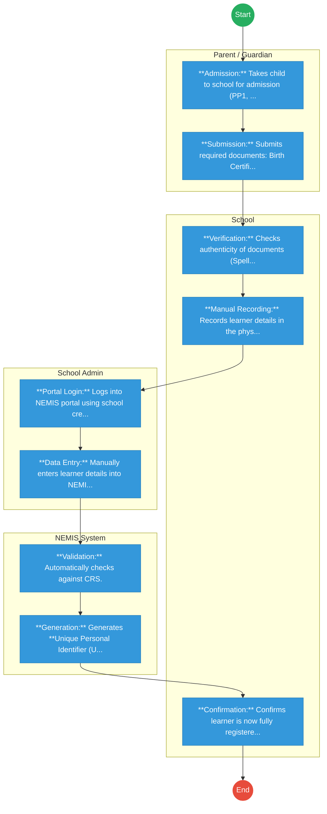
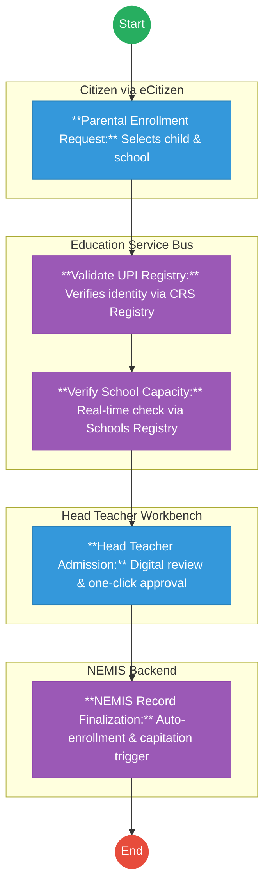

# MINISTRY OF EDUCATION – Service Delivery

## Cover Page
- **Ministry/Department/Agency (MDA):** MINISTRY OF EDUCATION
- **Process Name:** Student Registration & Transition (NEMIS)
- **Document Version:** 1.3
- **Date:** 2026-02-19
- **Classification:** Official

---

## Executive Summary
The Ministry of Education (MoE) is responsible for national education policy and standards. The **National Education Management Information System (NEMIS)** is the central repository for all student data, assigning a Unique Personal Identifier (UPI) to every learner from Early Years Education (EYE) to University.

---

## 1. AS-IS Process Flowchart (BPMN 2.0)
*Current State visualization (Manual Entry / System Glitches).*

---

## Process Overview
### Process Name
Student Registration & Capitation (NEMIS)

### Service Category
- G2C (Government to Citizen) / G2G (Government to School)

### Scope
- **In Scope:** Registration of learners in Public/Private Basic Education institutions; Disbursement of Free Primary/Day Secondary Education funds.
- **Out of Scope:** University placement (KUCCPS handles this based on NEMIS data).

### Triggers
- Admission of a child to school (PP1, Grade 1, Form 1).
- Transfer of a student between schools.

### End States
- **Successful:** UPI Generated; Capitation Disbursed.

### Policy Context
- Basic Education Act, 2013; Sessional Paper No. 1 of 2019.

---

## Stakeholders
| Stakeholder | Role | Responsibilities |
|---|---|---|
| Head Teacher | Data Entrant | Captures learner details on NEMIS. |
| County Director of Education (CDE) | Approver | Approves school registrations and transfers. |
| Parent | Beneficiary | Provides birth documents; monitors progress. |
| KNEC | Consumer | Uses NEMIS data for exam registration (KPSEA, KCSE). |

---

## Detailed Process (AS-IS)
| Step | Role | Action | Tool | Notes |
|---|---|---|---|---|
| 1 | Parent / Guardian | **Admission:** Takes child to school for admission (PP1, Grade 1, or transfer). | Physical Presence | Child must be physically present for verification. |
| 2 | Parent / Guardian | **Submission:** Submits required documents: Birth Certificate (Mandatory), Parent ID copy, Passport photo, Previous school details, Immunization card. | Physical Documents | *Constraint:* Without Birth Cert, admission is often delayed. |
| 3 | School | **Verification:** Checks authenticity of documents (Spelling, DOB, Parent details). | Manual Check | If Birth Cert missing, parent is advised to register birth first. |
| 4 | School | **Manual Recording:** Records learner details in the physical Admission Register and Class Register. | Physical Register | Creates the official school admission record (offline). |
| 5 | School Admin | **Portal Login:** Logs into NEMIS portal using school credentials. | NEMIS Web Portal | Often done at cyber cafés due to lack of school internet. |
| 6 | School Admin | **Data Entry:** Manually enters learner details into NEMIS (Birth Cert No, Name, Gender, DOB, Parent details). | NEMIS Web Portal | *Bottleneck:* School applies to NEMIS on behalf of learner; Parent cannot do this directly. |
| 7 | NEMIS System | **Validation:** Automatically checks against CRS. | Integration API | **Outcomes:**  • Valid: Learner accepted. • Duplicate: Transfer required. • Invalid: Registration rejected (Learner stuck). |
| 8 | NEMIS System | **Generation:** Generates **Unique Personal Identifier (UPI)**. | System | This becomes the learner’s permanent education ID for exams (KPSEA, KCSE) and Capitation. |
| 9 | School | **Confirmation:** Confirms learner is now fully registered and Active in NEMIS. | Dashboard | Learner is now officially recognized by Ministry of Education. |

**Summary:** The reality is that **Parents DO NOT apply directly to NEMIS**. Parents apply to the school, and the **School applies to NEMIS** on behalf of the learner. The final artifact is the **UPI Number**.

---

## Pain Points & Opportunities
### Pain Points
- **System Downtime:** NEMIS crashes frequently during Form 1 admission.
- **Data Mismatch:** Rigid validation against CRS (e.g., "Maina" vs "Maina J.") causes rejection.
- **Manual Transfers:** Moving a student requires the *previous* school to "release" them online. Head Teachers often refuse/delay this.
- **Capitation Loss:** Schools lose funds for students whose UPI generation is stuck.
- **Cyber Costs:** Head Teachers in rural areas travel long distances to access internet.

### Opportunities
- **Auto-Registration:** Link Birth Registration (CRS) to Education. A child turning 4 is *automatically* eligible for PP1.
- **Offline Mode:** Allow data capture on a mobile app without internet, syncing later.
- **Parent Self-Service:** Allow parents to register/transfer their own children via eCitizen, removing the Head Teacher bottleneck.
- **Biometrics:** Introduce simple biometrics to eliminate ghost students definitively.

---

## 2. TO-BE Process Flowchart (BPMN 2.0)
*Future State visualization (Repeatable WoG Platform).*

## Detailed Process (TO-BE) - Configurable & Automated
| Step | Actor | Action | System Component | Logic / Integration |
|---|---|---|---|---|
| 1 | Parent / Guardian | **Initiation:** Selects child (via UPI) and preferred school on eCitizen. | **eCitizen Portal** | Uses `Maisha Namba (SSO)` for authentication. |
| 2 | System | **UPI Validation:** Verifies child existence and parentage records. | **CRS Registry API** | Fetches birth details via the `Service Bus`. |
| 3 | System | **Capacity Check:** Validates school has space and child meets age requirements. | **National Schools Registry** | Calls `Verify School Capacity` endpoint dynamically. |
| 4 | School Head | **Admission Review:** Approves the digital application on the workbench. | **Officer Workbench** | Validated data removes need for physical file review. |
| 5 | System | **Enrollment Sync:** Finalizes record in NEMIS and triggers capitation. | **NEMIS Workflow Engine** | Auto-enrolls and calculated FDSE/FPE funds. |

---

## 3. Standard Data Inputs
*Required fields for the WoG Digital Service.*

### A. School Enrollment (MOE-NEMIS-001)
| Field Name | Type | Source | Widget / Registry |
|---|---|---|---|
| child_upi | String | CRS Registry | **Auto-Populate / Verify** |
| school_code | String | Schools Registry | **Registry Search** |
| admission_level | Enum | Business Logic | **Rule-Based (Age)** |

### B. Student Transfer Request
| Field Name | Type | Source | Validation |
|---|---|---|---|
| Child UPI | String | User Input | Must be currently enrolled |
| From School | String | System Fetch | Read-only |
| To School Code | String | User Input | Must have capacity |
| Reason | String | Enum (Relocation, etc.) | Required |
| Transfer Date | Date | User Input | Cannot be past |

---

## References
- Basic Education Act.
