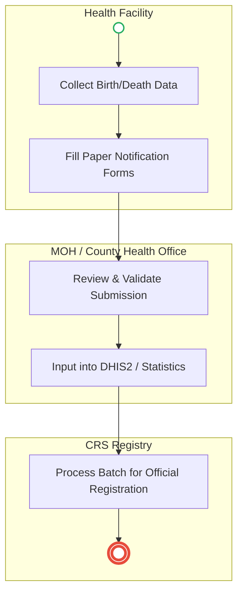
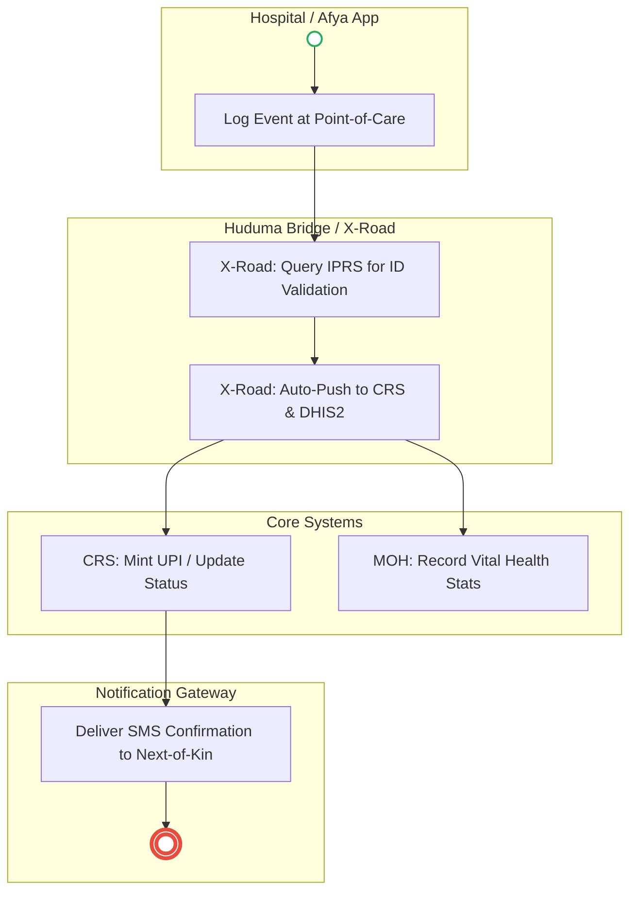

# MINISTRY OF HEALTH – Service Delivery

## Cover Page
- **Ministry/Department/Agency (MDA):** MINISTRY OF HEALTH
- **Process Name:** Notification of Birth/Death
- **Document Version:** 2.0
- **Date:** 2026-02-24
- **Classification:** Official

---

## Executive Summary
The Ministry of Health plays a foundational role in the citizen lifecycle by acting as the primary point of occurrence for vital events (births and deaths). It is responsible for capturing, verifying, and notifying the Civil Registration Services (CRS) of these events, which forms the basis of national identity and public health statistics.

---

### 1.1 AS-IS Process Flow (BPMN 2.0)

---

## Process Overview
### Process Name
Notification of Birth/Death

### Service Category
- G2G (Government to Government) / G2C (Government to Citizen)

### Scope
- **In Scope:** Identification of vital event, completion of notification forms, verification of identities, submission to DHIS2, validation by MOH, and forwarding to Civil Registration Services.
- **Out of Scope:** Actual printing and issuance of Birth and Death Certificates (handled by CRS).

### Triggers
- A birth or death occurring within a registered health facility.

### End States
- **Successful:** Verified Birth/Death Notification forwarded to CRS; Recorded in MOH database for national statistics.

### Policy Context
- Public Health Act; Births and Deaths Registration Act.

---

## Detailed Process (AS-IS)
| Step | Role | Action | Tool/System | Notes |
|---|---|---|---|---|
| 1 | Health Facility | **Event Occurs:** Birth or death happens at a registered health facility. Identifies event as reportable. | Physical | |
| 2 | Health Facility | **Record Event:** Fills Birth Notification Form or Death Notification Form. | Manual/Paper | |
| 3 | Health Personnel | **Verification:** Verifies National ID of mother (birth) or deceased (death), and completeness of forms. | Manual | |
| 4 | Health Facility | **Submission:** Sends notification electronically via DHIS2 or physically to County Health Office. | DHIS2 / Physical | |
| 5 | MOH/County | **Validation:** Checks completeness, compliance, and consistency with other health data. | Manual/DHIS2 | |
| 6 | MOH | **Confirmation:** Confirms record for health statistics and linking to CRS. | DHIS2 | |
| 7 | MOH | **Forwarding:** Sends confirmed notifications to CRS for official civil registration. | Manual/Batch | CRS then issues Birth/Death Certificates. |
| 8 | MOH | **Reporting:** Keeps aggregated reports for vital stats, planning, and epidemiology. | DHIS2 | |

---

## Pain Points & Opportunities
### Pain Points
- **Manual Data Entry:** Paper forms lead to errors in names and ID numbers before they ever reach the digital system.
- **Processing Delays:** Physical forwarding of batches to County Offices and then to CRS creates massive backlogs in civil registration.
- **Lack of Verification:** The hospital often cannot instantly verify if the provided Mother's ID or Deceased's ID is valid in IPRS.

### Opportunities
- **Point-of-Care Capture:** Directly inputting data into an EMR connected to the national system.
- **Instant IPRS Validation:** API ping to IPRS to validate IDs before the notification is saved.
- **System-to-System Integration:** Direct API push from MOH (DHIS2) to CRS, bypassing manual county-level validation for routine cases.

---

### 2.1 TO-BE Process (BPMN 2.0 - POC v2 Aligned)

## Future State Process (TO-BE)
### Narrative
**TO-BE Process: Real-Time Vital Event Notification**

**Design Principles:**
- Point-of-Care Digital Capture
- Instant Identity Verification
- Seamless Inter-Agency Data Exchange (MOH to CRS)

### Optimized Steps (Digital)
| Step | Actor | Action | System |
|---|---|---|---|
| 1 | Health Worker | **Digital Capture:** Logs the birth or death event directly into the integrated Hospital EMR or national Afya Mobile App at the point of care. | Hospital EMR |
| 2 | System | **Auto-Validation:** Instantly pings IPRS via API to validate the provided National ID (Mother or Deceased) to prevent identity fraud. | IPRS API |
| 3 | System | **Dual-Routing:** The validated notification data is simultaneously routed to the MOH DHIS2 system and directly pushed to the CRS database. | X-Road API |
| 4 | CRS System | **Registration:** CRS receives the data instantly, automatically minting a Maisha Namba (UPI) for a birth, or flagging the ID as deceased. | CRS System |
| 5 | MOH System | **Aggregation:** DHIS2 automatically ingests the vital event into the national data lake for real-time epidemiological monitoring and health planning. | DHIS2 / Data Lake |
| 6 | System | **Citizen Alert:** Auto-generates an SMS to the next of kin/parents confirming the event has been securely registered with the government. | Notification Gateway |

---

## References
- Public Health Act.
- Births and Deaths Registration Act.