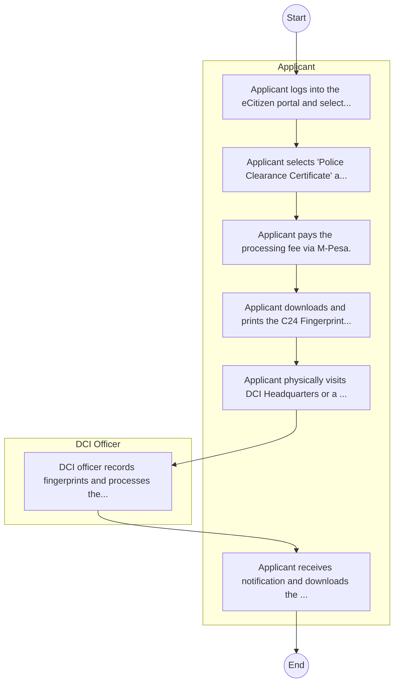
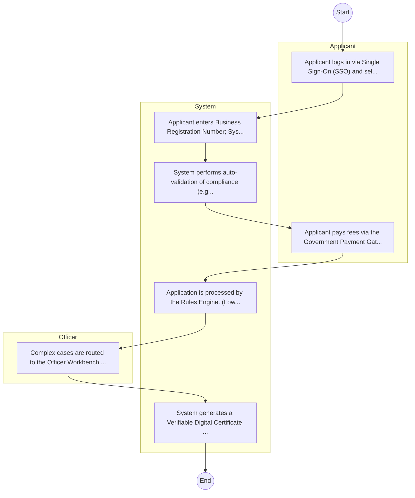

# NATIONAL POLICE SERVICE (NPS) – Service Delivery

## Cover Page
- **Ministry/Department/Agency (MDA):** NATIONAL POLICE SERVICE (NPS)
- **Process Name:** Service Delivery
- **Document Version:** 1.0
- **Date:** 2026-02-14
- **Classification:** Official

---

## Executive Summary
The Ministry of Agriculture and Livestock Development Kenya is mandated to promote sustainable development and management of crops and livestock, ensuring the nation's food and nutrition security. It aims to transform the agricultural sector into a competitive, commercially oriented, and economically responsive contributor to national development.

---

## 1. AS-IS Process Flowchart (BPMN 2.0)
*Current State visualization.*

---

## Process Overview
### Process Name
Service Delivery

### Service Category
- G2C/G2B

### Scope
- **In Scope:** End-to-end processing within NATIONAL POLICE SERVICE (NPS).

### Triggers
- Submission of application/request by Applicant.

### End States
- **Successful:** P3 Form, Police Abstract, Good Conduct Cert

### Policy Context
- The NATIONAL POLICE SERVICE (NPS) Act; The Constitution of Kenya 2010; Data Protection Act 2019.

---

## Stakeholders
| Stakeholder | Role | Responsibilities |
|---|---|---|
| DCI Officer | Process Actor | Performs actions as defined in steps. |
| Applicant | Process Actor | Performs actions as defined in steps. |

---

## Detailed Process (AS-IS)
| Step | Role | Action | Tool | Notes |
|---|---|---|---|---|
| 1 | Applicant | Applicant logs into the eCitizen portal and selects Directorate of Criminal Investigations (DCI). | Digital | |
| 2 | Applicant | Applicant selects 'Police Clearance Certificate' application. | Manual | |
| 3 | Applicant | Applicant pays the processing fee via M-Pesa. | Manual | |
| 4 | Applicant | Applicant downloads and prints the C24 Fingerprint Form and receipt. | Manual | |
| 5 | Applicant | Applicant physically visits DCI Headquarters or a Huduma Center for fingerprint recording. | Manual | |
| 6 | DCI Officer | DCI officer records fingerprints and processes the check. | Manual | |
| 7 | Applicant | Applicant receives notification and downloads the certificate from eCitizen. | Manual | |

---

## Pain Points & Opportunities
### Pain Points
- Lost case files
- Manual OB (Occurrence Book)
- Slow response

### Opportunities
- Integration with IPRS/BRS via Service Bus.
- Adoption of Government Payment Gateway.
- Implementation of Automated Rules Engine.
- Issuance of Digital Verifiable Credentials.

---

## 2. TO-BE Process Flowchart (BPMN 2.0)
*Future State visualization (Optimized).*

## Future State Process (TO-BE)
### Narrative
The To-Be process leverages the Government Service Bus to integrate with BRS (Business Registry) and the Payment Gateway. Manual data entry and document uploads are replaced by real-time API validations, enabling a paperless, cashless, and presence-less service experience.

### Optimized Steps (Digital)
| Step | Actor | Action | System |
|---|---|---|---|
| 1 | Applicant | Applicant logs in via Single Sign-On (SSO) and selects the service. | Citizen Portal / SSO |
| 2 | System | Applicant enters Business Registration Number; System auto-populates details from BRS (Business Registry) via the Service Bus. | Service Bus / Registry API |
| 3 | System | System performs auto-validation of compliance (e.g., KRA Tax Status) via Inter-Agency APIs. | Service Bus / Compliance Engine |
| 4 | Applicant | Applicant pays fees via the Government Payment Gateway; System auto-receipts. | Payment Gateway |
| 5 | System | Application is processed by the Rules Engine. (Low-risk cases are Auto-Approved). | Workflow Engine |
| 6 | Officer | Complex cases are routed to the Officer Workbench for digital review and approval. | Officer Workbench |
| 7 | System | System generates a Verifiable Digital Certificate (QR Code) and notifies the applicant. | Output Generator |

---

## References
Derived from official mandates.
