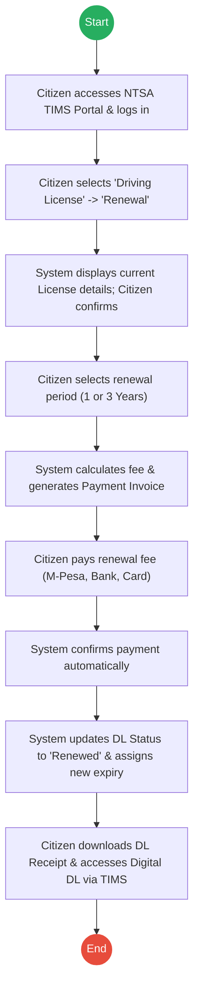
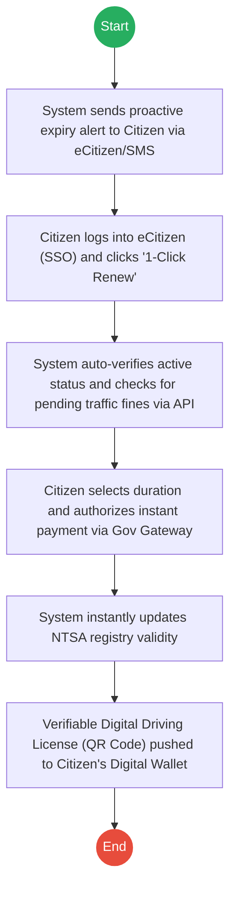

# NATIONAL TRANSPORT AND SAFETY AUTHORITY (NTSA) – Driving License Renewal

## Cover Page
- **Ministry/Department/Agency (MDA):** NATIONAL TRANSPORT AND SAFETY AUTHORITY (NTSA)
- **Process Name:** Driving License Renewal
- **Document Version:** 2.0
- **Date:** 2026-02-24
- **Classification:** Official

---

## Executive Summary
The National Transport and Safety Authority (NTSA) is mandated to harmonize the operations of the key road transport departments and help effectively manage the road transport sub-sector. One of its high-volume services is the renewal of Driving Licenses for eligible citizens, transitioning towards a fully digital smart card and e-license system via the TIMS (Transport Integrated Management System) portal.

---

## 1. AS-IS Process Flowchart (BPMN 2.0)
*Current State visualization (TIMS Portal Renewal).*

---

## Process Overview
### Process Name
Driving License Renewal

### Service Category
- G2C (Government to Citizen)

### Scope
- **In Scope:** Accessing portal, verifying license details, selecting renewal duration, payment processing, updating license validity, and digital issuance.
- **Out of Scope:** First-time Driving License application; Smart DL physical card printing (unless explicitly requested separately).

### Triggers
- Citizen's driving license is expiring or has expired.

### End States
- **Successful:** Renewed Driving License with updated validity period in the NTSA system.

### Policy Context
- Traffic Act (Cap 403); NTSA Act.

---

## Detailed Process (AS-IS)
| Step | Role | Action | Tool/System | Notes |
|---|---|---|---|---|
| 1 | Citizen | **Access:** Accesses NTSA TIMS Portal and logs in using National ID Number and Password. | TIMS Portal | |
| 2 | Citizen | **Navigation:** Navigates to Driving License service and selects "Renewal". | TIMS Portal | |
| 3 | System/Citizen| **Verification:** System displays License Number, Class, and Expiry. Citizen confirms details. | TIMS Portal | |
| 4 | Citizen | **Selection:** Selects renewal duration (1 Year or 3 Years). System calculates the fee. | TIMS Portal | |
| 5 | System | **Invoicing:** Generates a Payment Invoice. | TIMS Portal | |
| 6 | Citizen | **Payment:** Pays the renewal fee via Mobile Money (M-Pesa), Bank, or Card. | Payment Gateway | |
| 7 | System | **Confirmation:** Confirms the payment automatically. | TIMS Portal | |
| 8 | System | **Update:** Updates Driving License Status to "Renewed" and assigns a new expiry date. | NTSA Registry | |
| 9 | Citizen | **Issuance:** Downloads the Driving License Receipt and accesses the Digital Driving License via the TIMS Portal. | TIMS Portal | Physical smart card is not automatically issued. |

**Final Output:** Renewed Driving License and updated validity period in the NTSA system.

---

## Pain Points & Opportunities
### Pain Points
- **Multiple Logins:** Citizens must maintain separate credentials for eCitizen and TIMS.
- **Traffic Offense Disconnect:** Renewal can sometimes proceed even if the citizen has pending traffic fines.
- **Physical vs. Digital Confusion:** Citizens are often unclear whether they must carry the printed receipt or if the digital view is sufficient for law enforcement.

### Opportunities
- **Unified Identity:** Migrate TIMS login entirely to eCitizen Single Sign-On (SSO).
- **Proactive Alerts:** Push notifications to citizens 30 days before expiry.
- **API Checks:** Integrate with the Judiciary/Police to block renewal if there are outstanding arrest warrants or unpaid fines.
- **Verifiable Digital Credential:** Issue the DL directly into the Maisha App / eCitizen Wallet for instant offline verification by traffic police.

---

## 2. TO-BE Process Flowchart (BPMN 2.0)
*Future State visualization (Proactive & Unified Renewal).*

## Future State Process (TO-BE)
### Narrative
**TO-BE Process: Proactive & Unified Driving License Renewal**

**Design Principles:**
- Proactive Service Delivery
- Unified Citizen Identity (SSO)
- Inter-Agency Compliance Checks
- Verifiable Digital Credentials

### Optimized Steps (Digital)
| Step | Actor | Action | System |
|---|---|---|---|
| 1 | System | **Proactive Alert:** Automatically sends an SMS/Email to the citizen 30 days before license expiry. | Notification Gateway |
| 2 | Citizen | **1-Click Access:** Citizen clicks the link, authenticating seamlessly via eCitizen Single Sign-On (SSO). | eCitizen Portal |
| 3 | System | **Compliance Check:** Automatically queries the Judiciary/Police databases to ensure there are no outstanding warrants or unpaid traffic fines. | Inter-Agency API |
| 4 | Citizen | **Instant Payment:** Selects renewal duration (1 or 3 years) and processes payment instantly via the unified Government Payment Gateway. | Gov Payment Gateway |
| 5 | System | **Registry Update:** Instantly updates the central NTSA registry with the new validity dates. | NTSA Registry |
| 6 | System | **Digital Issuance:** Generates a Verifiable Digital Driving License (with offline QR capability) and pushes it directly to the citizen's Digital Wallet (e.g., Maisha App). | eCitizen Wallet |

---

## References
- Traffic Act (Cap 403).
- NTSA Act.