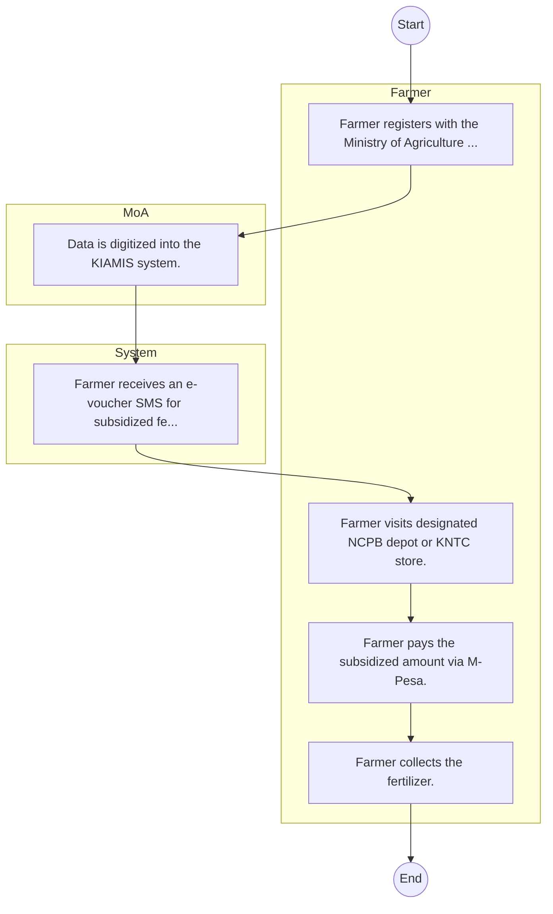

# National Cereals and Produce Board – Service Delivery

## Cover Page
- **Ministry/Department/Agency (MDA):** National Cereals and Produce Board
- **Process Name:** Service Delivery
- **Document Version:** 1.0
- **Date:** 2026-02-14
- **Classification:** Official

---

## Executive Summary
The National Cereals and Produce Board (NCPB) is a commercial State Corporation in Kenya operating under the Ministry of Agriculture, Livestock, Fisheries and Cooperatives. Its primary mandate is to provide logistics support services to the government on food security matters and to carry out market intervention for grains and farm inputs on behalf of the government. Additionally, NCPB engages in commercial trading of agricultural commodities, especially cereals, and is responsible for managing the National Food Reserves (NFR), playing a critical role in stabilizing food supply and prices across the nation.

---

## Process Flowchart (BPMN 2.0 - Mermaid)
*Guidance: This diagram visualizes the AS-IS process flow across different actors.*

---

## Process Overview
### Process Name
Service Delivery

### Service Category
- G2B (Government to Business)

### Scope
- **In Scope:** End-to-end processing within National Cereals and Produce Board.

### Triggers
- Submission of application/request by Farmer.

### End States
- **Successful:** License / Permit / Certificate, Compliance Inspection Report, Official Receipt, Gazette Notice

### Policy Context
- The National Cereals and Produce Board Act; The Constitution of Kenya 2010; Data Protection Act 2019.

---

## Stakeholders
| Stakeholder | Role | Responsibilities |
|---|---|---|
| Farmer | Process Actor | Performs actions as defined in steps. |
| System | Process Actor | Performs actions as defined in steps. |
| MoA | Process Actor | Performs actions as defined in steps. |

---

## Inputs & Outputs
- **Inputs:** Application Form (License/Permit), Compliance Documents (Tax Compliance, CR12), Technical Reports / Site Plans, Proof of Payment
- **Outputs:** License / Permit / Certificate, Compliance Inspection Report, Official Receipt, Gazette Notice

---

## Detailed Process (AS-IS)
| Step | Role | Action | Tool | Notes |
|---|---|---|---|---|
| 1 | Farmer | Farmer registers with the Ministry of Agriculture (Chief/Assistant Chief). | Manual | |
| 2 | MoA | Data is digitized into the KIAMIS system. | Manual | |
| 3 | System | Farmer receives an e-voucher SMS for subsidized fertilizer. | Manual | |
| 4 | Farmer | Farmer visits designated NCPB depot or KNTC store. | Manual | |
| 5 | Farmer | Farmer pays the subsidized amount via M-Pesa. | Manual | |
| 6 | Farmer | Farmer collects the fertilizer. | Manual | |

---

## Pain Points & Opportunities
### Pain Points
- Manual document verification takes time.
- High cost and time for physical inspections.
- Risk of counterfeit licenses/certificates.
- Lack of real-time monitoring of licensees.

### Opportunities
- Integration with IPRS/BRS via Service Bus.
- Adoption of Government Payment Gateway.
- Implementation of Automated Rules Engine.
- Issuance of Digital Verifiable Credentials.

---

## Future State Process (TO-BE)
### Narrative
The To-Be process leverages the Government Service Bus to integrate with BRS (Business Registry) and the Payment Gateway. Manual data entry and document uploads are replaced by real-time API validations, enabling a paperless, cashless, and presence-less service experience.

### Optimized Steps (Digital)
| Step | Actor | Action | System |
|---|---|---|---|
| 1 | Applicant | Applicant logs in via Single Sign-On (SSO) and selects the service. | Citizen Portal / SSO |
| 2 | System | Applicant enters Business Registration Number; System auto-populates details from BRS (Business Registry) via the Service Bus. | Service Bus / Registry API |
| 3 | System | System performs auto-validation of compliance (e.g., KRA Tax Status) via Inter-Agency APIs. | Service Bus / Compliance Engine |
| 4 | Applicant | Applicant pays fees via the Government Payment Gateway; System auto-receipts. | Payment Gateway |
| 5 | System | Application is processed by the Rules Engine. (Low-risk cases are Auto-Approved). | Workflow Engine |
| 6 | Officer | Complex cases are routed to the Officer Workbench for digital review and approval. | Officer Workbench |
| 7 | System | System generates a Verifiable Digital Certificate (QR Code) and notifies the applicant. | Output Generator |

---

## References & Evidence
The information in this document was derived from the following official sources:

- [https://www.ncpb.co.ke/](https://www.ncpb.co.ke/)
- [https://ecitizen.go.ke/](https://ecitizen.go.ke/)
- [https://gauthmath.com/](https://gauthmath.com/)
- [https://saraka.info/](https://saraka.info/)
- [https://devex.com/](https://devex.com/)

---

## Appendices
See attached ERD and System Design.
