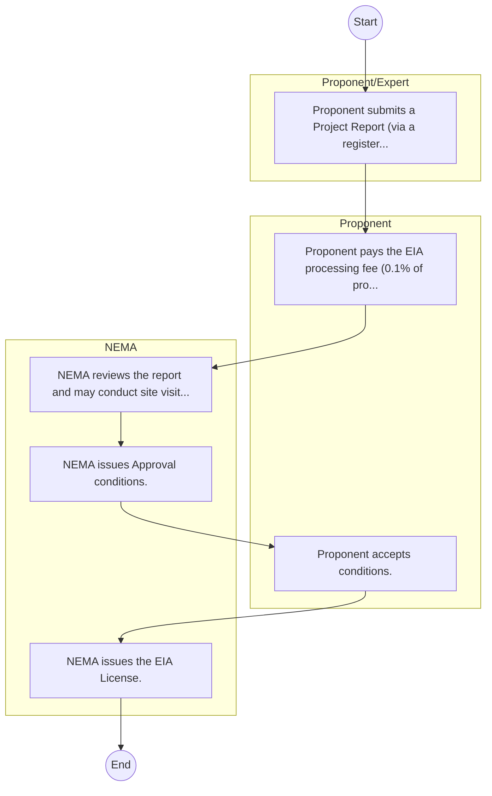
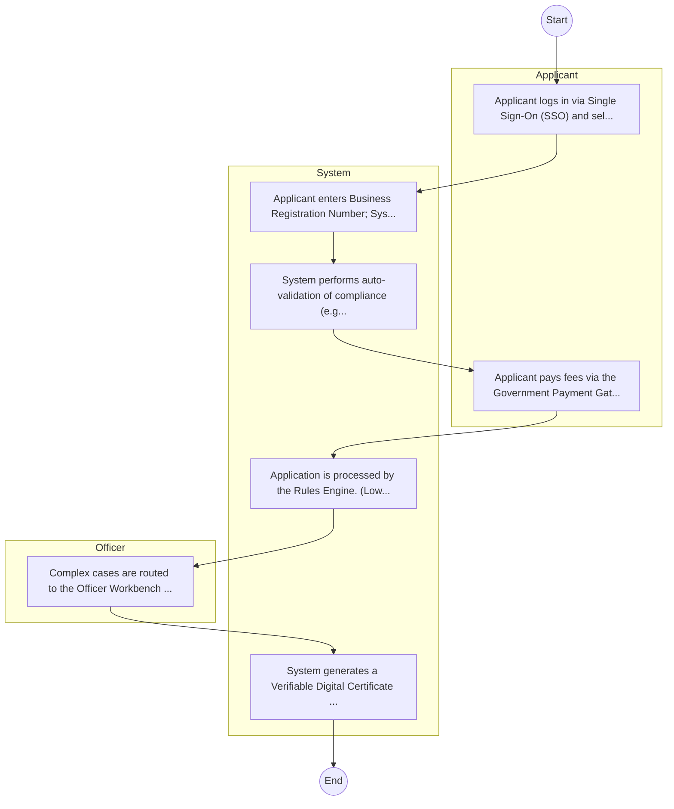

# National Environment Management Authority – Service Delivery

## Cover Page
- **Ministry/Department/Agency (MDA):** National Environment Management Authority
- **Process Name:** Service Delivery
- **Document Version:** 1.0
- **Date:** 2026-02-14
- **Classification:** Official

---

## Executive Summary
The National Environment Management Authority (NEMA) is the principal agency in Kenya responsible for coordinating, monitoring, regulating, and supervising all environmental management activities. Established under specific environmental legislation, NEMA aims to ensure a clean, healthy, productive, and sustainable environment for all Kenyans by promoting sound environmental practices, integrating environmental considerations into national development policies, plans, programs, and projects, and enforcing compliance with environmental laws and regulations.

---

## 1. AS-IS Process Flowchart (BPMN 2.0)
*Current State visualization.*

---

## Process Overview
### Process Name
Service Delivery

### Service Category
- G2B (Government to Business)

### Scope
- **In Scope:** End-to-end processing within National Environment Management Authority.

### Triggers
- Submission of application/request by Proponent/Expert.

### End States
- **Successful:** License / Permit / Certificate, Compliance Inspection Report, Official Receipt, Gazette Notice

### Policy Context
- The National Environment Management Authority Act; The Constitution of Kenya 2010; Data Protection Act 2019.

---

## Stakeholders
| Stakeholder | Role | Responsibilities |
|---|---|---|
| Proponent | Process Actor | Performs actions as defined in steps. |
| NEMA | Process Actor | Performs actions as defined in steps. |
| Proponent/Expert | Process Actor | Performs actions as defined in steps. |

---

## Detailed Process (AS-IS)
| Step | Role | Action | Tool | Notes |
|---|---|---|---|---|
| 1 | Proponent/Expert | Proponent submits a Project Report (via a registered expert) to NEMA. | Manual | |
| 2 | Proponent | Proponent pays the EIA processing fee (0.1% of project cost). | Manual | |
| 3 | NEMA | NEMA reviews the report and may conduct site visits or public participation. | Manual | |
| 4 | NEMA | NEMA issues Approval conditions. | Manual | |
| 5 | Proponent | Proponent accepts conditions. | Manual | |
| 6 | NEMA | NEMA issues the EIA License. | Manual | |

---

## Pain Points & Opportunities
### Pain Points
- Manual document verification takes time.
- High cost and time for physical inspections.
- Risk of counterfeit licenses/certificates.
- Lack of real-time monitoring of licensees.

### Opportunities
- Integration with IPRS/BRS via Service Bus.
- Adoption of Government Payment Gateway.
- Implementation of Automated Rules Engine.
- Issuance of Digital Verifiable Credentials.

---

## 2. TO-BE Process Flowchart (BPMN 2.0)
*Future State visualization (Optimized).*

## Future State Process (TO-BE)
### Narrative
The To-Be process leverages the Government Service Bus to integrate with BRS (Business Registry) and the Payment Gateway. Manual data entry and document uploads are replaced by real-time API validations, enabling a paperless, cashless, and presence-less service experience.

### Optimized Steps (Digital)
| Step | Actor | Action | System |
|---|---|---|---|
| 1 | Applicant | Applicant logs in via Single Sign-On (SSO) and selects the service. | Citizen Portal / SSO |
| 2 | System | Applicant enters Business Registration Number; System auto-populates details from BRS (Business Registry) via the Service Bus. | Service Bus / Registry API |
| 3 | System | System performs auto-validation of compliance (e.g., KRA Tax Status) via Inter-Agency APIs. | Service Bus / Compliance Engine |
| 4 | Applicant | Applicant pays fees via the Government Payment Gateway; System auto-receipts. | Payment Gateway |
| 5 | System | Application is processed by the Rules Engine. (Low-risk cases are Auto-Approved). | Workflow Engine |
| 6 | Officer | Complex cases are routed to the Officer Workbench for digital review and approval. | Officer Workbench |
| 7 | System | System generates a Verifiable Digital Certificate (QR Code) and notifies the applicant. | Output Generator |

---

## References
Derived from official mandates.
