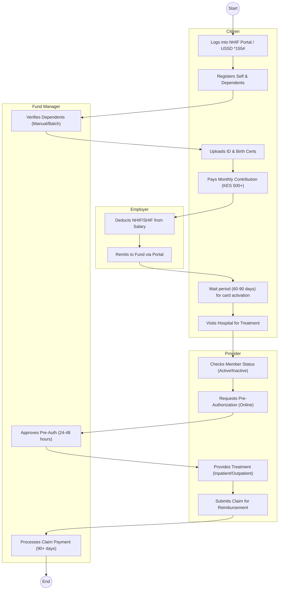
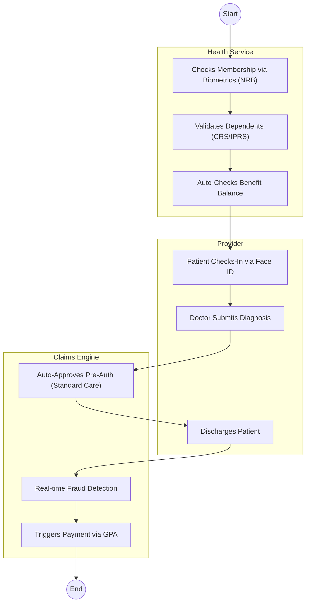

# NATIONAL HEALTH INSURANCE FUND (NHIF/SHA) – Service Delivery

## Cover Page
- **Ministry/Department/Agency (MDA):** NATIONAL HEALTH INSURANCE FUND (NHIF) / SOCIAL HEALTH AUTHORITY (SHA)
- **Process Name:** Member Registration & Claims (Health Insurance)
- **Document Version:** 1.3
- **Date:** 2026-02-19
- **Classification:** Official

---

## Executive Summary
The National Health Insurance Fund (transitioning to the Social Health Authority - SHA) is mandated to provide health insurance to all Kenyans. Registration is mandatory for all adults. The process involves member registration, monthly contributions, and pre-authorization of medical claims.

---

## 1. AS-IS Process Flowchart (BPMN 2.0)
*Current State visualization (Manual Forms / Delayed Pre-Auth).*

---

## Process Overview
### Process Name
Member Registration & Benefit Access (UHC)

### Service Category
- G2C (Government to Citizen)

### Scope
- **In Scope:** Registration of Principal Member + Spouse/Children; Collection of Premiums; Pre-Authorization of specialized care (Surgery, MRI, Dialysis); Claims processing.
- **Out of Scope:** Private insurance top-ups.

### Triggers
- Employment (Statutory Deduction).
- Need for medical cover (Voluntary Contributor).

### End States
- **Successful:** Medical bill settled by Fund.

### Policy Context
- Social Health Insurance Act, 2023; NHIF Act (Repealed/Transitional).

---

## Stakeholders
| Stakeholder | Role | Responsibilities |
|---|---|---|
| Principal Member | Beneficiary | Registers family, pays premiums, seeks treatment. |
| Employer | Remitter | Deducts and remits contributions by 9th of month. |
| Healthcare Provider | Service | Treats patient, seeks pre-auth, files claims. |
| SHA/NHIF Officer | Adjudicator | Reviews pre-auth requests and audits claims. |

---

## Detailed Process (AS-IS)
| Step | Role | Action | Tool | Notes |
|---|---|---|---|---|
| 1 | Member | **Registration:** Individual visits Huduma Centre or uses USSD/App. Fills bio-data. Uploads spouse ID and children's Birth Certs. | Mobile App / Portal | Dependent verification often fails or takes weeks. |
| 2 | Member | **Payment:** Pays via M-Pesa Paybill 200222 or Salary Check-off. | Payment Gateway | Reconciliation delays lead to "Card Inactive" status at hospital reception. |
| 3 | Member | **Access:** Visits hospital. Receptionist checks status on system. If inactive (due to delayed remittance), patient is turned away. | Provider Portal | Frequent downtime of the biometric/card system. |
| 4 | Hospital | **Pre-Auth:** For surgeries/CT scans, hospital requests "Pre-Authorization" online. Must attach clinical notes. | E-Claim Portal | Approval takes 24-48 hours. Patients wait in wards for "Pre-Auth Code". |
| 5 | SHA/NHIF | **Adjudication:** Medical team reviews request. Often rejects or queries ("Add X-ray report"). | Back Office | |
| 6 | Hospital | **Treatment:** Upon approval, treatment is given. Patient discharged. | Hospital HIS | |
| 7 | Hospital | **Claim:** Hospital compiles invoice and submits to Fund for payment. | Bulk Upload | Payment delays >6 months cripple hospital cash flow. |

---

## Pain Points & Opportunities
### Pain Points
- **Card Activation:** 60-day waiting period for voluntary contributors discourages enrollment.
- **Biometric Failure:** Fingerprint scanners at hospitals often fail, forcing manual forms.
- **Pre-Auth Delays:** Critical surgeries delayed waiting for an email/system approval from HQ.
- **Dependent Verification:** Adding a spouse/child is a manual nightmare of uploading documents.
- **Fraud:** "Ghost Procedures" billed by rogue hospitals leading to fund loss.

### Opportunities
- **Instant Activation:** Link with Mobile Money history to score creditworthiness and activate immediately.
- **AI Adjudication:** Use AI to auto-approve standard pre-auth requests (e.g., Malaria, Normal Delivery) instantly.
- **IPRS Link:** Auto-populate dependents from Birth/Marriage records (CRS/AG) to remove document upload burden.
- **Real-Time Settlement:** Pay hospitals within 7 days using automated claim vetting.

---

## 2. TO-BE Process Flowchart (BPMN 2.0)
*Future State visualization (Repeatable WoG Platform).*

## Future State Process (TO-BE)
### Narrative
The process is **Seamless** and **Intelligent**.
1.  **Biometric ID:** No physical card. The patient's face (matched against **NRB/Maisha Namba**) is their insurance credential.
2.  **Dependent Sync:** Family members are auto-linked from **CRS (Births)** and **AG (Marriage)** registries via **X-Road**. No document uploads.
3.  **AI Authorization:** Routine procedures (Malaria, Normal Delivery) are approved instantly by the **WoG AI Engine** based on clinical rules. No human delay.
4.  **Smart Settlement:** Claims are vetted in real-time for fraud. Valid claims are paid weekly via **GPA**, ensuring provider liquidity.

### Optimized Steps (Digital)
| Step | Actor | Action | System |
|---|---|---|---|
| 1 | Patient | Checks in at hospital using facial recognition. | Biometric Scanner |
| 2 | WoG Platform | Validates identity and active status. | IPRS / SHA |
| 3 | Doctor | Enters diagnosis. AI approves treatment plan instantly. | SHA AI Engine |
| 4 | Hospital | Submits e-Claim upon discharge. | Hospital HIS |
| 5 | GPA | Settles payment to hospital account. | Payment Gateway |

---

## 3. Standard Data Inputs
*Required fields for the WoG Digital Service.*

### A. Patient Check-In
| Field Name | Type | Source | Validation |
|---|---|---|---|
| Biometric Token | Binary (Face) | Biometric Scanner | Match vs IPRS |
| Patient UPI | String | System Fetch (NRB) | Must be Active |
| Benefit Package | Enum | System Fetch (SHA) | UHC / Enhanced |

### B. e-Claim Submission (Provider)
| Field Name | Type | Source | Validation |
|---|---|---|---|
| Patient UPI | String | System Fetch (Check-in) | Verified Session |
| Diagnosis Code | String | User Input (Dr.) | ICD-11 Standard |
| Procedure Code | String | User Input (Dr.) | SHA Tariff Code |
| Bill Amount | Currency | System Calculated | Tariff Rate (Fixed) |
| Discharge Summary | Text | User Input | Required |

---

## References
- Social Health Insurance Act.
