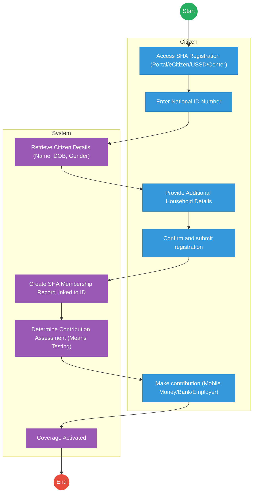
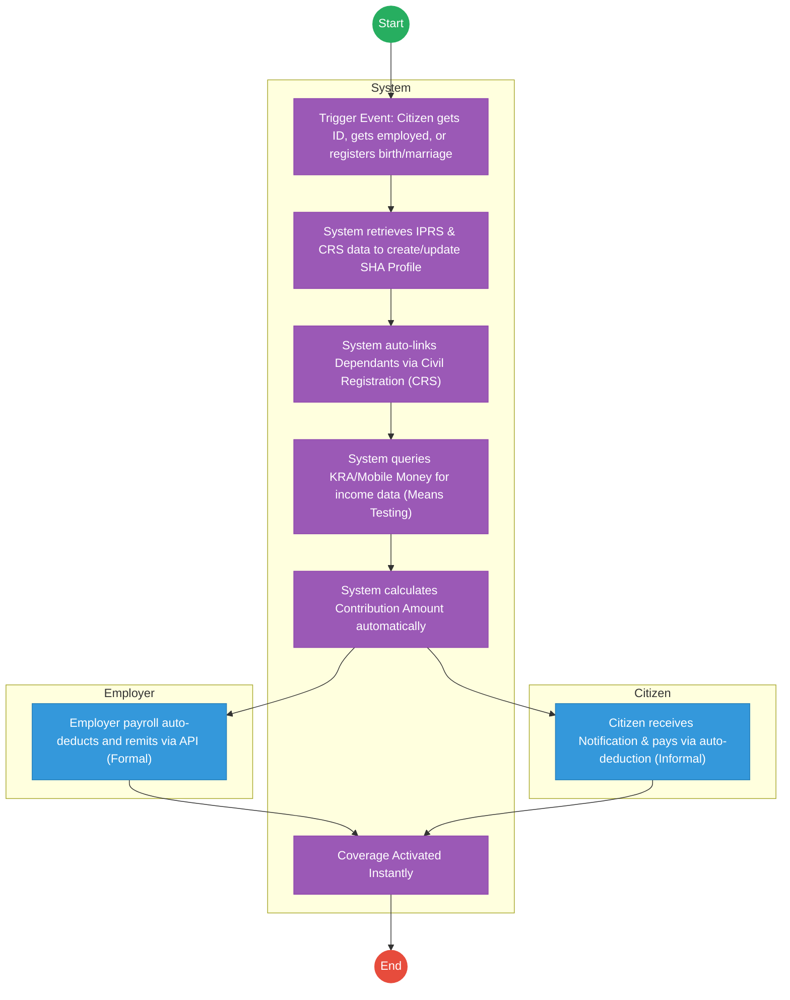

# NATIONAL HEALTH INSURANCE FUND (NHIF/SHA) – Service Delivery

## Cover Page
- **Ministry/Department/Agency (MDA):** NATIONAL HEALTH INSURANCE FUND (NHIF) / SOCIAL HEALTH AUTHORITY (SHA)
- **Process Name:** Member Registration & Claims (Health Insurance)
- **Document Version:** 1.3
- **Date:** 2026-02-19
- **Classification:** Official

---

## Executive Summary
The National Health Insurance Fund (transitioning to the Social Health Authority - SHA) is mandated to provide health insurance to all Kenyans. Registration is mandatory for all adults. The process involves member registration, monthly contributions, and pre-authorization of medical claims.

---

## 1. AS-IS Process Flowchart (BPMN 2.0)
*Current State visualization (SHA Registration).*

---

## Process Overview
### Process Name
Member Registration & Benefit Access (UHC)

### Service Category
- G2C (Government to Citizen)

### Scope
- **In Scope:** Registration of Principal Member + Spouse/Children; Collection of Premiums; Pre-Authorization of specialized care (Surgery, MRI, Dialysis); Claims processing.
- **Out of Scope:** Private insurance top-ups.

### Triggers
- Employment (Statutory Deduction).
- Need for medical cover (Voluntary Contributor).

### End States
- **Successful:** Medical bill settled by Fund.

### Policy Context
- Social Health Insurance Act, 2023; NHIF Act (Repealed/Transitional).

---

## Stakeholders
| Stakeholder | Role | Responsibilities |
|---|---|---|
| Principal Member | Beneficiary | Registers family, pays premiums, seeks treatment. |
| Employer | Remitter | Deducts and remits contributions by 9th of month. |
| Healthcare Provider | Service | Treats patient, seeks pre-auth, files claims. |
| SHA/NHIF Officer | Adjudicator | Reviews pre-auth requests and audits claims. |

---

## Detailed Process (AS-IS)
**AS-IS Steps: SHA Registration (Current Process)**
*Agency: Social Health Authority*
*System: SHA Portal / USSD / eCitizen / Physical Registration*
*(SHA replaced NHIF under Universal Health Coverage reforms)*

| Step | Role | Action | Tool/System | Notes |
|---|---|---|---|---|
| 1 | Citizen | **Access:** Citizen accesses SHA Registration via Online Portal, eCitizen, USSD, or Registration Center. | SHA Portal/USSD | |
| 2 | Citizen | **Enter ID:** Citizen enters National ID Number. | Digital/Manual | |
| 3 | System | **Retrieve Details:** System automatically fetches Name, Date of Birth, and Gender. | IPRS/System | |
| 4 | Citizen | **Provide Details:** Citizen enters Phone Number, Email, Residence, and Household/Dependants. | Digital/Manual | |
| 5 | Citizen | **Submit:** Citizen confirms and submits registration. | Digital/Manual | |
| 6 | System | **Generate SHA Number:** System creates SHA Membership Record linked to National ID. | SHA System | |
| 7 | System | **Assessment:** System determines contribution amount based on income level / means testing. | SHA System | |
| 8 | Citizen | **Contribution:** Citizen pays via Mobile Money, Bank, or Employer deduction. | Payment Gateway | |
| 9 | System | **Activation:** Coverage Activated. Citizen becomes eligible for healthcare services. | SHA System |

---|---|---|---|---|
| 1 | Member | **Registration:** Individual visits Huduma Centre or uses USSD/App. Fills bio-data. Uploads spouse ID and children's Birth Certs. | Mobile App / Portal | Dependent verification often fails or takes weeks. |
| 2 | Member | **Payment:** Pays via M-Pesa Paybill 200222 or Salary Check-off. | Payment Gateway | Reconciliation delays lead to "Card Inactive" status at hospital reception. |
| 3 | Member | **Access:** Visits hospital. Receptionist checks status on system. If inactive (due to delayed remittance), patient is turned away. | Provider Portal | Frequent downtime of the biometric/card system. |
| 4 | Hospital | **Pre-Auth:** For surgeries/CT scans, hospital requests "Pre-Authorization" online. Must attach clinical notes. | E-Claim Portal | Approval takes 24-48 hours. Patients wait in wards for "Pre-Auth Code". |
| 5 | SHA/NHIF | **Adjudication:** Medical team reviews request. Often rejects or queries ("Add X-ray report"). | Back Office | |
| 6 | Hospital | **Treatment:** Upon approval, treatment is given. Patient discharged. | Hospital HIS | |
| 7 | Hospital | **Claim:** Hospital compiles invoice and submits to Fund for payment. | Bulk Upload | Payment delays >6 months cripple hospital cash flow. |

---

## Pain Points & Opportunities
### Pain Points
- **Card Activation:** 60-day waiting period for voluntary contributors discourages enrollment.
- **Biometric Failure:** Fingerprint scanners at hospitals often fail, forcing manual forms.
- **Pre-Auth Delays:** Critical surgeries delayed waiting for an email/system approval from HQ.
- **Dependent Verification:** Adding a spouse/child is a manual nightmare of uploading documents.
- **Fraud:** "Ghost Procedures" billed by rogue hospitals leading to fund loss.

### Opportunities
- **Instant Activation:** Link with Mobile Money history to score creditworthiness and activate immediately.
- **AI Adjudication:** Use AI to auto-approve standard pre-auth requests (e.g., Malaria, Normal Delivery) instantly.
- **IPRS Link:** Auto-populate dependents from Birth/Marriage records (CRS/AG) to remove document upload burden.
- **Real-Time Settlement:** Pay hospitals within 7 days using automated claim vetting.

---

## 2. TO-BE Process Flowchart (BPMN 2.0)
*Future State visualization (Automated SHA Registration & Assessment).*

## Future State Process (TO-BE)
### Narrative
**TO-BE Process: Automated SHA Registration and Means Testing**

**Design Principles:**
- Proactive & Event-Driven Enrollment
- Zero Duplicate Data Entry
- Automated Dependent Verification
- Intelligent Means Testing via Inter-Agency APIs

### Optimized Steps (Digital)
| Step | Actor | Action | System |
|---|---|---|---|
| 1 | System | **Trigger Event:** Citizen receives National ID (turns 18), gets first employment (KRA PAYE), or registers a birth/marriage. | NRB / KRA / CRS |
| 2 | System | **Profile Creation:** System automatically fetches bio-data from National Population Registry to create/update SHA profile. | SHA System / IPRS |
| 3 | System | **Dependent Linking:** System automatically links spouse and children using data from Civil Registration Services. No manual uploads. | SHA System / CRS |
| 4 | System | **Assessment:** System determines contribution amount by querying KRA for formal income or alternative data (Mobile Money) for informal sector. | SHA System / KRA API |
| 5 | Citizen/Employer | **Contribution:** Employer payroll automatically deducts and remits via API. Informal citizens receive a prompt to authorize recurring Mobile Money payments. | Payroll / Payment Gateway |
| 6 | System | **Activation:** Coverage is activated instantly upon system processing. Citizen is notified via SMS/Email. | SHA System |

---

## 3. Standard Data Inputs
*Required fields for the WoG Digital Service.*

### A. SHA Registration & Assessment
| Field Name | Type | Source | Validation |
|---|---|---|---|
| National ID Number | String | System Fetch (NRB/IPRS) | Match vs IPRS |
| Dependants (Birth/Marriage Certs) | String | System Fetch (CRS) | Verified by CRS |
| Income / Tax Band | Currency | System Fetch (KRA) | API Token |

## References
- Social Health Insurance Act.
