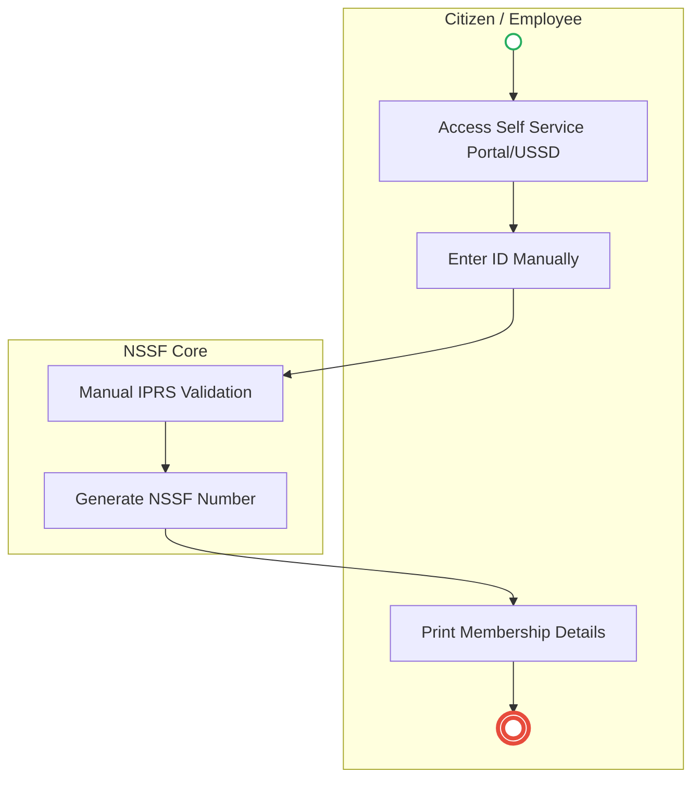
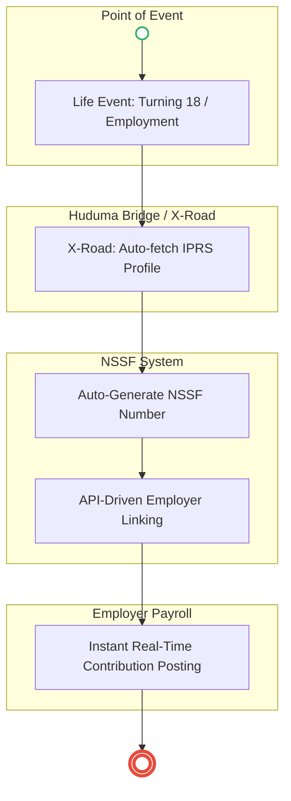

# National Social Security Fund – Service Delivery

## Cover Page
- **Ministry/Department/Agency (MDA):** National Social Security Fund
- **Process Name:** Service Delivery
- **Document Version:** 1.0
- **Date:** 2026-02-14
- **Classification:** Official

---

## Executive Summary
The National Social Security Fund (NSSF) is a statutory public institution in Kenya mandated to provide social security protection to all workers, encompassing both the formal and informal sectors. Established initially as a Provident Fund in 1965, NSSF transitioned into a Pension Scheme in 2014 following the enactment of the NSSF Act, No. 45 of 2013. Its core purpose is to guarantee basic compensation in cases of permanent disability, provide assistance to needy dependents in the event of death, and offer a monthly life pension upon retirement. Beyond these direct benefits, NSSF also mobilizes domestic savings, aids in poverty reduction, fosters financial inclusion, and helps decrease the national dependency ratio.

---

### 1.1 AS-IS Process Flow (BPMN 2.0)

---

## Process Overview
### Process Name
Service Delivery

### Service Category
- G2C/G2B

### Scope
- **In Scope:** End-to-end processing within National Social Security Fund.

### Triggers
- Submission of application/request by Applicant.

### End States
- **Successful:** Loan Disbursement / Service Delivery, Statement of Account, Contract / Agreement, Receipt / Invoice

### Policy Context
- The National Social Security Fund Act; The Constitution of Kenya 2010; Data Protection Act 2019.

---

## Stakeholders
| Stakeholder | Role | Responsibilities |
|---|---|---|
| System | Process Actor | Performs actions as defined in steps. |
| Applicant | Process Actor | Performs actions as defined in steps. |

---

## Detailed Process (AS-IS)
| Step | Role | Action | Tool | Notes |
|---|---|---|---|---|
| 1 | Applicant | Applicant accesses NSSF Self Service Portal or USSD. | Digital | |
| 2 | Applicant | Applicant enters National ID/Alien ID number and details. | Manual | |
| 3 | System | System validates details from IPRS. | Manual | |
| 4 | System | System generates NSSF Number immediately. | Manual | |
| 5 | Applicant | Applicant prints the NSSF card/membership details. | Manual | |

---

## Pain Points & Opportunities
### Pain Points
- Lengthy credit appraisal processes.
- Manual debt collection and reconciliation.
- High paperwork for loan processing.
- Lack of 360-degree customer view.

### Opportunities
- Integration with IPRS/BRS via Service Bus.
- Adoption of Government Payment Gateway.
- Implementation of Automated Rules Engine.
- Issuance of Digital Verifiable Credentials.

---

### 2.1 TO-BE Process (BPMN 2.0 - POC v2 Aligned)

## Future State Process (TO-BE)
### Narrative
**TO-BE Process: Automated NSSF Registration and Contribution**

**Design Principles:**
- Zero duplicate data entry
- No physical forms
- Automatic identity verification
- Event-driven registration
- Integrated with National ID, KRA, and Employer systems

### Optimized Steps (Digital)
| Step | Actor | Action | System |
|---|---|---|---|
| 1 | System | **Trigger Event:** Citizen becomes eligible (first employment via KRA PAYE, turns 18, or registers on gov portal). | KRA / IPRS / Portal |
| 2 | System | **Profile Creation:** System retrieves citizen data (National ID, Name, DOB, Contact) from National Population Registry. | NSSF System / IPRS |
| 3 | System | **Number Generation:** System generates NSSF Number and notifies citizen via SMS, Email, or eCitizen. | NSSF System / Notification Gateway |
| 4 | Employer | **Employee Linking:** Employer submits National ID and KRA PIN during payroll registration. System links employee to NSSF automatically. | Employer Payroll / NSSF API |
| 5 | Employer | **Contribution Submission:** Employer payroll system calculates and submits contribution via API without manual forms. | Employer Payroll / NSSF API |
| 6 | System | **Real-Time Posting:** NSSF system updates citizen account instantly. Citizen can view via Portal or Mobile App. | NSSF System |
| 7 | Citizen | **Self-Service Access:** Citizen logs into unified government portal to view NSSF Number, contributions, employer history, and benefits. | Unified Government Portal |

---|---|---|---|
| 1 | Applicant | Applicant logs in via Single Sign-On (SSO) and selects the service. | Citizen Portal / SSO |
| 2 | System | Applicant enters Business Registration Number; System auto-populates details from BRS (Business Registry) via the Service Bus. | Service Bus / Registry API |
| 3 | System | System performs auto-validation of compliance (e.g., KRA Tax Status) via Inter-Agency APIs. | Service Bus / Compliance Engine |
| 4 | Applicant | Applicant pays fees via the Government Payment Gateway; System auto-receipts. | Payment Gateway |
| 5 | System | Application is processed by the Rules Engine. (Low-risk cases are Auto-Approved). | Workflow Engine |
| 6 | Officer | Complex cases are routed to the Officer Workbench for digital review and approval. | Officer Workbench |
| 7 | System | System generates a Verifiable Digital Certificate (QR Code) and notifies the applicant. | Output Generator |

---

## References
Derived from official mandates.
