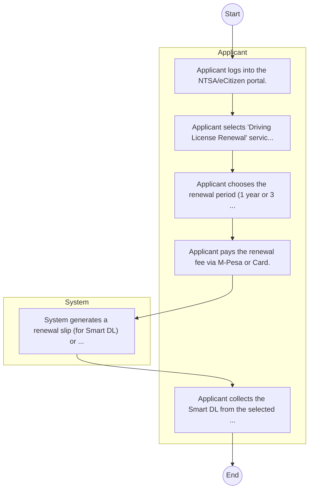

# National Transport and Safety Authority – Driving License Renewal

## Cover Page
- **Ministry/Department/Agency (MDA):** National Transport and Safety Authority
- **Process Name:** Driving License Renewal
- **Document Version:** 1.0
- **Date:** 2026-02-14
- **Classification:** Official

---

## Executive Summary
The National Transport and Safety Authority (NTSA) is a Kenyan government agency established to continually improve the accessibility, safety, and reliability of the country's road transport system. NTSA provides comprehensive online and physical services for individuals, vehicles, and transport service providers, and regulates various aspects of road transport. Its core mandate involves enhancing road safety for all users, reducing road accidents and fatalities, and fostering a disciplined and efficient transport sector in Kenya.

---

## Process Flowchart (BPMN 2.0 - Mermaid)
*Guidance: This diagram visualizes the AS-IS process flow across different actors.*

---

## Process Overview
### Process Name
Driving License Renewal

### Service Category
- G2B (Government to Business)

### Scope
- **In Scope:** End-to-end processing within National Transport and Safety Authority.

### Triggers
- Submission of application/request by Applicant.

### End States
- **Successful:** Smart DL, Number Plate, Inspection Cert

### Policy Context
- The National Transport and Safety Authority Act; The Constitution of Kenya 2010; Data Protection Act 2019.

---

## Stakeholders
| Stakeholder | Role | Responsibilities |
|---|---|---|
| Applicant | Process Actor | Performs actions as defined in steps. |
| System | Process Actor | Performs actions as defined in steps. |

---

## Inputs & Outputs
- **Inputs:** Old DL, Police Abstract, Vehicle Logbook
- **Outputs:** Smart DL, Number Plate, Inspection Cert

---

## Detailed Process (AS-IS)
| Step | Role | Action | Tool | Notes |
|---|---|---|---|---|
| 1 | Applicant | Applicant logs into the NTSA/eCitizen portal. | Digital | |
| 2 | Applicant | Applicant selects 'Driving License Renewal' service. | Manual | |
| 3 | Applicant | Applicant chooses the renewal period (1 year or 3 years). | Manual | |
| 4 | Applicant | Applicant pays the renewal fee via M-Pesa or Card. | Manual | |
| 5 | System | System generates a renewal slip (for Smart DL) or updates the record. | Manual | |
| 6 | Applicant | Applicant collects the Smart DL from the selected center (if applying for a card) or prints the renewal slip. | Manual | |

---

## Pain Points & Opportunities
### Pain Points
- Fake licenses
- Road safety data gaps
- Manual inspection

### Opportunities
- Integration with IPRS/BRS via Service Bus.
- Adoption of Government Payment Gateway.
- Implementation of Automated Rules Engine.
- Issuance of Digital Verifiable Credentials.

---

## Future State Process (TO-BE)
### Narrative
The To-Be process leverages the Government Service Bus to integrate with BRS (Business Registry) and the Payment Gateway. Manual data entry and document uploads are replaced by real-time API validations, enabling a paperless, cashless, and presence-less service experience.

### Optimized Steps (Digital)
| Step | Actor | Action | System |
|---|---|---|---|
| 1 | Applicant | Applicant logs in via Single Sign-On (SSO) and selects the service. | Citizen Portal / SSO |
| 2 | System | Applicant enters Business Registration Number; System auto-populates details from BRS (Business Registry) via the Service Bus. | Service Bus / Registry API |
| 3 | System | System performs auto-validation of compliance (e.g., KRA Tax Status) via Inter-Agency APIs. | Service Bus / Compliance Engine |
| 4 | Applicant | Applicant pays fees via the Government Payment Gateway; System auto-receipts. | Payment Gateway |
| 5 | System | Application is processed by the Rules Engine. (Low-risk cases are Auto-Approved). | Workflow Engine |
| 6 | Officer | Complex cases are routed to the Officer Workbench for digital review and approval. | Officer Workbench |
| 7 | System | System generates a Verifiable Digital Certificate (QR Code) and notifies the applicant. | Output Generator |

---

## References & Evidence
The information in this document was derived from the following official sources:

- [https://www.ntsa.go.ke/](https://www.ntsa.go.ke/)
- [https://ecitizen.go.ke/](https://ecitizen.go.ke/)

---

## Appendices
See attached ERD and System Design.
