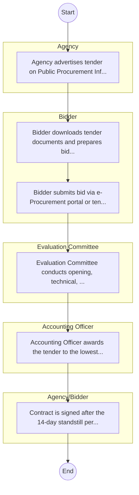

# North Rift Valley Water Works Development Agency – Procurement Process

## Cover Page
- **Ministry/Department/Agency (MDA):** North Rift Valley Water Works Development Agency
- **Process Name:** Procurement Process
- **Document Version:** 1.0
- **Date:** 2026-02-14
- **Classification:** Official

---

## Executive Summary
Represents 'Environment Protection Water and Natural Resources' cluster for balanced coverage; entity type: Agency. Included as Tier 3 for light‑touch desk review/survey.

---

## Process Flowchart (BPMN 2.0 - Mermaid)
*Guidance: This diagram visualizes the AS-IS process flow across different actors.*

---

## Process Overview
### Process Name
Procurement Process

### Service Category
- G2C/G2B

### Scope
- **In Scope:** End-to-end processing within North Rift Valley Water Works Development Agency.

### Triggers
- Submission of application/request by Agency.

### End States
- **Successful:** License / Permit / Certificate, Compliance Inspection Report, Official Receipt, Gazette Notice

### Policy Context
- The North Rift Valley Water Works Development Agency Act; The Constitution of Kenya 2010; Data Protection Act 2019.

---

## Stakeholders
| Stakeholder | Role | Responsibilities |
|---|---|---|
| Bidder | Process Actor | Performs actions as defined in steps. |
| Agency | Process Actor | Performs actions as defined in steps. |
| Agency/Bidder | Process Actor | Performs actions as defined in steps. |
| Accounting Officer | Process Actor | Performs actions as defined in steps. |
| Evaluation Committee | Process Actor | Performs actions as defined in steps. |

---

## Inputs & Outputs
- **Inputs:** Application Form (License/Permit), Compliance Documents (Tax Compliance, CR12), Technical Reports / Site Plans, Proof of Payment
- **Outputs:** License / Permit / Certificate, Compliance Inspection Report, Official Receipt, Gazette Notice

---

## Detailed Process (AS-IS)
| Step | Role | Action | Tool | Notes |
|---|---|---|---|---|
| 1 | Agency | Agency advertises tender on Public Procurement Information Portal (PPIP) and website. | Digital | |
| 2 | Bidder | Bidder downloads tender documents and prepares bid (Technical & Financial). | Manual | |
| 3 | Bidder | Bidder submits bid via e-Procurement portal or tender box. | Digital | |
| 4 | Evaluation Committee | Evaluation Committee conducts opening, technical, and financial evaluation. | Manual | |
| 5 | Accounting Officer | Accounting Officer awards the tender to the lowest responsive bidder. | Manual | |
| 6 | Agency/Bidder | Contract is signed after the 14-day standstill period. | Manual | |

---

## Pain Points & Opportunities
### Pain Points
- Manual document verification takes time.
- High cost and time for physical inspections.
- Risk of counterfeit licenses/certificates.
- Lack of real-time monitoring of licensees.

### Opportunities
- Integration with IPRS/BRS via Service Bus.
- Adoption of Government Payment Gateway.
- Implementation of Automated Rules Engine.
- Issuance of Digital Verifiable Credentials.

---

## Future State Process (TO-BE)
### Narrative
The To-Be process leverages the Government Service Bus to integrate with BRS (Business Registry) and the Payment Gateway. Manual data entry and document uploads are replaced by real-time API validations, enabling a paperless, cashless, and presence-less service experience.

### Optimized Steps (Digital)
| Step | Actor | Action | System |
|---|---|---|---|
| 1 | Applicant | Applicant logs in via Single Sign-On (SSO) and selects the service. | Citizen Portal / SSO |
| 2 | System | Applicant enters Business Registration Number; System auto-populates details from BRS (Business Registry) via the Service Bus. | Service Bus / Registry API |
| 3 | System | System performs auto-validation of compliance (e.g., KRA Tax Status) via Inter-Agency APIs. | Service Bus / Compliance Engine |
| 4 | Applicant | Applicant pays fees via the Government Payment Gateway; System auto-receipts. | Payment Gateway |
| 5 | System | Application is processed by the Rules Engine. (Low-risk cases are Auto-Approved). | Workflow Engine |
| 6 | Officer | Complex cases are routed to the Officer Workbench for digital review and approval. | Officer Workbench |
| 7 | System | System generates a Verifiable Digital Certificate (QR Code) and notifies the applicant. | Output Generator |

---

## References & Evidence
The information in this document was derived from the following official sources:

- Official Mandate and Service Charter (Inferred from Statutory Acts).

---

## Appendices
See attached ERD and System Design.
