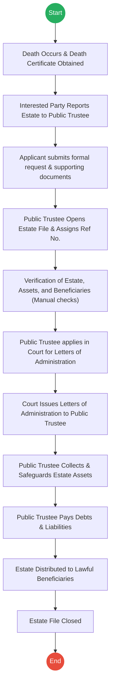
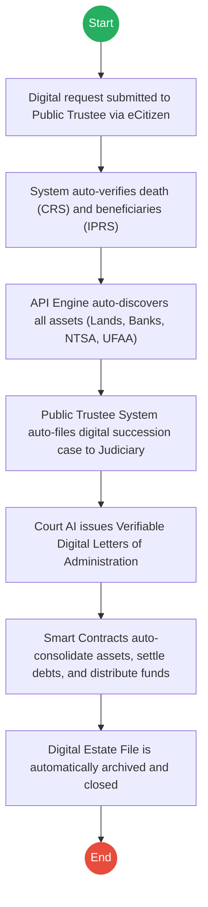

# OFFICE OF THE ATTORNEY GENERAL (AG) – Service Delivery

## Cover Page
- **Ministry/Department/Agency (MDA):** OFFICE OF THE ATTORNEY GENERAL (AG) - PUBLIC TRUSTEE
- **Process Name:** Public Trustee Estate Administration
- **Document Version:** 2.0
- **Date:** 2026-02-24
- **Classification:** Official

---

## Executive Summary
The Public Trustee, under the Office of the Attorney General, provides specialized services in the administration of estates of deceased persons, especially where there is no will (intestate), the executor is unwilling/unable to act, or the beneficiaries are minors. It acts as an impartial administrator to safeguard assets, settle debts, and distribute the estate to lawful beneficiaries.

---

## 1. AS-IS Process Flowchart (BPMN 2.0)
*Current State visualization (Manual Estate Administration).*

---

## Process Overview
### Process Name
Public Trustee Estate Administration

### Service Category
- G2C (Government to Citizen)

### Scope
- **In Scope:** Reporting the estate; Verification of assets/heirs; Securing Letters of Administration; Asset collection; Debt settlement; Final distribution.
- **Out of Scope:** Private executor administration.

### Triggers
- Death of a citizen without a will or capable administrator.
- Request from next of kin, beneficiaries, or government authority (e.g., area Chief).

### End States
- **Successful:** Estate legally administered, assets transferred to beneficiaries, and estate officially closed.

### Policy Context
- Public Trustee Act (Cap 168); Law of Succession Act.

---

## Detailed Process (AS-IS)
| Step | Role | Action | Tool/System | Notes |
|---|---|---|---|---|
| 1 | Family/Gov Auth | **Death Registration:** Obtains Death Certificate. | Physical | |
| 2 | Interested Party | **Reporting:** Reports estate to Public Trustee Office; provides Death Cert, known assets, and beneficiaries. | Manual | |
| 3 | Applicant | **Application:** Submits formal request for Public Trustee to administer estate. | Physical Form | |
| 4 | Applicant | **Documentation:** Provides Death Cert, Chief’s Letter, List of Beneficiaries, List of Assets, ID Copies. | Manual | |
| 5 | Public Trustee | **File Creation:** Creates Estate Administration File and assigns Reference Number. | Physical Ledger/System| |
| 6 | Public Trustee | **Verification:** Manually contacts Banks, Land Registry, etc., to verify death, beneficiaries, and asset ownership. | Letters/Physical Visits | Very time-consuming. |
| 7 | Public Trustee | **Court Application:** Files succession case in Court requesting Letters of Administration. | Court Registry | |
| 8 | Court | **Issuance:** Appoints Public Trustee as legal administrator and issues Letters of Administration. | Court Order | |
| 9 | Public Trustee | **Collection:** Recovers money from banks, land records, shares, and safeguards them. | Manual/Bank Transfers | |
| 10 | Public Trustee | **Management:** Pays off verified debts and liabilities of the estate. | Bank/Cheques | |
| 11 | Public Trustee | **Distribution:** Distributes remaining estate to lawful beneficiaries per succession law. | Manual Transfers | |
| 12 | Public Trustee | **Closure:** Closes the estate file formally. | Physical Archive | |

---

## Pain Points & Opportunities
### Pain Points
- **Manual Verification:** Writing letters to banks and land registries to verify assets takes months or years.
- **Court Delays:** Physical filing for Letters of Administration is subject to massive court backlogs.
- **Asset Tracing:** High risk of unknown or hidden assets going unclaimed because the Public Trustee relies on what the family reports.
- **Slow Distribution:** Manual cheque writing and physical meetings delay final disbursement to vulnerable beneficiaries.

### Opportunities
- **API Asset Discovery:** Instantly ping financial institutions, Ardhisasa, and NTSA to build a complete asset profile.
- **System-to-System Court Filing:** Direct API link from Public Trustee to Judiciary e-Justice for rapid grant issuance.
- **Smart Contracts:** Automated debt settlement and digital funds distribution to verified beneficiary wallets.

---

## 2. TO-BE Process Flowchart (BPMN 2.0)
*Future State visualization (Digital Public Trust Administration).*

## Future State Process (TO-BE)
### Narrative
**TO-BE Process: Digital Public Trust Administration**

**Design Principles:**
- Automated Asset & Heir Discovery
- Inter-Agency System Integration
- Smart Contract Estate Management

### Optimized Steps (Digital)
| Step | Actor | Action | System |
|---|---|---|---|
| 1 | Applicant | **Digital Request:** Submits request for Public Trustee administration via eCitizen. No physical documents needed. | eCitizen Portal |
| 2 | System | **Auto-Verification:** Instantly verifies the death via CRS and relationships/beneficiaries via IPRS and Civil Registration. | X-Road (CRS/IPRS) |
| 3 | System | **Asset Discovery:** Inter-agency APIs ping Ardhisasa, NTSA, Banks, and UFAA to automatically compile a comprehensive asset inventory. | Data Hub API |
| 4 | Public Trustee | **Automated Filing:** System securely transmits the verified digital file to the Judiciary to apply for Letters of Administration. | e-Justice Integration |
| 5 | Court | **Digital Issuance:** Court engine reviews and issues Verifiable Digital Letters of Administration directly to the Public Trustee system. | Judiciary e-Justice |
| 6 | System | **Smart Consolidation:** Digital Letters trigger automated transfer of funds and digital asset control to the Central Trust Account. | Smart Contracts |
| 7 | System | **Smart Distribution:** Verified debts are auto-paid; remaining funds/assets are distributed directly to beneficiaries' digital wallets or bank accounts. | Gov Payment Gateway |
| 8 | System | **Auto-Closure:** Upon zero-balance distribution, the system generates a final digital report and securely archives the closed estate. | Digital Archive |

---

## References
- Public Trustee Act.
- Law of Succession Act.