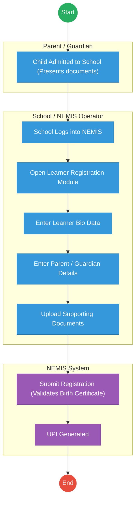
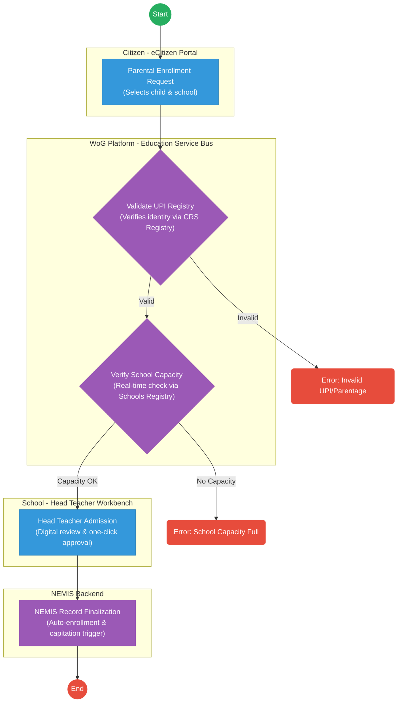

# STATE DEPARTMENT FOR BASIC EDUCATION – Student Registration & Transition (NEMIS)

## Cover Page
- **Ministry/Department/Agency (MDA):** STATE DEPARTMENT FOR BASIC EDUCATION
- **Process Name:** Student Registration & Transition (NEMIS)
- **Document Version:** 1.0
- **Date:** 2026-02-14
- **Classification:** Official

---

## Executive Summary
The National Education Management Information System (NEMIS) is a central registry for student data, assigning a Unique Personal Identifier (UPI) to learners across all education levels, from Early Years Education (EYE) to University. This document outlines the AS-IS process for student registration and UPI allocation within Nemis.

---

## 1. AS-IS PROCESS: Student Registration in NEMIS

**Registry:** National Education Management Information System
**Owner:** Ministry of Education Kenya
**Purpose:** Assign a Unique Personal Identifier (UPI) and track learner lifecycle

### AS-IS Process Flowchart (BPMN 2.0)
*Current State visualization (Manual Entry / System Glitches).*

### BUSINESS PROCESS OVERVIEW
**Process Name:** Learner Registration and UPI Allocation
**Trigger:** Child admitted to school (PP1, Grade 1, or transfer)

### ACTORS
| Actor             | Role                       |
|-------------------|----------------------------|
| Parent / Guardian | Provides student documents |
| School Headteacher | Approves registration      |
| School NEMIS Operator | Enters student data        |
| Ministry of Education | Maintains system           |

### AS-IS WORKFLOW STEPS
| Step | Actor                 | Action                                                                | Tool / System | Notes |
|------|-----------------------|-----------------------------------------------------------------------|---------------|-------|
| 1    | Parent / Guardian     | **Child Admitted to School:** Parent presents: Birth Certificate (Mandatory), Immunization Card (Optional), Transfer Letter (if applicable) | Physical Presence | Student accepted to school |
| 2    | School NEMIS Operator | **School Logs into NEMIS:** Operator logs into NEMIS Portal using school credentials. | NEMIS Portal  |       |
| 3    | School NEMIS Operator | **Open Learner Registration Module:** Navigates to Learner → Register Learner. | NEMIS Portal  |       |
| 4    | School NEMIS Operator | **Enter Learner Bio Data:** Inputs form fields from Birth Certificate (First Name, Middle Name, Last Name, Gender, Date of Birth, Birth Certificate Number, Nationality), Parent County, Parent Sub County, School Generated Admission Number, School Admission Date, School Class. | NEMIS Portal  |       |
| 5    | School NEMIS Operator | **Enter Parent / Guardian Details:** Inputs Father Name, Father ID Number, Mother Name, Mother ID Number, Guardian Name, Guardian ID Number, Parent Phone Number from Parent. | NEMIS Portal  |       |
| 6    | School NEMIS Operator | **Upload Supporting Documents:** Uploads Birth Certificate Copy (Mandatory), Optional: Passport Photo. | NEMIS Portal  |       |
| 7    | System Action         | **Submit Registration:** NEMIS validates Birth Certificate format.      | NEMIS System  |       |
| 8    | System Action         | **UPI Generated:** NEMIS generates Unique Personal Identifier (UPI).    | NEMIS System  | Example: UPI: 12345678901 |

### OUTPUT
**UPI Number Assigned**
Student now exists in: National Education Register

### REGISTRY DATA CREATED (AS-IS)
| Field                 |
|-----------------------|
| Learner Record        |
| UPI                   |
| Birth Certificate Number |
| Name                  |
| Gender                |
| Date of Birth         |
| Parent Details        |
| School                |
| Class                 |
| Admission Date        |

### REGISTRY DEPENDENCY (AS-IS)
**Input:** Birth Certificate Number
**Source:** Civil Registration Services

### REAL-WORLD VALIDATION (AS-IS)
Currently: Manual validation by school. No real-time CRS API integration in most cases.

### KEY OUTPUT USED BY OTHER SYSTEMS
**UPI used in:**
- Education tracking
- Capitation funding
- Exams registration (KCPE / KCSE)

### PROCESS FLOW SUMMARY (AS-IS)
Child admitted to School
↓
School logs into NEMIS
↓
Enter learner details
↓
Upload Birth Certificate
↓
Submit
↓
NEMIS generates UPI

### AS-IS PROCESS CHARACTERISTICS
| Attribute          | Status       |
|--------------------|--------------|
| Automation         | Semi-manual  |
| Initiated by       | School       |
| Identity verification | Manual       |
| Primary Key        | UPI          |
| Dependency         | Birth Certificate |

### FINAL OUTPUT OF NEMIS PROCESS
UPI Number

---

## Pain Points & Opportunities

### Pain Points
- **System Downtime:** NEMIS crashes frequently during Form 1 admission.
- **Data Mismatch:** Rigid validation against CRS (e.g., "Maina" vs "Maina J.") causes rejection.
- **Manual Transfers:** Moving a student requires the *previous* school to "release" them online. Head Teachers often refuse/delay this.
- **Capitation Loss:** Schools lose funds for students whose UPI generation is stuck.
- **Cyber Costs:** Head Teachers in rural areas travel long distances to access internet.

### Opportunities
- **Auto-Registration:** Link Birth Registration (CRS) to Education. A child turning 4 is *automatically* eligible for PP1.
- **Offline Mode:** Allow data capture on a mobile app without internet, syncing later.
- **Parent Self-Service:** Allow parents to register/transfer their own children via eCitizen, removing the Head Teacher bottleneck.
- **Biometrics:** Introduce simple biometrics to eliminate ghost students definitively.

---

## 2. TO-BE PROCESS: Student Registration in NEMIS (Optimized)

### TO-BE Process Flowchart (BPMN 2.0)
*Future State visualization (Repeatable WoG Platform / Automated).*

### Detailed Process (TO-BE) - Configurable & Automated
| Step | Actor / System        | Action                                                             | System Component      | Logic / Integration                                             |
|------|-----------------------|--------------------------------------------------------------------|-----------------------|-----------------------------------------------------------------|
| 1    | Parent / Guardian     | **Initiation:** Selects child (via Maisha Namba / UPI) and preferred school on eCitizen. | **eCitizen Portal**   | Uses `Maisha Namba (SSO)` for authentication.                 |
| 2    | WoG Platform (System) | **UPI Validation:** Verifies child existence and parentage records. | **CRS Registry API**  | Fetches birth details via the `Service Bus`.                    |
| 3    | WoG Platform (System) | **Capacity Check:** Validates school has space and child meets age requirements. | **National Schools Registry** | Calls `Verify School Capacity` endpoint dynamically.            |
| 4    | School Headteacher    | **Admission Review:** Approves the digital application on the workbench. | **Officer Workbench** | Validated data removes need for physical file review.             |
| 5    | NEMIS Backend (System)| **Enrollment Sync:** Finalizes record in NEMIS and triggers capitation. | **NEMIS Workflow Engine** | Auto-enrolls and calculates FDSE/FPE funds.                       |

---

## References
Derived from official mandates.

---

### Validation Survey
Please provide your feedback here: [https://ee.kobotoolbox.org/x/4Ls7SlCG](https://ee.kobotoolbox.org/x/4Ls7SlCG)
