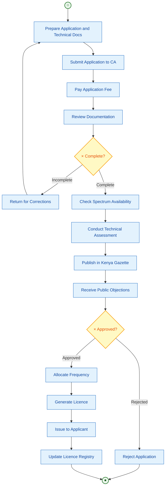
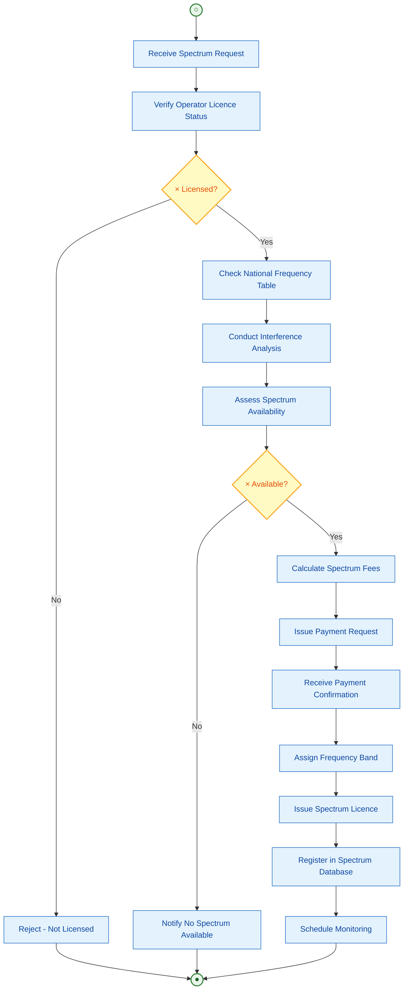
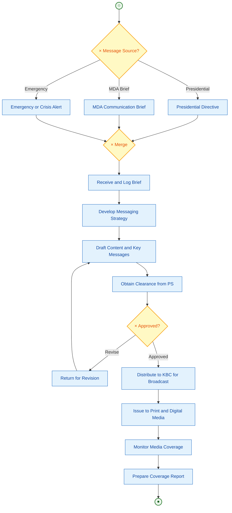
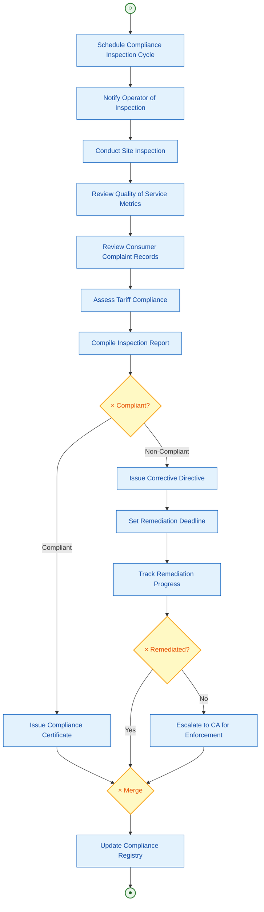
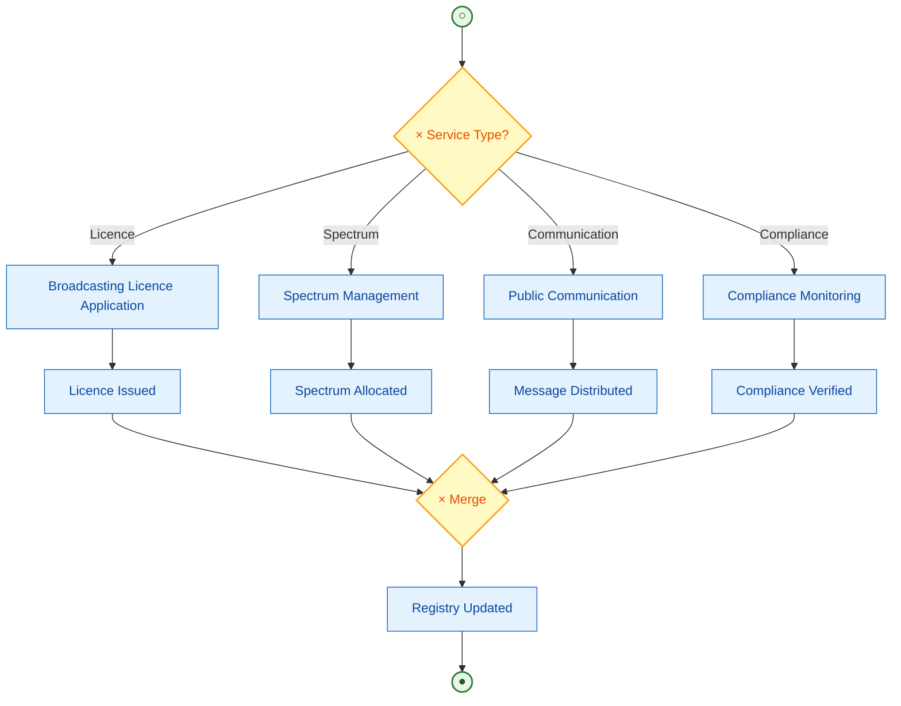

# State Department for Broadcasting and Telecommunications
## Business Process Mapping Report

### Ministry of Information, Communications and The Digital Economy
### State Department for Broadcasting and Telecommunications

## 1. Overview

The State Department for Broadcasting and Telecommunications was created through Executive Order No. 1 of 2023. It formulates policy, oversees regulation, and coordinates the broadcasting and telecommunications sectors in Kenya. The Department works with the Communications Authority of Kenya (CA), Kenya Broadcasting Corporation (KBC), Postal Corporation of Kenya (PCK), and the Media Council of Kenya (MCK).

| Attribute | Description |
|-----------|-------------|
| Key Actors | Broadcasters, Telecom Operators, Applicants, Licensing Officers, Spectrum Officers, Public Communication Officers |
| Key Systems | CA Licensing Portal, Spectrum Management System, KBC Content Management, Postal Tracking |
| Semi-Autonomous Agencies | Communications Authority of Kenya (CA), KBC, PCK, MCK |

## 2. Services

### Process 1: Broadcasting Licence Application
- Receive broadcasting licence applications from operators
- Verify documentation and technical specifications
- Conduct frequency spectrum availability check
- Assess compliance with broadcasting regulations
- Issue broadcasting licence and assign frequencies

### Process 2: Spectrum Management and Allocation
- Receive spectrum allocation requests
- Conduct interference analysis and availability check
- Allocate frequency bands per National Frequency Table
- Issue spectrum licence and monitor usage
- Enforce compliance and address interference complaints

### Process 3: Public Communication and Government Messaging
- Receive communication briefs from MDAs
- Develop messaging strategy and content
- Coordinate distribution via KBC and media channels
- Monitor media coverage and public sentiment
- Prepare communication reports

### Process 4: Telecom Operator Compliance Monitoring
- Schedule compliance inspections for licensed operators
- Conduct site inspections and quality of service audits
- Review tariff submissions and consumer complaints
- Issue compliance reports and corrective directives
- Escalate persistent non-compliance to CA

## 3. Diagrams

### 3.1 Broadcasting Licence Application

### 3.2 Spectrum Management and Allocation

### 3.3 Public Communication and Government Messaging

### 3.4 Telecom Operator Compliance Monitoring

### 3.5 End-to-End Broadcasting and Telecommunications

## 4. BPMN Legend

| Symbol | Meaning |
|--------|---------|
| ((○)) | Start Event |
| ((●)) | End Event |
| [Text] | Task/Activity |
| {×} | Exclusive Gateway - One path only |
| --> | Sequence Flow |
| -.-> | Loop Back / Return Flow |
