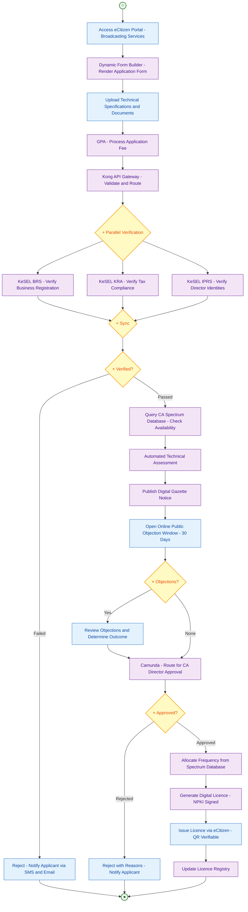
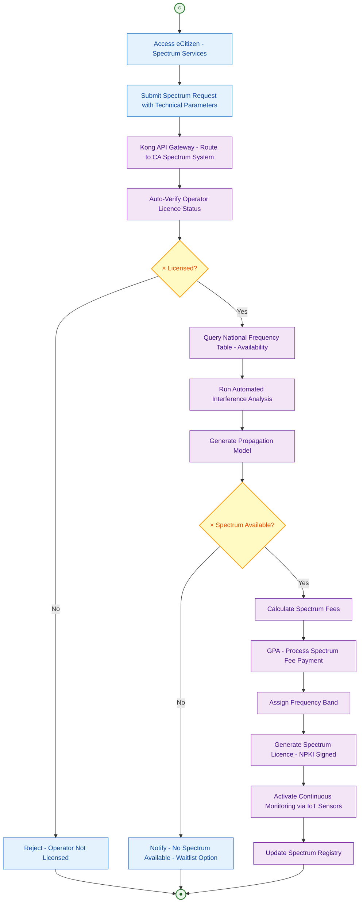
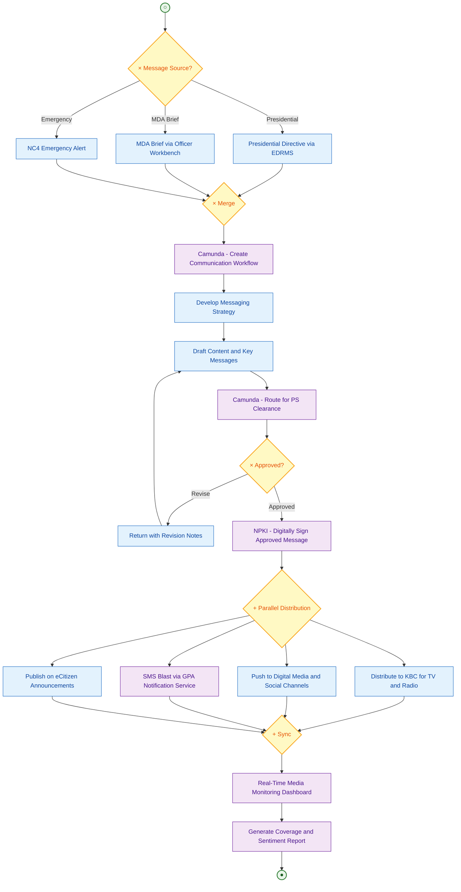
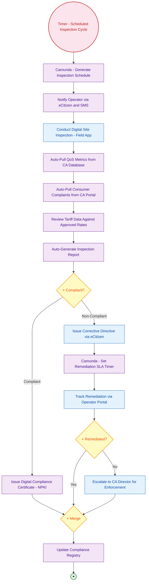

# State Department for Broadcasting and Telecommunications — TO-BE
## Business Process Mapping Report

### Ministry of Information, Communications and The Digital Economy
### State Department for Broadcasting and Telecommunications

## 1. Overview

| Attribute | Description |
|-----------|-------------|
| Process Scope | Digital transformation of broadcasting licensing, spectrum management, public communication, and compliance monitoring |
| Huduma Bridge Integration | eCitizen Portal, API Gateway (Kong), Camunda Workflow Engine, KeSEL (BRS, KRA, IPRS), GPA, NPKI, Consent Manager |
| GEA Principles | Citizen-Centricity, Standards-Driven, Interoperability by Design, Reuse and Modularity |

## 2. TO-BE Processes

### 2.1 TO-BE: Digital Broadcasting Licence Application

#### Key Transformation

| AS-IS | TO-BE |
|-------|-------|
| Paper application submitted to CA offices | Online application via eCitizen Portal |
| Manual document verification | Automated BRS and KRA compliance checks via KeSEL |
| Manual spectrum check | Automated spectrum availability query to CA database |
| Paper-based Kenya Gazette publication | Digital gazette with online objection portal |
| Manual licence generation | NPKI-signed digital licence with QR verification |
| Manual fee collection | GPA-integrated payment (M-Pesa, bank, card) |

#### Process Diagram

### 2.2 TO-BE: Digital Spectrum Management

### 2.3 TO-BE: Digital Public Communication

### 2.4 TO-BE: Digital Compliance Monitoring

## 3. Integration Points

| System | Integration Method | Data Exchanged |
|--------|--------------------|----------------|
| eCitizen Portal | REST API via Kong | Applications, status, licence delivery |
| BRS | KeSEL X-Road (NPKI signed) | Business registration verification |
| KRA | KeSEL X-Road (NPKI signed) | Tax compliance verification |
| IPRS / Maisha Namba | KeSEL X-Road (NPKI signed) | Director identity verification |
| CA Spectrum Database | Internal API | Frequency availability, interference analysis |
| GPA | Internal API | All fee payments and reconciliation |
| NPKI (ICTA CA) | Certificate Service | Digital signatures on licences |
| Camunda | Internal | Workflow, SLA timers, approval routing |

## 4. BPMN Legend

| Symbol | Meaning |
|--------|---------|
| ((○)) | Start Event |
| ((●)) | End Event |
| ((Timer)) | Timer Start Event |
| [Text] | Task/Activity |
| {×} | Exclusive Gateway |
| {+} | Parallel Gateway |
| --> | Sequence Flow |
