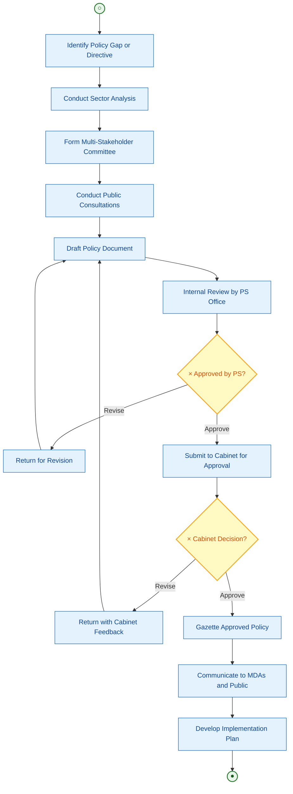
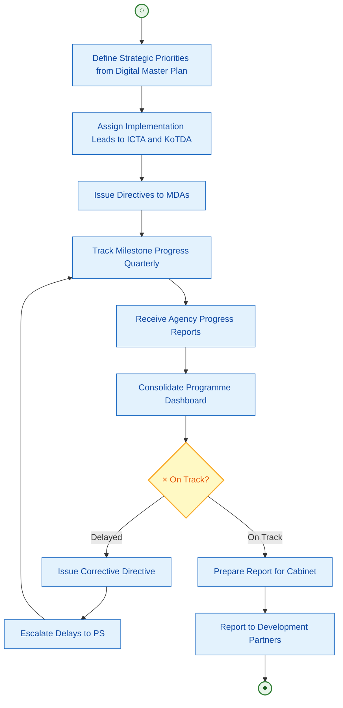
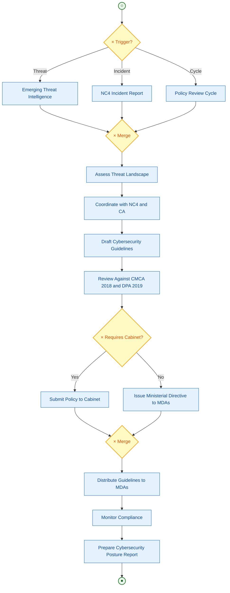
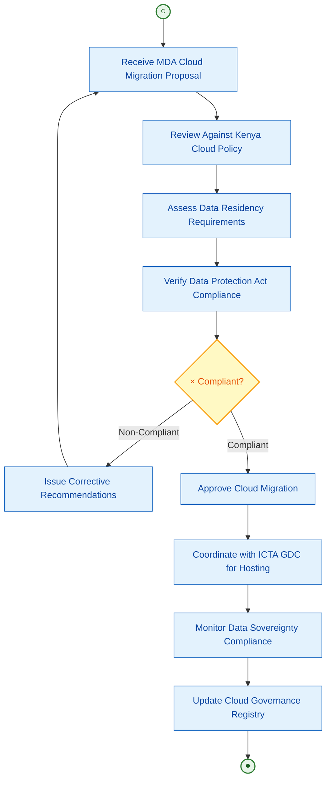
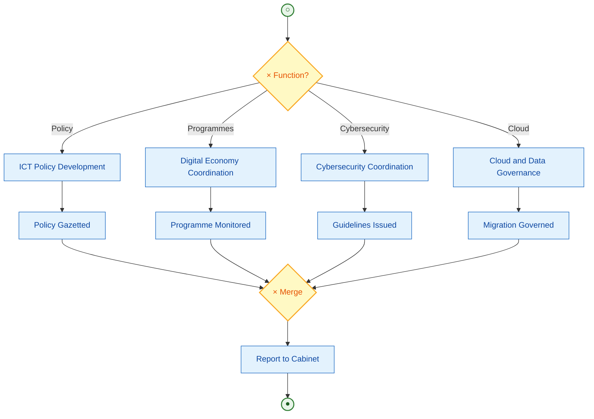

# State Department for ICT and Digital Economy
## Business Process Mapping Report

### Ministry of Information, Communications and The Digital Economy
### State Department for ICT and Digital Economy

## 1. Overview

The State Department for ICT and Digital Economy was established through Executive Order No. 1 of 2023. It formulates ICT policy, drives digital government services, oversees cybersecurity coordination, promotes digital infrastructure development, and manages the national digital transformation agenda including the Kenya National Digital Master Plan 2022-2032.

| Attribute | Description |
|-----------|-------------|
| Key Actors | PS ICT, Policy Officers, Cybersecurity Coordinators, Digital Economy Officers, MDAs, County Governments |
| Key Systems | eCitizen (policy oversight), Kenya Digital Economy Blueprint, National Digital Master Plan, Cloud Policy Framework |
| Key Agencies | ICTA, Konza Technopolis Development Authority (KoTDA), NC4 (Cybersecurity Coordination) |

## 2. Services

### Process 1: ICT Policy Development
- Identify policy gaps in the ICT sector
- Conduct stakeholder consultations
- Draft policy documents
- Submit for Cabinet approval
- Gazette and communicate approved policies

### Process 2: Digital Economy Programme Coordination
- Define digital economy strategic priorities
- Coordinate implementation across ICTA, KoTDA, and MDAs
- Track programme milestones and KPIs
- Prepare progress reports for Cabinet and development partners
- Facilitate donor-funded projects (KDEAP, HoAGDP)

### Process 3: Cybersecurity Policy Coordination
- Monitor national cybersecurity threat landscape
- Coordinate with NC4 on incident response
- Develop cybersecurity policy and standards
- Issue guidelines to MDAs on data protection compliance
- Report to Cabinet on cybersecurity posture

### Process 4: Cloud and Data Governance
- Develop cloud computing policy framework
- Review MDA cloud migration proposals
- Assess data residency and sovereignty compliance
- Issue cloud adoption guidelines
- Monitor compliance with Data Protection Act 2019

## 3. Diagrams

### 3.1 ICT Policy Development

### 3.2 Digital Economy Programme Coordination

### 3.3 Cybersecurity Policy Coordination

### 3.4 Cloud and Data Governance

### 3.5 End-to-End State Department for ICT

## 4. BPMN Legend

| Symbol | Meaning |
|--------|---------|
| ((○)) | Start Event |
| ((●)) | End Event |
| [Text] | Task/Activity |
| {×} | Exclusive Gateway - One path only |
| --> | Sequence Flow |
| -.-> | Loop Back / Return Flow |
