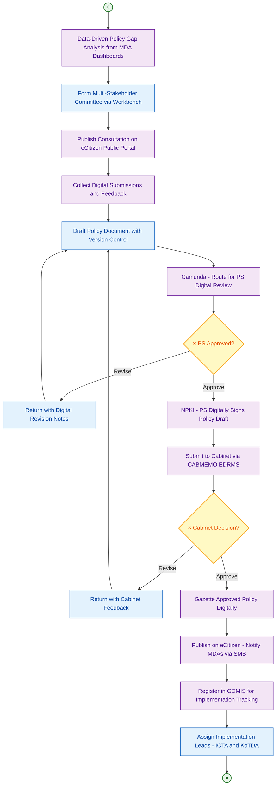
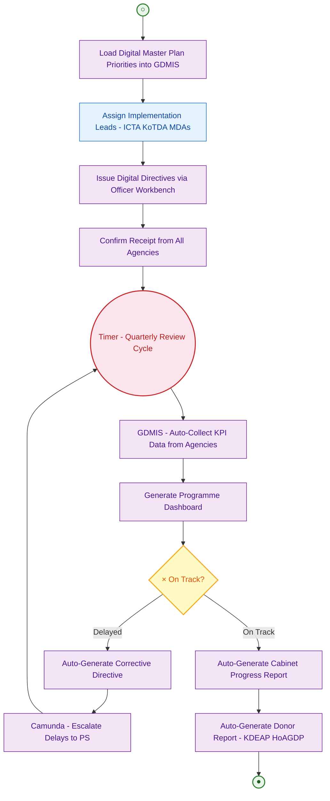
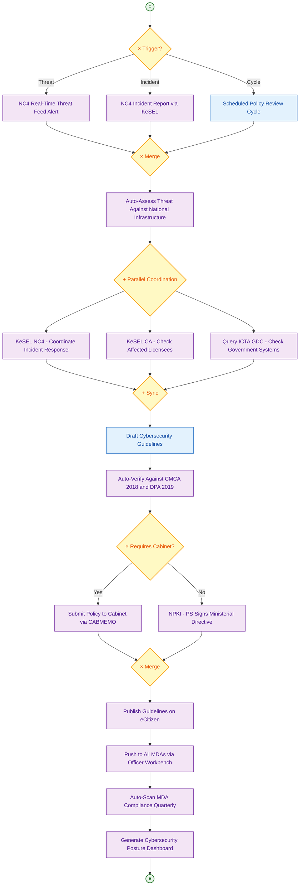
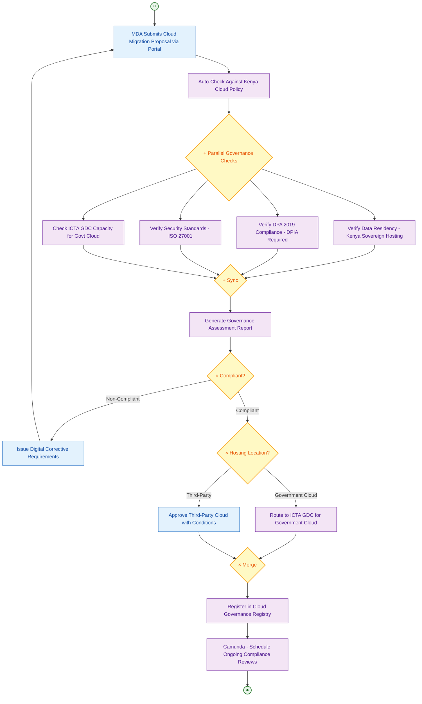

# State Department for ICT and Digital Economy — TO-BE
## Business Process Mapping Report

### Ministry of Information, Communications and The Digital Economy
### State Department for ICT and Digital Economy

## 1. Overview

| Attribute | Description |
|-----------|-------------|
| Process Scope | Digital transformation of ICT policy development, digital economy coordination, cybersecurity, and cloud governance |
| Huduma Bridge Integration | eCitizen Portal, Kong API Gateway, Camunda Workflow Engine, KeSEL, NPKI, NC4 Integration, GDMIS |
| GEA Principles | Standards-Driven, Security by Design, Data as Strategic Asset, Interoperability by Design |
| Strategic Role | Policy authority over Huduma Bridge architecture, drives National Digital Master Plan 2022-2032 |

## 2. TO-BE Processes

### 2.1 TO-BE: Digital ICT Policy Development

#### Key Transformation

| AS-IS | TO-BE |
|-------|-------|
| Manual policy gap identification | Data-driven gap analysis from MDA digital maturity dashboards |
| Physical stakeholder consultations | Hybrid digital consultation via eCitizen public participation portal |
| Paper policy drafts circulated by mail | Digital drafting with version control and NPKI-signed approvals |
| Manual Cabinet submission | Digital submission via CABMEMO (EDRMS) |
| Paper gazette publication | Digital gazette with eCitizen policy notification |
| No implementation tracking | GDMIS-integrated policy implementation tracking |

#### Process Diagram

### 2.2 TO-BE: Digital Economy Programme Coordination

#### Key Transformation

| AS-IS | TO-BE |
|-------|-------|
| Manual priority definition from documents | Digital Master Plan priorities auto-loaded into GDMIS |
| Manual directive issuance to MDAs | Digital directives via Officer Workbench with read receipts |
| Quarterly paper reports from agencies | Real-time dashboards with automated KPI collection |
| Manual escalation to PS | Camunda SLA timers with auto-escalation on delays |
| Paper reports to Cabinet | Auto-generated reports from GDMIS dashboard data |

#### Process Diagram

### 2.3 TO-BE: Digital Cybersecurity Policy Coordination

#### Key Transformation

| AS-IS | TO-BE |
|-------|-------|
| Manual threat monitoring | Real-time NC4 threat feed integration |
| Manual coordination with NC4 and CA | Automated incident routing via KeSEL and Camunda |
| Paper cybersecurity guidelines | Digital guideline publication via eCitizen with MDA push |
| Manual compliance monitoring | Automated compliance scanning against CMCA 2018 and DPA 2019 |
| Paper reports to Cabinet | Auto-generated cybersecurity posture dashboard |

#### Process Diagram

### 2.4 TO-BE: Digital Cloud and Data Governance

## 3. Integration Points

| System | Integration Method | Data Exchanged |
|--------|--------------------|----------------|
| eCitizen Portal | REST API via Kong | Public consultations, policy publications, notifications |
| CABMEMO / EDRMS | Internal API | Cabinet memoranda submission and tracking |
| GDMIS | Internal API | Priority registration, KPI tracking, programme dashboards |
| NC4 | KeSEL X-Road | Threat intelligence, incident reports, response coordination |
| CA | KeSEL X-Road | Licensee data, spectrum monitoring, compliance status |
| ICTA GDC | Internal API | System health checks, cloud capacity, hosting status |
| NPKI (ICTA CA) | Certificate Service | Digital signatures for policy approvals and directives |
| Camunda | Internal | Workflow orchestration, SLA timers, escalation |
| Officer Workbench | WebSocket | MDA directive distribution, compliance monitoring |

## 4. BPMN Legend

| Symbol | Meaning |
|--------|---------|
| ((○)) | Start Event |
| ((●)) | End Event |
| ((Timer)) | Timer Start Event |
| [Text] | Task/Activity |
| {×} | Exclusive Gateway |
| {+} | Parallel Gateway |
| --> | Sequence Flow |
