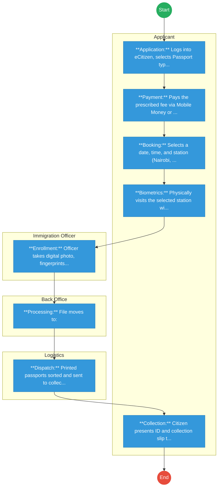
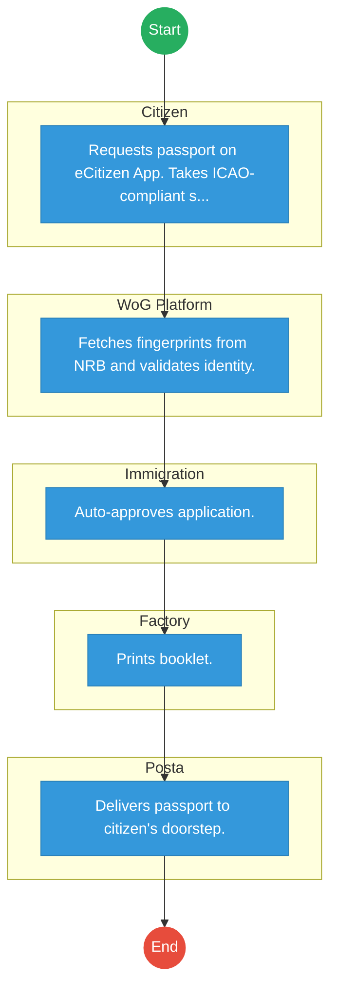

# STATE DEPARTMENT FOR IMMIGRATION AND CITIZEN SERVICES – Passport Application

## Cover Page
- **Ministry/Department/Agency (MDA):** STATE DEPARTMENT FOR IMMIGRATION AND CITIZEN SERVICES
- **Process Name:** Passport Application & Issuance
- **Document Version:** 1.3
- **Date:** 2026-02-19
- **Classification:** Official

---

## Executive Summary
The Directorate of Immigration Services (DIS) is responsible for the issuance of travel documents (passports, visas) to Kenyan citizens and foreign nationals. The passport application process has been digitized via eCitizen but faces significant bottlenecks in biometric capture, processing, and printing.

---

## 1. AS-IS Process Flowchart (BPMN 2.0)
*Current State visualization (eCitizen Application -> Physical Queue).*

---

## Process Overview
### Process Name
Passport Application (New / Renewal / Replacement)

### Service Category
- G2C (Government to Citizen)

### Scope
- **In Scope:** Ordinary (A, B, C series), Diplomatic, and Service Passports.
- **Out of Scope:** Visa processing (evisa.go.ke).

### Triggers
- Need for international travel.
- Expiry of current passport.

### End States
- **Successful:** Issuance of e-Passport (East African Community).

### Policy Context
- Kenya Citizenship and Immigration Act, 2011; ICAO Doc 9303.

---

## Stakeholders
| Stakeholder | Role | Responsibilities |
|---|---|---|
| Applicant | Applicant | Completes online form, pays fee, attends appointment. |
| Immigration Officer | Enroller | Captures biometrics and verifies original documents. |
| Production Staff | Processor | Operates printing machines, quality assurance. |
| Courier Service | Logistics | Delivers passports to regional offices (Mombasa, Kisumu, etc.). |

---

## Detailed Process (AS-IS)
| Step | Role | Action | Tool | Notes |
|---|---|---|---|---|
| 1 | Applicant | **Application:** Logs into eCitizen, selects Passport type (32, 50, 66 pages), fills biodata, uploads photo and ID copy. | eCitizen Portal | |
| 2 | Applicant | **Payment:** Pays the prescribed fee via Mobile Money or Card. | eCitizen / Pesaflow | 32 pages: KES 4,500; 50 pages: KES 6,000 (rates subject to change). |
| 3 | Applicant | **Booking:** Selects a date, time, and station (Nairobi, Mombasa, Kisumu, Nakuru, Eldoret, Embu, Kisii) for biometrics. | Appointment System | Slots are often fully booked for weeks. "Express" services are limited. |
| 4 | Applicant | **Biometrics:** Physically visits the selected station with printed forms and original documents (Birth Cert, ID, Old Passport, Recommender ID). Queues for verification. | Biometric Kit | Long queues. Often requires a whole day. |
| 5 | Immigration Officer | **Enrollment:** Officer takes digital photo, fingerprints, and signature. Verifies physical documents against system data. | Live Capture Station | Frequent system downtime or slow network. |
| 6 | Back Office | **Processing:** File moves to: 
- **Scanning:** Physical file digitized.
- **Approval:** Senior officer approves.
- **Printing:** Booklet personalized. | Production Workflow | Bottleneck: Printing machines often break down or lack booklets. "Priority" cases skip the queue. |
| 7 | Logistics | **Dispatch:** Printed passports sorted and sent to collection counters. Applicant receives SMS. | SMS Gateway | SMS often fails; applicants visit office to check status manually. |
| 8 | Applicant | **Collection:** Citizen presents ID and collection slip to pick up passport. | Collection Desk | Another queue for collection. |

---

## Pain Points & Opportunities
### Pain Points
- **Booklet Shortage:** Frequent delays due to lack of blank passport booklets.
- **Machine Breakdown:** Few printing machines (mainly in Nairobi), causing national backlog.
- **Appointment Delays:** Slots booked out for months; forced to travel to other towns.
- **Corruption:** "Brokers" promising faster processing or appointment slots.
- **Communication:** Lack of transparency on application status ("Stuck at Printing").

### Opportunities
- **Decentralized Printing:** Install printers in key regional offices (Mombasa, Kisumu).
- **Mobile Enrollment:** Portable biometric kits for diaspora or remote areas.
- **Auto-Approval:** Integrate with IPRS/NRB to auto-approve renewal applications (no new biometrics needed if data hasn't changed).
- **Home Delivery:** Partner with Postal Corporation for secure delivery to home/office.

---

## 2. TO-BE Process Flowchart (BPMN 2.0)
*Future State visualization (Repeatable WoG Platform).*

## Future State Process (TO-BE)
### Narrative
The process is **Shared-Service Driven** and **Logistics-Integrated**.
1.  **Biometric Reuse:** The system pulls existing fingerprints from the **NRB (Maisha Namba)** database via **X-Road**. Why capture them again?
2.  **No Appointments:** For renewals and standard applications, physical presence is removed.
3.  **AI Photo Check:** The **eCitizen App** uses AI to ensure the selfie meets ICAO standards before submission.
4.  **Home Delivery:** Passports are delivered securely via **Posta (National Courier)**, tracking the parcel via the App.
5.  **Digital Travel Credential (DTC):** A virtual passport is issued immediately to the phone for use at e-Gates.

### Optimized Steps (Digital)
| Step | Actor | Action | System |
|---|---|---|---|
| 1 | Citizen | Requests passport on eCitizen App. Takes ICAO-compliant selfie. | eCitizen App / AI |
| 2 | WoG Platform | Fetches fingerprints from NRB and validates identity. | X-Road / IPRS |
| 3 | Immigration | Auto-approves application. | Workflow Engine |
| 4 | Factory | Prints booklet. | Production System |
| 5 | Posta | Delivers passport to citizen's doorstep. | Logistics Tracking |

---

## 3. Standard Data Inputs
*Required fields for the WoG Digital Service.*

### A. Passport Application (Renewal/New)
| Field Name | Type | Source | Validation |
|---|---|---|---|
| Citizen ID (Maisha) | String | System Fetch (NRB) | Read-only |
| Passport Type | Enum | User Input | 32/50/66 Pages |
| Current Photo | Image | User Capture (App) | AI ICAO Check |
| Delivery Address | Geo-Loc | User Input | Verified via Google Maps |
| Recommender ID | String | User Input | Optional (if NRB verified) |
| Reason for Travel | Enum | User Input | Tourism / Business / Medical |
| Emergency Contact | String | User Input | Validated vs IPRS |

---

## References
- Kenya Citizenship and Immigration Act.
