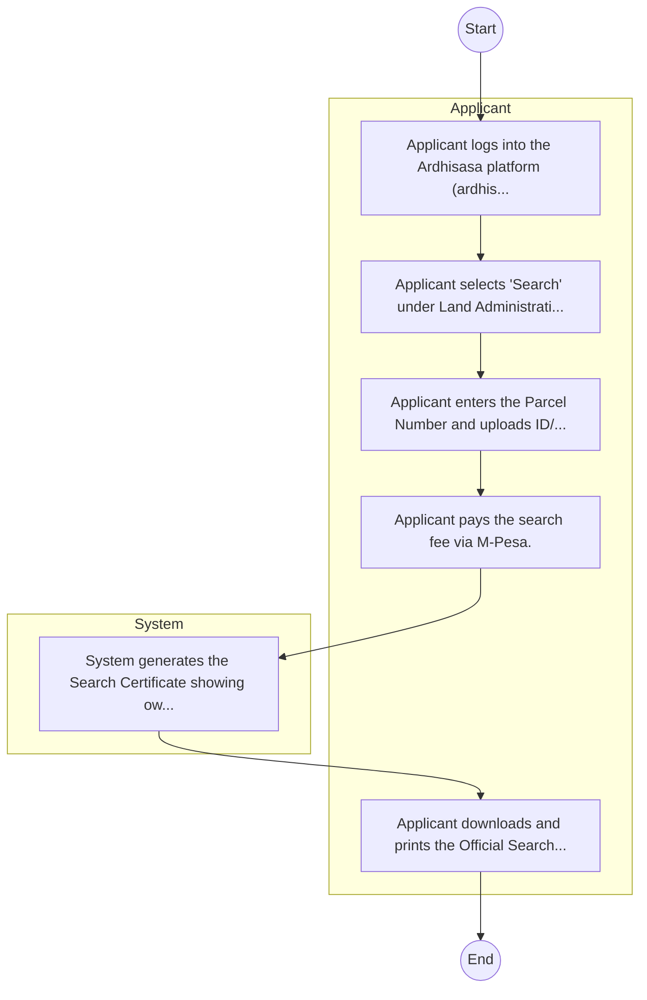

# STATE DEPARTMENT FOR LANDS AND PHYSICAL PLANNING – Service Delivery

## Cover Page
- **Ministry/Department/Agency (MDA):** STATE DEPARTMENT FOR LANDS AND PHYSICAL PLANNING
- **Process Name:** Service Delivery
- **Document Version:** 1.0
- **Date:** 2026-02-14
- **Classification:** Official

---

## Executive Summary
The National Environment Management Authority (NEMA) is Kenya's principal government agency responsible for environmental management and policy. Established under EMCA 1999, it ensures the sustainable management of the environment through general supervision, coordination of environmental matters, and implementation of all environmental policies to maintain standards and regulations across Kenya.

---

## Process Flowchart (BPMN 2.0 - Mermaid)
*Guidance: This diagram visualizes the AS-IS process flow across different actors.*

---

## Process Overview
### Process Name
Service Delivery

### Service Category
- G2C/G2B

### Scope
- **In Scope:** End-to-end processing within STATE DEPARTMENT FOR LANDS AND PHYSICAL PLANNING.

### Triggers
- Submission of application/request by Applicant.

### End States
- **Successful:** Search Certificate, New Title Deed, Green Card Entry

### Policy Context
- The STATE DEPARTMENT FOR LANDS AND PHYSICAL PLANNING Act; The Constitution of Kenya 2010; Data Protection Act 2019.

---

## Stakeholders
| Stakeholder | Role | Responsibilities |
|---|---|---|
| Applicant | Process Actor | Performs actions as defined in steps. |
| System | Process Actor | Performs actions as defined in steps. |

---

## Inputs & Outputs
- **Inputs:** Transfer Form, Title Deed, Land Rent Clearance
- **Outputs:** Search Certificate, New Title Deed, Green Card Entry

---

## Detailed Process (AS-IS)
| Step | Role | Action | Tool | Notes |
|---|---|---|---|---|
| 1 | Applicant | Applicant logs into the Ardhisasa platform (ardhisasa.lands.go.ke). | Manual | |
| 2 | Applicant | Applicant selects 'Search' under Land Administration. | Manual | |
| 3 | Applicant | Applicant enters the Parcel Number and uploads ID/Consent if required. | Manual | |
| 4 | Applicant | Applicant pays the search fee via M-Pesa. | Manual | |
| 5 | System | System generates the Search Certificate showing ownership and encumbrances. | Manual | |
| 6 | Applicant | Applicant downloads and prints the Official Search Result. | Manual | |

---

## Pain Points & Opportunities
### Pain Points
- Missing green cards
- Fraud/Double allocation
- Manual search

### Opportunities
- Integration with IPRS/BRS via Service Bus.
- Adoption of Government Payment Gateway.
- Implementation of Automated Rules Engine.
- Issuance of Digital Verifiable Credentials.

---

## Future State Process (TO-BE)
### Narrative
The To-Be process leverages the Government Service Bus to integrate with BRS (Business Registry) and the Payment Gateway. Manual data entry and document uploads are replaced by real-time API validations, enabling a paperless, cashless, and presence-less service experience.

### Optimized Steps (Digital)
| Step | Actor | Action | System |
|---|---|---|---|
| 1 | Applicant | Applicant logs in via Single Sign-On (SSO) and selects the service. | Citizen Portal / SSO |
| 2 | System | Applicant enters Business Registration Number; System auto-populates details from BRS (Business Registry) via the Service Bus. | Service Bus / Registry API |
| 3 | System | System performs auto-validation of compliance (e.g., KRA Tax Status) via Inter-Agency APIs. | Service Bus / Compliance Engine |
| 4 | Applicant | Applicant pays fees via the Government Payment Gateway; System auto-receipts. | Payment Gateway |
| 5 | System | Application is processed by the Rules Engine. (Low-risk cases are Auto-Approved). | Workflow Engine |
| 6 | Officer | Complex cases are routed to the Officer Workbench for digital review and approval. | Officer Workbench |
| 7 | System | System generates a Verifiable Digital Certificate (QR Code) and notifies the applicant. | Output Generator |

---

## References & Evidence
The information in this document was derived from the following official sources:

- [https://nema.go.ke/](https://nema.go.ke/)
- [https://en.wikipedia.org/wiki/National_Environment_Management_Authority_(Kenya)](https://en.wikipedia.org/wiki/National_Environment_Management_Authority_(Kenya))
- [https://investkenya.go.ke/](https://investkenya.go.ke/)
- [https://greenclimate.fund/](https://greenclimate.fund/)

---

## Appendices
See attached ERD and System Design.
