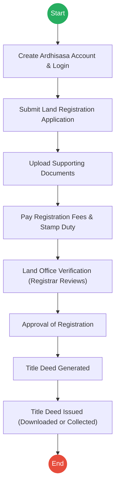
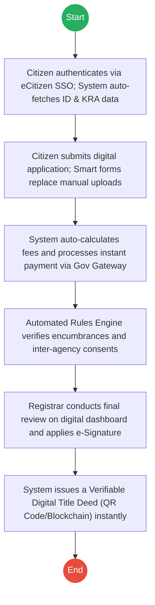
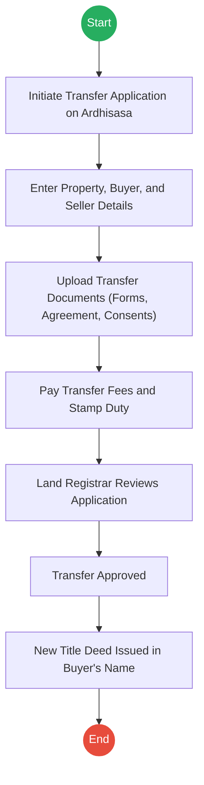
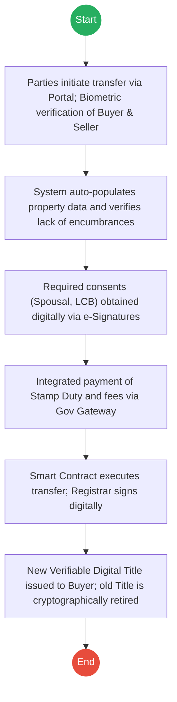

# MINISTRY OF LANDS AND PHYSICAL PLANNING – Service Delivery

## Cover Page
- **Ministry/Department/Agency (MDA):** MINISTRY OF LANDS AND PHYSICAL PLANNING
- **Process Names:** Land Registration / Title Deed Issuance, Property Transfer (Change of Ownership)
- **Document Version:** 2.0
- **Date:** 2026-02-24
- **Classification:** Official

---

## Executive Summary
The Ministry of Lands manages land administration, registration, valuation, and physical planning. It operates the **Ardhisasa** digital platform to facilitate secure, transparent, and efficient land transactions, including the registration of new title deeds and the transfer of property ownership between parties.

---

## Process 1: Land Registration / Title Deed Issuance

### 1.1 AS-IS Process Flowchart (BPMN 2.0)

### 1.2 Detailed Process (AS-IS)
| Step | Role | Action | Tool/System | Notes |
|---|---|---|---|---|
| 1 | Citizen/Lawyer | **Account Creation:** Registers on Ardhisasa using ID, KRA PIN, Email, and Phone. | Ardhisasa Portal | |
| 2 | Citizen/Lawyer | **Login:** Logs into the Ardhisasa portal. | Ardhisasa Portal | |
| 3 | Citizen/Lawyer | **Application:** Selects Land Registration Service; Enters Parcel and Owner details. | Ardhisasa Portal | |
| 4 | Citizen/Lawyer | **Uploads:** Uploads Sale Agreement, Transfer Forms, ID, PIN, and Consents. | Ardhisasa Portal | |
| 5 | Citizen/Lawyer | **Payment:** Pays Stamp Duty, Registration Fees, and other charges. | Payment Gateway | |
| 6 | Registrar | **Verification:** Reviews ownership documents, parcel info, and clearance/consent. | Ardhisasa Backend | |
| 7 | Registrar | **Approval:** Approves the land registration. | Ardhisasa Backend | |
| 8 | System | **Generation:** System generates Title Deed registered in the owner's name. | Ardhisasa System | |
| 9 | Owner | **Issuance:** Owner downloads or physically collects the Title Deed. | Ardhisasa/Registry | |

### 1.3 TO-BE Process (Inferred)
**Design Principles:** Inter-agency Auto-Verification, Smart E-Payments, Verifiable Digital Titles.

| Step | Role | Action | System |
|---|---|---|---|
| 1 | Citizen | Authenticate via single sign-on; profiles auto-populated. | eCitizen / IPRS / KRA |
| 2 | Citizen | Complete smart-form application. | Land Portal |
| 3 | System | Calculate and process all fees (Stamp Duty, etc.) instantly. | Integrated Payment Gateway |
| 4 | System | Auto-verify land status, liens, and spousal/board consents. | Inter-Agency API / Rules Engine |
| 5 | Registrar | Review flagged items and digitally approve the registration. | Officer Workbench |
| 6 | System | Generate and push Verifiable Digital Title to citizen's digital wallet. | Digital Registry / Wallet |

---

## Process 2: Property Transfer (Change of Ownership)

### 2.1 AS-IS Process Flowchart (BPMN 2.0)

### 2.2 Detailed Process (AS-IS)
| Step | Role | Action | Tool/System | Notes |
|---|---|---|---|---|
| 1 | Buyer/Seller | **Initiate:** Logs into Ardhisasa and selects Property Transfer. | Ardhisasa Portal | |
| 2 | Buyer/Seller | **Details:** Enters Parcel Number, Seller Details, and Buyer Details. | Ardhisasa Portal | |
| 3 | Buyer/Seller | **Uploads:** Uploads Signed Transfer Forms, Sale Agreement, ID Copies, PINs, and Land Control Board Consent. | Ardhisasa Portal | |
| 4 | Buyer/Seller | **Payment:** Pays required transfer fees and Stamp Duty. | Payment Gateway | |
| 5 | Registrar | **Review:** Verifies ownership, payment, and legal compliance. | Ardhisasa Backend | |
| 6 | Registrar | **Approval:** Approves the transfer of property. | Ardhisasa Backend | |
| 7 | System | **Issuance:** Generates the new Title Deed in the Buyer’s name. | Ardhisasa System | |

### 2.3 TO-BE Process (Inferred)
**Design Principles:** Biometric Consents, Smart Contract Execution, Real-time Ledger Updates.

| Step | Role | Action | System |
|---|---|---|---|
| 1 | Buyer/Seller | Initiate smart transfer; identities confirmed biometrically. | Portal / IPRS (Maisha) |
| 2 | System | Fetch authoritative property data; check for active cautions/liens. | Digital Land Registry |
| 3 | Parties | Provide digital, verifiable consents (e.g., spousal consent via AG link). | e-Signature / API |
| 4 | Buyer | Process Stamp Duty and transfer fees seamlessly. | Payment Gateway |
| 5 | System/Registrar| Execute transfer via rules engine/smart contract; final digital approval. | Smart Contract / Workbench |
| 6 | System | Issue new digital title to buyer; permanently archive previous ownership record. | Blockchain / Immutable Ledger |