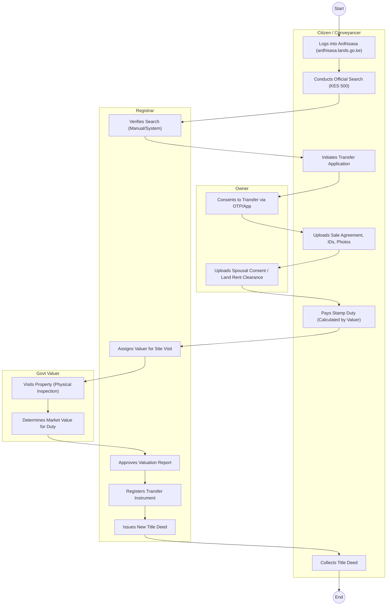
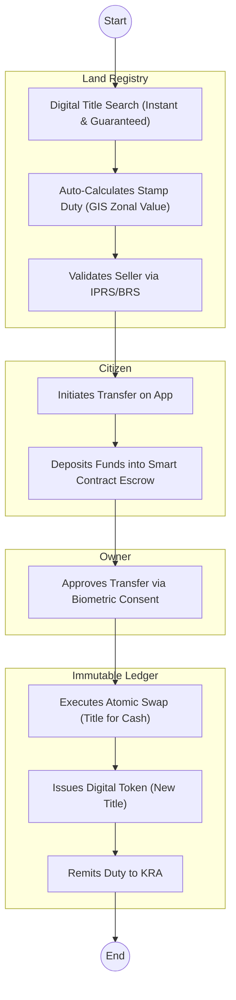

# MINISTRY OF LANDS AND PHYSICAL PLANNING – Service Delivery

## Cover Page
- **Ministry/Department/Agency (MDA):** MINISTRY OF LANDS AND PHYSICAL PLANNING
- **Process Name:** Land Transaction (Transfer, Charge, Search)
- **Document Version:** 1.3
- **Date:** 2026-02-19
- **Classification:** Official

---

## Executive Summary
The Ministry of Lands manages land administration, registration, valuation, and physical planning. The transition to the **Ardhisasa** digital platform aims to digitize all land records, but the process of buying, selling, or charging land remains complex, involving multiple manual verifications and physical site visits.

---

## 1. AS-IS Process Flowchart (BPMN 2.0)
*Current State visualization (Ardhisasa Portal / Parallel Manual Files).*

---

## Process Overview
### Process Name
Transfer of Land / Registration of Charge

### Service Category
- G2C (Government to Citizen) / G2B (Government to Bank)

### Scope
- **In Scope:** Official Search; Transfer of Ownership; Charge (Mortgage); Discharge; Caution; Replacement of Lost Title.
- **Out of Scope:** Land Adjudication (Settlement Schemes); Dispute Resolution (Environment & Land Court).

### Triggers
- Sale/Purchase of Land.
- Taking a Bank Loan (Charge).
- Inheritance (Transmission).

### End States
- **Successful:** Issuance of Title Deed / Lease.

### Policy Context
- Land Registration Act, 2012; Sectional Properties Act, 2020.

---

## Stakeholders
| Stakeholder | Role | Responsibilities |
|---|---|---|
| Buyer / Seller | Parties | Initiate transfer, provide consent, pay Stamp Duty. |
| Conveyancing Advocate | Professional | Drafts agreements, witnesses signatures, uploads documents. |
| Land Registrar | Approver | Vets instruments, signs Titles. |
| Govt Valuer | Assessor | Determines property value for tax purposes. |
| Surveyor | Technical | Verifies boundaries/maps (RIM). |

---

## Detailed Process (AS-IS)
| Step | Role | Action | Tool | Notes |
|---|---|---|---|---|
| 1 | Buyer | **Search:** Logs into Ardhisasa. Requests search on Parcel No. (e.g., Nairobi/Block1/123). Pays KES 500. | Ardhisasa Portal | Often returns "No Record Found" if file isn't digitized yet. |
| 2 | Seller | **Consent:** Seller receives SMS prompt to authorize the search/transfer. Must log in to approve. | OTP / Portal | Requires Seller to have active Ardhisasa account (often tricky for elderly). |
| 3 | Advocate | **Transfer:** Lawyer uploads Transfer Form (TR1), Sale Agreement, ID copies, KRA PINs, Land Rent Clearance Cert, Rates Clearance (County). | Portal Upload | Missing one document halts the whole process. |
| 4 | Valuer | **Valuation:** System assigns a Govt Valuer. Valuer schedules a physical site visit to assess value for Stamp Duty (4% Urban / 2% Rural). | Field Visit | *Bottleneck:* Finding the valuer and facilitating the visit can take weeks. |
| 5 | Buyer | **Duty Payment:** Once value is approved, Buyer generates Stamp Duty slip on iTax and pays via M-Pesa/Bank. | iTax Integration | |
| 6 | Registrar | **Registration:** Registrar reviews the file. If compliant, signs the new Title Deed. | Digital Workflow | Backlogs at the "Signing" stage are common. |
| 7 | Buyer | **Collection:** Buyer (or Advocate) visits Registry to pick up the physical Title Deed. | Counter | Digital Titles exist but physical is still preferred by Banks. |

---

## Pain Points & Opportunities
### Pain Points
- **Missing Files:** The "conversion" process (digitizing old manual files) is slow/incomplete. Search often fails.
- **Valuation Delays:** Physical site visits by overwhelmed Govt Valuers delay transactions by months.
- **System Glitches:** Ardhisasa downtime or "system errors" preventing document upload.
- **Double Allocation:** Historic fraud where one plot has two titles, confusing the digital system.
- **Account Access:** Elderly/Rural sellers struggle to create accounts and navigate OTPs/Consent.

### Opportunities
- **Automated Valuation:** Use GIS and Zonal Valuation Maps to auto-calculate Stamp Duty for standard plots (no site visit needed).
- **Blockchain Title:** Immutable ledger to prevent double allocation and fraud permanently.
- **Unified View:** Link BRS (Company Land) and CRS (Deceased Owners) to auto-verify capacity to transfer.
- **e-Conveyancing:** Fully digital process where Title is a secure Token, not a paper.

---

## 2. TO-BE Process Flowchart (BPMN 2.0)
*Future State visualization (Repeatable WoG Platform).*

## Future State Process (TO-BE)
### Narrative
The process is **Secure** and **Trustless**.
1.  **Guaranteed Search:** The Digital Land Registry is the "Single Source of Truth." If the system says you own it, you own it (State Guarantee).
2.  **Auto-Valuation:** The system uses **GIS Data** to determine the property value instantly based on location zones. No human valuer visits the site.
3.  **Biometric Consent:** The Seller authorizes the sale using their fingerprint/face via the **Maisha App**, eliminating identity fraud.
4.  **Atomic Swap:** The transfer is a **Smart Contract**. The Title moves to the Buyer *only* when the Funds move to the Seller. It happens in milliseconds. No "pending" state.
5.  **Digital Asset:** The Title Deed is a secure digital token in the owner's eCitizen Wallet, accepted by banks for collateral instantly.

### Optimized Steps (Digital)
| Step | Actor | Action | System |
|---|---|---|---|
| 1 | Buyer | Initiates purchase and deposits funds. | Smart Contract |
| 2 | WoG Platform | Validates Seller and calculates Duty. | GIS / IPRS |
| 3 | Seller | Consents via Biometric Scan. | Maisha App |
| 4 | Blockchain | Swaps Title for Cash instantly. | Ledger |
| 5 | Buyer | Receives Digital Title. | eCitizen Wallet |

---

## 3. Standard Data Inputs
*Required fields for the WoG Digital Service.*

### A. Official Search (Instant)
| Field Name | Type | Source | Validation |
|---|---|---|---|
| Parcel Number | String | User Input | Must exist in Registry |
| Search Purpose | Enum | User Input | Sale / Charge / Due Diligence |
| Requester ID | String | System (Auth) | Must be Active |

### B. Smart Contract Transfer (TR1-Digital)
| Field Name | Type | Source | Validation |
|---|---|---|---|
| Parcel Number | String | User Input | Must match Search |
| Buyer ID | String | User Input | Must be Active (IPRS) |
| Sale Price | Currency | User Input | Must be > 0 |
| Seller Consent | Boolean | Biometric (App) | Face ID Match |
| Spousal Consent | Boolean | Biometric (App) | If Married (AG Link) |
| Stamp Duty | Currency | System Calculated | GIS Zonal Value |

---

## References
- Land Registration Act.
