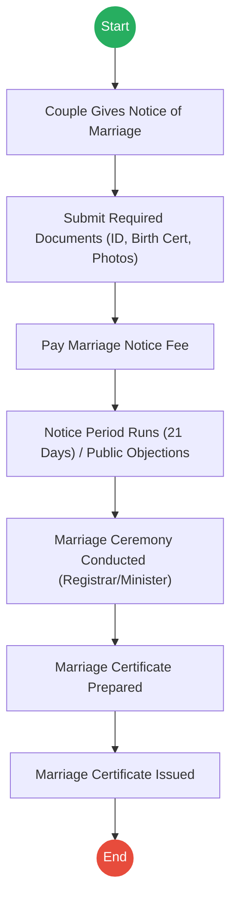
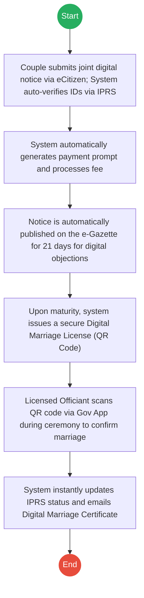
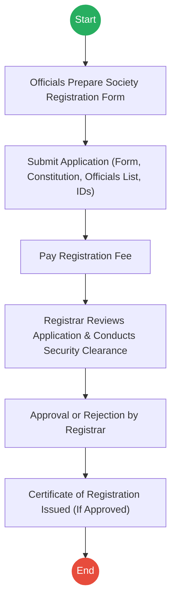
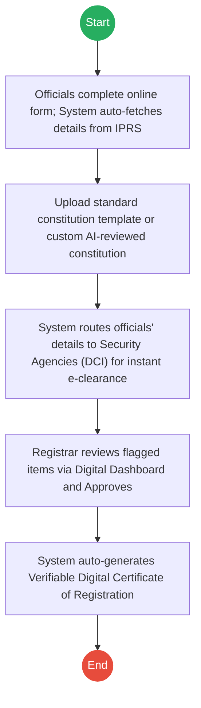
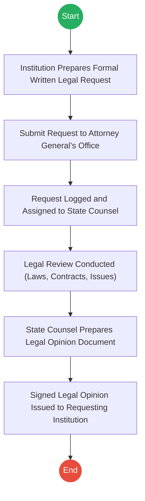
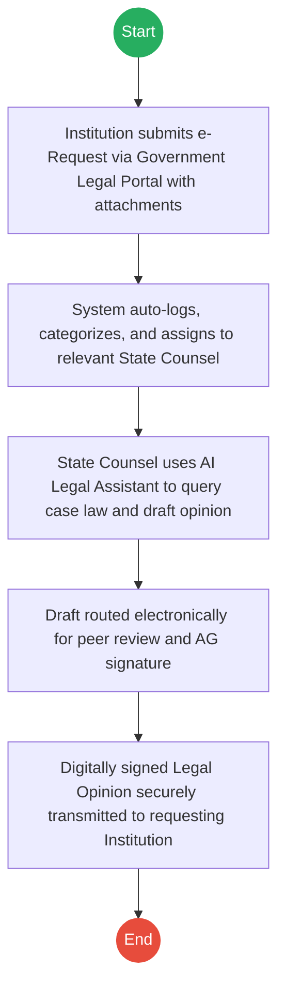

# STATE LAW OFFICE (ATTORNEY GENERAL) – Service Delivery

## Cover Page
- **Ministry/Department/Agency (MDA):** STATE LAW OFFICE (ATTORNEY GENERAL)
- **Process Names:** Marriage Registration, Societies Registration, Legal Advice Request
- **Document Version:** 2.0
- **Date:** 2026-02-24
- **Classification:** Official

---

## Executive Summary
The Office of the Attorney General (State Law Office) oversees vital legal processes for citizens and government institutions. This includes the registration of civil and religious marriages, the registration and regulation of societies, and the provision of formal legal advice and opinions to government ministries and agencies.

---

## Process 1: Marriage Registration

### 1.1 AS-IS Process Flowchart (BPMN 2.0)

### 1.2 Detailed Process (AS-IS)
| Step | Role | Action | Tool/System | Notes |
|---|---|---|---|---|
| 1 | Couple | Gives Notice of Intended Marriage at Registrar Office or Online (eCitizen). | eCitizen / Manual | |
| 2 | Couple | Submits National ID/Passport, Birth Certificate, and Passport Photos. | eCitizen / Manual | |
| 3 | Couple | Pays the Marriage Notice fee. | eCitizen/Bank | |
| 4 | Registrar/Public | Registrar publishes notice. 21-day notice period runs allowing public objections. | Notice Board | |
| 5 | Officiant | Marriage is officiated by Registrar or Licensed religious minister. | Physical | |
| 6 | Registrar | Prepares the Marriage Record. | Manual/System | |
| 7 | Registrar | Issues the final Marriage Certificate to the couple. | Manual | |

### 1.3 TO-BE Process (Inferred)
**Design Principles:** Digital Identity Verification, Automated Notice Publication, Instant Certificate Generation.

| Step | Role | Action | System |
|---|---|---|---|
| 1 | Couple | Submit joint notice; identities and marital status auto-verified. | eCitizen / IPRS |
| 2 | System | Processes payment through Gov Payment Gateway. | Payment Gateway |
| 3 | System | Publishes notice on e-Gazette allowing online objections. | e-Gazette |
| 4 | System | Issues Digital Marriage License (QR Code) after 21 days. | Registry System |
| 5 | Officiant | Scans QR code via app to solemnize marriage in real-time. | Officiant App |
| 6 | System | Updates IPRS and issues verifiable Digital Marriage Certificate. | Registry / IPRS |

---

## Process 2: Societies Registration

### 2.1 AS-IS Process Flowchart (BPMN 2.0)

### 2.2 Detailed Process (AS-IS)
| Step | Role | Action | Tool/System | Notes |
|---|---|---|---|---|
| 1 | Officials | Society officials complete the Society Registration Form. | Manual/Digital | |
| 2 | Officials | Submit Form, Constitution, Officials List, and ID Copies. | Manual/Registry | |
| 3 | Officials | Pay prescribed registration fee. | Bank/Mobile | |
| 4 | Registrar | Reviews objectives and officials details; may conduct security clearance. | Manual/Internal | |
| 5 | Registrar | Approves or Rejects the application. | Manual | |
| 6 | Registrar | Issues Society Registration Certificate if approved. | Manual | |

### 2.3 TO-BE Process (Inferred)
**Design Principles:** AI-assisted Constitution Review, Automated Background Checks, E-Certificates.

| Step | Role | Action | System |
|---|---|---|---|
| 1 | Officials | Apply online; ID details auto-fetched. | Portal / IPRS |
| 2 | System | Validates uploaded constitution against legal templates. | Rules Engine |
| 3 | System | Triggers automated background checks with security agencies. | Inter-Agency API |
| 4 | Registrar | Reviews application on digital dashboard and approves. | Officer Workbench |
| 5 | System | Generates Verifiable Digital Certificate with QR code. | Registry System |

---

## Process 3: Legal Advice Request

### 3.1 AS-IS Process Flowchart (BPMN 2.0)

### 3.2 Detailed Process (AS-IS)
| Step | Role | Action | Tool/System | Notes |
|---|---|---|---|---|
| 1 | Institution | Government Ministry/Agency prepares formal written request. | Physical Letter/Memo | |
| 2 | Institution | Submits request to the Attorney General’s Office. | Manual Dispatch | |
| 3 | Registry | Request is logged manually and assigned to a State Counsel. | Logbook/Registry | |
| 4 | State Counsel | Conducts legal review of laws, contracts, and issues. | Manual | |
| 5 | State Counsel | Prepares Legal Opinion Document. | Word Processor | |
| 6 | AG Office | Signed legal opinion sent back to the requesting institution. | Physical Dispatch | |

### 3.3 TO-BE Process (Inferred)
**Design Principles:** Centralized Legal Case Management, Electronic Routing, AI Legal Research Assistant.

| Step | Role | Action | System |
|---|---|---|---|
| 1 | Institution | Submits request and contract attachments via secure portal. | Gov Legal Portal |
| 2 | System | Auto-assigns case based on workload and specialization. | Case Management |
| 3 | State Counsel | Reviews request utilizing AI-powered legal research tools. | Legal AI Assistant |
| 4 | Management | Electronically reviews and applies digital signature. | e-Signature Workflow |
| 5 | System | Transmits official legal opinion back to the institution's dashboard. | Gov Legal Portal |

---

### Validation Survey
Please provide your feedback here: [https://ee.kobotoolbox.org/x/4Ls7SlCG](https://ee.kobotoolbox.org/x/4Ls7SlCG)
