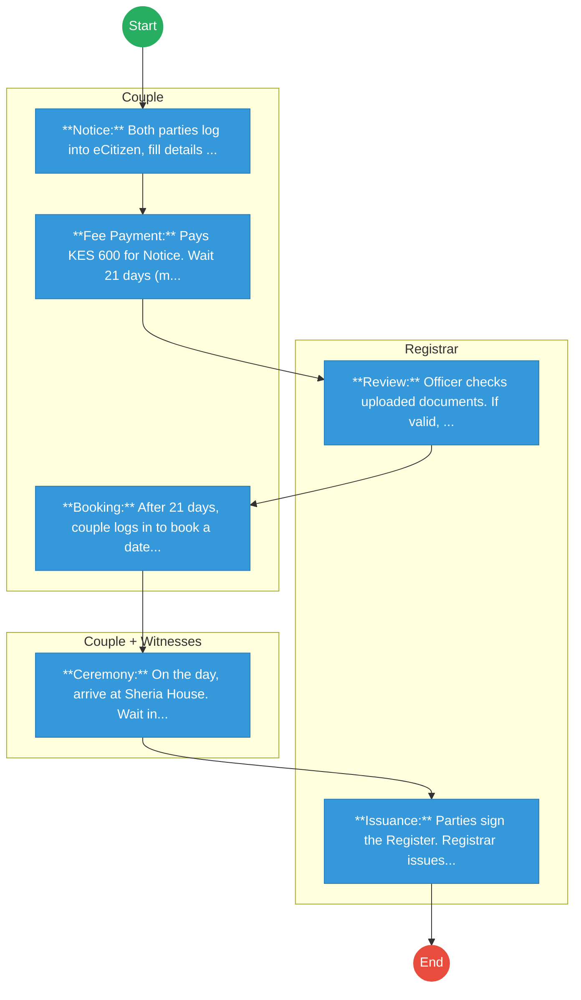
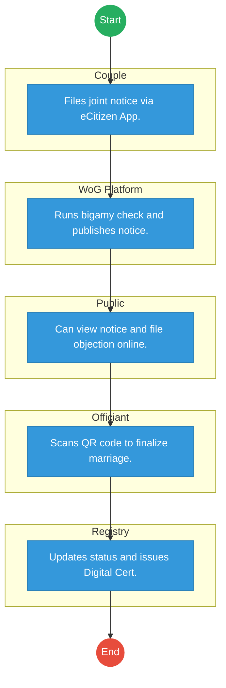

# STATE LAW OFFICE (ATTORNEY GENERAL) – Service Delivery

## Cover Page
- **Ministry/Department/Agency (MDA):** STATE LAW OFFICE (ATTORNEY GENERAL)
- **Process Name:** Marriage Registration
- **Document Version:** 1.3
- **Date:** 2026-02-19
- **Classification:** Official

---

## Executive Summary
The Office of the Attorney General (State Law Office), through the Registrar of Marriages, oversees all civil, customary, Christian, Hindu, and Islamic marriages in Kenya. It issues the **Marriage Certificate**, a vital document for spousal benefits, travel, and succession.

---

## 1. AS-IS Process Flowchart (BPMN 2.0)
*Current State visualization (Manual Notice / Sheria House Queues).*

---

## Process Overview
### Process Name
Civil Marriage Registration (Sheria House)

### Service Category
- G2C (Government to Citizen)

### Scope
- **In Scope:** Notice of Marriage; Civil Marriage Ceremony; Issuance of Marriage Certificate.
- **Out of Scope:** Divorce (Judiciary); Customary Marriage registration (often delayed).

### Triggers
- Couple intending to marry.

### End States
- **Successful:** Issuance of Marriage Certificate.

### Policy Context
- Marriage Act, 2014.

---

## Stakeholders
| Stakeholder | Role | Responsibilities |
|---|---|---|
| Couple | Applicant | Files notice, attends interview/ceremony. |
| Registrar of Marriages | Officiant | Conducts civil marriage, verifies capacity to marry. |
| Witnesses (2) | Verifier | Witness the vows and sign the register. |
| Public | Objector | May file an objection (Caveat) during the 21-day notice period. |

---

## Detailed Process (AS-IS)
| Step | Role | Action | Tool | Notes |
|---|---|---|---|---|
| 1 | Couple | **Notice:** Both parties log into eCitizen, fill details (Occupation, Residence, Parents). Upload passport photos and ID copies. | eCitizen Portal | System requires both parties to have eCitizen accounts. |
| 2 | Couple | **Fee Payment:** Pays KES 600 for Notice. Wait 21 days (mandatory legal requirement). | Mobile Money | No way to expedite legally (except Special License). |
| 3 | Registrar | **Review:** Officer checks uploaded documents. If valid, Notice is "Published" (often just pinned on a notice board at Sheria House). | Physical Board | Archaic method of publication. |
| 4 | Couple | **Booking:** After 21 days, couple logs in to book a date for the ceremony. Pays KES 3,300 (Ceremony Fee). | Appointment System | Slots at Sheria House fill up fast, especially on Fridays. |
| 5 | Couple + Witnesses | **Ceremony:** On the day, arrive at Sheria House. Wait in queue. Enter Registrar's office for brief vows. | Physical Office | Often chaotic, crowded waiting rooms. |
| 6 | Registrar | **Issuance:** Parties sign the Register. Registrar issues hand-written or typed Certificate. | Manual Certificate | Risk of typos. |

---

## Pain Points & Opportunities
### Pain Points
- **Physical Presence:** Both parties must visit Sheria House for the interview/booking, even if applied online.
- **Notice Board:** Relying on a physical notice board for objections is ineffective in the digital age.
- **Delays:** Booking slots can be months away due to high demand.
- **Customary Marriages:** Registration of customary unions (traditional weddings) is complex and often ignored until death/succession disputes arise.
- **Verification:** Banks/Embassies struggle to verify manual certificates instantly.

### Opportunities
- **Digital Notice:** Publish notices online (e-Gazette/Portal) for wider visibility.
- **Remote Interview:** Conduct the pre-wedding interview via video link to save travel.
- **Decentralization:** Empower Huduma Centres in all counties to officiate marriages (currently limited).
- **Blockchain:** Immutable marriage register to prevent bigamy/fraud.

---

## 2. TO-BE Process Flowchart (BPMN 2.0)
*Future State visualization (Repeatable WoG Platform).*

## Future State Process (TO-BE)
### Narrative
The process is **Decentralized** and **Secure**.
1.  **Smart Notice:** The **WoG Platform** checks the ID numbers of both parties against the central marriage database. Bigamy is flagged instantly.
2.  **Online Publication:** The "Notice of Marriage" is published on the public **e-Gazette** portal, searchable by name.
3.  **Digital License:** After 21 days, if no objection is filed online, the couple receives a secure **QR Code License** on their phone.
4.  **Universal Officiation:** Any licensed officiant (Pastor, Imam, Registrar) uses the **Government Officiant App** to scan the QR code at the wedding venue (church, garden, mosque). This "activates" the marriage in real-time.
5.  **Instant Update:** The change of status (Single -> Married) is pushed immediately to **IPRS**, linking the spouses for future services (NHIF, Pension).

### Optimized Steps (Digital)
| Step | Actor | Action | System |
|---|---|---|---|
| 1 | Couple | Files joint notice via eCitizen App. | eCitizen App |
| 2 | WoG Platform | Runs bigamy check and publishes notice. | Registry / e-Gazette |
| 3 | Public | Can view notice and file objection online. | Public Portal |
| 4 | Officiant | Scans QR code to finalize marriage. | Officiant App |
| 5 | Registry | Updates status and issues Digital Cert. | X-Road |

---

## 3. Standard Data Inputs
*Required fields for the WoG Digital Service.*

### A. Notice of Marriage (Joint)
| Field Name | Type | Source | Validation |
|---|---|---|---|
| Groom ID | String | User Input | Must be 'Single' (IPRS) |
| Bride ID | String | User Input | Must be 'Single' (IPRS) |
| Marriage Type | Enum | User Input | Civil / Christian / Customary |
| Proposed Date | Date | User Input | > 21 days from today |
| Venue | String | User Input | Licensed Venue List |

### B. Officiation (Ceremony)
| Field Name | Type | Source | Validation |
|---|---|---|---|
| License QR | String | Scanned (App) | Valid & Not Expired |
| Officiant License | String | System (Auth) | Must be Active |
| Witness 1 ID | String | User Input | Valid ID (IPRS) |
| Witness 2 ID | String | User Input | Valid ID (IPRS) |

---

## References
- Marriage Act.
