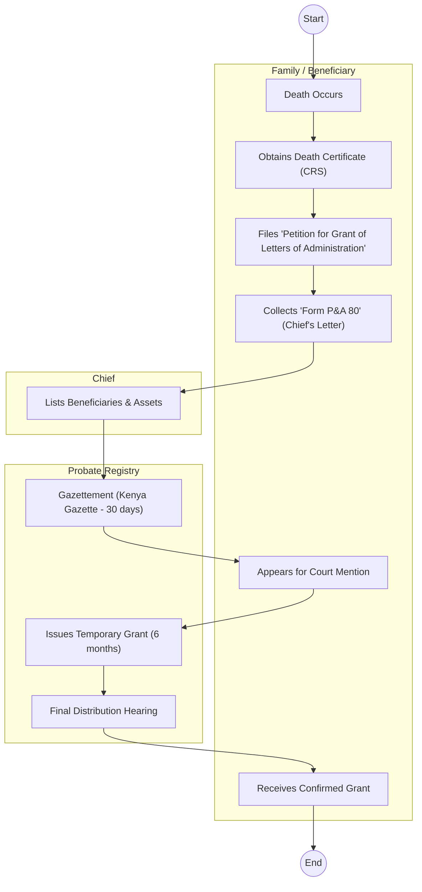
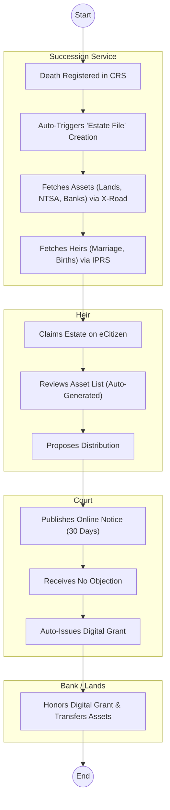

# THE JUDICIARY – Service Delivery

## Cover Page
- **Ministry/Department/Agency (MDA):** THE JUDICIARY
- **Process Name:** Succession & Probate Administration
- **Document Version:** 1.2
- **Date:** 2026-02-19
- **Classification:** Official

---

## Executive Summary
The Judiciary is the custodian of the law. In the lifecycle of a citizen, it plays the definitive role in the "Death" phase through **Succession Causes** (Probate & Administration). It validates Wills, appoints Administrators, and distributes the estate of the deceased.

---

## 1. AS-IS Process Flowchart (BPMN 2.0)
*Current State visualization (Manual Filing / Court Adjournments).*

---

## Process Overview
### Process Name
Succession Cause (Intestate / Testate)

### Service Category
- G2C (Government to Citizen)

### Scope
- **In Scope:** Filing of P&A forms; Gazettement; Grant of Letters of Administration; Confirmation of Grant.
- **Out of Scope:** Drafting of Wills (Private legal matter).

### Triggers
- Death of a property owner.
- Dispute over inheritance.

### End States
- **Successful:** Certificate of Confirmation of Grant (Form 108).

### Policy Context
- Law of Succession Act (Cap 160).

---

## Stakeholders
| Stakeholder | Role | Responsibilities |
|---|---|---|
| Petitioner | Applicant | Files the case, lists assets/liabilities. |
| Advocate | Representative | Legal representation (often mandatory for high value). |
| Magistrate / Judge | Adjudicator | Reviews petition, hears objections, confirms grant. |
| Probate Registry | Processor | Assesses court fees, prepares gazette notice. |
| Government Printer | Publisher | Prints the Kenya Gazette notice. |
| Objector | Interested Party | Files objection (Caveat) to stop the process. |

---

## Detailed Process (AS-IS)
| Step | Role | Action | Tool | Notes |
|---|---|---|---|---|
| 1 | Petitioner | **Filing:** Files Petition (P&A 80) at High Court or Magistrate Court. Must attach: Death Cert, Chief’s Letter (identifying heirs), 2 Sureties. | Manual / e-Filing | e-Filing exists but physical files still dominate. |
| 2 | Registry | **Assessment:** Registry assesses filing fees (based on estate value). Petitioner pays via M-Pesa/Bank. | Case Tracking System (CTS) | |
| 3 | Registry | **Gazettement:** Court sends notice to Government Printer. Notice must run for 30 days to allow objections. | Kenya Gazette | *Bottleneck:* Delays at Govt Printer (months). Lost notices. |
| 4 | Petitioner | **Hearing:** After 30 days, file for "Mention" to identify petitioner and sureties. | Physical Court | Adjournments common due to missing files. |
| 5 | Court | **Grant Issued:** Court issues "Temporary Grant" (Form 41) valid for 6 months. allows gathering of assets but *not* distribution. | Manual Typing | |
| 6 | Petitioner | **Confirmation:** After 6 months, Petitioner files "Summons for Confirmation of Grant" (Form 108) proposing distribution. | Manual | |
| 7 | Court | **Final Orders:** If no objections, Court confirms the grant. Issues Certificate of Confirmation. | Sealed Order | This document is required by Banks/Lands to transfer assets. |

---

## Pain Points & Opportunities
### Pain Points
- **Duration:** Simple cases take 1-2 years. Complex ones take decades.
- **Lost Files:** Physical files frequently disappear in registries.
- **Gazette Delays:** Waiting for the weekly Kenya Gazette print run is archaic.
- **Corruption:** "Missing file" syndrome used to solicit bribes.
- **Geographic Barriers:** Parties must travel to the specific court where the file is.

### Opportunities
- **e-Gazette:** Instant online publication of notices (daily instead of weekly).
- **Auto-Integration:** Link CRS (Death) to Judiciary (Succession) to prevent fraud.
- **Virtual Courts:** Routine mentions via video link to save travel.
- **Blockchain:** Immutable record of Wills and Grants to prevent tampering.

---

## 2. TO-BE Process Flowchart (BPMN 2.0)
*Future State visualization (Repeatable WoG Platform).*

## Future State Process (TO-BE)
### Narrative
The process is **Proactive** and **Data-Driven**.
1.  **Trigger:** The issuance of a Death Certificate by **CRS** automatically opens a "Succession Case" in the Judiciary system.
2.  **Asset Discovery:** The system queries **Lands (Ardhisasa)**, **NTSA (Vehicles)**, and **UFAA (Unclaimed Assets)** using the deceased's ID to build an "Inventory of Assets" automatically.
3.  **Heir Identification:** Potential heirs are identified from **Marriage (Spouse)** and **Birth (Children)** registries.
4.  **Digital Claim:** The family logs into eCitizen to "Claim" the estate. They confirm the asset list and proposed distribution.
5.  **Automated Grant:** If the proposal aligns with the Law of Succession (e.g., equal share) and no objection is filed online after 30 days, the **Digital Grant** is issued automatically. No court appearance needed for uncontested cases.

### Optimized Steps (Digital)
| Step | Actor | Action | System |
|---|---|---|---|
| 1 | CRS | Flags ID as "Deceased". | IPRS |
| 2 | WoG Platform | Compiles asset inventory via X-Road APIs. | Data Hub |
| 3 | Heir | Claims estate and proposes distribution on App. | eCitizen App |
| 4 | Judiciary | Publishes e-Gazette notice instantly. | Online Gazette |
| 5 | Court AI | Validates proposal and issues Grant. | Case Management |

---

## References
- Law of Succession Act.
