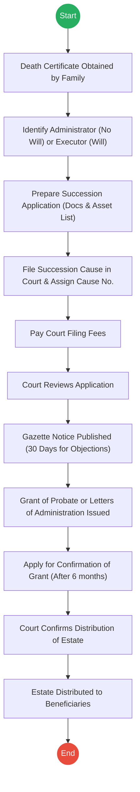
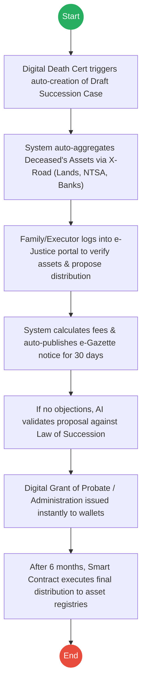

# THE JUDICIARY – Service Delivery

## Cover Page
- **Ministry/Department/Agency (MDA):** THE JUDICIARY
- **Process Name:** Succession & Probate Administration
- **Document Version:** 2.0
- **Date:** 2026-02-24
- **Classification:** Official

---

## Executive Summary
The Judiciary is the custodian of the law and plays the definitive role in the "Death" phase of a citizen's lifecycle through **Succession Causes** (Probate & Administration). It validates Wills, appoints Administrators, and legally oversees the distribution of a deceased person's estate to their rightful beneficiaries.

---

## 1. AS-IS Process Flowchart (BPMN 2.0)
*Current State visualization (Succession and Probate Administration).*

---

## Detailed Process (AS-IS)
**AS-IS Steps: Succession and Probate Administration**

| Step | Role | Action | Tool/System | Notes |
|---|---|---|---|---|
| 1 | Family | **Obtain Document:** Family obtains the official Death Certificate. | Physical | Required to prove death. |
| 2 | Family | **Identify Rep:** Family identifies Executor (if will exists) or Administrator (usually next of kin). | Manual | |
| 3 | Applicant | **Prepare Application:** Prepares Succession Cause Application including Death Cert, Chief’s Letter, List of Beneficiaries, and List of Assets/Liabilities. | Manual/Legal | Often requires a lawyer. |
| 4 | Applicant | **File Case:** Files application at Magistrate Court or High Court. Court assigns a Succession Cause Number. | Court Registry | Physical or e-Filing. |
| 5 | Applicant | **Payment:** Applicant pays required court filing fees. | Bank/M-Pesa | |
| 6 | Court | **Review:** Court reviews submitted documents. May request additional information or corrections. | Manual/CTS | |
| 7 | Court | **Gazettement:** Court publishes notice in the Kenya Gazette, allowing objections (usually 30 days). | Gov Printer | Often faces delays. |
| 8 | Court | **Issuance:** Court issues Grant of Probate (if will exists) or Letters of Administration (if no will). | Physical Document| |
| 9 | Administrator | **Confirmation Application:** After statutory period (usually 6 months), applies for Confirmation of Grant. | Court Registry | |
| 10 | Court | **Confirmation:** Court approves the distribution of estate to beneficiaries. | Court Order | |
| 11 | Administrator | **Distribution:** Transfers Land, Bank funds, Shares, and other assets to beneficiaries. | Various Entities | Lands, Banks, UFAA. |

**Final Output:** Grant of Probate OR Letters of Administration AND Confirmed Grant for Asset Distribution.

---

## 2. TO-BE Process Flowchart (BPMN 2.0)
*Future State visualization (Automated & Interoperable Succession).*

## Future State Process (TO-BE)
### Narrative
**TO-BE Process: Automated & Interoperable Succession Administration**

**Design Principles:**
- Proactive Case Initiation
- Automated Asset Discovery
- Digital Gazettement
- Smart Contract Asset Distribution

### Optimized Steps (Digital)
| Step | Actor | Action | System |
|---|---|---|---|
| 1 | System | **Case Initiation:** Issuance of Digital Death Certificate by CRS automatically opens a draft Succession Case in the Judiciary portal. | CRS / e-Justice API |
| 2 | System | **Asset Discovery:** System queries external registries (Ardhisasa, NTSA, UFAA, Banks) via APIs to compile an immutable asset inventory. | Inter-Agency Data Hub |
| 3 | Family/Executor | **Verification & Proposal:** Logs into e-Justice portal using SSO, verifies auto-discovered assets, and inputs proposed distribution or uploads digital will. | e-Justice Portal |
| 4 | System | **e-Gazettement:** Instantly publishes notice on the daily e-Gazette for the 30-day objection period, replacing the physical government printer backlog. | e-Gazette Platform |
| 5 | Court AI | **Validation:** AI reviews proposed distribution against the Law of Succession (for intestate cases). If no objections are logged, it approves the grant. | Judiciary AI Engine |
| 6 | Court | **Digital Issuance:** Issues Verifiable Digital Grant of Probate or Letters of Administration directly to the administrator's digital wallet. | e-Justice Registry |
| 7 | System | **Smart Distribution:** After the 6-month statutory period, smart contracts trigger APIs to Lands and Banks to automatically execute the confirmed distribution. | Smart Contracts / X-Road |

---

## References
- Law of Succession Act (Cap 160).