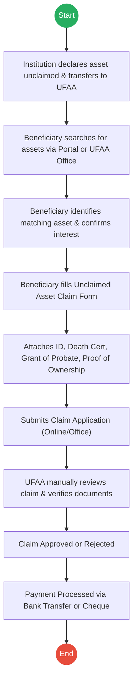
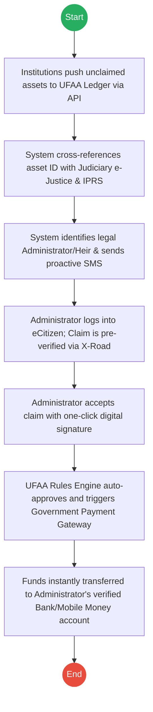

# UNCLAIMED FINANCIAL ASSETS AUTHORITY (UFAA) – Service Delivery

## Cover Page
- **Ministry/Department/Agency (MDA):** UNCLAIMED FINANCIAL ASSETS AUTHORITY (UFAA)
- **Process Name:** Claim for Unclaimed Financial Assets
- **Document Version:** 2.0
- **Date:** 2026-02-24
- **Classification:** Official

---

## Executive Summary
The Unclaimed Financial Assets Authority (UFAA) is mandated to receive, safeguard, and reunite unclaimed financial assets (such as dormant bank accounts, uncollected dividends, insurance benefits, and pension funds) with their rightful owners or beneficiaries. In the context of the citizen lifecycle, UFAA plays a crucial role post-succession.

---

## 1. AS-IS Process Flowchart (BPMN 2.0)
*Current State visualization (Reactive Claim Process).*

---

## Process Overview
### Process Name
Claim for Unclaimed Financial Assets

### Service Category
- G2C (Government to Citizen) / B2G (Business to Government)

### Scope
- **In Scope:** Receiving unclaimed assets from institutions; Searching for assets; Filing claims; Verification of beneficiaries; Disbursement of funds.
- **Out of Scope:** Physical assets (e.g., unclaimed land or vehicles).

### Triggers
- Financial institution reaches statutory dormancy period.
- Beneficiary searches and discovers an asset.

### End States
- **Successful:** Unclaimed Asset Paid to Beneficiary; Asset marked as claimed.

### Policy Context
- Unclaimed Financial Assets Act.

---

## Detailed Process (AS-IS)
| Step | Role | Action | Tool/System | Notes |
|---|---|---|---|---|
| 1 | Financial Institution | **Transfer:** Declares asset (bank accounts, shares, pension) unclaimed after inactivity and transfers to UFAA. | B2G Transfer | |
| 2 | Beneficiary | **Search:** Searches using UFAA Portal or visits office, providing Name or ID of owner. | UFAA Portal / Manual | |
| 3 | Beneficiary | **Identify:** Identifies matching asset record from the system and confirms interest. | UFAA Portal | |
| 4 | Beneficiary | **Form Fill:** Fills the Unclaimed Asset Claim Form. | Physical/Digital | |
| 5 | Beneficiary | **Attachments:** Submits ID Copy, Death Certificate, Grant of Probate, and Proof of Ownership. | Manual Upload | |
| 6 | Beneficiary | **Submission:** Submits claim application online or at UFAA Office. | UFAA Portal / Manual | |
| 7 | UFAA | **Review:** Verifies identity, beneficiary eligibility, and ownership records. | Manual | Process is often lengthy. |
| 8 | UFAA | **Decision:** Approves or rejects the claim and notifies the beneficiary. | Email/Letter | |
| 9 | UFAA | **Disbursement:** Transfers asset value to beneficiary via Bank Transfer or physical Cheque. | Bank System | |

---

## Pain Points & Opportunities
### Pain Points
- **Reactive Process:** Beneficiaries often don't know the assets exist. The burden of search is entirely on them.
- **Manual Verification:** Reviewing physical Grants of Probate and Death Certificates is slow and prone to fraud.
- **Cheque Payments:** Issuing physical cheques is inefficient and delays access to funds.

### Opportunities
- **Proactive Reunification:** Use IPRS and Judiciary data to actively locate next of kin.
- **API Integration:** Direct integration with the Judiciary e-Justice system to auto-verify Grants of Probate without manual document uploads.
- **Digital Disbursement:** Direct to Mobile Money (M-Pesa) or verified bank accounts instantly.

---

## 2. TO-BE Process Flowchart (BPMN 2.0)
*Future State visualization (Proactive Reunification).*

## Future State Process (TO-BE)
### Narrative
**TO-BE Process: Proactive Asset Reunification**

**Design Principles:**
- Proactive Citizen Notification
- Zero Document Uploads (API Verification)
- Instant Digital Disbursement

### Optimized Steps (Digital)
| Step | Actor | Action | System |
|---|---|---|---|
| 1 | Financial Inst. | **API Transfer:** Institutions automatically push unclaimed asset data directly into the UFAA Central Digital Ledger. | Institution API / UFAA Ledger |
| 2 | System | **Auto-Matching:** UFAA system queries IPRS (for death status) and the Judiciary e-Justice API (for active Grants of Probate) using the asset owner's ID. | X-Road (IPRS & Judiciary) |
| 3 | System | **Proactive Alert:** System identifies the legal Administrator/Next of Kin and sends a proactive SMS/Email: "Unclaimed asset found. Log in to claim." | Notification Gateway |
| 4 | Administrator | **One-Click Claim:** Administrator logs into eCitizen. No documents needed, as Probate is already verified. Administrator accepts the claim. | eCitizen Portal |
| 5 | UFAA System | **Auto-Approval:** The Rules Engine auto-approves the claim instantly based on the API verifications. | UFAA Rules Engine |
| 6 | System | **Instant Disbursement:** Funds are securely and instantly transferred to the Administrator's verified digital wallet or bank account. | Government Payment Gateway |

---

## References
- Unclaimed Financial Assets Act.