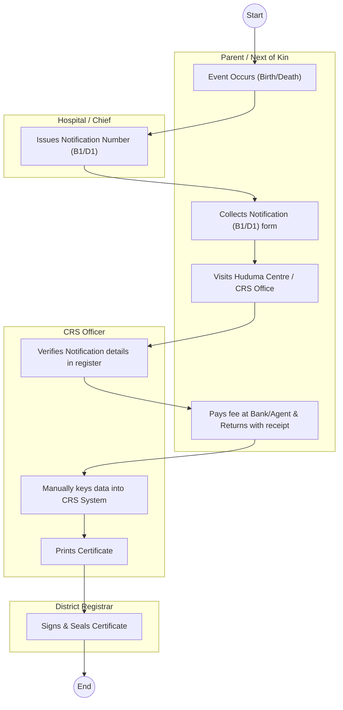
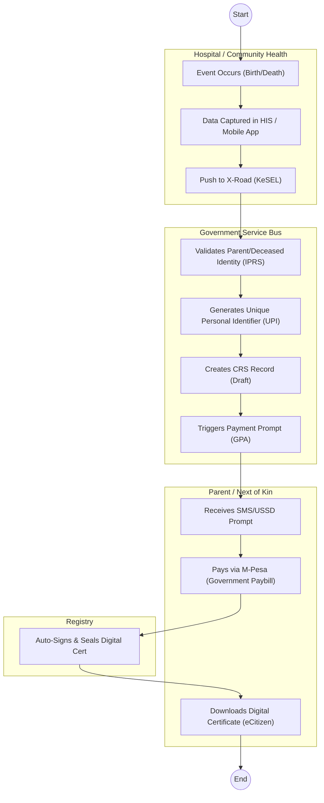

# ·       CIVIL REGISTRATION SERVICES (CRS) – Service Delivery

## Cover Page
- **Ministry/Department/Agency (MDA):** ·       CIVIL REGISTRATION SERVICES (CRS)
- **Process Name:** Service Delivery (Birth & Death Registration)
- **Document Version:** 1.2
- **Date:** 2026-02-19
- **Classification:** Official

---

## Executive Summary
Civil Registration Services (CRS) is mandated to register all births and deaths occurring in Kenya and of Kenyans abroad. It issues Birth and Death Certificates, which are the primary source documents for legal identity and succession.

---

## 1. AS-IS Process Flowchart (BPMN 2.0)
*Current State visualization (Manual/Semi-Digital).*

---

## Process Overview
### Process Name
Birth & Death Registration (Current/Late)

### Service Category
- G2C (Government to Citizen)

### Scope
- **In Scope:** Registration of births and deaths; Issuance of certificates.
- **Out of Scope:** DNA testing for disputed parentage.

### Triggers
- Birth of a child.
- Death of a person.

### End States
- **Successful:** Issuance of Birth Certificate (B3) or Death Certificate.

### Policy Context
- Births and Deaths Registration Act (Cap 149); Kenya Citizenship and Immigration Act.

---

## Stakeholders
| Stakeholder | Role | Responsibilities |
|---|---|---|
| Parent / Informant | Applicant | Reports event, provides notification. |
| Health Facility / Chief | Notifier | Issues B1 (Birth) or D1 (Death) notification. |
| CRS Registration Assistant | Processor | Data entry, verification against registers. |
| District Registrar | Approver | Signing and sealing of certificates. |

---

## Detailed Process (AS-IS)
| Step | Role | Action | Tool | Notes |
|---|---|---|---|---|
| 1 | Health Facility / Chief | **Notification:** Issuer records event. For hospital births/deaths, a Notification Number is generated. For home events, the Assistant Chief issues a manual acknowledgement. | Manual Register / B1 Form | |
| 2 | Parent / Informant | **Application:** Visits CRS office or Huduma Centre with the Notification Number and parent ID copies (for birth) or Deceased ID (for death). | Manual | "Late Registration" requires additional vetting. |
| 3 | CRS Officer | **Verification:** Officer locates the physical or digital notification record to validate details. | Manual / Local DB | Frequent delays if records aren't synced. |
| 4 | Parent / Informant | **Payment:** Pays processing fee (e.g., via eCitizen or Bank) and presents receipt. | eCitizen / Manual Receipt | |
| 5 | CRS Officer | **Data Entry:** Officer types details into the legacy CRS system for certificate printing. | Legacy Desktop App | Risk of typos. |
| 6 | District Registrar | **Approval:** Registrar manually signs and stamps the printed certificate. | Manual | Bottleneck step. |
| 7 | Parent / Informant | **Collection:** Collects the physical certificate. | Manual | |

---

## Pain Points & Opportunities
### Pain Points
- **Double Entry:** Hospital types data, CRS officer re-types it (error prone).
- **Late Registration:** Complex, manual committee vetting for events >6 months.
- **Physical Archives:** Searching for old records in physical ledgers is slow.
- **Fraud:** Risk of fake notifications or identity theft (Ghost workers/voters).

### Opportunities
- **Hospital Integration:** API push from Hospital system directly to CRS.
- **Automated Queuing:** First-in-First-out processing.
- **Digitization:** Scanning all historical registers for searchable database.
- **IPRS Link:** Real-time validation of parent/deceased IDs.

---

## 2. TO-BE Process Flowchart (BPMN 2.0)
*Future State visualization (Repeatable WoG Platform).*

## Future State Process (TO-BE)
### Narrative
The process is **Event-Driven** and **Interoperable**.
1.  **Source Capture:** Data is captured *once* at the source (Hospital HMIS or Community Health Promoter's Tablet).
2.  **Interoperability (X-Road):** The Health System pushes data securely to CRS via the Government Service Bus (KeSEL).
3.  **Identity Verification:** The platform automatically queries IPRS to validate the parents' or deceased's identity.
4.  **UPI Generation:** For births, a **Maisha Namba (UPI)** is minted immediately.
5.  **Direct Payment:** The citizen pays directly via the Government Payment Aggregator (GPA).
6.  **Digital Output:** A Verifiable Digital Certificate (QR Code) is issued to the citizen's eCitizen locker. No physical visit required.

### Optimized Steps (Digital)
| Step | Actor | Action | System |
|---|---|---|---|
| 1 | Health Staff | Enters birth/death details into Hospital System (EMR). | Hospital EMR |
| 2 | WoG Platform | Validates IDs, generates UPI, and creates draft record. | X-Road / IPRS |
| 3 | Citizen | Receives SMS, reviews details, and pays fee. | Notification / GPA |
| 4 | CRS System | Auto-approves (if low risk) and generates Digital Certificate. | Workflow Engine |
| 5 | Citizen | Downloads official certificate from eCitizen. | eCitizen Portal |

---

## References
- Births and Deaths Registration Act.
