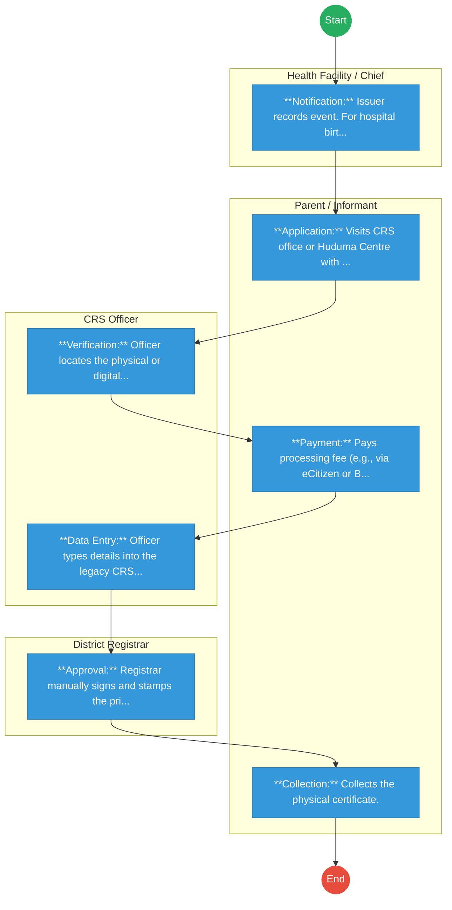
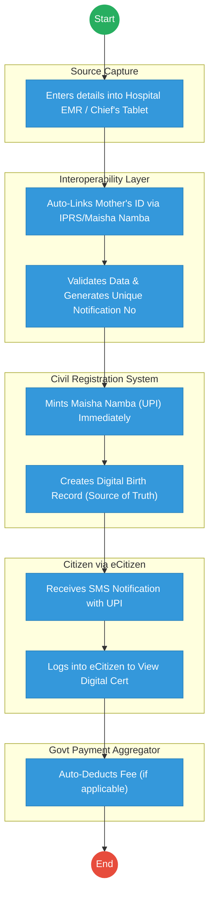

# ·       CIVIL REGISTRATION SERVICES (CRS) – Service Delivery

## Cover Page
- **Ministry/Department/Agency (MDA):** ·       CIVIL REGISTRATION SERVICES (CRS)
- **Process Name:** Service Delivery (Birth & Death Registration)
- **Document Version:** 1.3
- **Date:** 2026-02-19
- **Classification:** Official

---

## Executive Summary
Civil Registration Services (CRS) is mandated to register all births and deaths occurring in Kenya and of Kenyans abroad. It issues Birth and Death Certificates, which are the primary source documents for legal identity and succession.

---

## 1. AS-IS Process Flowchart (BPMN 2.0)
*Current State visualization (Manual/Semi-Digital).*

---

## Process Overview
### Process Name
Birth & Death Registration (Current/Late)

### Service Category
- G2C (Government to Citizen)

### Scope
- **In Scope:** Registration of births and deaths; Issuance of certificates.
- **Out of Scope:** DNA testing for disputed parentage.

### Triggers
- Birth of a child.
- Death of a person.

### End States
- **Successful:** Issuance of Birth Certificate (B3) or Death Certificate.

### Policy Context
- Births and Deaths Registration Act (Cap 149); Kenya Citizenship and Immigration Act.

---

## Stakeholders
| Stakeholder | Role | Responsibilities |
|---|---|---|
| Parent / Informant | Applicant | Reports event, provides notification. |
| Health Facility / Chief | Notifier | Issues B1 (Birth) or D1 (Death) notification. |
| CRS Registration Assistant | Processor | Data entry, verification against registers. |
| District Registrar | Approver | Signing and sealing of certificates. |

---

## Detailed Process (AS-IS)
| Step | Role | Action | Tool | Notes |
|---|---|---|---|---|
| 1 | Hospital / Health Facility / Parent | **Birth Occurs:** Child is born. If at **Hospital**: Notification issued immediately. If at **Home**: Parent must report to Assistant Chief. | Physical Presence | **Hospital Output:** Birth Notification (Serial No). **Home Output:** Chief's Acknowledgement. |
| 2 | Parent / Guardian | **Application:** Visits CRS Office or Huduma Centre with documents. **Required:** Birth Notification, Parent ID, Clinic Card, Baptism Card (Optional). | Physical Documents | *Constraint:* Must travel to office; often long queues. |
| 3 | CRS Officer | **Form B3 Issuance:** Provides "Application for Birth Certificate" (Form B3). | Paper Form | |
| 4 | Parent / Guardian | **Data Entry:** Manually fills Form B3: Child Name, DOB, Place of Birth, Father Details, Mother Details, Address. | Pen & Paper | Risk of legible errors or misspelling names. |
| 5 | CRS Registrar | **Verification:** Checks authenticity of Birth Notification and Parent ID against physical records. | Manual Check | If incomplete, parent is sent back. |
| 6 | CRS Registrar | **Manual Recording:** Captures birth details in the **Birth Register**. | Physical Ledger | This creates the official government birth record. |
| 7 | CRS Registrar | **Certificate Generation:** Processes application and prints the Birth Certificate. | Legacy Printer | Contains: Cert Number, Name, Parents, DOB, Place. |
| 8 | Parent / Guardian | **Payment:** Pays certificate fee (KES 50 - 200) for late registration or extra copies. | Cash / M-Pesa | |
| 9 | Parent / Guardian | **Collection:** Collects the official Birth Certificate. | Physical Collection | **Final Artifact:** The Foundational Identity Document used for NEMIS, ID, Passport. |

**Summary:** The process relies heavily on physical movement of parents and paper forms (B3). Data is often re-entered multiple times, leading to errors.

---

## Pain Points & Opportunities
### Pain Points
- **Double Entry:** Hospital types data, CRS officer re-types it (error prone).
- **Late Registration:** Complex, manual committee vetting for events >6 months.
- **Physical Archives:** Searching for old records in physical ledgers is slow.
- **Fraud:** Risk of fake notifications or identity theft (Ghost workers/voters).

### Opportunities
- **Hospital Integration:** API push from Hospital system directly to CRS.
- **Automated Queuing:** First-in-First-out processing.
- **Digitization:** Scanning all historical registers for searchable database.
- **IPRS Link:** Real-time validation of parent/deceased IDs.

---

## 2. TO-BE Process Flowchart (BPMN 2.0)
*Future State visualization (Repeatable WoG Platform).*

## Detailed Process (TO-BE) - Event-Driven & Automated
| Step | Role | Action | System Component | Logic / Integration |
|---|---|---|---|---|
| 1 | Health Staff / Chief | **Source Capture:** Enters birth details directly at the point of event (Hospital EMR or Chief's Tablet). | **Hospital EMR / Mobile App** | Data is captured *once*. No re-entry. |
| 2 | System | **Identity Link:** Auto-fetches Mother's details using her ID/Maisha Namba. | **IPRS / Maisha Namba** | Validates Mother's existence and citizenship instantly. |
| 3 | System | **UPI Minting:** Automatically generates **Maisha Namba (UPI)** for the newborn. | **Civil Registration System** | This UPI is permanent and pushed to NEMIS for school. |
| 4 | System | **Notification:** Sends SMS to Parent: "Birth Registered. UPI: [Number]. Click to view Cert." | **Notification Service** | Immediate feedback loop. |
| 5 | Parent | **Payment (Optional):** If a physical copy is needed, pays via Mobile Money. | **Govt Payment Aggregator** | Real-time settlement. |
| 6 | System | **Issuance:** Generates **Verifiable Digital Certificate** (QR Code) in Parent's eCitizen Locker. | **eCitizen Portal** | No need to visit CRS office. Print anytime. |

**Key Benefit:** The child leaves the hospital with a **Digital Identity (UPI)** already created. No "Late Registration" backlog.

---

## 3. Standard Data Inputs
*Required fields for the WoG Digital Service.*

### A. Birth Registration Input (B1)
| Field Name | Type | Source | Validation |
|---|---|---|---|
| Child Name | String | User Input (Hospital) | Min 3 chars |
| Date of Birth | Date | User Input (Hospital) | Cannot be future |
| Gender | Enum (M/F) | User Input | Required |
| Place of Birth | String | System (Facility Name) | Auto-filled |
| Mother's ID | String | User Input | Validated vs IPRS |
| Father's ID | String | User Input (Optional) | Validated vs IPRS |
| Notification No | String | System Generated | Unique B-Series |

### B. Death Registration Input (D1)
| Field Name | Type | Source | Validation |
|---|---|---|---|
| Deceased Name | String | System Fetch (IPRS) | Read-only |
| Deceased ID | String | User Input | Must exist in IPRS |
| Date of Death | Date | User Input | Cannot be future |
| Cause of Death | String | ICD-11 Code | Medical Personnel Only |
| Informant ID | String | User Input | Validated vs IPRS |
| Notification No | String | System Generated | Unique D-Series |

---

## References
- Births and Deaths Registration Act.
