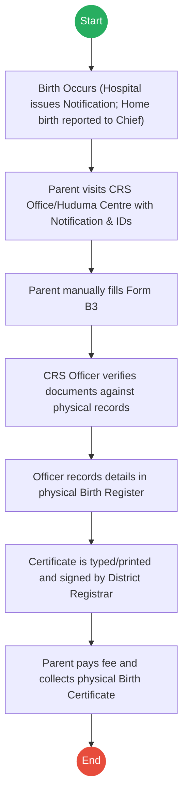
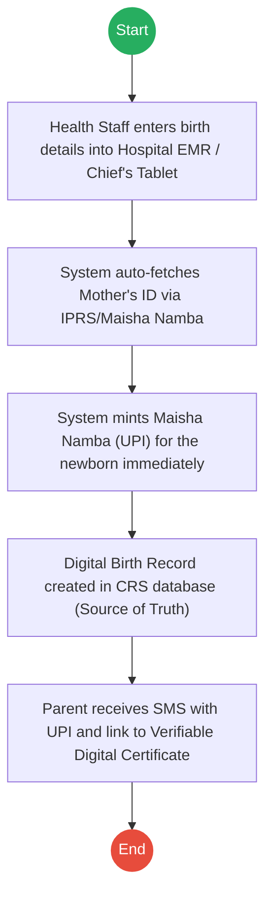
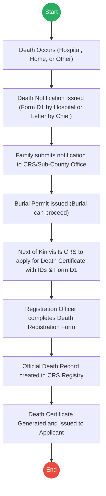
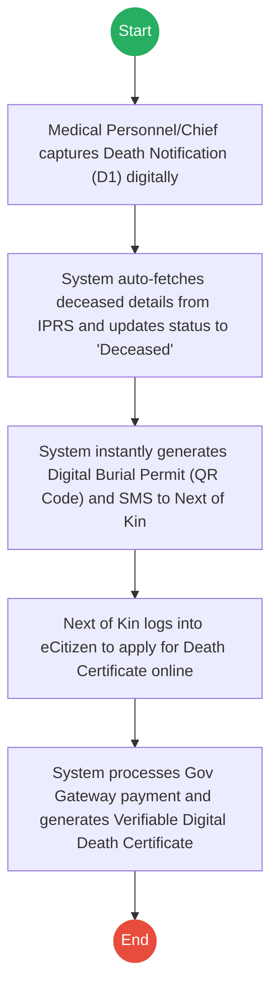

# CIVIL REGISTRATION SERVICES (CRS) – Service Delivery

## Cover Page
- **Ministry/Department/Agency (MDA):** CIVIL REGISTRATION SERVICES (CRS)
- **Process Names:** Birth Registration, Death Registration and Issuance of Death Certificate
- **Document Version:** 2.0
- **Date:** 2026-02-24
- **Classification:** Official

---

## Executive Summary
Civil Registration Services (CRS) is mandated to register all births and deaths occurring in Kenya and of Kenyans abroad. It issues Birth and Death Certificates, which are the primary source documents for legal identity, school enrollment (NEMIS), and succession/probate matters.

---

## Process 1: Birth Registration

### 1.1 AS-IS Process Flowchart (BPMN 2.0)

### 1.2 Detailed Process (AS-IS)
| Step | Role | Action | Tool/System | Notes |
|---|---|---|---|---|
| 1 | Hospital/Chief | **Birth Notification:** Hospital issues notification immediately. For home births, parent reports to Assistant Chief. | Manual | Hospital Output: Serial No. |
| 2 | Parent | **Application:** Visits CRS Office with Notification, Parent ID, Clinic Card. | Physical | Often involves long queues. |
| 3 | Parent | **Form Fill:** Manually fills "Application for Birth Certificate" (Form B3). | Pen & Paper | Prone to spelling errors. |
| 4 | CRS Officer | **Verification:** Checks authenticity of Notification and Parent ID. | Manual | |
| 5 | CRS Officer | **Recording:** Captures birth details in the physical Birth Register. | Ledger | |
| 6 | CRS Officer | **Generation:** Types and prints the Birth Certificate; signed by Registrar. | Legacy Printer | |
| 7 | Parent | **Collection:** Pays certificate fee (if late/extra) and collects physical copy. | Cash/M-Pesa | |

### 1.3 TO-BE Process (Inferred)
**Design Principles:** Source Data Capture, Instant UPI Minting, Digital Certificates.

| Step | Role | Action | System |
|---|---|---|---|
| 1 | Health Staff | **Source Capture:** Enters birth details directly at point of event. | Hospital EMR / Tablet |
| 2 | System | **Identity Link:** Auto-fetches and validates Mother's details. | IPRS / Maisha Namba |
| 3 | System | **UPI Minting:** Generates Maisha Namba (UPI) for the newborn. | Civil Registration System |
| 4 | System | **Notification:** Sends SMS to Parent with UPI and cert link. | Notification Gateway |
| 5 | Parent | **Issuance:** Views/Downloads Verifiable Digital Certificate via portal. | eCitizen Portal |

---

## Process 2: Death Registration and Issuance of Death Certificate

### 2.1 AS-IS Process Flowchart (BPMN 2.0)

### 2.2 Detailed Process (AS-IS)
| Step | Role | Action | Tool/System | Notes |
|---|---|---|---|---|
| 1 | Informant | **Death Occurs:** At hospital, home, or other location. | Physical | |
| 2 | Hospital/Chief | **Notification:** Hospital issues Form D1. Home death: Chief issues notification letter. | Paper Form | |
| 3 | Family | **Burial Permit:** Submits notification to CRS/Sub-County Office to get Burial Permit. | Manual | Burial can now legally proceed. |
| 4 | Next of Kin | **Application:** Visits CRS Office, submits Form D1, deceased's ID, and applicant's ID. | Physical | |
| 5 | CRS Officer | **Form Fill:** Records deceased's name, ID, date/place/cause of death, informant details. | Pen & Paper/System | |
| 6 | CRS Officer | **Submission:** Application is formally submitted to the Civil Registration Services. | Manual | |
| 7 | Registry | **Record Creation:** Creates Official Death Record in the registry. | Ledger/System | |
| 8 | Registry | **Generation:** System prepares the Death Certificate. | Printer | |
| 9 | Next of Kin | **Issuance:** Collects the final Death Certificate. | Physical | |

### 2.3 TO-BE Process (Inferred)
**Design Principles:** Digital Source Capture, Automated IPRS Status Update, Verifiable E-Certificates.

| Step | Role | Action | System |
|---|---|---|---|
| 1 | Medical Staff/Chief | **Source Capture:** Logs death details (ICD-11 code, date) via EMR or mobile app. | EMR / Chief's App |
| 2 | System | **IPRS Update:** Fetches ID and instantly updates IPRS status to 'Deceased' to prevent fraud. | IPRS / X-Road |
| 3 | System | **Burial Permit:** Auto-generates verifiable Digital Burial Permit (QR Code) to family. | CRS System / SMS |
| 4 | Next of Kin | **Application:** Applies for Death Certificate via eCitizen using Digital Burial Permit ID. | eCitizen Portal |
| 5 | System | **Payment:** Calculates and processes processing fees. | Gov Payment Gateway |
| 6 | System | **Issuance:** Generates and deposits Verifiable Digital Death Certificate in applicant's wallet. | Digital Registry |

---

## References
- Births and Deaths Registration Act (Cap 149).