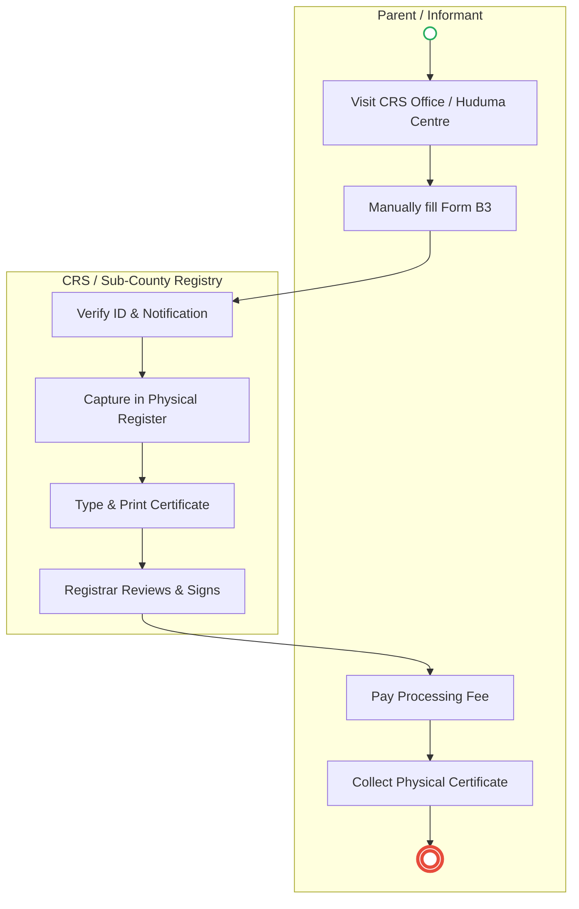
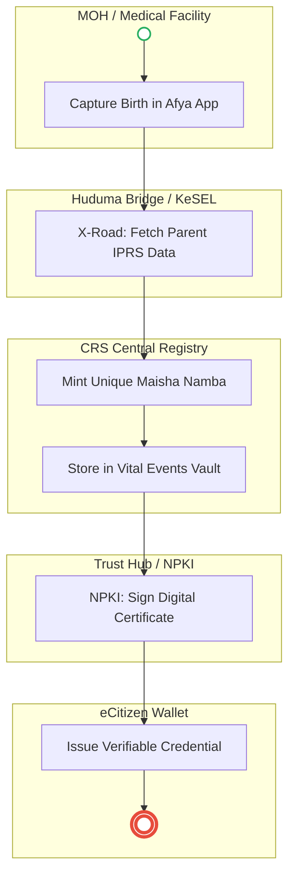
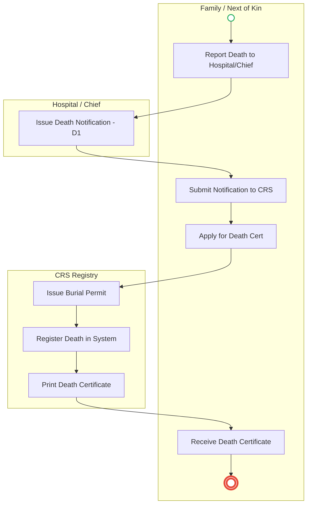
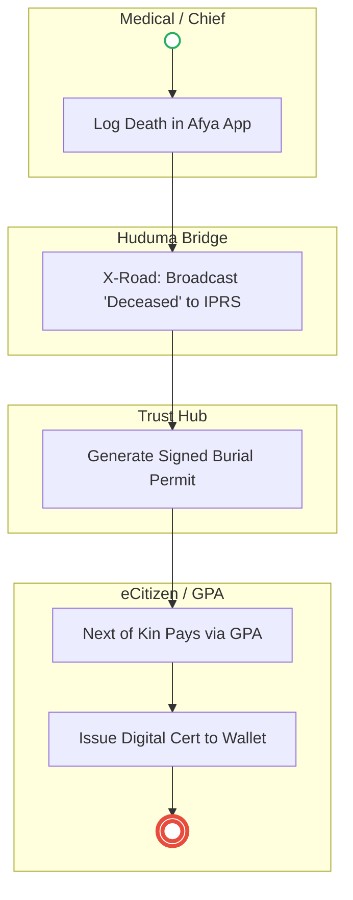

# CIVIL REGISTRATION SERVICES (CRS) – Service Delivery

## Cover Page
- **Ministry/Department/Agency (MDA):** CIVIL REGISTRATION SERVICES (CRS)
- **Process Names:** Birth Registration, Death Registration and Issuance of Death Certificate
- **Document Version:** 2.0
- **Date:** 2026-02-24
- **Classification:** Official

---

## Executive Summary
Civil Registration Services (CRS) is mandated to register all births and deaths occurring in Kenya and of Kenyans abroad. It issues Birth and Death Certificates, which are the primary source documents for legal identity, school enrollment (NEMIS), and succession/probate matters.

---

## Process 1: Birth Registration

### 1.1 AS-IS Process Flow (BPMN 2.0)

### 1.2 Detailed Process (AS-IS)
| Step | Role | Action | Tool/System | Notes |
|---|---|---|---|---|
| 1 | Hospital/Chief | **Birth Notification:** Hospital issues notification immediately. For home births, parent reports to Assistant Chief. | Manual | Hospital Output: Serial No. |
| 2 | Parent | **Application:** Visits CRS Office with Notification, Parent ID, Clinic Card. | Physical | Often involves long queues. |
| 3 | Parent | **Form Fill:** Manually fills "Application for Birth Certificate" (Form B3). | Pen & Paper | Prone to spelling errors. |
| 4 | CRS Officer | **Verification:** Checks authenticity of Notification and Parent ID. | Manual | |
| 5 | CRS Officer | **Recording:** Captures birth details in the physical Birth Register. | Ledger | |
| 6 | CRS Officer | **Generation:** Types and prints the Birth Certificate; signed by Registrar. | Legacy Printer | |
| 7 | Parent | **Collection:** Pays certificate fee (if late/extra) and collects physical copy. | Cash/M-Pesa | |

### 1.3 TO-BE Process (BPMN 2.0 - POC v2 Aligned)

| Step | Role | Action | System / Platform |
|---|---|---|---|
| 1 | Health Staff | **Event Trigger:** Capture birth details at source immediately. | MOH Afya App |
| 2 | Huduma Bridge | **Identity Pull:** Auto-verifies parent details via X-Road (Once-Only Principle). | KeSEL / IPRS |
| 3 | CRS Engine | **UPI Minting:** Assigns a permanent Maisha Namba to the infant. | Civil Registration System |
| 4 | Trust Hub | **Digital Signing:** Signs the record using National PKI (NPKI) for non-repudiation. | NPKI Service |
| 5 | Citizen | **Instant Issuance:** Accesses verifiable certificate via Mobile Wallet. | eCitizen Mobile / Wallet |

---

## Process 2: Death Registration and Issuance of Death Certificate

### 2.1 AS-IS Process Flow (BPMN 2.0)

### 2.2 Detailed Process (AS-IS)
| Step | Role | Action | Tool/System | Notes |
|---|---|---|---|---|
| 1 | Informant | **Death Occurs:** At hospital, home, or other location. | Physical | |
| 2 | Hospital/Chief | **Notification:** Hospital issues Form D1. Home death: Chief issues notification letter. | Paper Form | |
| 3 | Family | **Burial Permit:** Submits notification to CRS/Sub-County Office to get Burial Permit. | Manual | Burial can now legally proceed. |
| 4 | Next of Kin | **Application:** Visits CRS Office, submits Form D1, deceased's ID, and applicant's ID. | Physical | |
| 5 | CRS Officer | **Form Fill:** Records deceased's name, ID, date/place/cause of death, informant details. | Pen & Paper/System | |
| 6 | CRS Officer | **Submission:** Application is formally submitted to the Civil Registration Services. | Manual | |
| 7 | Registry | **Record Creation:** Creates Official Death Record in the registry. | Ledger/System | |
| 8 | Registry | **Generation:** System prepares the Death Certificate. | Printer | |
| 9 | Next of Kin | **Issuance:** Collects the final Death Certificate. | Physical | |

### 2.3 TO-BE Process (BPMN 2.0 - POC v2 Aligned)

| Step | Role | Action | System / Platform |
|---|---|---|---|
| 1 | Medical/Chief | **Event Capture:** Captures death details digitally (ICD-11 compliant). | MOH Afya App |
| 2 | Interop Layer | **Registry Sync:** Updates IPRS status; triggers downstream invalidation (KRA, NTSA). | KeSEL (X-Road) |
| 3 | Trust Hub | **Burial Auth:** Generates NPKI-signed Digital Burial Permit (QR Code). | NPKI / CRS |
| 4 | GPA | **Payment:** Processes fees via Government Payment Aggregator (revenue split). | GPA |
| 5 | Citizen | **Issuance:** Secure certificate delivered to Passport/Mobile Wallet. | eCitizen Wallet |

---

## References
- Births and Deaths Registration Act (Cap 149).