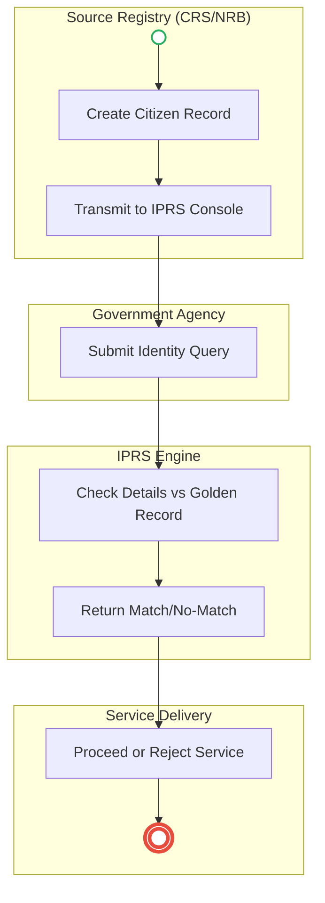
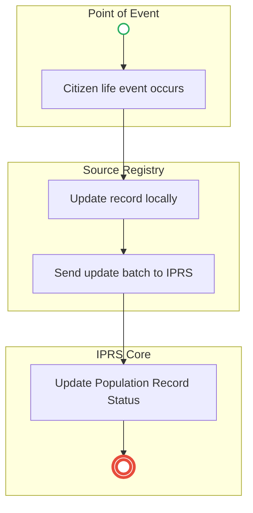
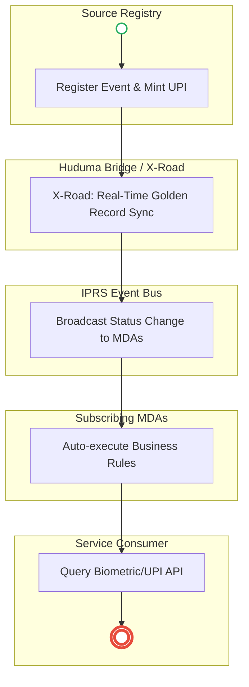

# INTEGRATED POPULATION REGISTRATION SYSTEM (IPRS) – Service Delivery

## Cover Page
- **Ministry/Department/Agency (MDA):** INTEGRATED POPULATION REGISTRATION SYSTEM (IPRS)
- **Process Names:** IPRS Identity Registration and Verification, IPRS Record Update
- **Document Version:** 2.0
- **Date:** 2026-02-24
- **Classification:** Official

---

## Executive Summary
The Integrated Population Registration System (IPRS) serves as the "Single Source of Truth" for citizen identity in Kenya. It consolidates data from primary source registries (like Civil Registration Services and the National Registration Bureau) and provides real-time identity verification services to all other government and private agencies (e.g., KRA, NTSA, NSSF, SHA).

---

## Process 1: IPRS Identity Registration and Verification

### 1.1 AS-IS Process Flow (BPMN 2.0)

### 1.2 Detailed Process (AS-IS)
| Step | Role | Action | Tool/System | Notes |
|---|---|---|---|---|
| 1 | Source Registry | **Data Creation:** Civil Registration (Birth Cert) or NRB (National ID) creates identity record and transmits to IPRS. | Primary Registries | |
| 2 | IPRS | **Storage:** Creates consolidated identity record (Name, DOB, ID No, Gender, Parents). | IPRS Database | |
| 3 | Agency | **Request:** Government institution accesses IPRS when a citizen applies for a service (e.g., Passport, PIN, DL). | Agency System | |
| 4 | Agency | **Query:** Submits query using National ID or Birth Certificate Number via secure network. | API / Portal | |
| 5 | IPRS | **Validation:** Checks submitted details against stored population records (validity, name match, DOB). | IPRS Engine | |
| 6 | IPRS | **Response:** Returns response (Match Found -> Verified OR No Match -> Rejected). | API | |
| 7 | Agency | **Action:** Continues with service provision if verified; otherwise, application is flagged/rejected. | Agency System | |

---

## Process 2: IPRS Record Update

### 2.1 AS-IS Process Flow: Life Event Sync (BPMN 2.0)

### 2.2 Detailed Process (AS-IS)
| Step | Role | Action | Tool/System | Notes |
|---|---|---|---|---|
| 1 | Source Registry | **Event Occurs:** Citizen update occurs in source systems (e.g., ID issuance, Death registration). | Primary Registries | |
| 2 | Source Registry | **Transmission:** Sends update to IPRS. | Manual/Batch API | Updates can sometimes be delayed. |
| 3 | IPRS | **Record Update:** Updates citizen record status (e.g., "ID Issued", "Citizen Deceased"). | IPRS Database | Forms the basis for blocking fraud (e.g., voting/pensions for deceased). |

**Final Output:** Verified Citizen Identity Record used as a reference across all MDAs (Passport, KRA, SHA, NSSF, NTSA, BRS, Lands).

---

## Pain Points & Opportunities
### Pain Points
- **Batch Processing Delays:** Source registries often update IPRS in batches, meaning a person marked "Deceased" today might still be "Active" in IPRS for days, allowing fraud.
- **Data Discrepancies:** Disconnects between CRS (Births) and NRB (IDs) can lead to mismatched profiles.
- **Passive Architecture:** IPRS only responds when queried. It does not actively notify other agencies when a citizen's status changes.

### Opportunities
- **Event-Driven Architecture (Pub/Sub):** IPRS should act as an active event bus, instantly broadcasting status changes (like "Deceased") to subscribing MDAs.
- **Biometric API:** Shift from simple demographic matching (Name/ID) to biometric API matching for higher security.
- **Maisha Namba (UPI):** Adopt the Unique Personal Identifier from birth to death as the primary database key.

---

### 3.1 TO-BE Process (BPMN 2.0 - POC v2 Aligned)

## Future State Process (TO-BE)
### Narrative
**TO-BE Process: Real-Time & Event-Driven IPRS**

**Design Principles:**
- Single Source of Truth (Maisha Namba / UPI)
- Real-Time API Sync (No Batch Processing)
- Event-Driven Broadcasting (Pub/Sub Model)
- Biometric Verification

### Optimized Steps (Digital)
| Step | Actor | Action | System |
|---|---|---|---|
| 1 | Source Registry | **Real-Time Capture:** Registers life event (Birth/ID/Death) and pushes data instantly. | CRS/NRB via X-Road |
| 2 | IPRS | **Instant Update:** Updates the "Golden Record" in real-time using the Maisha Namba (UPI) as the primary key. | IPRS Core Engine |
| 3 | IPRS | **Event Broadcast:** Acts as an event bus, broadcasting the status change (e.g., "Status: Deceased") to all subscribing government systems simultaneously. | Gov Event Bus |
| 4 | MDAs | **Proactive Action:** Subscribing agencies receive the broadcast and auto-execute rules (e.g., NTSA cancels DL, NSSF stops pension). | Subscribing Systems |
| 5 | Agency | **Zero-Trust Verification:** When a citizen requests a service, the agency queries IPRS via Biometric API or Maisha Namba for instant, irrefutable verification. | Agency Portal / IPRS API |

---

## References
- Registration of Persons Act.
- Data Protection Act.

---

### Validation Survey
Please provide your feedback here: [https://ee.kobotoolbox.org/x/4Ls7SlCG](https://ee.kobotoolbox.org/x/4Ls7SlCG)
