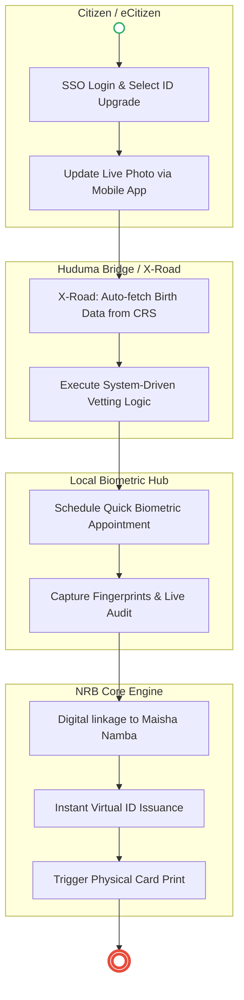

# ·       NATIONAL REGISTRATION BUREAU (NRB) – Service Delivery

## Cover Page
- **Ministry/Department/Agency (MDA):** ·       NATIONAL REGISTRATION BUREAU (NRB)
- **Process Name:** Service Delivery (National Identity Card Registration)
- **Document Version:** 1.3
- **Date:** 2026-02-19
- **Classification:** Official

---

## Executive Summary
The National Registration Bureau (NRB) is responsible for the identification and registration of all Kenyans who have attained the age of 18 years. It issues the National Identity Card (ID), which is the primary document for accessing all government and private services (banking, voting, travel).

---

### 1.1 AS-IS Process Flow (BPMN 2.0)
```mermaid
flowchart TD
    subgraph Applicant["Citizen / Applicant"]
        Start(( )) --> A1[Obtain Parent ID & Birth Cert]
        A1 --> A2[Visit Local Chief for Vetting]
        A2 --> A3[Visit NRB Registrar Office]
        A3 --> A4[Fill Physical Form REG.136A]
    end

    subgraph NRB_Officer["NRB Registrar Booth"]
        A4 --> B1[Manual Document Review]
        B1 --> B2[Capture Biometrics (Ink/Scan)]
    end

    subgraph NRB_HQ["NRB HQ / production"]
        B2 --> C1[Data Transmission to Nairobi]
        C1 --> C2[AFIS Fingerprint Matching]
        C2 --> C3[Card Production & Personalization]
    end

    subgraph Logistics["Logistics Hub"]
        C3 --> L1[Dispatch Batch to District]
        L1 --> A5[Citizen Collects Physical ID]
        A5 --> End((( )))
    end

    style Start fill:#fff,stroke:#27ae60,stroke-width:2px
    style End fill:#fff,stroke:#e74c3c,stroke-width:4px
```

---

## Process Overview
### Process Name
National Identity Card Registration (New Application & Replacement)

### Service Category
- G2C (Government to Citizen)

### Scope
- **In Scope:** Registration of Kenyans at 18; Replacement of Lost/Damaged IDs; Change of Particulars.
- **Out of Scope:** Passport issuance (Immigration); Alien ID (Immigration).

### Triggers
- Citizen turning 18 years old.
- Loss or damage of existing ID.

### End States
- **Successful:** Issuance of 2nd Generation (or Maisha) ID Card.

### Policy Context
- Registration of Persons Act (Cap 107).

---

## Stakeholders
| Stakeholder | Role | Responsibilities |
|---|---|---|
| Applicant | Applicant | Presents self for registration with required documents. |
| Chief / Assistant Chief | Vetting Authority | Confirms applicant is a resident/citizen of the area. |
| NRB Registration Officer | Processor | Vets documents, captures biometrics (Live Scan/Ink). |
| Fingerprint Expert (HQ) | Analyst | Compares fingerprints against database (AFIS). |
| Production Centre | Issuer | Prints and personalizes the ID card. |

---

## Detailed Process (AS-IS)
| Step | Role | Action | Tool | Notes |
|---|---|---|---|---|
| 1 | Citizen | **Trigger:** Reaches 18 years of age. Becomes eligible for ID. | N/A | |
| 2 | Citizen | **Visit:** Physically visits NRB Office, Chief's Camp, or Huduma Centre. | Physical Presence | Must appear in person. |
| 3 | Citizen | **Form Acquisition:** Obtains **Form REG.136A**. Fills Name, DOB, Place of Birth, Parents, Location, Occupation. | Paper Form | Manual data entry by citizen. |
| 4 | Citizen | **Submission:** Presents mandatory documents: Original Birth Cert, Copy of Birth Cert, Parent ID copies. | Physical Documents | *Constraint:* Without these, application stops. |
| 5 | Chief / Registration Officer | **Vetting:** Conducts identity vetting to confirm lineage and residence. | Manual Verification | **Outcome:** Approve, Reject, or Request more proof. Critical anti-fraud step. |
| 6 | Registration Officer | **Data Capture:** Records biographic details in the National Identity Register system. | Legacy System | |
| 7 | Registration Officer | **Biometrics:** Captures Fingerprints, Facial Photo, and Signature. | Live Scan Kit | Creates the **Biometric Identity Profile**. |
| 8 | Citizen | **Sign-off:** Signs the application form to confirm details are correct. | Pen & Paper | |
| 9 | Registration Officer | **Waiting Card:** Issues **Waiting Card (ID Waiting Slip)** with serial number. | Physical Slip | Used as temporary ID. |
| 10 | NRB HQ | **Processing:** Application sent to HQ for processing and card production. | Backend System | Card is generated with ID Number linked to biometrics. |
| 11 | Citizen | **Collection:** Returns to Registration Office with Waiting Card to collect the **National ID**. | Physical Collection | **Final Artifact:** Official Adult Identity. |

**Summary:** The process is heavily manual, involving physical forms (REG.136A), face-to-face vetting by Chiefs, and multiple physical visits.

---

## Pain Points & Opportunities
### Pain Points
- **Turnaround Time:** Takes months (sometimes >6 months) to get the ID.
- **Centralized Production:** All cards printed in Nairobi, creating a bottleneck.
- **Manual Dependencies:** Reliance on Chief's letter is prone to corruption/bribery.
- **Lost Applications:** Manual forms (136A) sometimes get lost in transit to HQ.
- **Retakes:** Poor quality fingerprints require the applicant to return and redo the process.

### Opportunities
- **Decentralized Printing:** Print IDs at County/Regional level.
- **Digital Vetting:** Integrate with Birth Certificate database (CRS) to auto-verify citizenship, removing Chief's letter for straightforward cases.
- **Online Application:** Allow pre-filling of biodata on eCitizen to reduce time at the desk.
- **Maisha Namba:** Transition to digital ID (UPI) issued at birth, upgrading to biometric at 18 without re-vetting.

---

### 2.1 TO-BE Process (BPMN 2.0 - POC v2 Aligned)


## Detailed Process (TO-BE) - Biometric Upgrade
| Step | Role | Action | System Component | Logic / Integration |
|---|---|---|---|---|
| 1 | Citizen | **Initiation:** Logs into eCitizen app using Child UPI. Selects "Upgrade to Adult ID". | **eCitizen Portal** | Authentication via UPI. |
| 2 | System | **Data Fetch:** Pulls existing Child data (Names, DOB, Parents) from CRS. | **Integration Layer (X-Road)** | Source of Truth is CRS. No manual form filling (REG.136A eliminated). |
| 3 | System | **Auto-Vetting:** Validates Citizenship. If parents are Kenyans, vetting is auto-approved. | **Rules Engine** | *Logic:* If Parent.Citizenship = Kenyan, Approve. Else, Route to Chief. |
| 4 | Citizen | **Scheduling:** Selects nearest Huduma Centre/Chief's Camp for biometric capture. | **Booking Service** | Geo-located appointment booking. |
| 5 | Registration Officer | **Capture:** Scans Citizen's QR Code. Captures Fingerprints & Live Photo. | **Biometric Kit (Tablet)** | Quick 2-minute process. No paperwork. |
| 6 | System | **Linkage:** Links new Biometrics to the existing Maisha Namba (UPI). | **IPRS / Maisha DB** | Transitions status from "Child" to "Adult". |
| 7 | System | **Issuance:** Instantly generates **Virtual ID** in Maisha Wallet. | **Digital Wallet** | Immediate usability for services. |
| 8 | NRB | **Printing:** Prints physical card (if requested) and dispatches via Posta. | **Production Centre** | Optional step for those needing physical card. |

**Key Benefit:** Eliminates the "waiting card" and manual vetting for the majority of citizens. The UPI remains the single source of truth from birth to adulthood.

---

## 3. Standard Data Inputs
*Required fields for the WoG Digital Service.*

### A. Adult ID Upgrade (Form 136-Digital)
| Field Name | Type | Source | Validation |
|---|---|---|---|
| Maisha Namba (UPI) | String | System Fetch (CRS) | Must exist & be >18 years |
| Current Photo | Image | User Capture (App) | ICAO Compliance AI Check |
| Fingerprints | Binary (WSQ) | Biometric Kit | AFIS Uniqueness Check |
| Physical Address | String | User Input | Geo-tagged |
| Mobile Number | String | User Input | Must differ from Parent |
| Signature | Image | User Capture (Pad) | Required |

---

## References
- Registration of Persons Act.
