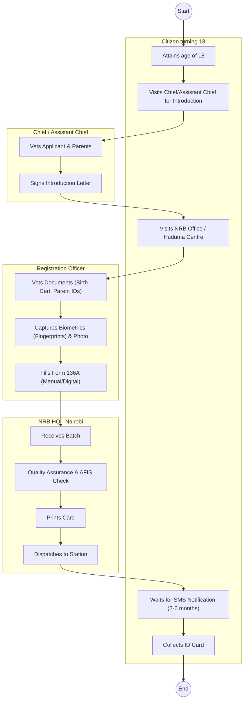
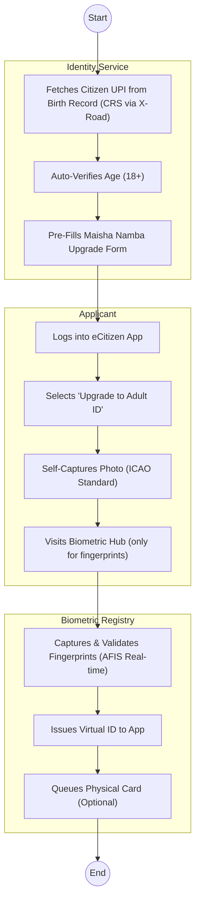

# ·       NATIONAL REGISTRATION BUREAU (NRB) – Service Delivery

## Cover Page
- **Ministry/Department/Agency (MDA):** ·       NATIONAL REGISTRATION BUREAU (NRB)
- **Process Name:** Service Delivery (National Identity Card Registration)
- **Document Version:** 1.2
- **Date:** 2026-02-19
- **Classification:** Official

---

## Executive Summary
The National Registration Bureau (NRB) is responsible for the identification and registration of all Kenyans who have attained the age of 18 years. It issues the National Identity Card (ID), which is the primary document for accessing all government and private services (banking, voting, travel).

---

## 1. AS-IS Process Flowchart (BPMN 2.0)
*Current State visualization (Semi-Manual / Fingerprint Intensive).*

---

## Process Overview
### Process Name
National Identity Card Registration (New Application & Replacement)

### Service Category
- G2C (Government to Citizen)

### Scope
- **In Scope:** Registration of Kenyans at 18; Replacement of Lost/Damaged IDs; Change of Particulars.
- **Out of Scope:** Passport issuance (Immigration); Alien ID (Immigration).

### Triggers
- Citizen turning 18 years old.
- Loss or damage of existing ID.

### End States
- **Successful:** Issuance of 2nd Generation (or Maisha) ID Card.

### Policy Context
- Registration of Persons Act (Cap 107).

---

## Stakeholders
| Stakeholder | Role | Responsibilities |
|---|---|---|
| Applicant | Applicant | Presents self for registration with required documents. |
| Chief / Assistant Chief | Vetting Authority | Confirms applicant is a resident/citizen of the area. |
| NRB Registration Officer | Processor | Vets documents, captures biometrics (Live Scan/Ink). |
| Fingerprint Expert (HQ) | Analyst | Compares fingerprints against database (AFIS). |
| Production Centre | Issuer | Prints and personalizes the ID card. |

---

## Detailed Process (AS-IS)
| Step | Role | Action | Tool | Notes |
|---|---|---|---|---|
| 1 | Applicant | **Preparation:** Obtains parents' ID copies and Birth Certificate. | Manual | Mandatory documents. |
| 2 | Chief / Assistant Chief | **Vetting:** Visits the local administrator for verification of village of origin. Chief signs the introduction letter. | Manual Letter | Crucial for border counties to prevent illegal registration. |
| 3 | Applicant | **Application:** Visits the NRB office (Registrar of Persons) or Huduma Centre. | Manual Queue | Long queues common. |
| 4 | NRB Officer | **Data Capture:** Officer verifies documents against originals. Captures 10 fingerprints (digital scanner or ink pad) and photo. Fills Form 136A. | Live Scan Kit / Form 136A | Connectivity issues often force fallback to manual forms. |
| 5 | NRB HQ | **Processing:** Data transmitted to HQ (Nairobi). 
- **AFIS:** Automated Fingerprint Identification System checks for duplicates. 
- **Production:** Card is printed. | AFIS / Production Machines | Backlogs occur frequently due to material shortages or system downtime. |
| 6 | Logistics | **Dispatch:** Cards are batched and sent back to the district registrar. | Physical Courier | Delays in transport to remote areas. |
| 7 | Applicant | **Collection:** Applicant receives SMS (sometimes), visits office to collect card. | Physical Logbook | Uncollected IDs pile up at offices. |

---

## Pain Points & Opportunities
### Pain Points
- **Turnaround Time:** Takes months (sometimes >6 months) to get the ID.
- **Centralized Production:** All cards printed in Nairobi, creating a bottleneck.
- **Manual Dependencies:** Reliance on Chief's letter is prone to corruption/bribery.
- **Lost Applications:** Manual forms (136A) sometimes get lost in transit to HQ.
- **Retakes:** Poor quality fingerprints require the applicant to return and redo the process.

### Opportunities
- **Decentralized Printing:** Print IDs at County/Regional level.
- **Digital Vetting:** Integrate with Birth Certificate database (CRS) to auto-verify citizenship, removing Chief's letter for straightforward cases.
- **Online Application:** Allow pre-filling of biodata on eCitizen to reduce time at the desk.
- **Maisha Namba:** Transition to digital ID (UPI) issued at birth, upgrading to biometric at 18 without re-vetting.

---

## 2. TO-BE Process Flowchart (BPMN 2.0)
*Future State visualization (Repeatable WoG Platform).*

## Future State Process (TO-BE)
### Narrative
The process is **Seamless** and **Digital-First**.
1.  **UPI Continuity:** The citizen's UPI (Maisha Namba) from birth is reused. No new application is needed, just an "Upgrade".
2.  **Auto-Vetting:** The platform verifies citizenship via the **IPRS/CRS Link**. Chief's letters are only required for exceptional cases (e.g., late registration without birth cert).
3.  **Self-Service:** Photo and bio-data updates are done via the **eCitizen App**.
4.  **Virtual ID:** A digital ID is issued instantly upon biometric capture to the citizen's secure wallet.
5.  **Decentralized Printing:** Physical cards (if requested) are printed at regional hubs or delivered via courier (Posta).

### Optimized Steps (Digital)
| Step | Actor | Action | System |
|---|---|---|---|
| 1 | Citizen | Upgrades status to "Adult" on eCitizen App. | eCitizen / Maisha |
| 2 | WoG Platform | Auto-verifies birth record via X-Road. | IPRS / CRS |
| 3 | Citizen | Visits local hub for quick fingerprint scan. | Biometric Kit |
| 4 | NRB System | Issues Virtual ID instantly. | Maisha Wallet |

---

## References
- Registration of Persons Act.
