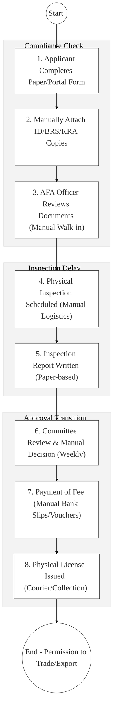
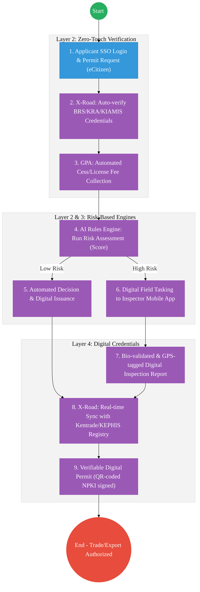

# Livestock and Food Authority – Business Process Architecture (Updated)

## Cover Page
- **Ministry:** Ministry of Agriculture and Livestock Development
- **Authority:** Agriculture and Food Authority (AFA)
- **Primary Authority:** Director General, AFA
- **Document Type:** Business Process Architecture (BPA) Standardised
- **Document Version:** 4.1
- **Date:** 2026-03-25
- **Classification:** Official
- **Strategic Category:** Priority MDA - System Anchor (Tier 1)
- **Service Model:** G2B / G2C
- **Reviewer:** Senior Government Enterprise Architect

---

## SECTION 0: SERVICE PRIORITISATION MAPPING
- **Mapped Priority Service:** Farmer Registration, Crop Licensing, and Export Permitting
- **Tier Classification:** Tier 1
- **Strategic Category:** Economy / Agriculture (Food Security)
- **Breakout Room Classification:** Room 3 (Agriculture & Economic Development)
- **Lead MDA (Standardised Name):** Livestock and Food Authority
- **Related Cross-Cutting Services:**
    - KIAMIS (Kenya Integrated Agricultural Management Information System)
    - Identity Layer (IPRS / Maisha Namba - Farmer/Trader ID)
    - X-Road (BRS / KRA / Kentrade / KEPHIS Interop)
    - Government Payment Aggregator (GPA / Cess & License Fees)
    - National EDRMS (Regulatory Document Vault)

---

## SECTION 0.1: PRIORITISATION JUSTIFICATION
This service is prioritised because the TO-BE design transforms agricultural regulation from a manual "paper-permit" system into an "Automated Agri-Trade Hub." By integrating the KIAMIS (National Farmer Registry) with BRS (Business) and KRA (Tax) via X-Road (Huduma Bridge), the design enables a "Zero-Upload" licensing experience where business ownership and tax compliance are verified instantly. This transformation eliminates the historical 14-day inspection backlog for low-risk renewals, automates cess and fee collection via the Government Payment Aggregator (GPA), and ensures that Kenyan agricultural exports (Tea, Coffee, Horticulture) are backed by verifiable digital certificates, directly boosting national food security, farmer incomes, and global export competitiveness.

| Criteria | Evidence from TO-BE Design |
| :--- | :--- |
| **Demand / Volume** | Over 7.1 million farmer profiles; thousands of export permits processed weekly. |
| **National Priority Alignment** | Agricultural Sector Transformation & Growth Strategy (ASTGS); BETA Agenda. |
| **Data Reusability** | Farmer data is the primary input for National Fertilizer Subsidy and Crop Insurance. |
| **Interoperability** | Multi-agency data pipeline between AFA, KEPHIS, and Kentrade via X-Road. |
| **Revenue / Efficiency Impact** | Automated cess collection via GPA; reduces permit processing from 14 days to <2 hours. |
| **Governance / Risk Reduction** | Digital traceability from farm to port prevents "Crop Hawking" and illegal exports. |
| **Inclusivity** | Mobile-first USSD registration ensures smallholder farmers in remote areas are profiled. |
| **Readiness** | High; KIAMIS is already operational; AFA IMIS and Kentrade are digital-ready. |

> [!NOTE]
> “The TO-BE design transforms agricultural regulation from a manual 'paper-permit' system into an 'Automated Agri-Trade Hub.' By integrating KIAMIS (Farmer Registry) with BRS and KRA via X-Road, the design enables 'Zero-Upload' licensing where business ownership and tax compliance are verified instantly. This transformation eliminates the 14-day inspection backlog for low-risk traders, automates cess and fee collection via the Government Payment Aggregator (GPA), and ensures that Kenyan agricultural exports are backed by verifiable digital certificates, directly boosting national food security and export competitiveness.”

---

# SECTION 1: SERVICE DEFINITION (STANDARDISED)

The Agriculture and Food Authority (AFA) is the primary regulatory body for the crops sector in Kenya, mandated under the **AFA Act (No. 13 of 2013)** and the **Crops Act (No. 16 of 2013)**. 

In this refactored BPA, the primary service is the **End-to-End Agri-Business Compliance & Export Lifecycle**. The objective is to move from manual physical "Document Reviews" and inspections to an **Automated Risk-Based Licensing Engine** where farmer data is pulled from **KIAMIS** and trade permits are issued as **Verifiable Digital Credentials**.

---

# SECTION 2: SERVICE CATALOGUE (NORMALISED)

| Category | Service Name | Description |
| :--- | :--- | :--- |
| **Core Services** | **Farmer Registration**| Biometric/ID-led profiling of farmers in KIAMIS (G2C). |
| | **Agri-Export Permitting** | Real-time issuance of crop export certificates (G2B). |
| **Extended Services** | **Product Trading License** | Registration of warehouses, millers, and dealers in scheduled crops. |
| | **Inspection QR Issuance** | Digital, GPS-tagged inspection reports for processing plants. |
| **Special Case Services**| **Cess Collection Payout** | Automated fee collection and revenue sharing with Counties (GPA). |
| | **Traceability Audit** | API-based tracking of crop movement from farm-gate to port. |

---

# SECTION 3: AS-IS PROCESS FLOWS (MANUAL/PAPER-LED)

Currently, licensing and permitting rely on manual document submissions and physical inspections, leading to significant delays and friction for traders.

### 3.1 AS-IS Visualization

### 3.2 Operational Reality
- **Actors:** Farmer/Trader, AFA Clerk, Inspector, Committee Members, Finance Officer.
- **Systems:** Paper Forms, AFA IMIS (Siloed), Kentrade (Disconnected), Physical Registers.
- **Pain Points:** 10-14 day delay for standard renewals; manual verification of BRS/KRA documents is prone to fraud; physical inspections for every applicant create massive backlogs; lack of real-time sync with port authorities creates bottlenecks at the border.

---

# SECTION 4: TO-BE PROCESS INTERPRETATION (NEW LAYER)

### 4.1 TO-BE Process (Automated Agri-Trade Hub)

### 4.2 Key Capabilities Introduced
*   **Automation:** Automated Risk-Based Approval – system ignores low-risk renewals, allowing officers to focus only on high-risk new applicants or flagged traders.
*   **Integration:** Multi-registry integration between **AFA**, **BRS**, **KRA**, and **Kentrade** via X-Road.
*   **Real-time Processing:** "Instant Export Clearance" – synchronization with port systems ensures that a permit issued at AFA is visible to KRA Customs in milliseconds.
*   **Digital Identity Validation:** Identity of traders and inspectors verified via **National Identity (Maisha Namba)** for tamper-proof reports.
*   **Workflow Orchestration:** Orchestrates the entire agri-trade lifecycle from farmer registration to port clearance.

### 4.3 Transformation Summary
| Dimension | AS-IS | TO-BE |
| :--- | :--- | :--- |
| **Processing** | Manual / Multi-office visits | Digital / Single-window (eCitizen) |
| **Verification** | ID/Certificate Photocopies | Live X-Road API (BRS/KRA/KIAMIS) |
| **Records** | Regional/Mail Ledgers | Unified National Crop Registry |
| **Tracking** | Post-permit physical audits | Real-time Traceability & Heatmaps |

---

# SECTION 5: SYSTEM LANDSCAPE (ALIGN TO GEA)

| Layer | System / Platform | Role |
| :--- | :--- | :--- |
| **Identity Layer** | Maisha Namba (Trader ID) | Identity and Bio-login for all formal trade and farm interaction. |
| **Interoperability** | KeSEL (X-Road) | The "Data Bridge" to KRA, BRS, KEPHIS, and Kentrade. |
| **shared Services** | KIAMIS | The authoritative registry for all farmer and crop data. |
| **Workflow / BPM** | AFA Regulatory Engine | Orchestrates risk-scoring, tasking, and permitting. |
| **Payment Layer** | GPA (Payment Gateway) | Automated Cess and regulatory fee settlement. |
| **Trust Hub** | NPKI Stamping Service | Cryptographic sealing of all digital export permits. |

---

# SECTION 6: TRANSFORMATION VALUE (CRITICAL ADDITION)

| Value Type | Explanation |
| :--- | :--- |
| **Efficiency Gain** | Permit turnaround time reduced from 14 days to <2 hours for 80% of cases. |
| **Economic Impact** | Reduces the "Cost of Doing Business" for agri-traders; improves export volumes. |
| **Governance Impact** | Absolute traceability; prevents illegal trade and revenue leakage at the port. |
| **Citizen Experience** | Farmers gain instant access to subsidies and markets via digital profiling. |
| **Interoperability Value** | Shared Agri-Registry ensures all agencies have a "Single Version of the Truth." |

---

# SECTION 7: ALIGNMENT TO WHOLE-OF-GOVERNMENT ARCHITECTURE
- **Shared Platforms:** Uses the GPA for all fee collection and Kentrade for single-window trade facilitation.
- **Registry Reuse:** Reuses KIAMIS farmer data to prevent redundant data collection by livestock or finance agencies.
- **Compliance with GEA / GIF:** Standardizing agricultural permit metadata for international interoperability (e.g., ePhyto certificates).

---

# SECTION 8: IMPLEMENTATION READINESS (NEW)
*   **Data Readiness:** High; KIAMIS contains over 7 million farmer profiles.
*   **Legal Readiness:** High; AFA and Crops Acts provide a strong regulatory framework for digitization.
*   **Institutional Readiness:** High; AFA has established digital desks and regional inspection offices.
*   **Technical Readiness:** High; Kentrade and X-Road nodes are already active for trade facilitation.

---

# SECTION 9: TRACEABILITY MATRIX (NEW)

| BPA Process | Priority Service | Tier | TO-BE Capability | National Impact |
| :--- | :--- | :--- | :--- | :--- |
| **Farmer Registry** | Profile Onboard | T1 | Maisha Namba Verified Sync | Inclusive Extension Services |
| **Risk-Based Appr.** | Permit Issuance | T1 | AI Rules Engine (Auto-approve) | Global Export Competitiveness |
| **Digital Insp.** | Compliance Track | T1 | GPS-Tagged Bio-validated App | Enhanced Food Safety Standards |
| **Cess Collection** | Revenue Settlement| T1 | GPA Integrated Payouts | Sustainable County Agriculture |

---
**[End of Standardised Business Process Architecture]**
