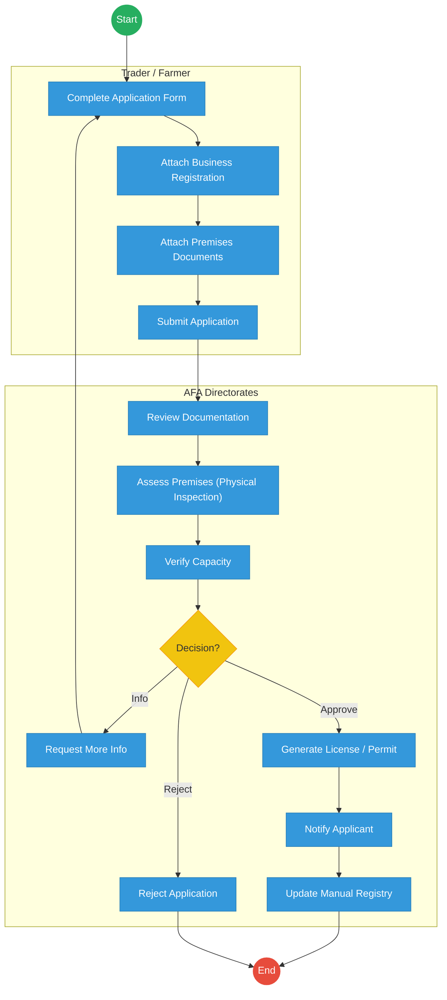
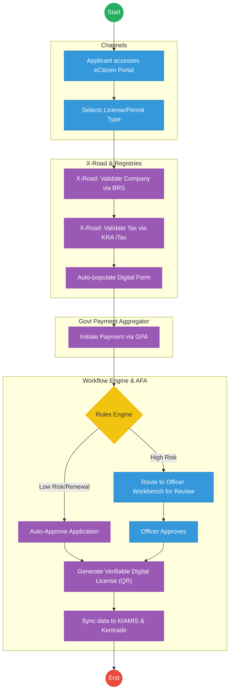

# Agriculture and Food Authority (AFA) – Service Delivery

## Cover Page
- **Ministry/Department/Agency (MDA):** Agriculture and Food Authority
- **Process Name:** Farmer Registration & Licensing
- **Document Version:** 2.1
- **Date:** 2026-02-24
- **Classification:** Official

---

## Executive Summary
The Agriculture and Food Authority (AFA) regulates, develops, and promotes scheduled crops (coffee, tea, nuts, etc.). The current manual and fragmented licensing processes lead to delays in export permits, trading licenses, and farmer registration. The transition to the Kenya DSAP Architecture aims to establish KIAMIS as the single source of truth for farmers, while integrating with BRS, KRA, and Kentrade to automate compliance and licensing.

---

## 1. AS-IS Process Flowchart (BPMN 2.0)
*Current State visualization (End-to-End AFA Services based on Deep Dive).*

---

## Process Overview
### Process Name
End-to-End Farmer Registration, Export Permits, and Trading Licenses

### Service Category
- G2B (Government to Business) / G2C (Government to Citizen)

### Scope
- **In Scope:** Farmer profiling (KIAMIS), issuing trading licenses, and approving export/import permits.
- **Out of Scope:** Customs clearance at the port (handled by KRA/Kentrade).

### Triggers
- A trader applying for a license or a farmer registering to supply scheduled crops.

### End States
- **Successful:** Verifiable Digital Trading License or Export Permit issued.

### Policy Context
- Agriculture and Food Authority Act; Crops Act.

---

## Detailed Process (AS-IS)
| Step | Role | Action | Tool/System | Notes |
|---|---|---|---|---|
| 1 | Applicant | Fills application forms for licenses or permits and attaches paper copies of BRS certificates and land documents. | Paper/Portal | High manual effort. |
| 2 | AFA Clerk | Receives and logs the application, assigning a manual reference number. | Manual Registry | |
| 3 | AFA Inspector | Travels to physically assess the applicant's premises and verify operational capacity. | Manual | Major bottleneck. |
| 4 | AFA Committee | Reviews the inspection report and documentation to make a decision (Approve/Reject/Info). | Committee | |
| 5 | AFA Admin | If approved, manually generates the license/permit and notifies the applicant. | AFA IMIS | |

---

## Pain Points & Opportunities
### Pain Points
- **Manual Verification:** Officers manually verify BRS and KRA documents, leading to fraud risks.
- **Inspection Delays:** Physical premise inspections cause massive backlogs.
- **Siloed Registries:** KIAMIS (farmers), AFA IMIS (licenses), and Kentrade (exports) are not fully integrated.

### Opportunities
- **Automated Validation:** Use KeSEL (X-Road) to validate BRS (ownership) and KRA (tax compliance) instantly.
- **Risk-Based Inspections:** Auto-approve renewals for low-risk applicants without physical visits.
- **Integrated Payments:** Shift all cess and license fees to the Government Payment Aggregator (GPA).

---

## 2. TO-BE Process Flowchart (BPMN 2.0)
*Future State visualization (Kenya DSAP Architecture - Huduma Bridge).*

## Future State Process (TO-BE)
### Narrative
**TO-BE Process: Automated Licensing via Huduma Bridge**

**Design Principles:**
- **Once-Only Principle:** BRS and KRA data is fetched automatically via APIs; applicants no longer upload paper certificates.
- **Cashless & Transparent:** All payments are unified under the GPA, ensuring immediate reconciliation and split-billing where necessary.
- **Automated Orchestration:** The Camunda workflow engine applies risk profiles to auto-approve standard renewals, reserving manual inspections only for high-risk or first-time applicants.

### Optimized Steps (Digital)
| Step | Actor | Action | System |
|---|---|---|---|
| 1 | Applicant | Logs into eCitizen and selects the required AFA service (e.g., Export Permit). | eCitizen Portal |
| 2 | System | Fetches business details from BRS and tax status from KRA instantly via X-Road. | KeSEL / X-Road |
| 3 | Applicant | Pays the required cess or license fee through unified mobile money or card options. | GPA |
| 4 | System | Rules Engine assesses risk. If low risk (e.g., renewal), it auto-approves. If high risk, routes to an inspector. | Workflow Engine |
| 5 | System | Generates a QR-coded digital license and pushes the approval status directly to the Kentrade Single Window System. | Output Generator |

---

## References
- Agriculture and Food Authority Act.
- Kenya DSAP Architecture.