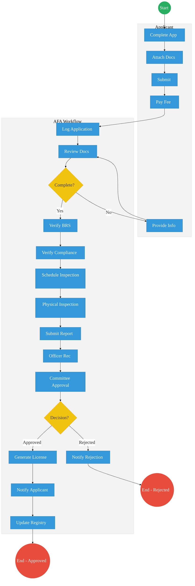

# Agriculture and Food Authority (AFA) – Service Delivery

## Cover Page
- **Ministry/Department/Agency (MDA):** Agriculture and Food Authority
- **Process Name:** Farmer Registration & Licensing
- **Document Version:** 2.1
- **Date:** 2026-03-04
- **Classification:** Official
- **Strategic Category:** Priority MDA
- **Service Model:** G2B
- **Life-Cycle Group:** Cradle to Death (4. Employment & Business)

---

## Executive Summary
The Agriculture and Food Authority (AFA) regulates, develops, and promotes scheduled crops (coffee, tea, nuts, etc.). The current manual and fragmented licensing processes lead to delays in export permits, trading licenses, and farmer registration. The transition to the Kenya DSAP Architecture aims to establish KIAMIS as the single source of truth for farmers, while integrating with BRS, KRA, and Kentrade to automate compliance and licensing.

---

## 1. AS-IS Process Flowchart (BPMN 2.0)
*Current State visualization (End-to-End AFA Services based on Deep Dive).*

---

## Process Overview
### Process Name
End-to-End Farmer Registration, Export Permits, and Trading Licenses

### Service Category
- G2B (Government to Business) / G2C (Government to Citizen)

### Scope
- **In Scope:** Farmer profiling (KIAMIS), issuing trading licenses, and approving export/import permits.
- **Out of Scope:** Customs clearance at the port (handled by KRA/Kentrade).

### Triggers
- A trader applying for a license or a farmer registering to supply scheduled crops.

### End States
- **Successful:** Verifiable Digital Trading License or Export Permit issued.

### Policy Context
- Agriculture and Food Authority Act; Crops Act.

---

## Detailed Process (AS-IS)
| Step | Role | Action | Tool/System | Notes |
|---|---|---|---|---|
| 1 | Applicant | Completes application, attaches paper copies of required documents, submits application, and pays the application fee. | Paper/Bank/Portal | High manual effort. |
| 2 | AFA Clerk | Receives and logs the application, and reviews documentation for completeness. | Manual Registry | May request more info if incomplete. |
| 3 | AFA Officer | Verifies business registration and compliance history manually. | Manual | Time-consuming verification process. |
| 4 | AFA Inspector | Schedules inspection, conducts physical premises inspection, and submits inspection report. | Manual | Major bottleneck in the process. |
| 5 | AFA Committee | Reviews the officer's recommendation and makes a final approval or rejection decision. | Committee | |
| 6 | AFA Admin | Generates license if approved, notifies the applicant of the decision, and updates the manual registry. | AFA IMIS / Manual | |

---

## Pain Points & Opportunities
### Pain Points
- **Manual Verification:** Officers manually verify BRS and KRA documents, leading to fraud risks.
- **Inspection Delays:** Physical premise inspections cause massive backlogs.
- **Siloed Registries:** KIAMIS (farmers), AFA IMIS (licenses), and Kentrade (exports) are not fully integrated.

### Opportunities
- **Automated Validation:** Use KeSEL to validate BRS (ownership) and KRA (tax compliance) instantly.
- **Risk-Based Inspections:** Auto-approve renewals for low-risk applicants without physical visits.
- **Integrated Payments:** Shift all cess and license fees to the Government Payment Aggregator (GPA).

---

## 2. TO-BE Process Flowchart (BPMN 2.0)
*Future State visualization (Kenya DSAP Architecture - Huduma Bridge).*

```mermaid
%%{init: { 'theme': 'base', 'themeVariables': { 'fontSize': '24px', 'fontFamily': 'Inter, system-ui, sans-serif', 'primaryColor': '#ffffff', 'edgeLabelBackground':'#ffffff', 'tertiaryColor': '#f3f3f3', 'mainBkg': '#ffffff', 'nodeBorder': '#333333' } } }%%
flowchart TD
    %% Events
    Start((Start))
    EndApprove(("End - Issued"))
    EndReject(("End - Rejected"))

    subgraph Applicant [Applicant]
        direction LR
        Access["Access eCitizen"] --> SelectType["Select License"]
        SelectType --> ConfirmData["Confirm Data"]
        ConfirmData --> MakePayment["Digital Payment"]
    end

    subgraph IntegrationLayer["System Integration"]
        direction LR
        ValBRS["Validate BRS"] --> ValKRA["Validate KRA"]
        ValKRA --> GetKIAMIS["Get KIAMIS Data"]
        GetKIAMIS --> AutoPop["Auto-populate"]
    end

    subgraph WorkflowEngine["Workflow Engine"]
        direction TB
        RunRisk["Run Risk Assessment"] --> RiskGateway{"Risk Level?"}
        OfficerReview["Officer Review"] --> ReviewGateway{Decision?}
    end

    subgraph InspectionWorkflow [Inspection]
        direction TB
        ScheduleInsp["Schedule Insp"] --> UploadReport["Upload Report"]
        UploadReport --> ReviewInspResult["Review Result"]
        ReviewInspResult --> InspDecisionGateway{Approved?}
    end

    subgraph LicenseIssuance [Issuance]
        direction TB
        GenDigitalLicense["Gen Digital License"] --> RegDigitalRegistry["Register License"]
        RegDigitalRegistry --> NotifyApplicantApprove["Notify Applicant"]
        NotifyApplicantApprove --> SyncKentrade["Sync Kentrade"]
    end

    %% Flow connections
    Start --> Access
    MakePayment --> ValBRS
    AutoPop --> RunRisk
    
    RiskGateway -- "Low" --> GenDigitalLicense
    RiskGateway -- "Medium" --> OfficerReview
    RiskGateway -- "High" --> ScheduleInsp
    
    %% Officer Review Path
    ReviewGateway -- "Approved" --> GenDigitalLicense
    ReviewGateway -- "Needs Insp" --> ScheduleInsp
    ReviewGateway -- "Rejected" --> NotifyReject["Notify Rejection"]
    
    %% Inspection Path
    InspDecisionGateway -- "Yes" --> GenDigitalLicense
    InspDecisionGateway -- "No" --> NotifyReject
    
    %% License Issuance Path
    SyncKentrade --> EndApprove
    
    %% Rejection Path
    NotifyReject --> EndReject

    %% Styling
    classDef startEvent fill:#27ae60,stroke:#27ae60,color:#fff,font-size:24px,font-size:24px;;
    classDef endEvent fill:#e74c3c,stroke:#e74c3c,color:#fff,font-size:24px,font-size:24px;;
    classDef userTask fill:#3498db,stroke:#2980b9,color:#fff,font-size:24px,font-size:24px;;
    classDef serviceTask fill:#9b59b6,stroke:#8e44ad,color:#fff,font-size:24px,font-size:24px;;
    classDef gateway fill:#f1c40f,stroke:#f39c12,color:#333,font-size:24px,font-size:24px;;
    
    class Start startEvent;
    class EndApprove,EndReject endEvent;
    class RiskGateway,ReviewGateway,InspDecisionGateway gateway;
    class ValBRS,ValKRA,GetKIAMIS,AutoPop,RunRisk,GenDigitalLicense,RegDigitalRegistry,NotifyApplicantApprove,SyncKentrade,NotifyReject serviceTask;
    class Access,SelectType,ConfirmData,MakePayment,OfficerReview,ScheduleInsp,UploadReport,ReviewInspResult userTask;
```

## Future State Process (TO-BE)
### Narrative
**TO-BE Process: Automated Licensing via Huduma Bridge**

**Design Principles:**
- **Registry-Centric Architecture:** KIAMIS serves as the primary registry for farmer profiling.
- **Once-Only Principle:** BRS and KRA data is fetched automatically via APIs; applicants no longer upload paper certificates.
- **Automated Compliance Verification:** Seamless validation via KeSEL integration eliminates manual documentation checks.
- **Risk-Based Decision Automation:** The workflow engine applies risk profiles to auto-approve standard low-risk renewals.
- **Exception-Based Human Review:** Manual processing and physical inspections are reserved strictly for high-risk or flagged applications.

### Optimized Steps (Digital)
| Step | Actor | Action | System |
|---|---|---|---|
| 1 | Applicant | Accesses eCitizen, selects the required license type, confirms auto-populated data, and makes digital payment. | eCitizen Portal / GPA |
| 2 | System Integration Layer | Validates business registration via BRS, checks tax compliance via KRA, retrieves farmer data from KIAMIS, and auto-populates the form. | KeSEL / BRS / KRA / KIAMIS |
| 3 | Workflow Engine | Runs risk assessment. Low-risk applications are auto-approved. Medium-risk are routed to officer review, and high-risk trigger the inspection workflow. | Workflow Engine |
| 4 | AFA Inspector / Officer | Handles exception-based reviews or physical inspections (schedules inspection, uploads report, reviews results). | AFA Workbench |
| 5 | System | Generates a digital license, registers it in the digital registry, notifies the applicant, and synchronizes the approval with Kentrade. | Output Generator / Kentrade |

---

## References
- https://afa.go.ke
- Agriculture and Food Authority Act
- Desk Review