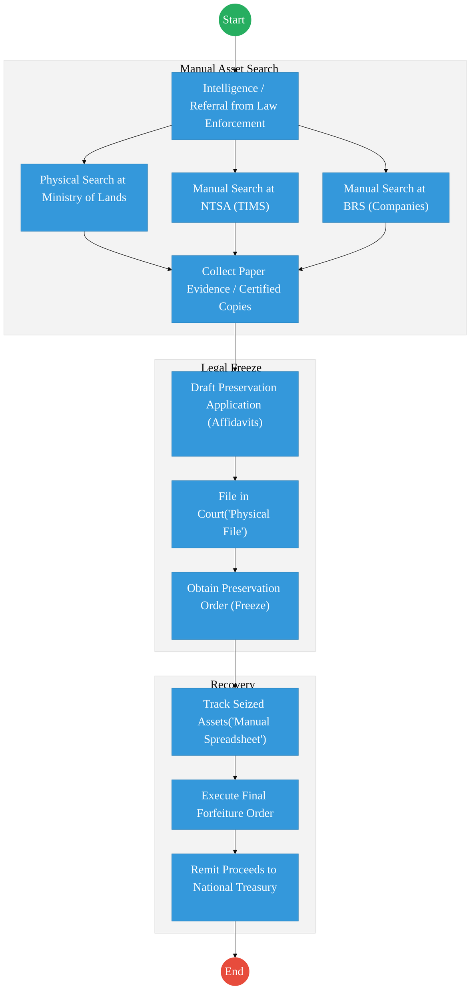
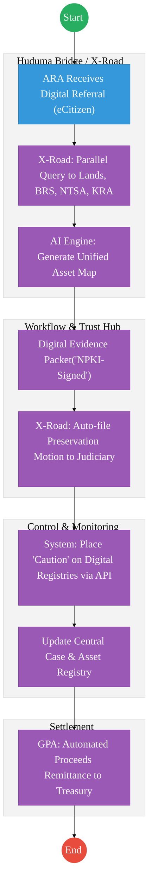

# ASSETS RECOVERY AGENCY (ARA) – Service Delivery

## Cover Page
- **Ministry/Department/Agency (MDA):** Office of the Attorney General
- **Authority:** Assets Recovery Agency (ARA)
- **Process Name:** Asset Identification, Preservation, and Forfeiture
- **Document Version:** 2.1
- **Date:** 2026-02-24
- **Classification:** Official
- **Strategic Category:** Priority MDA
- **Service Model:** G2G
- **Life-Cycle Group:** Cradle to Death (5. Social Protection & Justice)

---

## Executive Summary
The Assets Recovery Agency (ARA) is mandated to identify, trace, freeze, and recover proceeds of crime. Currently, the evidence management process is heavily reliant on physical files and manual tracking across different registries (Lands, NTSA, BRS). The transition to the Kenya DSAP Architecture aims to establish a central "Case and Evidence Registry" integrated with national foundational registries via X-Road to enable real-time asset tracing.

---

## 1. AS-IS Process Flowchart (BPMN 2.0)
*Current State visualization (Asset Tracing and Recovery).*

---

## Process Overview
### Process Name
Asset Identification, Tracing, and Forfeiture Lifecycle

### Service Category
- G2G (Government to Government - Judiciary/MDAs)

### Scope
- **In Scope:** Tracing of suspect assets, obtaining court orders, managing seized assets, and final forfeiture to the state.
- **Out of Scope:** The actual investigation of the predicate crime (handled by DCI/EACC).

### Triggers
- A formal referral from an investigative agency or a suspicious transaction report (STR).

### End States
- **Successful:** Proceeds of crime recovered and remitted to the state.

### Policy Context
- Proceeds of Crime and Anti-Money Laundering Act (POCAMLA); Data Protection Act 2019.

---

## Detailed Process (AS-IS)
| Step | Role | Action | Tool/System | Notes |
|---|---|---|---|---|
| 1 | Investigator | Receives a lead and sends physical requests to NTSA, Lands, and BRS to find assets owned by a suspect. | Physical Letters | Slow and prone to leakage. |
| 2 | MDA Clerk | Searches their local database and provides certified paper copies of ownership documents. | Manual | |
| 3 | ARA Legal | Prepares court affidavits manually, attaching the paper evidence collected. | Manual/Word | |
| 4 | ARA Officer | Tracks the location and status of seized vehicles/properties in a local Excel sheet. | Excel | |
| 5 | Finance | Remits funds from liquidated assets to the National Treasury via IFMIS. | Manual Entry | |

---

## Pain Points & Opportunities
### Pain Points
- **Tracing Lag:** Assets are often moved or sold before ARA can obtain ownership data from siloed registries.
- **Evidence Integrity:** Physical documents can be lost, stolen, or altered during the long tracing process.
- **Resource Fragmentation:** No unified view of all assets associated with a specific "Maisha Namba" across government.

### Opportunities
- **Instant Asset Discovery:** Using **X-Road** to query Lands (Ardhisasa), NTSA, and BRS simultaneously to see a suspect's full "Wealth Map" in seconds.
- **Digital Evidence Vault:** All ownership records fetched via the **Huduma Bridge** are digitally signed (NPKI), serving as immutable evidence for court.
- **Blockchain for Seized Assets:** Using a private ledger to track every seized asset (serial numbers, GPS locations) from "Freeze" to "Liquidation."

---

## 2. TO-BE Process Flowchart (BPMN 2.0)
*Future State visualization (Kenya DSAP Architecture - Huduma Bridge).*

## Future State Process (TO-BE)
### Narrative
**TO-BE Process: Rapid Digital Asset Recovery**

**Design Principles:**
- **Zero-Latency Tracing:** The **Huduma Bridge** enables ARA to see all assets linked to a National ID or PIN across all government databases in real-time.
- **Non-Repudiable Evidence:** Records retrieved via **KeSEL (X-Road)** are authenticated by the issuing agency's **NPKI** server, removing the need for manual certification.
- **Instant Freezing:** Once a court order is issued digitally, the **Workflow Engine** pings the relevant registries (Lands/NTSA) to place an instant digital "Caution" on the assets, preventing their sale.

### Optimized Steps (Digital)
| Step | Actor | Action | System |
|---|---|---|---|
| 1 | ARA Analyst | Inputs a suspect's Maisha Namba into the ARA Investigation Portal. | ARA Portal |
| 2 | System | Instantly pings BRS, NTSA, and Ardhisasa via X-Road to list all assets. | KeSEL / X-Road |
| 3 | System | Compiles a digitally signed evidence packet and routes it to the Judiciary Case Management System. | Huduma Bridge / Judiciary API |
| 4 | System | Upon the Judge's digital signature, the system auto-locks the asset records in the source registries. | Workflow Engine |
| 5 | System | Automatically reconciles the proceeds from forfeited assets and remits them to the National Treasury via the GPA. | GPA / IFMIS |

---

## References
- https://ara.go.ke
- Proceeds of Crime and Anti-Money Laundering Act
- Desk Review

---

### Validation Survey
Please provide your feedback here: [https://ee.kobotoolbox.org/x/4Ls7SlCG](https://ee.kobotoolbox.org/x/4Ls7SlCG)

