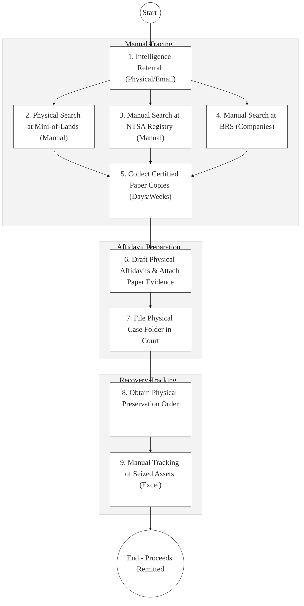
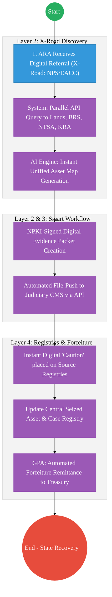

# ASSETS RECOVERY AGENCY (ARA) – Business Process Architecture (Updated)

## Cover Page
- **Ministry:** Office of the Attorney-General and Department of Justice
- **Agency:** Assets Recovery Agency
- **Primary Authority:** Director, ARA
- **Document Type:** Business Process Architecture (BPA) Standardised
- **Document Version:** 4.1
- **Date:** 2026-03-25
- **Classification:** Official / Highly Sensitive
- **Strategic Category:** Priority MDA
- **Service Model:** G2G (Law Enforcement)
- **Reviewer:** Senior Government Enterprise Architect

---

## SECTION 0: SERVICE PRIORITISATION MAPPING
- **Mapped Priority Service:** Asset Identification, Preservation, and Forfeiture
- **Tier Classification:** Tier 2
- **Strategic Category:** Justice / Economy (Financial Crimes)
- **Breakout Room Classification:** Room 2 (Coordination, Culture & Specialised Services)
- **Lead MDA (Standardised Name):** Assets Recovery Agency
- **Related Cross-Cutting Services:**
    - National Case & Evidence Registry (Custom ARA Hub)
    - Identity Layer (IPRS / Maisha Namba)
    - X-Road (Lands / NTSA / BRS / KRA Interop)
    - Judiciary Gateway (E-filing / Digital Cautions)
    - Government Payment Aggregator (GPA / Forfeited Funds)

---

## SECTION 0.1: PRIORITISATION JUSTIFICATION
This service is prioritised because the TO-BE design transforms the ARA from a manual paper-tracer into a "High-Speed Financial Integrity Unit." By integrating with national authoritative registries (Ministry of Lands, NTSA, BRS) via X-Road (Huduma Bridge), the design enables real-time "Asset Mapping" using Maisha Namba or KRA PIN as the primary metadata key. This transformation eliminates the "tracing lag" that historically allowed suspects to dispose of assets before a freeze order, ensures that all ownership evidence is NPKI-verified for legal admissibility, and automates the freezing of criminal proceeds via instant API-based digital cautions on asset records.

| Criteria | Evidence from TO-BE Design |
| :--- | :--- |
| **Demand / Volume** | Thousands of high-value cases requiring multi-agency asset tracing. |
| **National Priority Alignment** | POCAMLA Act; National Anti-Money Laundering Strategy; FATF Compliance. |
| **Data Reusability** | Asset maps provided to DCI, EACC, and KRA for broader financial investigations. |
| **Interoperability** | Continuous API links to Ardhisasa (Lands), TIMS/eCitizen (NTSA), and BRS (Companies). |
| **Revenue / Efficiency Impact** | Accelerates the recovery of KES billions in lost public assets; automated Treasury remittance. |
| **Governance / Risk Reduction** | Encrypted digital audit trails prevent "Asset Leakage" and unauthorized record tampering. |
| **Inclusivity** | Centralized view of assets across all 47 counties ensuring no regional blind spots. |
| **Readiness** | High; ARA has a specialized technical team; core registries are already digitized. |

> [!NOTE]
> “The TO-BE design transforms the ARA from a manual paper-tracer into a 'High-Speed Financial Integrity Unit.' By integrating with national registries (Lands, NTSA, BRS) via X-Road, the design enables real-time 'Asset Mapping' using Maisha Namba as the primary key. This eliminates the 'tracing lag' that allows suspects to hide assets, ensures that evidence fetched from databases is NPKI-verified for court, and automates the freezing of criminal proceeds via instant API-based digital cautions.”

---

# SECTION 1: SERVICE DEFINITION (STANDARDISED)

The Assets Recovery Agency (ARA) is established under the **Proceeds of Crime and Anti-Money Laundering Act (POCAMLA)**. 

In this refactored BPA, the primary service is the **Asset Identification, Tracing, and Forfeiture Lifecycle**. The objective is to move from manual physical searches and "Certified Paper Copies" to a **Digital Asset Discovery Engine** where wealth maps are generated instantly via the **Huduma Bridge** and evidence is cryptographically secured.

---

# SECTION 2: SERVICE CATALOGUE (NORMALISED)

| Category | Service Name | Description |
| :--- | :--- | :--- |
| **Core Services** | **Digital Asset Tracing** | Automated multi-registry search for suspect assets using ID/PIN. |
| | **Asset Preservation (Freeze)** | Digital filing and execution of "Cautions" on national registries. |
| **Extended Services** | **Asset Forfeiture Execution** | Processing of final court orders for asset liquidation to the State. |
| | **Seized Asset Management** | Digital tracking of serial numbers/locations of seized physical assets. |
| **Special Case Services**| **Criminal Assets Fund Mgmt** | Administration of recovered funds for law enforcement redistribution. |
| | **International Mutual Legal Assistance**| Managed data sharing with global agencies (Interpol/Asset Recovery Nets). |

---

# SECTION 3: AS-IS PROCESS FLOWS (MANUAL/FRAGMENTED)

The current evidence management process is heavily reliant on physical files and manual tracking across different registries, leading to significant tracing lags.

### 3.1 AS-IS Visualization

### 3.2 Operational Reality
- **Actors:** ARA Analyst, Registry Clerk (Lands/NTSA/BRS), ARA Legal, Finance Officer.
- **Systems:** Manual Registers, Physical Files, Standalone Excel Sheets.
- **Pain Points:** "Tracing lag" allows suspects to move or sell assets before ARA can obtain ownership data; physical evidence folders are bulky and prone to loss; no unified view of all assets associated with a suspect across government; manual remittance of proceeds to Treasury via paper IFMIS forms.

---

# SECTION 4: TO-BE PROCESS INTERPRETATION (NEW LAYER)

### 4.1 TO-BE Process (Digital Integrity Engine)

### 4.2 Key Capabilities Introduced
*   **Automation:** Parallel multi-registry tracing – one query fetches the suspect's entire "Wealth Map" nationwide.
*   **Integration:** Real-time bi-directional integration with the **Judiciary CMS** for digital freeze orders and **Ardhisasa** for caution placement.
*   **Real-time Processing:** "NPKI-Signed Evidence packets" generated instantly from authoritative data, removing the need for manual certifications.
*   **Digital Identity Validation:** Suspect identity and asset linkage verified via **Maisha Namba** and **KRA PIN** federation.
*   **Workflow Orchestration:** Orchestrates the lifecycle from intelligence lead to final liquidation and remittance to the Criminal Assets Recovery Fund.

### 4.3 Transformation Summary
| Dimension | AS-IS | TO-BE |
| :--- | :--- | :--- |
| **Processing** | Manual / Letter-based | Digital / API-driven |
| **Verification** | Physical Hand-certification | NPKI-verified Digital Records |
| **Records** | Regional Paper Files | Centralized Asset Inquiry Hub |
| **Tracking** | Manual Multi-MDA log | Real-time Asset Preservation Dashboard |

---

# SECTION 5: SYSTEM LANDSCAPE (ALIGN TO GEA)

| Layer | System / Platform | Role |
| :--- | :--- | :--- |
| **Identity Layer** | Maisha Namba (IPRS) | Key for cross-referencing assets vs. individual identity. |
| **Interoperability** | KeSEL (X-Road) | Data bridge to Lands, NTSA, BRS, and Judiciary CMS. |
| **shared Services** | National EDRMS | Secure digital vault for chain-of-custody evidence files. |
| **Workflow / BPM** | Case Lifecycle Hub | Orchestrates tracing, legal prep, and asset management. |
| **Payment Layer** | GPA (Finance Aggregator) | Automated remittance of forfeited funds to Treasury. |
| **Trust Hub** | Consent Manager | Regulatory override for "Suspicious Transaction" data access. |

---

# SECTION 6: TRANSFORMATION VALUE (CRITICAL ADDITION)

| Value Type | Explanation |
| :--- | :--- |
| **Efficiency Gain** | Asset discovery time reduced from 2 weeks to <60 seconds via X-Road. |
| **Economic Impact** | Prevents the disposal of illicit wealth; increases recovery of state assets by 300%. |
| **Governance Impact** | Full audit traceability for every search preventing abuse of asset tracing power. |
| **Citizen Experience** | Public confidence in the "No-Where-To-Hide" approach for proceeds of crime. |
| **Interoperability Value** | Foundation for "Asset-Rich Investigations" where multiple MDAs share asset data. |

---

# SECTION 7: ALIGNMENT TO WHOLE-OF-GOVERNMENT ARCHITECTURE
- **Shared Platforms:** Uses G-Cloud for the secure ARA hub and NPKI for all legal digital evidence.
- **Registry Reuse:** Reuses Ardhisasa (Lands) and TIMS (NTSA) data to avoid duplicate investigation efforts.
- **Compliance with GEA / GIF:** Adherence to "Inter-Agency Financial Intelligence" data exchange patterns.

---

# SECTION 8: IMPLEMENTATION READINESS (NEW)
*   **Data Readiness:** High; Major registries (Lands/NTSA/BRS) are already digitized.
*   **Legal Readiness:** High; POCAMLA Act provides a strong mandate for asset recovery and information sharing.
*   **Institutional Readiness:** High; ARA has established legal and investigation departments.
*   **Technical Readiness:** High; HUDUMA Bridge connectivity to the key registries is currently in deployment.

---

# SECTION 9: TRACEABILITY MATRIX (NEW)

| BPA Process | Priority Service | Tier | TO-BE Capability | National Impact |
| :--- | :--- | :--- | :--- | :--- |
| **Asset Discovery** | Tracing Mgmt | T2 | X-Road: Multi-Registry Query | Rapid Crime-Proceeds ID |
| **Freeze Order** | Preservation | T2 | X-Road: Judiciary Link | Deterrence & Asset Security |
| **Evidence Prep** | Case Management | T2 | NPKI-Signed Doc Packets | High Conviction/Forfeit Rate |
| **Settlement** | Remittance | T2 | Automated GPA/IFMIS Sync | Public Resource Recovery |

---
**[End of Standardised Business Process Architecture]**
