# Athi Water Works Development Agency (AWWDA)
 
## Cover Page
- **Ministry/Department/Agency (MDA):** Athi Water Works Development Agency (AWWDA) — Ministry of Water, Sanitation and Irrigation
- **Process Name:** Water Infrastructure & Operations Digitization
- **Document Version:** 1.0
- **Date:** 2026-03-18
- **Classification:** Official
- **Strategic Category:** Priority MDA
- **Service Model:** G2B / G2C
- **Life-Cycle Group:** Cradle to Death (3. Living & Working)
 
---
 
## Executive Summary
Athi Water Works Development Agency (AWWDA) is responsible for the development, rehabilitation, and operation of water and sanitation infrastructure in Kenya's greater Nairobi and Coast regions, serving millions of citizens and industrial consumers. AWWDA's core service delivery spans three operational domains: infrastructure planning, design and development; water operations including raw water abstraction, treatment, and bulk transmission; and environmental compliance covering permits, health and safety, and climate change.
 
Currently, these twelve inter-connected processes are managed through paper-based workflows, spreadsheets, and fragmented departmental systems with no central digital backbone. This leads to delays in infrastructure approvals, manual compliance tracking, reactive rather than predictive operations, and an inability to provide real-time service performance data to regulators and the public.
 
The transition to the Kenya DSAP Architecture aims to digitize all twelve core processes through a unified AWWDA Digital Operations Platform — integrating with PIMIS, KRA, NEMA, WRMA, and the Government Payment Aggregator (GPA) to automate approvals, compliance monitoring, and bulk water billing.
 
---
 
## Part 1 — Infrastructure
 
### 1.1 Infrastructure Planning
 
#### 1. AS-IS Process Flowchart (BPMN 2.0)
*Current State — Infrastructure Planning Process*
 
```mermaid
%%{init: { 'theme': 'base', 'themeVariables': { 'fontSize': '24px', 'fontFamily': 'Inter, system-ui, sans-serif', 'primaryColor': '#ffffff', 'edgeLabelBackground':'#ffffff', 'tertiaryColor': '#f3f3f3', 'mainBkg': '#ffffff', 'nodeBorder': '#333333' } } }%%
flowchart TD
    Start((Start))
    EndApprove(("End - Approved\nInvestment Pipeline"))
 
    IdentifyGaps["Identify Service Gaps\nand Infrastructure Needs"]
    CollectData["Collect and Analyze\nPlanning and Demand Data"]
    DevelopConcept["Develop Concept Notes\nand Investment Proposals"]
    CEOReviewConcept{"CEO Review and\nApproval of Concept\nNote / PIMIS"}
    TechnicalSurveys["Undertake Required\nTechnical Surveys\nand Analysis"]
    PreparePlans["Prepare Master Plans,\nFeasibility Study,\nConceptual and Preliminary\nDesigns + Internal Tech Review"]
    ReviewCEO{"Review and Approval\nby CEO of FS, MP\nand IP / PIMIS"}
    SubmitPIMIS["Submit to PIMIS\nand Prioritize Projects"]
    AlignFrameworks["Align Projects with\nStrategic and\nFinancing Frameworks"]
    CEOPipeline{"CEO Approval of\nPrioritized Investment\nPipeline"}
    DonorEngagement["Donor Engagement\nand Financing Arrangement"]
 
    Start --> IdentifyGaps
    IdentifyGaps --> CollectData
    CollectData --> DevelopConcept
    DevelopConcept --> CEOReviewConcept
 
    CEOReviewConcept -- "No" --> DevelopConcept
    CEOReviewConcept -- "Yes" --> TechnicalSurveys
 
    TechnicalSurveys --> PreparePlans
    PreparePlans --> ReviewCEO
 
    ReviewCEO -- "No" --> PreparePlans
    ReviewCEO -- "Yes" --> SubmitPIMIS
 
    SubmitPIMIS --> AlignFrameworks
    AlignFrameworks --> CEOPipeline
 
    CEOPipeline -- "No" --> AlignFrameworks
    CEOPipeline -- "Yes" --> DonorEngagement
 
    DonorEngagement --> EndApprove
 
    classDef startEvent fill:#27ae60,stroke:#27ae60,color:#fff,font-size:24px;
    classDef endEvent fill:#e74c3c,stroke:#e74c3c,color:#fff,font-size:24px;
    classDef userTask fill:#3498db,stroke:#2980b9,color:#fff,font-size:24px;
    classDef gateway fill:#f1c40f,stroke:#f39c12,color:#333,font-size:24px;
 
    class Start startEvent;
    class EndApprove endEvent;
    class CEOReviewConcept,ReviewCEO,CEOPipeline gateway;
    class IdentifyGaps,CollectData,DevelopConcept,TechnicalSurveys,PreparePlans,SubmitPIMIS,AlignFrameworks,DonorEngagement userTask;
```
 
#### Detailed Process (AS-IS)
 
| Step | Role | Action | Tool/System | Notes |
|---|---|---|---|---|
| 1 | Planning Officer | Identifies service gaps and infrastructure needs across the service area. | Manual Surveys / Spreadsheets | No centralised demand data platform. Gap identification is periodic and reactive. |
| 2 | Planning Officer | Collects and analyses planning and demand data to inform investment priorities. | Excel / Internal Reports | Data siloed across county and regional offices. No real-time analytics. |
| 3 | Planning Team | Develops concept notes and investment proposals for identified projects. | MS Word / Manual | Version control issues; no collaborative drafting tool. |
| 4 | CEO | Reviews and approves concept notes and PIMIS submissions. If rejected, team revises. | PIMIS / Manual | PIMIS integration partial; approvals not tracked digitally end-to-end. |
| 5 | Technical Team | Undertakes technical surveys and analysis for approved concept notes. | Manual / Outsourced | Survey scheduling untracked; reports submitted in hard copy. |
| 6 | Technical Team | Prepares Master Plans, Feasibility Studies, Conceptual and Preliminary Designs with internal technical review. | AutoCAD / Word / Manual | No central document repository. Review cycles cause delays of 4–12 weeks. |
| 7 | CEO / FS / MP | Reviews and approves Feasibility Studies, Master Plans, and Investment Proposals. | PIMIS / Manual | Multi-level approvals with no digital workflow or SLA tracking. |
| 8 | Planning Team | Submits approved projects to PIMIS and prioritises the investment pipeline. | PIMIS | PIMIS data entry manual; synchronisation with internal planning spreadsheets is error-prone. |
| 9 | CEO | Approves the prioritised investment pipeline. | Manual / Committee | No automated alignment check against strategic and financing frameworks. |
| 10 | Finance / Planning | Engages donors and finalises financing arrangements for approved pipeline. | Manual / Email | No digital deal tracking or financing workflow. |
 
#### Pain Points & Opportunities
##### Pain Points
- **No Demand Analytics Platform:** Service gap identification relies on periodic manual surveys with no live data feed from the distribution network or SCADA systems.
- **Fragmented Document Management:** Master plans, feasibility studies, and concept notes are stored across individual workstations with no version control or central repository.
- **Manual PIMIS Entry:** Investment data is entered into PIMIS manually after decisions are made, introducing transcription errors and lag in the national pipeline.
- **Untracked Approval Cycles:** Multi-level CEO and committee approvals have no digital audit trail, SLA enforcement, or escalation mechanism.
 
##### Opportunities
- **Integrated Demand Analytics:** Connect SCADA, customer complaint data, and WSP reporting into a live demand intelligence dashboard to trigger evidence-based planning.
- **Digital Document Repository:** Implement a centralised project document management system with version control, automated review routing, and e-signature approvals.
- **PIMIS API Integration:** Auto-populate PIMIS from the internal project system on approval, eliminating manual re-entry.
- **Digital Approval Workflow:** Route all CEO and committee approvals through a digital workflow engine with SLA tracking and automatic escalation.
 
---
 
#### 2. TO-BE Process Flowchart (BPMN 2.0)
*Future State — Infrastructure Planning (Kenya DSAP Architecture)*
 
```mermaid
%%{init: { 'theme': 'base', 'themeVariables': { 'fontSize': '24px', 'fontFamily': 'Inter, system-ui, sans-serif', 'primaryColor': '#ffffff', 'edgeLabelBackground':'#ffffff', 'tertiaryColor': '#f3f3f3', 'mainBkg': '#ffffff', 'nodeBorder': '#333333' } } }%%
flowchart TD
    Start((Start))
    EndApprove(("End - Approved\nInvestment Pipeline"))
 
    subgraph Analytics["Demand Intelligence"]
        direction LR
        LiveData["Live SCADA +\nCustomer Data Feed"]
        GapAlert["Automated Gap\nAlert Generated"]
    end
 
    subgraph Planning["Digital Planning Workflow"]
        direction TB
        DraftConcept["Draft Concept Note\n(Collaborative Portal)"]
        AutoPIMIS["Auto-submit to PIMIS\nvia API"]
        DigitalReview{"CEO Digital\nApproval?"}
        DigitalSurveys["Commission Surveys\n(Geo-tagged + Digital Reports)"]
        PrepareDesigns["Prepare Plans / FS / PD\n(Central Repository)"]
        TechReviewGateway{"Technical Review\nApproval?"}
        PrioritisePipeline["Auto-prioritise Pipeline\n(Scoring Engine)"]
        PipelineApproval{"CEO Digital\nPipeline Approval?"}
        DonorPortal["Donor Engagement\n(Digital Financing Portal)"]
    end
 
    Start --> LiveData
    LiveData --> GapAlert
    GapAlert --> DraftConcept
    DraftConcept --> AutoPIMIS
    AutoPIMIS --> DigitalReview
 
    DigitalReview -- "Rejected" --> DraftConcept
    DigitalReview -- "Approved" --> DigitalSurveys
 
    DigitalSurveys --> PrepareDesigns
    PrepareDesigns --> TechReviewGateway
 
    TechReviewGateway -- "Revision Required" --> PrepareDesigns
    TechReviewGateway -- "Approved" --> PrioritisePipeline
 
    PrioritisePipeline --> PipelineApproval
    PipelineApproval -- "Rejected" --> PrioritisePipeline
    PipelineApproval -- "Approved" --> DonorPortal
 
    DonorPortal --> EndApprove
 
    classDef startEvent fill:#27ae60,stroke:#27ae60,color:#fff,font-size:24px;
    classDef endEvent fill:#e74c3c,stroke:#e74c3c,color:#fff,font-size:24px;
    classDef userTask fill:#3498db,stroke:#2980b9,color:#fff,font-size:24px;
    classDef serviceTask fill:#9b59b6,stroke:#8e44ad,color:#fff,font-size:24px;
    classDef gateway fill:#f1c40f,stroke:#f39c12,color:#333,font-size:24px;
 
    class Start startEvent;
    class EndApprove endEvent;
    class DigitalReview,TechReviewGateway,PipelineApproval gateway;
    class LiveData,GapAlert,AutoPIMIS serviceTask;
    class DraftConcept,DigitalSurveys,PrepareDesigns,PrioritisePipeline,DonorPortal userTask;
```
 
##### Optimized Steps (Digital)
 
| Step | Actor | Action | System |
|---|---|---|---|
| 1 | System | Live SCADA, customer complaint, and WSP data feeds trigger automated gap alerts when thresholds are breached. | AWWDA Analytics Platform / SCADA |
| 2 | Planning Officer | Drafts concept note in the collaborative digital planning portal; data auto-populated from demand analytics. | AWWDA Planning Portal / PIMIS API |
| 3 | CEO | Receives digital approval request with SLA countdown. Approves or returns with comments. Decision logged with timestamp. | Digital Approval Workflow Engine |
| 4 | Technical Team | Commissions geo-tagged surveys via the mobile field app; reports uploaded digitally to the central repository. | AWWDA Field App / Document Repository |
| 5 | Technical Team | Prepares Master Plans, FS, and Preliminary Designs in the central repository. Peer review routed automatically. | Central Document Repository / e-Signature |
| 6 | System | Scoring engine auto-prioritises pipeline based on defined strategic criteria. Aligned against financing frameworks automatically. | AWWDA Pipeline Engine / PIMIS API |
| 7 | CEO | Reviews and digitally approves the prioritised investment pipeline. Approval auto-syncs to PIMIS. | Digital Approval Workflow / PIMIS |
| 8 | Finance | Engages donors through the digital financing portal; deal status tracked in real time. | Financing Portal / CRM |
 
---
 
### 1.2 Infrastructure Design
 
#### 1. AS-IS Process Flowchart (BPMN 2.0)
*Current State — Infrastructure Design Process*
 
```mermaid
%%{init: { 'theme': 'base', 'themeVariables': { 'fontSize': '24px', 'fontFamily': 'Inter, system-ui, sans-serif', 'primaryColor': '#ffffff', 'edgeLabelBackground':'#ffffff', 'tertiaryColor': '#f3f3f3', 'mainBkg': '#ffffff', 'nodeBorder': '#333333' } } }%%
flowchart TD
    Start((Start))
    EndApprove(("End - Procurement\nReady Designs"))
 
    ConfirmInputs["Confirm Approved Design Inputs\n(FS, MP, PD, Surveys, Safeguards)"]
    PrepareDraft["Prepare Draft\nEngineering Designs"]
    InternalReview{"Internal Design\nReview and Verification"}
    PrepareFinal["Prepare Final Detailed\nEngineering Designs"]
    StakeholderReview["Conduct Internal and\nStakeholder Design Reviews"]
    ApprovalDetailed{"Undertake Review and\nApproval of Detailed Designs"}
    ManageControl["Management and\nControl of Designs"]
    PrepareBidding["Preparation of Bidding\nDocuments and Obtain Permits"]
    BiddingApproval{"Approval of\nBidding Documents"}
 
    Start --> ConfirmInputs
    ConfirmInputs --> PrepareDraft
    PrepareDraft --> InternalReview
 
    InternalReview -- "No" --> PrepareDraft
    InternalReview -- "Yes" --> PrepareFinal
 
    PrepareFinal --> StakeholderReview
    StakeholderReview --> ApprovalDetailed
 
    ApprovalDetailed -- "No" --> StakeholderReview
    ApprovalDetailed -- "Yes" --> ManageControl
 
    ManageControl --> PrepareBidding
    PrepareBidding --> BiddingApproval
 
    BiddingApproval -- "No" --> PrepareBidding
    BiddingApproval -- "Yes" --> EndApprove
 
    classDef startEvent fill:#27ae60,stroke:#27ae60,color:#fff,font-size:24px;
    classDef endEvent fill:#e74c3c,stroke:#e74c3c,color:#fff,font-size:24px;
    classDef userTask fill:#3498db,stroke:#2980b9,color:#fff,font-size:24px;
    classDef gateway fill:#f1c40f,stroke:#f39c12,color:#333,font-size:24px;
 
    class Start startEvent;
    class EndApprove endEvent;
    class InternalReview,ApprovalDetailed,BiddingApproval gateway;
    class ConfirmInputs,PrepareDraft,PrepareFinal,StakeholderReview,ManageControl,PrepareBidding userTask;
```
 
#### Detailed Process (AS-IS)
 
| Step | Role | Action | Tool/System | Notes |
|---|---|---|---|---|
| 1 | Design Engineer | Confirms approved design inputs: FS, Master Plan, Preliminary Design, Surveys, and Safeguards documentation. | Manual / File System | Design inputs assembled from multiple disconnected sources and file locations. |
| 2 | Design Engineer | Prepares draft engineering designs. | AutoCAD / Manual | No design management system; files emailed between team members. |
| 3 | Chief Engineer | Conducts internal design review and verification. If not approved, designs are revised. | Printed drawings / Manual markup | Review comments on printed drawings; no digital redlining. |
| 4 | Design Engineer | Prepares final detailed engineering designs following internal approval. | AutoCAD | Final designs stored on individual workstations; version conflicts common. |
| 5 | Internal + External Stakeholders | Conducts internal and stakeholder design review sessions. | Physical Meetings | Stakeholder comments captured manually; no formal response tracking. |
| 6 | CEO / Director | Reviews and approves the detailed designs. If rejected, stakeholder review is repeated. | Manual / Committee | Approval cycles can extend 6–10 weeks with no SLA tracking. |
| 7 | Design Team | Manages and controls approved design documents. | File System / Manual | No change control register; design revisions untracked after approval. |
| 8 | Procurement Officer | Prepares bidding documents and obtains requisite permits. | Manual / Word | Permit applications submitted manually to NEMA, county governments. |
| 9 | Director / CEO | Approves bidding documents. If rejected, bidding documents are revised. | Manual | No digital record of bidding document approval history. |
 
#### Pain Points & Opportunities
##### Pain Points
- **No Design Collaboration Platform:** Engineering drawings are exchanged via email and USB drives, causing version conflicts and loss of design intent.
- **Manual Review Cycles:** Design review comments are captured on printed drawings, making it impossible to track the resolution of review findings digitally.
- **Permit Applications are Manual:** Applications to NEMA, Water Resources Authority, and county governments are submitted as physical documents, causing unpredictable delays.
- **No Change Control:** After approval, design changes are not formally logged, creating a risk of construction proceeding on superseded designs.
 
##### Opportunities
- **Integrated Design Management System:** Deploy a central CAD/BIM-compatible platform with version control, digital redlining, review routing, and change control register.
- **Digital Permit Submission:** Integrate with NEMA's ePERMIT and WRA's digital portal via KeSEL to auto-submit permit applications and track status.
- **Automated Stakeholder Review Workflow:** Circulate designs digitally to stakeholders, log comments, and track responses through a structured review register.
 
---
 
#### 2. TO-BE Process Flowchart (BPMN 2.0)
*Future State — Infrastructure Design (Kenya DSAP Architecture)*
 
```mermaid
%%{init: { 'theme': 'base', 'themeVariables': { 'fontSize': '24px', 'fontFamily': 'Inter, system-ui, sans-serif', 'primaryColor': '#ffffff', 'edgeLabelBackground':'#ffffff', 'tertiaryColor': '#f3f3f3', 'mainBkg': '#ffffff', 'nodeBorder': '#333333' } } }%%
flowchart TD
    Start((Start))
    EndApprove(("End - Procurement\nReady Designs"))
 
    subgraph DesignPlatform["Design Management Platform"]
        direction TB
        AutoInputs["Auto-retrieve Design Inputs\nfrom Document Repository"]
        DraftDesigns["Collaborative Engineering\nDesign (BIM / CAD Platform)"]
        DigitalReview{"Digital Internal\nReview and Verification"}
        FinalDesigns["Finalise Detailed\nEngineering Designs"]
        StakeholderPortal["Digital Stakeholder\nReview Portal"]
        ApprovalGateway{"Digital Design\nApproval?"}
        ChangeControl["Design Change\nControl Register"]
    end
 
    subgraph ProcurementPrep["Procurement Preparation"]
        direction LR
        AutoPermits["Auto-submit Permits\n(NEMA / WRA API)"]
        BiddingDocs["Prepare Bidding Documents\n(Digital Template)"]
        BiddingApproval{"Digital Bidding\nDoc Approval?"}
    end
 
    Start --> AutoInputs
    AutoInputs --> DraftDesigns
    DraftDesigns --> DigitalReview
 
    DigitalReview -- "Revision Required" --> DraftDesigns
    DigitalReview -- "Approved" --> FinalDesigns
 
    FinalDesigns --> StakeholderPortal
    StakeholderPortal --> ApprovalGateway
 
    ApprovalGateway -- "Rejected" --> StakeholderPortal
    ApprovalGateway -- "Approved" --> ChangeControl
 
    ChangeControl --> AutoPermits
    AutoPermits --> BiddingDocs
    BiddingDocs --> BiddingApproval
 
    BiddingApproval -- "Revision Required" --> BiddingDocs
    BiddingApproval -- "Approved" --> EndApprove
 
    classDef startEvent fill:#27ae60,stroke:#27ae60,color:#fff,font-size:24px;
    classDef endEvent fill:#e74c3c,stroke:#e74c3c,color:#fff,font-size:24px;
    classDef userTask fill:#3498db,stroke:#2980b9,color:#fff,font-size:24px;
    classDef serviceTask fill:#9b59b6,stroke:#8e44ad,color:#fff,font-size:24px;
    classDef gateway fill:#f1c40f,stroke:#f39c12,color:#333,font-size:24px;
 
    class Start startEvent;
    class EndApprove endEvent;
    class DigitalReview,ApprovalGateway,BiddingApproval gateway;
    class AutoInputs,AutoPermits serviceTask;
    class DraftDesigns,FinalDesigns,StakeholderPortal,ChangeControl,BiddingDocs userTask;
```
 
##### Optimized Steps (Digital)
 
| Step | Actor | Action | System |
|---|---|---|---|
| 1 | System | Auto-retrieves approved design inputs (FS, surveys, safeguards) from the central document repository and pre-loads the design workspace. | Design Management Platform / Document Repository |
| 2 | Design Engineer | Prepares engineering designs collaboratively on the BIM/CAD platform; all changes version-controlled automatically. | AWWDA Design Platform (BIM/CAD) |
| 3 | Chief Engineer | Conducts digital internal review with redline markups on the platform. Review comments tracked and resolved digitally. | Digital Review Workflow |
| 4 | Stakeholders | Receives design package via digital portal; submits comments through structured review form; responses tracked in comment register. | Stakeholder Review Portal |
| 5 | Director / CEO | Reviews and digitally approves final designs with e-signature. Approval logged with timestamp. | Digital Approval Workflow / e-Signature |
| 6 | System | Submits permit applications automatically to NEMA ePERMIT and WRA digital portal via KeSEL integration. Status tracked in real time. | KeSEL / NEMA ePERMIT / WRA API |
| 7 | Procurement Officer | Prepares bidding documents from digital templates auto-populated with approved design data. | AWWDA Procurement Module |
| 8 | Director / CEO | Reviews and digitally approves bidding documents. Approved package auto-packaged for tender advertisement. | Digital Approval Workflow |
 
---
 
### 1.3 Infrastructure Development
 
#### 1. AS-IS Process Flowchart (BPMN 2.0)
*Current State — Infrastructure Development Process*
 
```mermaid
%%{init: { 'theme': 'base', 'themeVariables': { 'fontSize': '24px', 'fontFamily': 'Inter, system-ui, sans-serif', 'primaryColor': '#ffffff', 'edgeLabelBackground':'#ffffff', 'tertiaryColor': '#f3f3f3', 'mainBkg': '#ffffff', 'nodeBorder': '#333333' } } }%%
flowchart TD
    Start((Start))
    End1(("End"))
 
    SiteHandover["Commencement of Services\nor Works / Site Handover"]
    WorksExecution["Works Execution, Monitoring,\nSupervision and Quality Control"]
    Valuation["Valuation / Measurement\nof Services or Works"]
    SubstantialComplete{"Substantial\nComplete Works?"}
    PrepIPC["Preparation of IPC"]
    CertIAC["Certification by IAC / CIT"]
    ApprovalDID{"Approval by\nDID, DF, CEO"}
    PaymentIPC["Payment of IPCs"]
    CompletionReport["IAC/CIT Prepare Completion Report\nand Engineer Issues Substantial\nCompletion Certificate"]
    NatPublicWorks{"National\nPublic Works?"}
    MonitorDLP_A["Monitoring of\nWorks during DLP"]
    FinalInsp_A["Final Inspection"]
    FinalCert_A{"Final Works\nCertified?"}
    IssueCert_A["Issuance of\nCompletion Certificate"]
    MonitorDLP_B["Monitoring of\nWorks during DLP"]
    FinalInsp_B["Final Inspection"]
    FinalCert_B{"Final Works\nCertified?"}
    IssueCert_B["Issuance of\nCompletion Certificate"]
    HandoverWSP["Handover Works\nto WSP"]
    ContractClosure["Contract Closure\nand Archiving"]
    HandoverBulk["Hand over to\nBulk Operations"]
 
    Start --> SiteHandover
    SiteHandover --> WorksExecution
    WorksExecution --> Valuation
    Valuation --> SubstantialComplete
 
    SubstantialComplete -- "No" --> WorksExecution
    SubstantialComplete -- "Yes" --> PrepIPC
 
    PrepIPC --> CertIAC
    CertIAC --> ApprovalDID
 
    ApprovalDID -- "No" --> WorksExecution
    ApprovalDID -- "Yes" --> PaymentIPC
 
    PaymentIPC --> CompletionReport
    CompletionReport --> NatPublicWorks
 
    NatPublicWorks -- "No" --> MonitorDLP_A
    MonitorDLP_A --> FinalInsp_A
    FinalInsp_A --> FinalCert_A
    FinalCert_A -- "No" --> FinalInsp_A
    FinalCert_A -- "Yes" --> IssueCert_A
    IssueCert_A --> HandoverWSP
    HandoverWSP --> ContractClosure
    ContractClosure --> HandoverBulk
    HandoverBulk --> End1
 
    NatPublicWorks -- "Yes" --> MonitorDLP_B
    MonitorDLP_B --> FinalInsp_B
    FinalInsp_B --> FinalCert_B
    FinalCert_B -- "No" --> FinalInsp_B
    FinalCert_B -- "Yes" --> IssueCert_B
    IssueCert_B --> ContractClosure
 
    classDef startEvent fill:#27ae60,stroke:#27ae60,color:#fff,font-size:24px;
    classDef endEvent fill:#e74c3c,stroke:#e74c3c,color:#fff,font-size:24px;
    classDef userTask fill:#3498db,stroke:#2980b9,color:#fff,font-size:24px;
    classDef gateway fill:#f1c40f,stroke:#f39c12,color:#333,font-size:24px;
 
    class Start startEvent;
    class End1 endEvent;
    class SubstantialComplete,ApprovalDID,NatPublicWorks,FinalCert_A,FinalCert_B gateway;
    class SiteHandover,WorksExecution,Valuation,PrepIPC,CertIAC,PaymentIPC,CompletionReport,MonitorDLP_A,FinalInsp_A,IssueCert_A,HandoverWSP,ContractClosure,HandoverBulk,MonitorDLP_B,FinalInsp_B,IssueCert_B userTask;
```
 
#### Detailed Process (AS-IS)
 
| Step | Role | Action | Tool/System | Notes |
|---|---|---|---|---|
| 1 | Contractor / AWWDA | Commences services or works following site handover. | Site Register / Manual | Handover records paper-based; no digital site handover certificate. |
| 2 | Contractor / Supervisor | Executes works with supervision and quality control checks. | Physical Inspections / Manual Logs | Supervision reports handwritten; quality non-conformances not tracked digitally. |
| 3 | Engineer | Valuates and measures completed works for payment certification. | Manual Measurement / Spreadsheets | Measurement disputes common due to no digital evidence trail. |
| 4 | IAC / CIT | Assesses substantial completion. If not met, works continue. | Physical Inspection | Substantial completion assessment criteria inconsistently applied across projects. |
| 5 | IAC / CIT | Prepares Interim Payment Certificate (IPC) and submits for approval. | Manual / Word | IPC processing averages 4–6 weeks; no automated routing. |
| 6 | DID / DF / CEO | Reviews and approves IPC. If rejected, contractor returns to site. | Manual / Email | No digital audit trail of IPC approval; delayed payments affect contractor cash flow. |
| 7 | Finance | Processes payment of IPCs to contractor. | Manual / Banking | Payment delays of 2–8 weeks after approval are common. |
| 8 | IAC/CIT + Engineer | Prepare completion report and issue Substantial Completion Certificate. | Manual / Word | SCC not registered in any central system. |
| 9 | AWWDA / WSP | Monitors works during Defects Liability Period (DLP) and conducts final inspection. | Physical / Manual Logs | DLP monitoring is sporadic; defects often undiscovered until after DLP expires. |
| 10 | AWWDA | Issues completion certificate, hands over works, closes contract, and archives records. | Manual / Physical Filing | Contract archiving on paper; records often lost or inaccessible. |
 
#### Pain Points & Opportunities
##### Pain Points
- **No Digital Site Supervision:** Supervision reports, quality control logs, and defect notices are all paper-based, with no photo or geo-tagged evidence for disputes.
- **Slow IPC Processing:** Interim payment certificates take 4–6 weeks from measurement to payment due to manual routing and approvals.
- **DLP Monitoring Gaps:** Defects Liability Period monitoring is sporadic and undocumented, leading to defects being discovered after the contractor's liability expires.
- **Paper Contract Archives:** Contract documents and completion records are stored in physical files that are frequently inaccessible or lost.
 
##### Opportunities
- **Digital Site Supervision App:** Field engineers use a mobile app to log supervision checks, upload photos, record quality observations, and issue digital defect notices.
- **Automated IPC Workflow:** IPC preparation, routing, and approval fully digitised with SLA tracking and auto-notification to finance for payment processing.
- **DLP Tracker:** Digital DLP monitoring schedule with automated field visit reminders, defect logging, and contractor response tracking.
 
---
 
#### 2. TO-BE Process Flowchart (BPMN 2.0)
*Future State — Infrastructure Development (Kenya DSAP Architecture)*
 
```mermaid
%%{init: { 'theme': 'base', 'themeVariables': { 'fontSize': '24px', 'fontFamily': 'Inter, system-ui, sans-serif', 'primaryColor': '#ffffff', 'edgeLabelBackground':'#ffffff', 'tertiaryColor': '#f3f3f3', 'mainBkg': '#ffffff', 'nodeBorder': '#333333' } } }%%
flowchart TD
    Start((Start))
    End1(("End"))
 
    subgraph SiteOps["Digital Site Operations"]
        direction TB
        DigitalHandover["Digital Site Handover\n(QR-stamped Certificate)"]
        MobileSupervision["Mobile Supervision App\n(Photos + Geo-tags + Checklists)"]
        DigitalValuation["Digital Measurement\nand Valuation"]
        SubstantialCheck{"Substantial\nCompletion Check?"}
    end
 
    subgraph PaymentWorkflow["Digital Payment Workflow"]
        direction TB
        AutoIPC["Auto-generate IPC\nfrom Measurement Data"]
        DigitalCert["Digital Certification\nby IAC / CIT"]
        DigitalApproval{"Digital Approval\nDID / DF / CEO"}
        AutoPayment["Auto-initiate Payment\nvia GPA / Banking API"]
    end
 
    subgraph Completion["Completion and Handover"]
        direction TB
        DigitalSCC["Digital Substantial\nCompletion Certificate"]
        DLPTracker["DLP Monitoring Tracker\n(Automated Visit Reminders)"]
        FinalInspApp["Final Inspection\n(Mobile App)"]
        FinalCertGateway{"Final Works\nCertified?"}
        DigitalCC["Issue Digital\nCompletion Certificate"]
        DigitalArchive["Digital Contract\nClosure and Archive"]
        HandoverBulk["Hand over to\nBulk Operations"]
    end
 
    Start --> DigitalHandover
    DigitalHandover --> MobileSupervision
    MobileSupervision --> DigitalValuation
    DigitalValuation --> SubstantialCheck
 
    SubstantialCheck -- "No" --> MobileSupervision
    SubstantialCheck -- "Yes" --> AutoIPC
 
    AutoIPC --> DigitalCert
    DigitalCert --> DigitalApproval
 
    DigitalApproval -- "No" --> MobileSupervision
    DigitalApproval -- "Yes" --> AutoPayment
 
    AutoPayment --> DigitalSCC
    DigitalSCC --> DLPTracker
    DLPTracker --> FinalInspApp
    FinalInspApp --> FinalCertGateway
 
    FinalCertGateway -- "No" --> FinalInspApp
    FinalCertGateway -- "Yes" --> DigitalCC
 
    DigitalCC --> DigitalArchive
    DigitalArchive --> HandoverBulk
    HandoverBulk --> End1
 
    classDef startEvent fill:#27ae60,stroke:#27ae60,color:#fff,font-size:24px;
    classDef endEvent fill:#e74c3c,stroke:#e74c3c,color:#fff,font-size:24px;
    classDef userTask fill:#3498db,stroke:#2980b9,color:#fff,font-size:24px;
    classDef serviceTask fill:#9b59b6,stroke:#8e44ad,color:#fff,font-size:24px;
    classDef gateway fill:#f1c40f,stroke:#f39c12,color:#333,font-size:24px;
 
    class Start startEvent;
    class End1 endEvent;
    class SubstantialCheck,DigitalApproval,FinalCertGateway gateway;
    class AutoIPC,AutoPayment serviceTask;
    class DigitalHandover,MobileSupervision,DigitalValuation,DigitalCert,DigitalSCC,DLPTracker,FinalInspApp,DigitalCC,DigitalArchive,HandoverBulk userTask;
```
 
##### Optimized Steps (Digital)
 
| Step | Actor | Action | System |
|---|---|---|---|
| 1 | AWWDA / Contractor | Digital site handover certificate generated and QR-stamped; signed electronically by both parties. | AWWDA Project Management System |
| 2 | Site Engineer | Logs daily supervision reports via mobile app with photos, geo-tags, and structured quality checklists. Defect notices issued digitally. | AWWDA Site Supervision App |
| 3 | Engineer | Records digital measurements and valuations; measurement data auto-populates the IPC template. | Digital Measurement Module |
| 4 | System | Auto-generates IPC from measurement data and routes to IAC/CIT for certification with SLA countdown. | Automated IPC Workflow |
| 5 | IAC / CIT | Reviews and digitally certifies IPC. Approved IPC auto-routed to DID/DF/CEO for approval. | Digital Certification Workflow |
| 6 | DID / DF / CEO | Reviews and digitally approves IPC. Auto-notification sent to Finance to initiate payment. | Digital Approval Workflow / e-Signature |
| 7 | System | Payment to contractor auto-initiated via GPA / Banking API within defined SLA. Receipt generated and archived. | GPA / Banking API |
| 8 | System | DLP monitoring tracker issues automated field visit reminders and logs all inspection outcomes digitally. | DLP Tracker Module |
| 9 | AWWDA | Final inspection conducted via mobile app; completion certificate issued digitally and registered in the contract repository. | Mobile Inspection App / Digital Archive |
 
---
 
### 1.4 Engineering Research and Innovation
 
#### 1. AS-IS Process Flowchart (BPMN 2.0)
*Current State — Engineering Research and Innovation Process*
 
```mermaid
%%{init: { 'theme': 'base', 'themeVariables': { 'fontSize': '24px', 'fontFamily': 'Inter, system-ui, sans-serif', 'primaryColor': '#ffffff', 'edgeLabelBackground':'#ffffff', 'tertiaryColor': '#f3f3f3', 'mainBkg': '#ffffff', 'nodeBorder': '#333333' } } }%%
flowchart TD
    Start((Start))
    End1(("End"))
 
    IdentifyNeeds["Identify Priority\nResearch Needs"]
    DefineResources["Define Required Resources,\nPartnerships, Budget and Timelines"]
    FeasibleGateway{"Is the Plan\nFeasible?"}
    LitReview["Initiate Literature Reviews,\nFeasibility Studies,\nBenchmarking and Documentation"]
    DevelopProposals["Develop Research /\nInnovation Proposals"]
    ReviewProposals["Review of Proposals"]
    ApprovalGateway{"Approval\nof Proposal?"}
    PilotImplement["Pilot Project\nImplementation"]
    MonitorEval["Monitoring and\nEvaluation"]
    ValidatePilot["Validation of Pilot"]
    ObjectivesGateway{"Does it Meet\nObjectives?"}
    Institutionalize["Institutionalization\nor Scale-Up"]
    Disseminate["Disseminate Research Outputs\nthrough Peer-reviewed Journals,\nConferences and Publications"]
 
    Start --> IdentifyNeeds
    IdentifyNeeds --> DefineResources
    DefineResources --> FeasibleGateway
 
    FeasibleGateway -- "No" --> DefineResources
    FeasibleGateway -- "Yes" --> LitReview
 
    LitReview --> DevelopProposals
    DevelopProposals --> ReviewProposals
    ReviewProposals --> ApprovalGateway
 
    ApprovalGateway -- "No" --> DevelopProposals
    ApprovalGateway -- "Yes" --> PilotImplement
 
    PilotImplement --> MonitorEval
    MonitorEval --> ValidatePilot
    ValidatePilot --> ObjectivesGateway
 
    ObjectivesGateway -- "No" --> DevelopProposals
    ObjectivesGateway -- "Yes" --> Institutionalize
 
    Institutionalize --> Disseminate
    Disseminate --> End1
 
    classDef startEvent fill:#27ae60,stroke:#27ae60,color:#fff,font-size:24px;
    classDef endEvent fill:#e74c3c,stroke:#e74c3c,color:#fff,font-size:24px;
    classDef userTask fill:#3498db,stroke:#2980b9,color:#fff,font-size:24px;
    classDef gateway fill:#f1c40f,stroke:#f39c12,color:#333,font-size:24px;
 
    class Start startEvent;
    class End1 endEvent;
    class FeasibleGateway,ApprovalGateway,ObjectivesGateway gateway;
    class IdentifyNeeds,DefineResources,LitReview,DevelopProposals,ReviewProposals,PilotImplement,MonitorEval,ValidatePilot,Institutionalize,Disseminate userTask;
```
 
#### 2. TO-BE Process Flowchart (BPMN 2.0)
*Future State — Engineering Research and Innovation*
 
```mermaid
%%{init: { 'theme': 'base', 'themeVariables': { 'fontSize': '24px', 'fontFamily': 'Inter, system-ui, sans-serif', 'primaryColor': '#ffffff', 'edgeLabelBackground':'#ffffff', 'tertiaryColor': '#f3f3f3', 'mainBkg': '#ffffff', 'nodeBorder': '#333333' } } }%%
flowchart TD
    Start((Start))
    End1(("End"))
 
    subgraph KnowledgeMgmt["Knowledge & Analytics Platform"]
        direction LR
        DataDrivenNeeds["Data-driven Research\nNeed Identification\n(Operational Analytics)"]
        KnowledgeBase["Auto-retrieve Literature\nfrom Knowledge Repository"]
    end
 
    subgraph RnDWorkflow["Digital R&D Workflow"]
        direction TB
        DigitalProposal["Develop Proposal\n(Collaborative Portal)"]
        FeasibilityCheck{"Feasibility\nAssessment?"}
        DigitalReview["Digital Peer\nReview of Proposals"]
        ApprovalGateway{"Digital\nApproval?"}
        PilotTracker["Pilot Implementation\nwith Digital M&E Tracker"]
        ObjectivesGateway{"Objectives\nMet?"}
        ScaleUp["Institutionalization\nand Scale-Up Plan"]
        PublishPortal["Publish to Open\nKnowledge Portal"]
    end
 
    Start --> DataDrivenNeeds
    DataDrivenNeeds --> KnowledgeBase
    KnowledgeBase --> DigitalProposal
    DigitalProposal --> FeasibilityCheck
 
    FeasibilityCheck -- "Not Feasible" --> DigitalProposal
    FeasibilityCheck -- "Feasible" --> DigitalReview
 
    DigitalReview --> ApprovalGateway
    ApprovalGateway -- "Rejected" --> DigitalProposal
    ApprovalGateway -- "Approved" --> PilotTracker
 
    PilotTracker --> ObjectivesGateway
    ObjectivesGateway -- "No" --> DigitalProposal
    ObjectivesGateway -- "Yes" --> ScaleUp
 
    ScaleUp --> PublishPortal
    PublishPortal --> End1
 
    classDef startEvent fill:#27ae60,stroke:#27ae60,color:#fff,font-size:24px;
    classDef endEvent fill:#e74c3c,stroke:#e74c3c,color:#fff,font-size:24px;
    classDef userTask fill:#3498db,stroke:#2980b9,color:#fff,font-size:24px;
    classDef serviceTask fill:#9b59b6,stroke:#8e44ad,color:#fff,font-size:24px;
    classDef gateway fill:#f1c40f,stroke:#f39c12,color:#333,font-size:24px;
 
    class Start startEvent;
    class End1 endEvent;
    class FeasibilityCheck,ApprovalGateway,ObjectivesGateway gateway;
    class DataDrivenNeeds,KnowledgeBase serviceTask;
    class DigitalProposal,DigitalReview,PilotTracker,ScaleUp,PublishPortal userTask;
```
 
---
 
## Part 2 — Operations
 
### 2.1 Raw Water Storage and Abstraction
 
#### 1. AS-IS Process Flowchart (BPMN 2.0)
*Current State — Raw Water Storage and Abstraction*
 
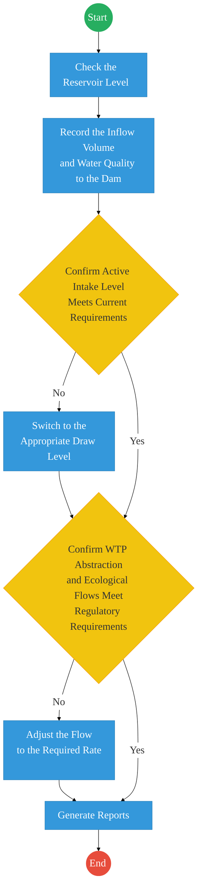
 
#### 2. TO-BE Process Flowchart (BPMN 2.0)
*Future State — Raw Water Storage and Abstraction (SCADA Integration)*
 
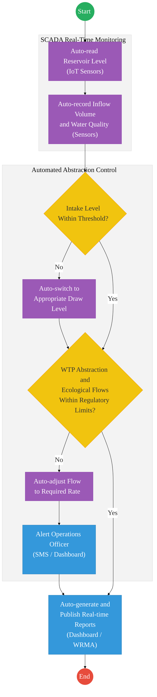
 
---
 
### 2.2 Dam Safety Monitoring
 
#### 1. AS-IS Process Flowchart (BPMN 2.0)
*Current State — Dam Safety Monitoring*
 
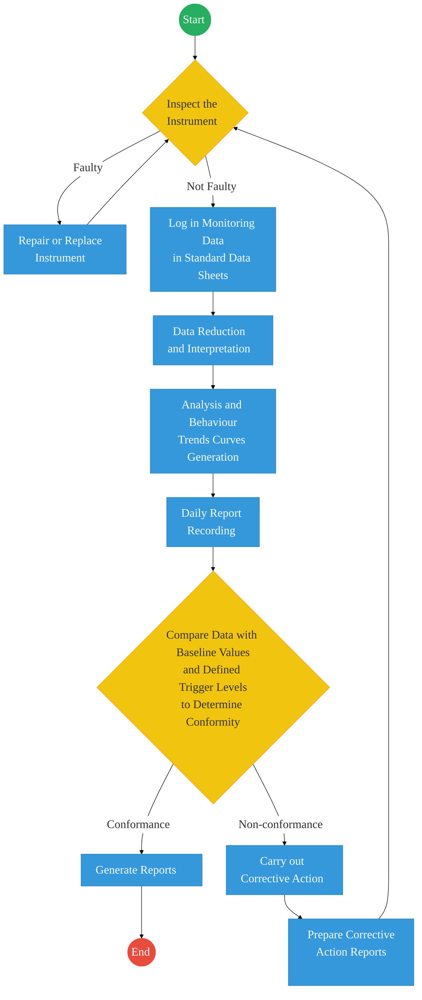
 
#### 2. TO-BE Process Flowchart (BPMN 2.0)
*Future State — Dam Safety Monitoring (Automated IoT + SCADA)*
 
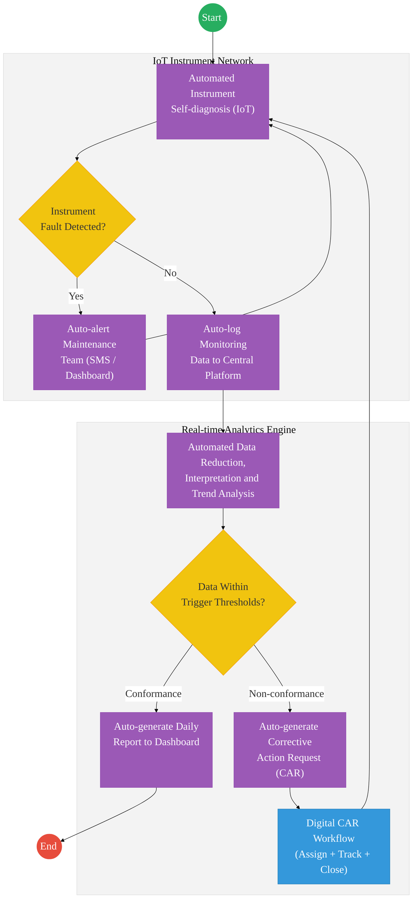
 
---
 
### 2.3 Water Treatment
 
#### 1. AS-IS Process Flowchart (BPMN 2.0)
*Current State — Water Treatment Process*
 
```mermaid
%%{init: { 'theme': 'base', 'themeVariables': { 'fontSize': '24px', 'fontFamily': 'Inter, system-ui, sans-serif', 'primaryColor': '#ffffff', 'edgeLabelBackground':'#ffffff', 'tertiaryColor': '#f3f3f3', 'mainBkg': '#ffffff', 'nodeBorder': '#333333' } } }%%
flowchart TD
    Start((Start))
    End1(("End"))
 
    ReceiveRaw["Receive Raw Water"]
    QualityCheck{"Check Raw Water\nQuantity and Quality"}
    ConductTests["Conduct Tests to Determine\nChemical to be Used\nand Dosage Rate"]
    PreTreatment["Pre-Treatment\n(Aeration and Oxidation)"]
    MainTreatment["Main Treatment\n(Coagulation and Flocculation)"]
    Sedimentation["Sedimentation /\nDissolved Air Floatation (DAF)"]
    TurbidityTest{"Test Effectiveness\nof Treatment (Turbidity)"}
    Filtration["Filtration"]
    Disinfection["Disinfection"]
    DisinfectTest1{"Test Effectiveness\nof Disinfection"}
    AdjustDosage["Adjust Chemical\nDosage"]
    DisinfectTest2{"Test Effectiveness\nof Disinfection"}
    Washout["Initiate Washout\n(Dispose)"]
    Release["Release Treated Water\nfor Transmission"]
 
    Start --> ReceiveRaw
    ReceiveRaw --> QualityCheck
 
    QualityCheck -- "Does Not Meet Requirements" --> ReceiveRaw
    QualityCheck -- "Meets Requirements" --> ConductTests
 
    ConductTests --> PreTreatment
    PreTreatment --> MainTreatment
    MainTreatment --> Sedimentation
    Sedimentation --> TurbidityTest
 
    TurbidityTest -- "Treatment Ineffective" --> MainTreatment
    TurbidityTest -- "Effectively Treated" --> Filtration
 
    Filtration --> Disinfection
    Disinfection --> DisinfectTest1
 
    DisinfectTest1 -- "Ineffectively Disinfected" --> AdjustDosage
    AdjustDosage --> DisinfectTest2
    DisinfectTest2 -- "Ineffectively Disinfected" --> Washout
    DisinfectTest2 -- "Effectively Disinfected" --> Release
    DisinfectTest1 -- "Effectively Disinfected" --> Release
 
    Washout --> End1
    Release --> End1
 
    classDef startEvent fill:#27ae60,stroke:#27ae60,color:#fff,font-size:24px;
    classDef endEvent fill:#e74c3c,stroke:#e74c3c,color:#fff,font-size:24px;
    classDef userTask fill:#3498db,stroke:#2980b9,color:#fff,font-size:24px;
    classDef gateway fill:#f1c40f,stroke:#f39c12,color:#333,font-size:24px;
 
    class Start startEvent;
    class End1 endEvent;
    class QualityCheck,TurbidityTest,DisinfectTest1,DisinfectTest2 gateway;
    class ReceiveRaw,ConductTests,PreTreatment,MainTreatment,Sedimentation,Filtration,Disinfection,AdjustDosage,Washout,Release userTask;
```
 
#### 2. TO-BE Process Flowchart (BPMN 2.0)
*Future State — Water Treatment (Automated SCADA + IoT Sensors)*
 
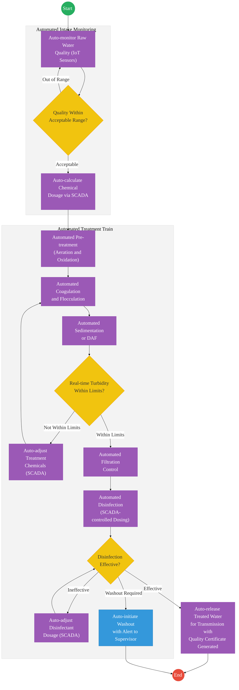
 
---
 
### 2.4 Treated Bulk Water Transmission
 
#### 1. AS-IS Process Flowchart (BPMN 2.0)
*Current State — Treated Bulk Water Transmission*
 
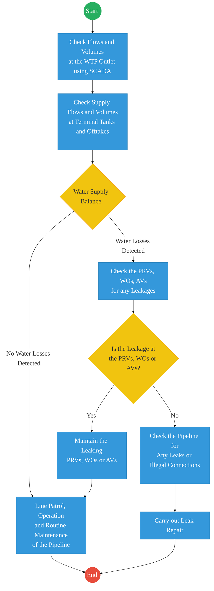
 
#### 2. TO-BE Process Flowchart (BPMN 2.0)
*Future State — Treated Bulk Water Transmission (SCADA + GIS Integration)*
 
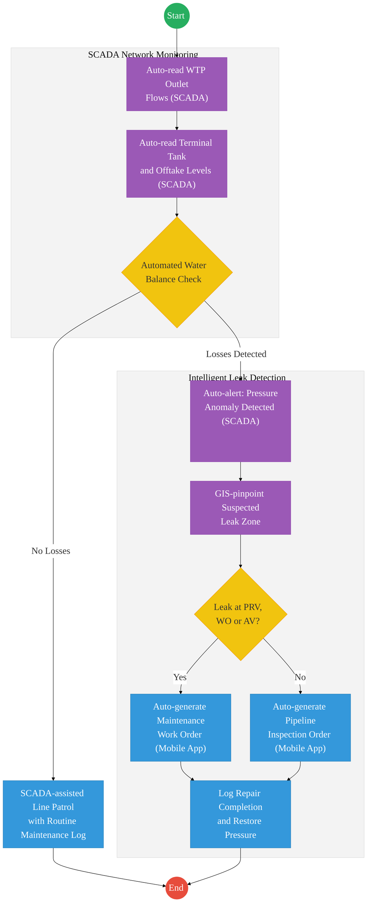
 
---
 
### 2.5 Supply, Billing and Collection
 
#### 1. AS-IS Process Flowchart (BPMN 2.0)
*Current State — Supply, Billing and Collection*
 
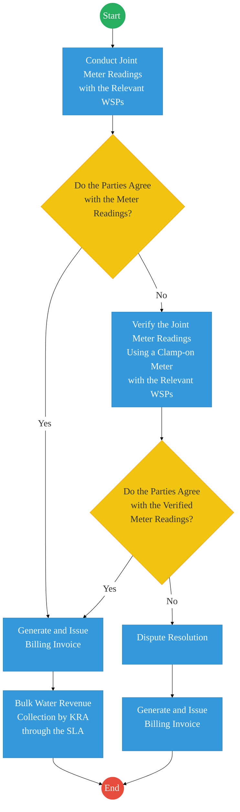
 
#### Detailed Process (AS-IS)
 
| Step | Role | Action | Tool/System | Notes |
|---|---|---|---|---|
| 1 | AWWDA / WSP | Conducts joint meter readings at bulk water offtake points with the relevant Water Service Providers. | Physical Meter Reading | Readings scheduled monthly; no digital record at point of reading. Disputes are common. |
| 2 | AWWDA / WSP | If parties do not agree, verifies readings using a clamp-on meter. | Clamp-on Meter | Secondary verification process adds 3–7 days to billing cycle. |
| 3 | AWWDA / WSP | If parties still do not agree, escalates to formal dispute resolution. | Manual / Legal | Dispute process is lengthy and untracked; some cases unresolved for months. |
| 4 | AWWDA Finance | Generates and issues billing invoice to the WSP. | Manual / Excel | Invoice generation is manual; no auto-calculation from meter data. |
| 5 | KRA / AWWDA | Bulk water revenue collected by KRA through the SLA arrangement. | KRA / Manual | Collection cycle disconnected from billing cycle; reconciliation is manual. |
 
#### Pain Points & Opportunities
##### Pain Points
- **Manual Meter Reading:** Joint meter readings are manual, unverifiable in real time, and frequently disputed. No digital timestamping or photographic evidence at point of reading.
- **Disconnected Billing Cycle:** Invoice generation is manual and decoupled from meter data, leading to billing errors and delayed revenue collection.
- **Untracked Dispute Process:** Billing disputes have no structured digital workflow; resolution timelines are unmonitored and frequently exceed 30 days.
- **KRA Reconciliation Delays:** Revenue collected by KRA via the SLA is manually reconciled against AWWDA billing records, creating a persistent revenue accounting lag.
 
##### Opportunities
- **SCADA-driven Automated Billing:** Replace manual joint readings with SCADA-metered data from smart bulk meters. Auto-generate invoices from certified meter readings.
- **Digital Dispute Portal:** Provide WSPs with a digital portal to query and dispute readings; all dispute communications timestamped and tracked to resolution.
- **GPA Integration:** Integrate with the Government Payment Aggregator to enable real-time payment tracking and automated revenue reconciliation with KRA.
 
---
 
#### 2. TO-BE Process Flowchart (BPMN 2.0)
*Future State — Supply, Billing and Collection (Digital + GPA Integration)*
 
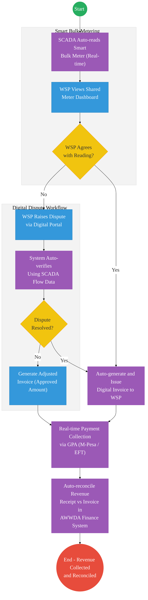
 
---
 
## Part 3 — Environment and Safeguards
 
### 3.1 Environmental Permits and Licenses
 
#### 1. AS-IS Process Flowchart (BPMN 2.0)
*Current State — Application for Environmental Permits / Licenses*
 
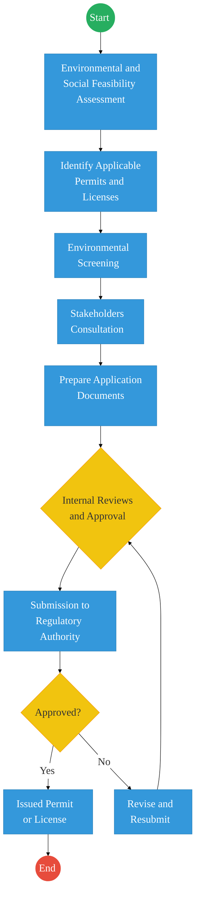
 
#### 2. TO-BE Process Flowchart (BPMN 2.0)
*Future State — Environmental Permits / Licenses (KeSEL + NEMA ePERMIT Integration)*
 
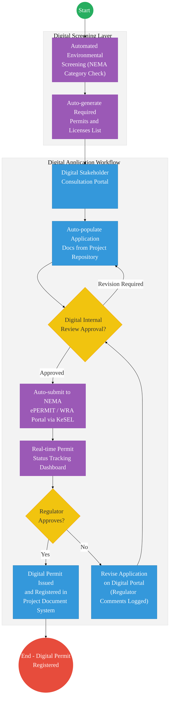
 
---
 
### 3.2 Environmental Health and Safety (EHS)
 
#### 1. AS-IS Process Flowchart (BPMN 2.0)
*Current State — Environmental Health and Safety (EHS)*
 
```mermaid
%%{init: { 'theme': 'base', 'themeVariables': { 'fontSize': '24px', 'fontFamily': 'Inter, system-ui, sans-serif', 'primaryColor': '#ffffff', 'edgeLabelBackground':'#ffffff', 'tertiaryColor': '#f3f3f3', 'mainBkg': '#ffffff', 'nodeBorder': '#333333' } } }%%
flowchart TD
    Start((Start))
    End1(("End"))
 
    IdentifyActivity["Identify Activity"]
    HazardID["Hazard Identification\n(Environmental, Health, Safety)"]
    RiskAssess["Risk Assessment\n(Likelihood x Severity)"]
    RiskAcceptable1{"Is Risk\nAcceptable?"}
    ReassessRisk["Reassess Risk"]
    ApplyControls["Apply Control Measures\n(Elimination → Substitution →\nEngineering → Administrative → PPE)"]
    RiskAcceptable2{"Is Risk\nAcceptable?"}
    StopWork["STOP WORK /\nRedesign Task"]
    Training["Training and Authorization\n(Permits, SOPs, Toolbox Talk)"]
    PerformTask["Perform Task Safely"]
    MonitorInspect["Monitoring\nand Inspection"]
    IncidentGateway{"Incident /\nNear Miss?"}
    IncidentReport["Incident Reporting"]
    Investigation["Investigation and\nRoot Cause Analysis"]
    CorrPrevent["Corrective and\nPreventive Actions"]
    UpdateRiskAssess["Update Risk Assessment\nand Procedures"]
    ManagementReview["Management Review"]
 
    Start --> IdentifyActivity
    IdentifyActivity --> HazardID
    HazardID --> RiskAssess
    RiskAssess --> RiskAcceptable1
 
    RiskAcceptable1 -- "No" --> ReassessRisk
    ReassessRisk --> RiskAcceptable1
    RiskAcceptable1 -- "Yes" --> ApplyControls
 
    ApplyControls --> RiskAcceptable2
    RiskAcceptable2 -- "No" --> StopWork
    StopWork --> IdentifyActivity
    RiskAcceptable2 -- "Yes" --> Training
 
    Training --> PerformTask
    PerformTask --> MonitorInspect
    MonitorInspect --> IncidentGateway
 
    IncidentGateway -- "Yes" --> IncidentReport
    IncidentReport --> Investigation
    Investigation --> CorrPrevent
    CorrPrevent --> UpdateRiskAssess
    UpdateRiskAssess --> MonitorInspect
 
    IncidentGateway -- "No" --> UpdateRiskAssess
    UpdateRiskAssess --> ManagementReview
    ManagementReview --> End1
 
    classDef startEvent fill:#27ae60,stroke:#27ae60,color:#fff,font-size:24px;
    classDef endEvent fill:#e74c3c,stroke:#e74c3c,color:#fff,font-size:24px;
    classDef userTask fill:#3498db,stroke:#2980b9,color:#fff,font-size:24px;
    classDef gateway fill:#f1c40f,stroke:#f39c12,color:#333,font-size:24px;
 
    class Start startEvent;
    class End1 endEvent;
    class RiskAcceptable1,RiskAcceptable2,IncidentGateway gateway;
    class IdentifyActivity,HazardID,RiskAssess,ReassessRisk,ApplyControls,StopWork,Training,PerformTask,MonitorInspect,IncidentReport,Investigation,CorrPrevent,UpdateRiskAssess,ManagementReview userTask;
```
 
#### 2. TO-BE Process Flowchart (BPMN 2.0)
*Future State — Environmental Health and Safety (Digital EHS Management System)*
 
```mermaid
%%{init: { 'theme': 'base', 'themeVariables': { 'fontSize': '24px', 'fontFamily': 'Inter, system-ui, sans-serif', 'primaryColor': '#ffffff', 'edgeLabelBackground':'#ffffff', 'tertiaryColor': '#f3f3f3', 'mainBkg': '#ffffff', 'nodeBorder': '#333333' } } }%%
flowchart TD
    Start((Start))
    End1(("End"))
 
    subgraph RiskEngine["Digital Risk Assessment Engine"]
        direction TB
        DigitalHazardID["Digital Hazard Identification\n(Structured EHS Register)"]
        AutoRiskScore["Auto-calculate Risk Score\n(Likelihood x Severity Matrix)"]
        RiskAcceptable1{"Risk Score\nWithin Threshold?"}
        AutoControlRec["Auto-recommend Control\nMeasures (Risk Register)"]
        RiskAcceptable2{"Residual Risk\nAcceptable?"}
        AutoStopWork["Auto-issue Stop Work Notice\nand Redesign Alert"]
    end
 
    subgraph TaskExecution["Digital Task Execution"]
        direction TB
        DigitalPermit["Issue Digital Work\nPermit (Mobile App)"]
        IoTMonitor["IoT Environmental\nand Safety Monitoring\n(Gas, Noise, Temperature)"]
        IncidentGateway{"Incident /\nNear Miss Detected?"}
        AutoIncidentReport["Auto-generate Incident\nReport (Mobile App)"]
        DigitalRCA["Digital Root Cause\nAnalysis Workflow"]
        DigitalCAPA["Digital CAPA Tracking\n(Assign + Deadline + Close)"]
        AutoUpdateRegister["Auto-update Risk\nRegister and Procedures"]
    end
 
    ManagementDashboard["Real-time EHS\nManagement Dashboard\nand Regulatory Reports"]
 
    Start --> DigitalHazardID
    DigitalHazardID --> AutoRiskScore
    AutoRiskScore --> RiskAcceptable1
 
    RiskAcceptable1 -- "No" --> AutoRiskScore
    RiskAcceptable1 -- "Yes" --> AutoControlRec
 
    AutoControlRec --> RiskAcceptable2
    RiskAcceptable2 -- "No" --> AutoStopWork
    AutoStopWork --> DigitalHazardID
    RiskAcceptable2 -- "Yes" --> DigitalPermit
 
    DigitalPermit --> IoTMonitor
    IoTMonitor --> IncidentGateway
 
    IncidentGateway -- "Yes" --> AutoIncidentReport
    AutoIncidentReport --> DigitalRCA
    DigitalRCA --> DigitalCAPA
    DigitalCAPA --> AutoUpdateRegister
    AutoUpdateRegister --> IoTMonitor
 
    IncidentGateway -- "No" --> AutoUpdateRegister
    AutoUpdateRegister --> ManagementDashboard
    ManagementDashboard --> End1
 
    classDef startEvent fill:#27ae60,stroke:#27ae60,color:#fff,font-size:24px;
    classDef endEvent fill:#e74c3c,stroke:#e74c3c,color:#fff,font-size:24px;
    classDef userTask fill:#3498db,stroke:#2980b9,color:#fff,font-size:24px;
    classDef serviceTask fill:#9b59b6,stroke:#8e44ad,color:#fff,font-size:24px;
    classDef gateway fill:#f1c40f,stroke:#f39c12,color:#333,font-size:24px;
 
    class Start startEvent;
    class End1 endEvent;
    class RiskAcceptable1,RiskAcceptable2,IncidentGateway gateway;
    class AutoRiskScore,AutoControlRec,AutoIncidentReport,AutoUpdateRegister serviceTask;
    class DigitalHazardID,AutoStopWork,DigitalPermit,IoTMonitor,DigitalRCA,DigitalCAPA,ManagementDashboard userTask;
```
 
---
 
### 3.3 Climate Change and Sustainability
 
#### 1. AS-IS Process Flowchart (BPMN 2.0)
*Current State — Climate Change and Sustainability*
 
```mermaid
%%{init: { 'theme': 'base', 'themeVariables': { 'fontSize': '24px', 'fontFamily': 'Inter, system-ui, sans-serif', 'primaryColor': '#ffffff', 'edgeLabelBackground':'#ffffff', 'tertiaryColor': '#f3f3f3', 'mainBkg': '#ffffff', 'nodeBorder': '#333333' } } }%%
flowchart TD
    Start((Start))
    End1(("End"))
 
    OrgCommitment["Organizational\nCommitment"]
    ClimatScreening["Climate and\nSustainability Screening"]
    ClimateRisk["Climate Risk and\nOpportunity Identification"]
    IntegrationDesign["Integration into\nDesign and Procurement"]
    Implementation["Implementation, Monitoring,\nMeasurement and\nPerformance Evaluation"]
    RegulatoryClimate["Regulatory, Climate\nand Safeguards\nCompliance Review"]
    ManagementReview["Management\nReview"]
 
    Start --> OrgCommitment
    OrgCommitment --> ClimatScreening
    ClimatScreening --> ClimateRisk
    ClimateRisk --> IntegrationDesign
    IntegrationDesign --> Implementation
    Implementation --> RegulatoryClimate
    RegulatoryClimate --> ManagementReview
    ManagementReview --> End1
 
    classDef startEvent fill:#27ae60,stroke:#27ae60,color:#fff,font-size:24px;
    classDef endEvent fill:#e74c3c,stroke:#e74c3c,color:#fff,font-size:24px;
    classDef userTask fill:#3498db,stroke:#2980b9,color:#fff,font-size:24px;
 
    class Start startEvent;
    class End1 endEvent;
    class OrgCommitment,ClimatScreening,ClimateRisk,IntegrationDesign,Implementation,RegulatoryClimate,ManagementReview userTask;
```
 
#### Detailed Process (AS-IS)
 
| Step | Role | Action | Tool/System | Notes |
|---|---|---|---|---|
| 1 | Leadership | Makes organizational commitment to climate-aligned operations and sustainability principles. | Policy Documents / Manual | Commitments documented in policy papers with no digital tracking or KPI framework. |
| 2 | Environment Team | Conducts climate and sustainability screening for projects and operations. | Spreadsheets / Manual Reports | Screening criteria inconsistently applied across project types. |
| 3 | Environment Team | Identifies climate risks and opportunities relevant to the project or operational context. | Manual Risk Registers | Climate risk registers are static documents, not linked to project or operations dashboards. |
| 4 | Design / Procurement | Integrates climate and sustainability requirements into design specifications and procurement criteria. | Manual / Word / Spreadsheets | No standard climate integration checklist or procurement criteria scoring tool. |
| 5 | Implementation Team | Implements climate measures and conducts monitoring, measurement, and performance evaluation. | Manual Field Checks / Excel | Monitoring data not aggregated; no carbon or sustainability performance dashboard. |
| 6 | Compliance Team | Reviews regulatory, climate, and safeguards compliance. | Manual / Spreadsheets | Compliance status tracked in spreadsheets; no automated regulatory update alert. |
| 7 | Management | Reviews climate and sustainability performance. | Physical Meetings / Reports | Management review reports compiled manually; no live performance data access. |
 
#### Pain Points & Opportunities
##### Pain Points
- **Static Climate Risk Registers:** Climate risk assessments are one-off documents not linked to real-time weather, hydrology, or operational data.
- **No Carbon / Sustainability Dashboard:** There is no platform aggregating energy, water, and carbon performance metrics for management review or public reporting.
- **Manual Regulatory Tracking:** Compliance with evolving climate and environmental regulations (NDCs, Nationally Determined Contributions, NEMA requirements) is tracked manually with no automated alert system.
- **Procurement Not Climate-scored:** Procurement evaluation criteria do not have an embedded climate or sustainability scoring component.
 
##### Opportunities
- **Real-time Climate Risk Monitoring:** Integrate with Kenya Meteorological Department (KMD) APIs and WRMA hydrology data for live climate risk alerts linked to project and operations dashboards.
- **Sustainability Performance Dashboard:** Deploy a digital ESG/sustainability dashboard aggregating energy consumption, water losses, carbon emissions, and regulatory compliance status.
- **Climate-integrated Procurement Scoring:** Build climate and sustainability criteria into the digital procurement evaluation module with automatic scoring.
 
---
 
#### 2. TO-BE Process Flowchart (BPMN 2.0)
*Future State — Climate Change and Sustainability (Digital ESG + Regulatory Integration)*
 
```mermaid
%%{init: { 'theme': 'base', 'themeVariables': { 'fontSize': '24px', 'fontFamily': 'Inter, system-ui, sans-serif', 'primaryColor': '#ffffff', 'edgeLabelBackground':'#ffffff', 'tertiaryColor': '#f3f3f3', 'mainBkg': '#ffffff', 'nodeBorder': '#333333' } } }%%
flowchart TD
    Start((Start))
    End1(("End - Sustainability\nReport Published"))
 
    subgraph ClimateIntelligence["Climate Intelligence Layer"]
        direction LR
        LiveClimate["Live Climate Risk Feed\n(KMD + WRMA API)"]
        AutoRiskID["Auto-identify Project\nand Operations Climate Risks"]
    end
 
    subgraph DigitalIntegration["Digital Climate Integration"]
        direction TB
        ClimateProcurement["Climate Scoring Auto-applied\nin Procurement Evaluation"]
        DigitalImplement["Digital Implementation Tracker\n(Climate Measures + KPIs)"]
        AutoMonitoring["Automated Monitoring:\nEnergy, Water, Carbon,\nBiodiversity Metrics"]
        RegComplianceCheck{"Regulatory\nCompliance Check\n(NEMA / NDC Requirements)"}
        AutoComplianceAlert["Auto-generate Compliance\nAlert and Action Plan"]
    end
 
    ESGDashboard["Live ESG / Sustainability\nDashboard (Internal +\nPublic Reporting)"]
    DigitalMgmtReview["Digital Management\nReview (Dashboard-driven)"]
 
    Start --> LiveClimate
    LiveClimate --> AutoRiskID
    AutoRiskID --> ClimateProcurement
    ClimateProcurement --> DigitalImplement
    DigitalImplement --> AutoMonitoring
    AutoMonitoring --> RegComplianceCheck
 
    RegComplianceCheck -- "Non-compliant" --> AutoComplianceAlert
    AutoComplianceAlert --> DigitalImplement
 
    RegComplianceCheck -- "Compliant" --> ESGDashboard
    ESGDashboard --> DigitalMgmtReview
    DigitalMgmtReview --> End1
 
    classDef startEvent fill:#27ae60,stroke:#27ae60,color:#fff,font-size:24px;
    classDef endEvent fill:#e74c3c,stroke:#e74c3c,color:#fff,font-size:24px;
    classDef userTask fill:#3498db,stroke:#2980b9,color:#fff,font-size:24px;
    classDef serviceTask fill:#9b59b6,stroke:#8e44ad,color:#fff,font-size:24px;
    classDef gateway fill:#f1c40f,stroke:#f39c12,color:#333,font-size:24px;
 
    class Start startEvent;
    class End1 endEvent;
    class RegComplianceCheck gateway;
    class LiveClimate,AutoRiskID,AutoMonitoring,AutoComplianceAlert serviceTask;
    class ClimateProcurement,DigitalImplement,ESGDashboard,DigitalMgmtReview userTask;
```
 
---
 
## Process Overview
 
### Service Category
- G2B (Government to Business) — Water Service Providers (WSPs), contractors, consultants
- G2C (Government to Citizen) — Bulk water consumers, communities served by WSPs
 
### Scope
- **In Scope:** All 12 core AWWDA processes across Infrastructure, Operations, and Environment & Safeguards as documented herein.
- **Out of Scope:** Last-mile retail distribution to end consumers (managed by WSPs); wastewater treatment operations (separate entity).
 
### Policy Context
- Water Act (2016)
- Environmental Management and Coordination Act (EMCA, Cap. 387)
- Digital Health Act 2023 *(cross-sector data standards)*
- Kenya Data Protection Act (2019)
- Kenya National Climate Change Action Plan
- Kenya DSAP Architecture — Huduma Bridge Technical Specification
- NEMA Environmental Impact Assessment Regulations
- Water Resources Management Authority (WRMA) Regulations
 
---
 
## References
- https://www.awwda.go.ke
- Water Act (2016)
- Environmental Management and Coordination Act (EMCA, Cap. 387)
- Kenya Data Protection Act (2019)
- Kenya National Climate Change Action Plan (2018–2022)
- NEMA Environmental Impact Assessment and Audit Regulations
- Kenya DSAP Architecture — Huduma Bridge Technical Specification
- KeSEL Integration Framework — ICT Authority Kenya
- AWWDA PROCESSESS — March 2026 (Source Document)
- Desk Review
 
---
 
### Validation Survey
Please provide your feedback here: [https://ee.kobotoolbox.org/x/4Ls7SlCG](https://ee.kobotoolbox.org/x/4Ls7SlCG)
