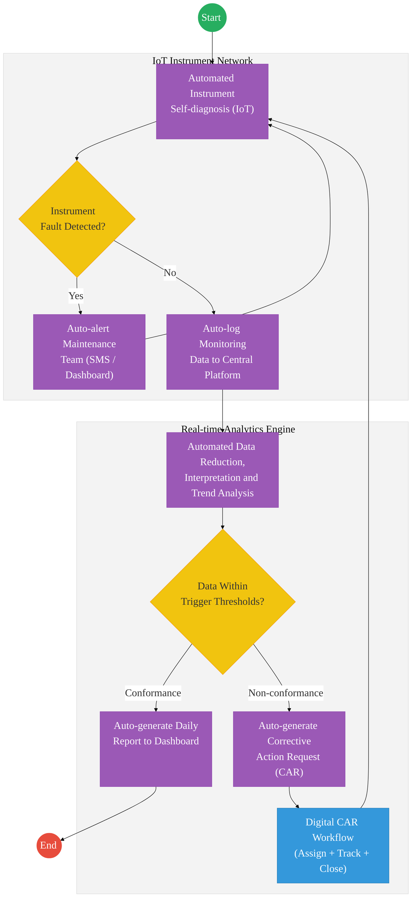
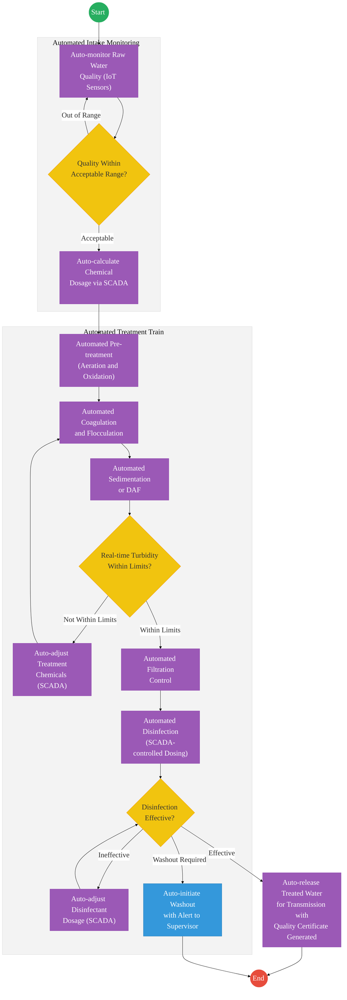
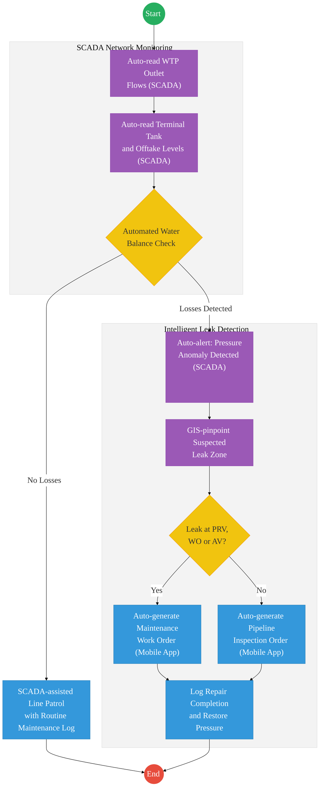
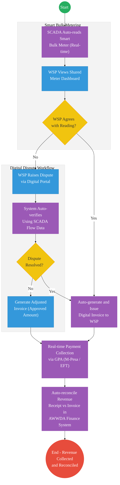
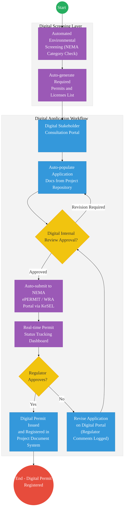

# ATHI WATER WORKS DEVELOPMENT AGENCY (AWWDA) – Business Process Architecture (Updated)

## Cover Page
- **Ministry:** Ministry of Water, Sanitation and Irrigation
- **Agency:** Athi Water Works Development Agency
- **Primary Authority:** Chief Executive Officer, AWWDA
- **Document Type:** Business Process Architecture (BPA) Standardised
- **Document Version:** 4.1
- **Date:** 2026-03-25
- **Classification:** Official
- **Strategic Category:** Priority MDA
- **Service Model:** G2B / G2C
- **Reviewer:** Senior Government Enterprise Architect

---

## SECTION 0: SERVICE PRIORITISATION MAPPING
- **Mapped Priority Service:** Water Infrastructure Digitization & Bulk Billing (Metropolitan Water Registry)
- **Tier Classification:** Tier 2
- **Strategic Category:** Economy / Infrastructure (Utility Services)
- **Breakout Room Classification:** Room 3 (Agriculture & Economic Development)
- **Lead MDA (Standardised Name):** Athi Water Works Development Agency
- **Related Cross-Cutting Services:**
    - Metropolitan Water Hub (Real-time SCADA Integration)
    - Identity Layer (IPRS / Maisha Namba - Contractor/WSP Identity)
    - X-Road (NEMA / WRA / KRA / National Treasury Interop)
    - Government Payment Aggregator (GPA / Bulk Water Billing)
    - PIMIS (Project Infrastructure Management Information System)

---

## SECTION 0.1: PRIORITISATION JUSTIFICATION
This service is prioritised because the TO-BE design transforms water infrastructure management from manual "meter-checks" into an "Intelligent Water Network." By implementing a "SCADA-Driven Automated Billing" system that integrates with the Government Payment Aggregator (GPA) via X-Road (Huduma Bridge), the design eliminates the chronic 30-day billing dispute cycle between AWWDA and Water Service Providers (WSPs). This transformation enables real-time leakage detection via GIS-linked sensors, automates environmental infrastructure permits with NEMA and WRMA, and ensures that bulk water revenue (KES millions monthly) is collected and reconciled instantly, securing the financial sustainability of the multi-billion shilling national water infrastructure investment.

| Criteria | Evidence from TO-BE Design |
| :--- | :--- |
| **Demand / Volume** | Serving millions of citizens in Nairobi/Kiambu/Murang'a; thousands of bulk meter points. |
| **National Priority Alignment** | Water Act 2016; BETA Agenda - Infrastructure & Sanitation Pillar. |
| **Data Reusability** | Bulk water flow data is the primary input for National Water Balance and Climate Adaptation planning. |
| **Interoperability** | Automated multi-agency permit pipeline with NEMA and WRA via X-Road. |
| **Revenue / Efficiency Impact** | Eliminates 30-day billing disputes; real-time revenue collection via GPA/KRA. |
| **Governance / Risk Reduction** | GPS-tagged site supervision and NPKI-signed IPCs prevent project "ghosting." |
| **Inclusivity** | Proactive "Gap Alerts" ensure that underserved grassroots communities are identified for expansion. |
| **Readiness** | High; SCADA systems are partially active; WSP registries are established. |

> [!NOTE]
> “The TO-BE design transforms water infrastructure management from manual 'meter-checks' into an 'Intelligent Water Network.' By implementing a 'SCADA-Driven Automated Billing' system that integrates with the Government Payment Aggregator (GPA) via X-Road, the design eliminates the chronic 30-day billing dispute cycle between AWWDA and Water Service Providers (WSPs). This transformation enables real-time leakage detection via GIS-linked sensors, automates infrastructure permits with NEMA and WRMA, and ensures that bulk water revenue is collected and reconciled instantly, securing the financial sustainability of the Sh800 billion national water investment.”

---

## Service Mandate
The Athi Water Works Development Agency (AWWDA) is mandated under the Water Act 2016 to develop, maintain, and manage national public water works in Nairobi, Kiambu, and Murang'a counties. Its responsibilities include operating water works, providing bulk water services, developing water and sewerage infrastructure, and providing technical services and capacity building to county governments and other water service providers.

---

## Executive Summary
Athi Water Works Development Agency (AWWDA) is responsible for the development, rehabilitation, and operation of water and sanitation infrastructure in Kenya's greater Nairobi and Coast regions, serving millions of citizens and industrial consumers. AWWDA's core service delivery spans three operational domains: infrastructure planning, design and development; water operations including raw water abstraction, treatment, and bulk transmission; and environmental compliance covering permits, health and safety, and climate change.
 
Currently, these ten inter-connected processes are managed through paper-based workflows, spreadsheets, and fragmented departmental systems with no central digital backbone. This leads to delays in infrastructure approvals, manual compliance tracking, reactive rather than predictive operations, and an inability to provide real-time service performance data to regulators and the public.
 
The transition to the Kenya DSAP Architecture aims to digitize all core processes through a unified AWWDA Digital Operations Platform — integrating with PIMIS, KRA, NEMA, WRMA, and the Government Payment Aggregator (GPA) to automate approvals, compliance monitoring, and bulk water billing.
 
---
 
## Part 1 — Infrastructure
 
---
 
### 1.1 Infrastructure Planning
 
#### 1. AS-IS Process Flowchart
*Current State — Infrastructure Planning Process*
 

 
---
 
#### Detailed Process (AS-IS)
 
| Step | Role | Action | Tool/System | Notes |
| :--- | :--- | :--- | :--- | :--- |
| 1 | Planning Officer | Identifies service gaps and infrastructure needs across the service area. | Manual Surveys / Spreadsheets | No centralised demand data platform. Gap identification is periodic and reactive. |
| 2 | Planning Officer | Collects and analyses planning and demand data to inform investment priorities. | Excel / Internal Reports | Data siloed across county and regional offices. No real-time analytics. |
| 3 | Planning Team | Develops concept notes and investment proposals for identified projects. | MS Word / Manual | Version control issues; no collaborative drafting tool. |
| 4 | CEO | Reviews and approves concept notes and PIMIS submissions. If rejected, team revises. | PIMIS / Manual | PIMIS integration partial; approvals not tracked digitally end-to-end. |
| 5 | Technical Team | Undertakes technical surveys and analysis for approved concept notes. | Manual / Outsourced | Survey scheduling untracked; reports submitted in hard copy. |
| 6 | Technical Team | Prepares Master Plans, Feasibility Studies, Conceptual and Preliminary Designs with internal technical review. | AutoCAD / Word / Manual | No central document repository. Review cycles cause delays of 4–12 weeks. |
| 7 | CEO / FS / MP | Reviews and approves Feasibility Studies, Master Plans, and Investment Proposals. | PIMIS / Manual | Multi-level approvals with no digital workflow or SLA tracking. |
| 8 | Planning Team | Submits approved projects to PIMIS and prioritises the investment pipeline. | PIMIS | PIMIS data entry manual; synchronisation with internal planning spreadsheets is error-prone. |
| 9 | CEO | Approves the prioritised investment pipeline. | Manual / Committee | No automated alignment check against strategic and financing frameworks. |
| 10 | Finance / Planning | Engages donors and finalises financing arrangements for approved pipeline. | Manual / Email | No digital deal tracking or financing workflow. |
 
#### Pain Points & Opportunities
##### Pain Points
- **No Demand Analytics Platform:** Service gap identification relies on periodic manual surveys with no live data feed from the distribution network or SCADA systems.
- **Fragmented Document Management:** Master plans, feasibility studies, and concept notes are stored across individual workstations with no version control or central repository.
- **Manual PIMIS Entry:** Investment data is entered into PIMIS manually after decisions are made, introducing transcription errors and lag in the national pipeline.
- **Untracked Approval Cycles:** Multi-level CEO and committee approvals have no digital audit trail, SLA enforcement, or escalation mechanism.
 
##### Opportunities
- **Integrated Demand Analytics:** Connect SCADA, customer complaint data, and WSP reporting into a live demand intelligence dashboard to trigger evidence-based planning.
- **Digital Document Repository:** Implement a centralised project document management system with version control, automated review routing, and e-signature approvals.
- **PIMIS API Integration:** Auto-populate PIMIS from the internal project system on approval, eliminating manual re-entry.
- **Digital Approval Workflow:** Route all CEO and committee approvals through a digital workflow engine with SLA tracking and automatic escalation.
 
---
 
#### 2. TO-BE Process Flowchart (BPMN 2.0)
*Future State — Infrastructure Planning (Kenya DSAP Architecture)*

```mermaid
%%{init: { 'theme': 'base', 'themeVariables': { 'fontSize': '24px', 'fontFamily': 'Inter, system-ui, sans-serif', 'primaryColor': '#ffffff', 'edgeLabelBackground':'#ffffff', 'tertiaryColor': '#f3f3f3', 'mainBkg': '#ffffff', 'nodeBorder': '#333333' } } }%%
flowchart TD
    Start((Start))
    EndApprove(("End - Approved\nInvestment Pipeline"))
 
    subgraph Analytics["Demand Intelligence"]
        direction LR
        LiveData["Live SCADA +\nCustomer Data Feed"]
        GapAlert["Automated Gap\nAlert Generated"]
    end
 
    subgraph Planning["Digital Planning Workflow"]
        direction TB
        DraftConcept["Draft Concept Note\n(Collaborative Portal)"]
        AutoPIMIS["Auto-submit to PIMIS\nvia API"]
        DigitalReview{"CEO Digital\nApproval?"}
        DigitalSurveys["Commission Surveys\n(Geo-tagged + Digital Reports)"]
        PrepareDesigns["Prepare Plans / FS / PD\n(Central Repository)"]
        TechReviewGateway{"Technical Review\nApproval?"}
        PrioritisePipeline["Auto-prioritise Pipeline\n(Scoring Engine)"]
        PipelineApproval{"CEO Digital\nPipeline Approval?"}
        DonorPortal["Donor Engagement\n(Digital Financing Portal)"]
    end
 
    Start --> LiveData
    LiveData --> GapAlert
    GapAlert --> DraftConcept
    DraftConcept --> AutoPIMIS
    AutoPIMIS --> DigitalReview
 
    DigitalReview -- "Rejected" --> DraftConcept
    DigitalReview -- "Approved" --> DigitalSurveys
 
    DigitalSurveys --> PrepareDesigns
    PrepareDesigns --> TechReviewGateway
 
    TechReviewGateway -- "Revision Required" --> PrepareDesigns
    TechReviewGateway -- "Approved" --> PrioritisePipeline
 
    PrioritisePipeline --> PipelineApproval
    PipelineApproval -- "Rejected" --> PrioritisePipeline
    PipelineApproval -- "Approved" --> DonorPortal
 
    DonorPortal --> EndApprove
 
    classDef startEvent fill:#27ae60,stroke:#27ae60,color:#fff,font-size:24px;
    classDef endEvent fill:#e74c3c,stroke:#e74c3c,color:#fff,font-size:24px;
    classDef userTask fill:#3498db,stroke:#2980b9,color:#fff,font-size:24px;
    classDef serviceTask fill:#9b59b6,stroke:#8e44ad,color:#fff,font-size:24px;
    classDef gateway fill:#f1c40f,stroke:#f39c12,color:#333,font-size:24px;
 
    class Start startEvent;
    class EndApprove endEvent;
    class DigitalReview,TechReviewGateway,PipelineApproval gateway;
    class LiveData,GapAlert,AutoPIMIS serviceTask;
    class DraftConcept,DigitalSurveys,PrepareDesigns,PrioritisePipeline,DonorPortal userTask;
```
 

 
##### Optimized Steps (Digital)
 
| Step | Actor | Action | Tool / System |
| :--- | :--- | :--- | :--- |
| 1 | System | Live SCADA, customer complaint, and WSP data feeds trigger automated gap alerts when thresholds are breached. | AWWDA Analytics Platform / SCADA |
| 2 | Planning Officer | Drafts concept note in the collaborative digital planning portal; data auto-populated from demand analytics. | AWWDA Planning Portal / PIMIS API |
| 3 | CEO | Receives digital approval request with SLA countdown. Approves or returns with comments — decision timestamped. | Digital Approval Workflow Engine |
| 4 | Technical Team | Commissions geo-tagged surveys via the mobile field app; reports uploaded digitally to the central repository. | AWWDA Field App / Document Repository |
| 5 | Technical Team | Prepares Master Plans, FS, and Preliminary Designs in the central repository with automated peer review routing. | Central Document Repository / e-Signature |
| 6 | System | Scoring engine auto-prioritises pipeline based on defined strategic criteria, aligned against financing frameworks. | AWWDA Pipeline Engine / PIMIS API |
| 7 | CEO | Reviews and digitally approves the prioritised investment pipeline. Approval auto-syncs to PIMIS. | Digital Approval Workflow / PIMIS |
| 8 | Finance | Engages donors through the digital financing portal; deal status tracked in real time. | Financing Portal / CRM |
 
---
 
### 1.2 Infrastructure Design
 
#### 1. AS-IS Process Flowchart
*Current State — Infrastructure Design Process*
 

 
---
 
#### Detailed Process (AS-IS)
 
| Step | Role | Action | Tool/System | Notes |
| :--- | :--- | :--- | :--- | :--- |
| 1 | Design Engineer | Confirms approved design inputs: FS, Master Plan, Preliminary Design, Surveys, and Safeguards. | Manual / File System | Design inputs assembled from multiple disconnected sources and file locations. |
| 2 | Design Engineer | Prepares draft engineering designs. | AutoCAD / Manual | No design management system; files emailed between team members. |
| 3 | Chief Engineer | Conducts internal design review and verification. If not approved, designs are revised. | Printed Drawings / Manual Markup | Review comments on printed drawings; no digital redlining. |
| 4 | Design Engineer | Prepares final detailed engineering designs following internal approval. | AutoCAD | Final designs stored on individual workstations; version conflicts common. |
| 5 | Internal + External Stakeholders | Conducts internal and stakeholder design review sessions. | Physical Meetings | Stakeholder comments captured manually; no formal response tracking. |
| 6 | CEO / Director | Reviews and approves the detailed designs. If rejected, stakeholder review is repeated. | Manual / Committee | Approval cycles can extend 6–10 weeks with no SLA tracking. |
| 7 | Design Team | Manages and controls approved design documents. | File System / Manual | No change control register; design revisions untracked after approval. |
| 8 | Procurement Officer | Prepares bidding documents and obtains requisite permits. | Manual / Word | Permit applications submitted manually to NEMA and county governments. |
| 9 | Director / CEO | Approves bidding documents. | Manual | No digital record of bidding document approval history. |
 
#### Pain Points & Opportunities
##### Pain Points
- **No Design Collaboration Platform:** Engineering drawings are exchanged via email and USB drives, causing version conflicts and loss of design intent.
- **Manual Review Cycles:** Design review comments are captured on printed drawings, making it impossible to track resolution of findings digitally.
- **Manual Permit Applications:** Applications to NEMA, WRA, and county governments are submitted as physical documents, causing unpredictable delays.
- **No Change Control:** After approval, design changes are not formally logged, creating risk of construction proceeding on superseded designs.
 
##### Opportunities
- **Integrated Design Management System:** Deploy a central BIM/CAD-compatible platform with version control, digital redlining, review routing, and change control register.
- **Digital Permit Submission:** Integrate with NEMA ePERMIT and WRA digital portal via KeSEL to auto-submit permit applications and track status in real time.
- **Automated Stakeholder Review Workflow:** Circulate designs digitally to stakeholders, log comments, and track responses through a structured review register.
 
---
 
#### 2. TO-BE Process Flowchart (BPMN 2.0)
*Future State — Infrastructure Design (Kenya DSAP Architecture)*

```mermaid
%%{init: { 'theme': 'base', 'themeVariables': { 'fontSize': '24px', 'fontFamily': 'Inter, system-ui, sans-serif', 'primaryColor': '#ffffff', 'edgeLabelBackground':'#ffffff', 'tertiaryColor': '#f3f3f3', 'mainBkg': '#ffffff', 'nodeBorder': '#333333' } } }%%
flowchart TD
    Start((Start))
    EndApprove(("End - Procurement\nReady Designs"))
 
    subgraph DesignPlatform["Design Management Platform"]
        direction TB
        AutoInputs["Auto-retrieve Design Inputs\nfrom Document Repository"]
        DraftDesigns["Collaborative Engineering\nDesign (BIM / CAD Platform)"]
        DigitalReview{"Digital Internal\nReview and Verification"}
        FinalDesigns["Finalise Detailed\nEngineering Designs"]
        StakeholderPortal["Digital Stakeholder\nReview Portal"]
        ApprovalGateway{"Digital Design\nApproval?"}
        ChangeControl["Design Change\nControl Register"]
    end
 
    subgraph ProcurementPrep["Procurement Preparation"]
        direction LR
        AutoPermits["Auto-submit Permits\n(NEMA / WRA API)"]
        BiddingDocs["Prepare Bidding Documents\n(Digital Template)"]
        BiddingApproval{"Digital Bidding\nDoc Approval?"}
    end
 
    Start --> AutoInputs
    AutoInputs --> DraftDesigns
    DraftDesigns --> DigitalReview
 
    DigitalReview -- "Revision Required" --> DraftDesigns
    DigitalReview -- "Approved" --> FinalDesigns
 
    FinalDesigns --> StakeholderPortal
    StakeholderPortal --> ApprovalGateway
 
    ApprovalGateway -- "Rejected" --> StakeholderPortal
    ApprovalGateway -- "Approved" --> ChangeControl
 
    ChangeControl --> AutoPermits
    AutoPermits --> BiddingDocs
    BiddingDocs --> BiddingApproval
 
    BiddingApproval -- "Revision Required" --> BiddingDocs
    BiddingApproval -- "Approved" --> EndApprove
 
    classDef startEvent fill:#27ae60,stroke:#27ae60,color:#fff,font-size:24px;
    classDef endEvent fill:#e74c3c,stroke:#e74c3c,color:#fff,font-size:24px;
    classDef userTask fill:#3498db,stroke:#2980b9,color:#fff,font-size:24px;
    classDef serviceTask fill:#9b59b6,stroke:#8e44ad,color:#fff,font-size:24px;
    classDef gateway fill:#f1c40f,stroke:#f39c12,color:#333,font-size:24px;
 
    class Start startEvent;
    class EndApprove endEvent;
    class DigitalReview,ApprovalGateway,BiddingApproval gateway;
    class AutoInputs,AutoPermits serviceTask;
    class DraftDesigns,FinalDesigns,StakeholderPortal,ChangeControl,BiddingDocs userTask;
```
 

 
---
 
### 1.3 Infrastructure Development
 
#### 1. AS-IS Process Flowchart
*Current State — Infrastructure Development Process*
 

 
---
 
#### Detailed Process (AS-IS)
 
| Step | Role | Action | Tool/System | Notes |
| :--- | :--- | :--- | :--- | :--- |
| 1 | Contractor / AWWDA | Commences services or works following site handover. | Site Register / Manual | Handover records paper-based; no digital site handover certificate. |
| 2 | Contractor / Supervisor | Executes works with supervision and quality control checks. | Physical Inspections / Manual Logs | Supervision reports handwritten; quality non-conformances not tracked digitally. |
| 3 | Engineer | Valuates and measures completed works for payment certification. | Manual Measurement / Spreadsheets | Measurement disputes common due to no digital evidence trail. |
| 4 | IAC / CIT | Assesses substantial completion. Prepares IPC if met; works continue if not. | Physical Inspection | Substantial completion criteria inconsistently applied across projects. |
| 5 | DID / DF / CEO | Reviews and approves IPC. | Manual / Email | IPC processing averages 4–6 weeks; no digital audit trail of approval. |
| 6 | Finance | Processes payment of IPCs to contractor. | Manual / Banking | Payment delays of 2–8 weeks after approval are common. |
| 7 | IAC/CIT + Engineer | Prepares completion report and issues Substantial Completion Certificate. | Manual / Word | SCC not registered in any central system. |
| 8 | AWWDA | Monitors works during DLP, conducts final inspection, issues completion certificate, and archives contract. | Physical / Manual / Paper Files | DLP monitoring is sporadic; contract archiving on paper; records frequently inaccessible. |
 
#### Pain Points & Opportunities
##### Pain Points
- **No Digital Site Supervision:** Supervision reports, quality control logs, and defect notices are all paper-based with no photo or geo-tagged evidence for disputes.
- **Slow IPC Processing:** Interim payment certificates take 4–6 weeks from measurement to payment due to manual routing and approvals.
- **DLP Monitoring Gaps:** Defects Liability Period monitoring is sporadic, leading to defects discovered after the contractor's liability expires.
- **Paper Contract Archives:** Contract documents are stored in physical files that are frequently inaccessible or lost.
 
##### Opportunities
- **Digital Site Supervision App:** Field engineers log supervision checks, upload photos, record quality observations, and issue digital defect notices via mobile app.
- **Automated IPC Workflow:** IPC preparation, routing, and approval fully digitised with SLA tracking and auto-notification to finance.
- **DLP Tracker:** Digital monitoring schedule with automated field visit reminders, defect logging, and contractor response tracking.
 
---
 
#### 2. TO-BE Process Flowchart (BPMN 2.0)
*Future State — Infrastructure Development (Kenya DSAP Architecture)*

```mermaid
%%{init: { 'theme': 'base', 'themeVariables': { 'fontSize': '24px', 'fontFamily': 'Inter, system-ui, sans-serif', 'primaryColor': '#ffffff', 'edgeLabelBackground':'#ffffff', 'tertiaryColor': '#f3f3f3', 'mainBkg': '#ffffff', 'nodeBorder': '#333333' } } }%%
flowchart TD
    Start((Start))
    End1(("End"))
 
    subgraph SiteOps["Digital Site Operations"]
        direction TB
        DigitalHandover["Digital Site Handover\n(QR-stamped Certificate)"]
        MobileSupervision["Mobile Supervision App\n(Photos + Geo-tags + Checklists)"]
        DigitalValuation["Digital Measurement\nand Valuation"]
        SubstantialCheck{"Substantial\nCompletion Check?"}
    end
 
    subgraph PaymentWorkflow["Digital Payment Workflow"]
        direction TB
        AutoIPC["Auto-generate IPC\nfrom Measurement Data"]
        DigitalCert["Digital Certification\nby IAC / CIT"]
        DigitalApproval{"Digital Approval\nDID / DF / CEO"}
        AutoPayment["Auto-initiate Payment\nvia GPA / Banking API"]
    end
 
    subgraph Completion["Completion and Handover"]
        direction TB
        DigitalSCC["Digital Substantial\nCompletion Certificate"]
        DLPTracker["DLP Monitoring Tracker\n(Automated Visit Reminders)"]
        FinalInspApp["Final Inspection\n(Mobile App)"]
        FinalCertGateway{"Final Works\nCertified?"}
        DigitalCC["Issue Digital\nCompletion Certificate"]
        DigitalArchive["Digital Contract\nClosure and Archive"]
        HandoverBulk["Hand over to\nBulk Operations"]
    end
 
    Start --> DigitalHandover
    DigitalHandover --> MobileSupervision
    MobileSupervision --> DigitalValuation
    DigitalValuation --> SubstantialCheck
 
    SubstantialCheck -- "No" --> MobileSupervision
    SubstantialCheck -- "Yes" --> AutoIPC
 
    AutoIPC --> DigitalCert
    DigitalCert --> DigitalApproval
 
    DigitalApproval -- "No" --> MobileSupervision
    DigitalApproval -- "Yes" --> AutoPayment
 
    AutoPayment --> DigitalSCC
    DigitalSCC --> DLPTracker
    DLPTracker --> FinalInspApp
    FinalInspApp --> FinalCertGateway
 
    FinalCertGateway -- "No" --> FinalInspApp
    FinalCertGateway -- "Yes" --> DigitalCC
 
    DigitalCC --> DigitalArchive
    DigitalArchive --> HandoverBulk
    HandoverBulk --> End1
 
    classDef startEvent fill:#27ae60,stroke:#27ae60,color:#fff,font-size:24px;
    classDef endEvent fill:#e74c3c,stroke:#e74c3c,color:#fff,font-size:24px;
    classDef userTask fill:#3498db,stroke:#2980b9,color:#fff,font-size:24px;
    classDef serviceTask fill:#9b59b6,stroke:#8e44ad,color:#fff,font-size:24px;
    classDef gateway fill:#f1c40f,stroke:#f39c12,color:#333,font-size:24px;
 
    class Start startEvent;
    class End1 endEvent;
    class SubstantialCheck,DigitalApproval,FinalCertGateway gateway;
    class AutoIPC,AutoPayment serviceTask;
    class DigitalHandover,MobileSupervision,DigitalValuation,DigitalCert,DigitalSCC,DLPTracker,FinalInspApp,DigitalCC,DigitalArchive,HandoverBulk userTask;
```
 

 
---
 
### 1.4 Engineering Research and Innovation
 
#### 1. AS-IS Process Flowchart
*Current State — Engineering Research and Innovation Process*
 

 
---
 
#### 2. TO-BE Process Flowchart (BPMN 2.0)
*Future State — Engineering Research and Innovation*

```mermaid
%%{init: { 'theme': 'base', 'themeVariables': { 'fontSize': '24px', 'fontFamily': 'Inter, system-ui, sans-serif', 'primaryColor': '#ffffff', 'edgeLabelBackground':'#ffffff', 'tertiaryColor': '#f3f3f3', 'mainBkg': '#ffffff', 'nodeBorder': '#333333' } } }%%
flowchart TD
    Start((Start))
    End1(("End"))
 
    subgraph KnowledgeMgmt["Knowledge and Analytics Platform"]
        direction LR
        DataDrivenNeeds["Data-driven Research\nNeed Identification\n(Operational Analytics)"]
        KnowledgeBase["Auto-retrieve Literature\nfrom Knowledge Repository"]
    end
 
    subgraph RnDWorkflow["Digital R&D Workflow"]
        direction TB
        DigitalProposal["Develop Proposal\n(Collaborative Portal)"]
        FeasibilityCheck{"Feasibility\nAssessment?"}
        DigitalReview["Digital Peer\nReview of Proposals"]
        ApprovalGateway{"Digital\nApproval?"}
        PilotTracker["Pilot Implementation\nwith Digital M&E Tracker"]
        ObjectivesGateway{"Objectives\nMet?"}
        ScaleUp["Institutionalization\nand Scale-Up Plan"]
        PublishPortal["Publish to Open\nKnowledge Portal"]
    end
 
    Start --> DataDrivenNeeds
    DataDrivenNeeds --> KnowledgeBase
    KnowledgeBase --> DigitalProposal
    DigitalProposal --> FeasibilityCheck
 
    FeasibilityCheck -- "Not Feasible" --> DigitalProposal
    FeasibilityCheck -- "Feasible" --> DigitalReview
 
    DigitalReview --> ApprovalGateway
    ApprovalGateway -- "Rejected" --> DigitalProposal
    ApprovalGateway -- "Approved" --> PilotTracker
 
    PilotTracker --> ObjectivesGateway
    ObjectivesGateway -- "No" --> DigitalProposal
    ObjectivesGateway -- "Yes" --> ScaleUp
 
    ScaleUp --> PublishPortal
    PublishPortal --> End1
 
    classDef startEvent fill:#27ae60,stroke:#27ae60,color:#fff,font-size:24px;
    classDef endEvent fill:#e74c3c,stroke:#e74c3c,color:#fff,font-size:24px;
    classDef userTask fill:#3498db,stroke:#2980b9,color:#fff,font-size:24px;
    classDef serviceTask fill:#9b59b6,stroke:#8e44ad,color:#fff,font-size:24px;
    classDef gateway fill:#f1c40f,stroke:#f39c12,color:#333,font-size:24px;
 
    class Start startEvent;
    class End1 endEvent;
    class FeasibilityCheck,ApprovalGateway,ObjectivesGateway gateway;
    class DataDrivenNeeds,KnowledgeBase serviceTask;
    class DigitalProposal,DigitalReview,PilotTracker,ScaleUp,PublishPortal userTask;
```
 

 
---
 
## Part 2 — Operations
 
---
 
### 2.1 Raw Water Storage and Abstraction
 
#### 1. AS-IS Process Flowchart
*Current State — Raw Water Storage and Abstraction*
 

 
---
 
#### 2. TO-BE Process Flowchart (BPMN 2.0)
*Future State — Raw Water Storage and Abstraction (SCADA Integration)*
 

 
---
 
### 2.2 Dam Safety Monitoring
 
#### 1. AS-IS Process Flowchart
*Current State — Dam Safety Monitoring*
 

 
---
 
#### 2. TO-BE Process Flowchart (BPMN 2.0)
*Future State — Dam Safety Monitoring (Automated IoT + SCADA)*
 

 
---
 
### 2.3 Water Treatment
 
#### 1. AS-IS Process Flowchart
*Current State — Water Treatment Process*
 

 
---
 
#### 2. TO-BE Process Flowchart (BPMN 2.0)
*Future State — Water Treatment (Automated SCADA + IoT Sensors)*
 

 
---
 
### 2.4 Treated Bulk Water Transmission
 
#### 1. AS-IS Process Flowchart
*Current State — Treated Bulk Water Transmission*
 

 
---
 
#### 2. TO-BE Process Flowchart (BPMN 2.0)
*Future State — Treated Bulk Water Transmission (SCADA + GIS Integration)*
 

 
---
 
### 2.5 Supply, Billing and Collection
 
#### 1. AS-IS Process Flowchart
*Current State — Supply, Billing and Collection*
 

 
---
 
#### Detailed Process (AS-IS)
 
| Step | Role | Action | Tool/System | Notes |
| :--- | :--- | :--- | :--- | :--- |
| 1 | AWWDA / WSP | Conducts joint meter readings at bulk water offtake points with the relevant Water Service Providers. | Physical Meter Reading | Readings scheduled monthly; no digital record at point of reading. Disputes are common. |
| 2 | AWWDA / WSP | If parties do not agree, verifies readings using a clamp-on meter. | Clamp-on Meter | Secondary verification adds 3–7 days to billing cycle. |
| 3 | AWWDA / WSP | If parties still do not agree, escalates to formal dispute resolution. | Manual / Legal | Dispute process is lengthy and untracked; some cases unresolved for months. |
| 4 | AWWDA Finance | Generates and issues billing invoice to the WSP. | Manual / Excel | Invoice generation is manual; no auto-calculation from meter data. |
| 5 | KRA / AWWDA | Bulk water revenue collected by KRA through the SLA arrangement. | KRA / Manual | Collection cycle disconnected from billing; reconciliation is manual. |
 
#### Pain Points & Opportunities
##### Pain Points
- **Manual Meter Reading:** Joint meter readings are manual, unverifiable in real time, and frequently disputed with no digital timestamping or photographic evidence.
- **Disconnected Billing Cycle:** Invoice generation is manual and decoupled from meter data, leading to billing errors and delayed revenue collection.
- **Untracked Dispute Process:** Billing disputes have no structured digital workflow; resolution timelines are unmonitored and frequently exceed 30 days.
- **KRA Reconciliation Delays:** Revenue collected by KRA via the SLA is manually reconciled against AWWDA billing records, creating a persistent revenue accounting lag.
 
##### Opportunities
- **SCADA-driven Automated Billing:** Replace manual joint readings with SCADA-metered data from smart bulk meters; auto-generate invoices from certified meter readings.
- **Digital Dispute Portal:** Provide WSPs with a digital portal to query and dispute readings; all communications timestamped and tracked to resolution.
- **GPA Integration:** Integrate with the Government Payment Aggregator to enable real-time payment tracking and automated revenue reconciliation with KRA.
 
---
 
#### 2. TO-BE Process Flowchart (BPMN 2.0)
*Future State — Supply, Billing and Collection (Digital + GPA Integration)*
 

 
---
 
## Part 3 — Environment and Safeguards
 
---
 
### 3.1 Environmental Permits and Licenses
 
#### 1. AS-IS Process Flowchart
*Current State — Application for Environmental Permits / Licenses*
 

 
---
 
#### 2. TO-BE Process Flowchart (BPMN 2.0)
*Future State — Environmental Permits / Licenses (KeSEL + NEMA ePERMIT Integration)*
 

 
---
 
## Process Overview
 
### Service Category
- G2B (Government to Business) — Water Service Providers (WSPs), contractors, consultants
- G2C (Government to Citizen) — Bulk water consumers and communities served by WSPs
 
### Scope
- **In Scope:** All 10 core AWWDA processes across Infrastructure, Operations, and Environment & Safeguards as documented herein.
- **Out of Scope:** Last-mile retail distribution to end consumers (managed by WSPs); wastewater treatment operations (separate entity).
 
### Policy Context
- Water Act (2016)
- Environmental Management and Coordination Act (EMCA, Cap. 387)
- Kenya Data Protection Act (2019)
- Kenya National Climate Change Action Plan
- Kenya DSAP Architecture — Huduma Bridge Technical Specification
- NEMA Environmental Impact Assessment Regulations
- Water Resources Management Authority (WRMA) Regulations
 
---
 
## References
- https://www.awwda.go.ke
- Water Act (2016)
- Environmental Management and Coordination Act (EMCA, Cap. 387)
- Kenya Data Protection Act (2019)
- Kenya National Climate Change Action Plan (2018–2022)
- NEMA Environmental Impact Assessment and Audit Regulations
- Kenya DSAP Architecture — Huduma Bridge Technical Specification
- KeSEL Integration Framework — ICT Authority Kenya
- AWWDA PROCESSESS — March 2026 (Source Document)
- Desk Review
 
---

# SECTION 9: TRACEABILITY MATRIX (NEW)

| BPA Process | Priority Service | Tier | TO-BE Capability | National Impact |
| :--- | :--- | :--- | :--- | :--- |
| **Digital Planning** | Infra Development | T2 | Real-time Gap Alerts (Analytics) | Evidence-Based Investment |
| **Auto-Billing** | Revenue Cycle | T2 | SCADA-to-GPA Automated Billing | Financial Utility Sustainability|
| **Mobile Superv.** | Construction Mgmt| T2 | GPS-Tagged Field Inspection App | Quality Infrastructure Asset |
| **Permit Pipeline** | Compliance | T2 | X-Road: NEMA/WRA API Link | Environmental Accountability |

---

### Validation Survey
Please provide your feedback here: [https://ee.kobotoolbox.org/x/4Ls7SlCG](https://ee.kobotoolbox.org/x/4Ls7SlCG)

