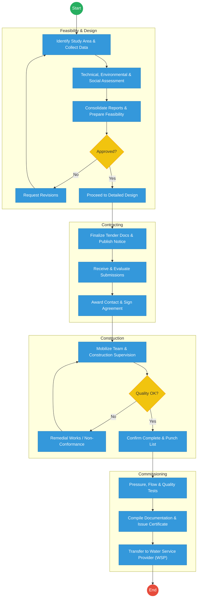
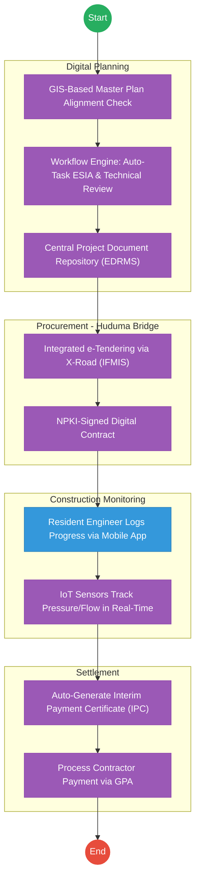

# ATHI WATER WORKS DEVELOPMENT AGENCY (AWWDA) – Service Delivery

## Cover Page
- **Ministry/Department/Agency (MDA):** Ministry of Water, Sanitation and Irrigation
- **Agency:** Athi Water Works Development Agency (AWWDA)
- **Process Name:** Infrastructure Development Lifecycle
- **Document Version:** 2.1
- **Date:** 2026-02-24
- **Classification:** Official

---

## Executive Summary
Athi Water Works Development Agency (AWWDA) is responsible for the planning and development of water and sewerage infrastructure within its area of jurisdiction. The infrastructure lifecycle involves complex feasibility studies, procurement, construction supervision, and final commissioning. The current process is hampered by manual data collection and fragmented tracking of contractors and project milestones. The transition to the Kenya DSAP Architecture aims to provide a unified project management ecosystem integrated with GIS and IFMIS.

---

## 1. AS-IS Process Flowchart (BPMN 2.0)
*Current State visualization (End-to-End Infrastructure Lifecycle based on Deep Dive).*

---

## Process Overview
### Process Name
End-to-End Water Infrastructure Development (Study to Handover)

### Service Category
- G2B (Government to Business - Contractors) / G2G (Government to WSP)

### Scope
- **In Scope:** Feasibility studies, procurement of contractors, construction supervision, and commissioning of water/sewerage projects.
- **Out of Scope:** Day-to-day water billing (handled by WSPs like NCWSC).

### Triggers
- Identification of a water need in the Master Plan or a Presidential Directive.

### End States
- **Successful:** Infrastructure commissioned and transferred to a Water Service Provider for operations.

### Policy Context
- The Water Act 2016; Public Procurement and Asset Disposal Act; NEMA Regulations.

---

## Detailed Process (AS-IS)
| Step | Role | Action | Tool/System | Notes |
|---|---|---|---|---|
| 1 | Planning Engineer | Identifies the study area and collects site data for feasibility. | Manual/GIS | |
| 2 | Environmentalist | Conducts Environmental & Social Impact Assessment (ESIA). | Manual | |
| 3 | AWWDA Committee | Reviews the feasibility report and detailed design for approval. | Manual | |
| 4 | Procurement Unit | Manages the tender process from advertisement to contract signing. | IFMIS / Manual | |
| 5 | Resident Engineer | Oversees construction, conducts site inspections, and verifies material quality. | Manual Reports | |
| 6 | Technical Team | Conducts final tests (Pressure/Flow) before issuing a certificate of completion. | Physical Tests | |

---

## Pain Points & Opportunities
### Pain Points
- **Siloed Project Data:** Planning, Procurement, and Construction data are held in different formats and systems.
- **Delayed Payments:** Manual verification of "Interim Payment Certificates" (IPCs) leads to contractor interest claims.
- **Manual Reporting:** Tracking the progress of 50+ sites via paper-based site diaries is inefficient.

### Opportunities
- **Integrated PMS:** A single Project Management System that tracks every milestone from "Feasibility" to "Handover".
- **Digital Site Diaries:** Using a mobile app to capture real-time construction progress and GPS-tagged photos.
- **Blockchain for Contracts:** Using an immutable ledger to track contract amendments and payment certificates.

---

## 2. TO-BE Process Flowchart (BPMN 2.0)
*Future State visualization (Kenya DSAP Architecture - Huduma Bridge).*

## Future State Process (TO-BE)
### Narrative
**TO-BE Process: Smart Water Infrastructure Management**

**Design Principles:**
- **Evidence-Based Construction:** Using **IoT sensors** and **Mobile GIS** to capture progress. Payments are only triggered when the system verifies the GPS location and quality data.
- **Unified Financial Flow:** Integration with **IFMIS** and the **Govt Payment Aggregator (GPA)** to ensure contractors are paid immediately upon certification, reducing cost overruns.
- **Inter-Agency Transparency:** All environmental approvals (NEMA) and land clearances are handled via **X-Road APIs**, eliminating the "paper chase."

### Optimized Steps (Digital)
| Step | Actor | Action | System |
|---|---|---|---|
| 1 | Planning Team | Checks the proposed project against the GIS-based Water Master Plan. | GIS / Dashboard |
| 2 | System | Routes the feasibility documents to NEMA and Treasury for parallel digital approval. | X-Road / Workflow Engine |
| 3 | Contractor | Submits progress reports via a secure mobile app; IoT sensors verify flow/pressure levels during testing. | IoT / Mobile App |
| 4 | Resident Engineer | Digitally signs the IPC (Interim Payment Certificate) using their NPKI certificate. | Trust Hub / NPKI |
| 5 | System | Automatically reconciles the certificate with the contract value and triggers payment via the GPA. | GPA / IFMIS |

---

## References
- The Water Act 2016.
- Huduma Bridge DSAP Architecture.